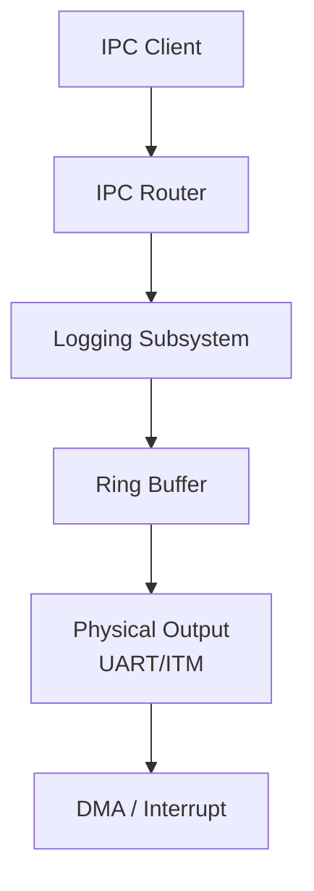
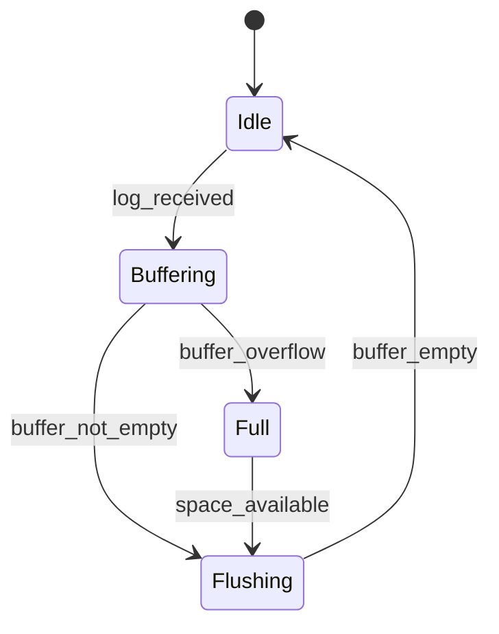
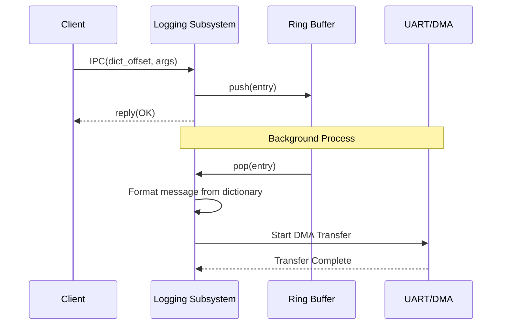

# ロギング コンポーネント設計書

## 1. コンセプト
ロギングコンポーネントは、ハイパーバイザ内部の状態を記録し、外部（UART/ITM等）へ出力する。メモリ消費と通信負荷を抑えるため、辞書参照IPCと内部リングバッファによる遅延出力を採用する。 `{IPCRouter}` `{DictionaryBasedIPC}` `{BufferedLogging}`

## 2. 静的モデル

### 2.1 データ構造
- **log_ring_buffer**: 受信したログメッセージを一時的に保持する固定長リングバッファ。
- **log_dictionary**: `constexpr` で定義された、ログメッセージのテンプレート辞書。

### 2.2 内部ブロック図

### 2.3 主要なクラス・構造体・配列・定数

#### `log_entry` (ログエントリ)
リングバッファ内に保持される単一のログイベントデータ。

| 構成項目 | 機能と役割 | 備考（制約、型など） |
| :--- | :--- | :--- |
| `timestamp` | ログが発生した時点のシステムティックまたは内部時刻。 | 64bit値 |
| `level` | ログの重要度（TRACE, DEBUG, INFO, WARN, ERROR）。 | 8bitインデックス |
| `dict_offset` | ログメッセージ文字列自体に代わり、静的辞書内の位置を示す。 | 16bit値 `{DictionaryBasedIPC}` |
| `args` | メッセージ内のプレースホルダに埋め込むための変数データ。 | 32bit×4件固定 |

#### `logging_config` (ロギング構成)
ロギングシステムの動作パラメータを定義する。 `{ConfigurableSystem}`

| 構成項目 | 機能と役割 | 備考（制約、型など） |
| :--- | :--- | :--- |
| `buffer_size` | ログを一時保持するリングバッファの総容量。 | バイト数（2のべき乗推奨） |
| `default_level` | システム起動時に適用される最小出力レベル。 | 重要度定数 |

## 3. 動的モデル

### 3.1 アルゴリズム
- **辞書参照ロギング**: 送信側はメッセージ文字列ではなく、辞書内のオフセットと引数のみをIPCで送信する。 `{DictionaryBasedIPC}`
- **遅延出力**: IPC受信時はリングバッファへの格納のみを行い、実際の物理出力はDMAや割り込みを利用してバックグラウンドで行う。 `{BufferedLogging}`

### 3.2 状態遷移図

### 3.3 内部シーケンス
#### ログ出力シーケンス

## 4. インターフェイス定義

### 4.1 公開API
外部から利用可能なオブジェクト指向APIを定義する。

#### ログの記録 (log)
| 項目 | 内容 |
| :--- | :--- |
| 機能概要 | 発生したイベントを、レベルと辞書オフセット形式でシステムに通知する。 |
| 引数と役割 | `level`: 重要度, `offset`: 辞書位置, `args`: 最大4個の数値パラメータ。 |
| 期待する結果 | 正常：ログ情報がリングバッファにキューイングされる。 |
| 事前条件 | ロギングサービスが Ready であること。 |
| 事後条件 | 送信側プロセスを止めずに、非同期に出力待ちリストへ追加される。 |
| 不変条件 | パラメータの型が 32bit 整数に適合すること。 |
| エラー時の挙動 | リングバッファが満杯の場合は、ポリシーに基づき破棄または最古のエントリを上書きする。 |
| 補足 | 文字列を直接含まず ID でやり取りするため、低帯域通信でも詳細なログが可能。 |

#### 出力閾値の設定 (set_level)
| 項目 | 内容 |
| :--- | :--- |
| 機能概要 | 物理的な出力対象とするログの最小レベルを動的に変更する。 |
| 引数と役割 | `level`: これより低いレベルのログは廃棄されるようになる。 |
| 期待する結果 | 指定以上の重要度を持つログのみが出力される。 |
| 事前条件 | なし。 |
| 事後条件 | これ以降に生成されたログにのみ、フィルタリングが適用される。 |
| 不変条件 | なし。 |
| エラー時の挙動 | 無効なレベルが指定された場合は現状維持とする。 |
| 補足 | デバッグ時に動的に詳細度を上げたい場合に利用する。 |

### 4.2 URI/IPCインターフェイス
- **URI**: `fireball://logging/system/0`
- **メッセージ形式**: Key-Valueプロトコル。 `level`, `dict_offset`, `arg0`〜`arg3` を含む。 `{DictionaryBasedIPC}`

## 5. 制約達成の方策

### 5.1 性能制約と方策
- **目標**: ログ出力による呼び出し側のブロッキングを最小化する。
- **方策**: `{BufferedLogging}` 内部バッファリングと非同期出力により、IPCハンドラを即座に解放する。

### 5.2 メモリ制約と方策
- **目標**: ログ機能によるメモリ圧迫を防止する。
- **方策**: `{MemoryIsolation}` `{ConfigurableSystem}` 独立したヒープパーティションを使用し、バッファサイズをコンパイル時に固定する。

### 5.3 安全性制約と方策
- **目標**: ログ出力の失敗がシステム全体に波及しないようにする。
- **方策**: `{FaultIsolation}` バッファフル時は古いログを破棄するか、新しいログを無視することで、システムの継続実行を優先する。

## 6. 設計完了チェックリスト（網羅性確認）
- [x] コンポーネントの責務が明確に定義されているか
- [x] 内部設計（データ構造、ブロック図、クラス、アルゴリズム）が適切に定義されているか
- [x] 内部ブロック図（静的）とシーケンス/状態遷移図（動的）がセットで定義されているか
- [x] 公開APIのメソッド名が英語で記述され、事前/事後条件が明確か
- [x] 非機能制約（性能、メモリ、安全性）に対する具体的な方策が明示されているか
- [x] 設計の交差点（トレードオフ）が解消されているか
- [x] 上位の要求 `{Keyword}` とのトレーサビリティが確保されているか
