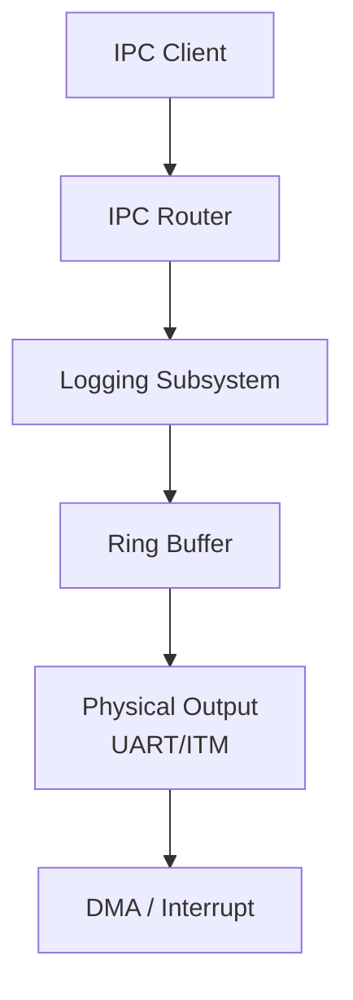
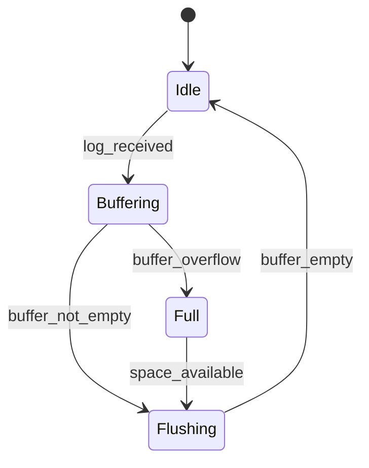
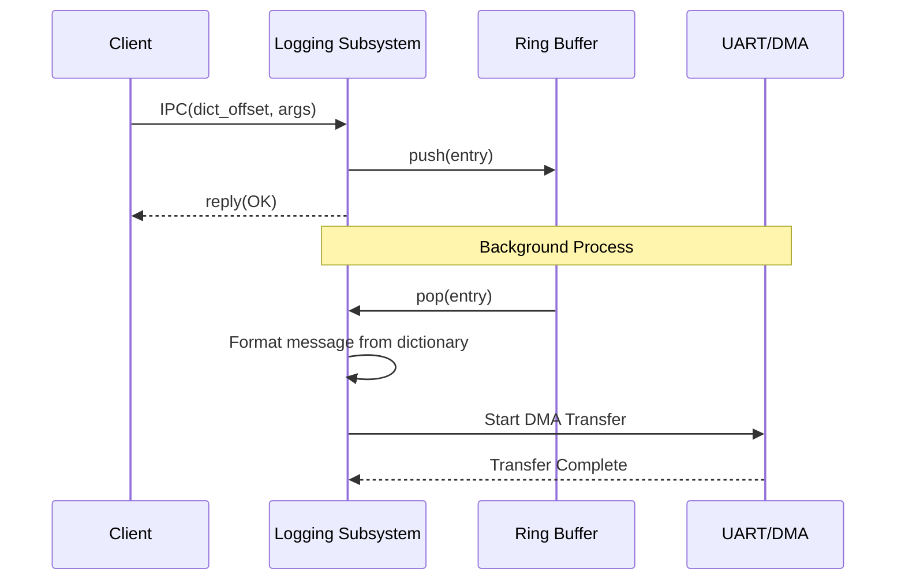

# ロギング コンポーネント設計書

## 1. コンセプト
ロギングコンポーネントは、ハイパーバイザ内部の状態を記録し、外部（UART/ITM等）へ出力する。メモリ消費と通信負荷を抑えるため、辞書参照IPCと内部リングバッファによる遅延出力を採用する。 `{IPCRouter}` `{DictionaryBasedIPC}` `{BufferedLogging}`

## 2. 静的モデル

### 2.1 データ構造
- **log_ring_buffer_t**: 受信したログメッセージを一時的に保持する固定長リングバッファ。
- **log_dictionary_t**: `constexpr` で定義された、ログメッセージのテンプレート辞書。

### 2.2 内部ブロック図

### 2.3 主要な構造体・クラス・定数

#### `log_entry_t` (ログエントリ)
リングバッファ内に保持される単一のログデータ。

| メンバ名 | 型 | 説明 |
| :--- | :--- | :--- |
| `timestamp` | `uint64_t` | ログ発生時刻 |
| `level` | `uint8_t` | ログレベル (TRACE, DEBUG, INFO, etc.) |
| `dict_offset` | `uint16_t` | 辞書内のメッセージオフセット |
| `args` | `uint32_t[4]` | メッセージ埋め込み用の引数 |

#### `logging_config_t` (ロギング構成)
ロギングの動作パラメータを定義する。 `{ConfigurableSystem}`

| メンバ名 | 型 | 説明 |
| :--- | :--- | :--- |
| `buffer_size` | `size_t` | リングバッファのサイズ |
| `default_level` | `uint8_t` | デフォルトの出力ログレベル |

## 3. 動的モデル

### 3.1 アルゴリズム
- **辞書参照ロギング**: 送信側はメッセージ文字列ではなく、辞書内のオフセットと引数のみをIPCで送信する。 `{DictionaryBasedIPC}`
- **遅延出力**: IPC受信時はリングバッファへの格納のみを行い、実際の物理出力はDMAや割り込みを利用してバックグラウンドで行う。 `{BufferedLogging}`

### 3.2 状態遷移図

### 3.3 内部シーケンス
#### ログ出力シーケンス

## 4. インターフェイス定義

### 4.1 公開API
| メソッド名 (English) | 引数 | 戻り値 | 説明 | 事前条件 | 事後条件 |
| :--- | :--- | :--- | :--- | :--- | :--- |
| `log` | `level, offset, args` | `status_t` | ログを記録する | なし | バッファに格納される |
| `set_level` | `level` | `void` | 出力レベルを変更 | なし | レベルが更新される |

### 4.2 URI/IPCインターフェイス
- **URI**: `fireball://logging/system/0`
- **メッセージ形式**: Key-Valueプロトコル。 `level`, `dict_offset`, `arg0`〜`arg3` を含む。 `{DictionaryBasedIPC}`

## 5. 制約達成の方策

### 5.1 性能制約と方策
- **目標**: ログ出力による呼び出し側のブロッキングを最小化する。
- **方策**: `{BufferedLogging}` 内部バッファリングと非同期出力により、IPCハンドラを即座に解放する。

### 5.2 メモリ制約と方策
- **目標**: ログ機能によるメモリ圧迫を防止する。
- **方策**: `{MemoryIsolation}` `{ConfigurableSystem}` 独立したヒープパーティションを使用し、バッファサイズをコンパイル時に固定する。
- **最小構成**: ログバッファは 512B を基準とする。

### 5.3 安全性制約と方策
- **目標**: ログ出力の失敗がシステム全体に波及しないようにする。
- **方策**: `{FaultIsolation}` バッファフル時は古いログを破棄するか、新しいログを無視することで、システムの継続実行を優先する。

## 6. 設計完了チェックリスト（網羅性確認）
- [x] コンポーネントの責務が明確に定義されているか
- [x] 内部設計（データ構造、ブロック図、クラス、アルゴリズム）が適切に定義されているか
- [x] 内部ブロック図（静的）とシーケンス/状態遷移図（動的）がセットで定義されているか
- [x] 公開APIのメソッド名が英語で記述され、事前/事後条件が明確か
- [x] 非機能制約（性能、メモリ、安全性）に対する具体的な方策が明示されているか
- [x] 設計の交差点（トレードオフ）が解消されているか
- [x] 上位の要求 `{Keyword}` とのトレーサビリティが確保されているか
