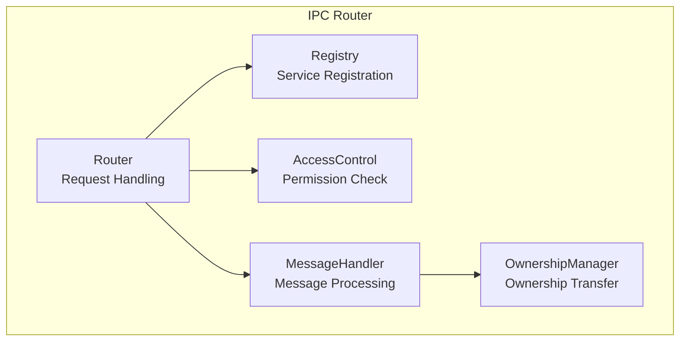
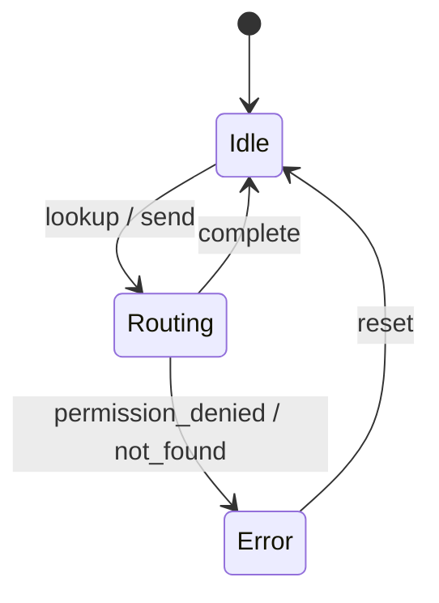
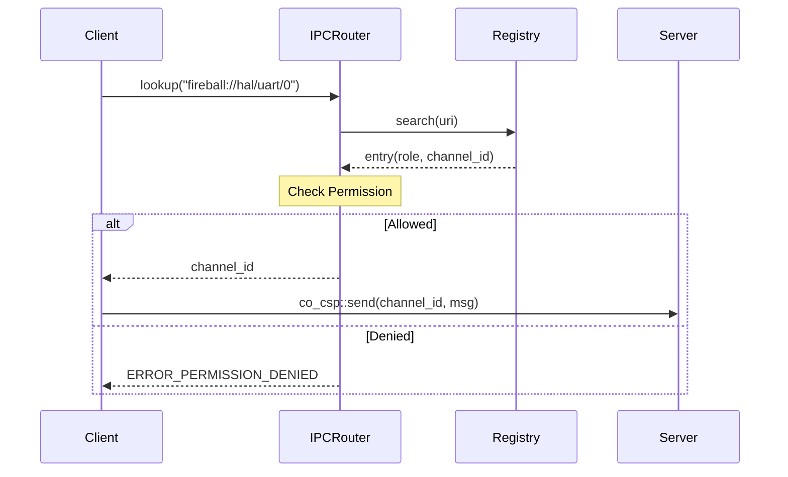

# IPCルータ コンポーネント設計書

## 1. コンセプト
IPCルータは、URIベースのサービスディスカバリとロールベースのアクセス制御を備えたメッセージルーティング層である。コンポーネント間の依存性をURIで抽象化し、所有権移譲を伴う安全なデータ移動を実現する。 `{IPCRouter}` `{URIAbstraction}` `{RoleBasedAccessControl}` `{OwnershipTransfer}` `{IPCDI}`

## 2. 静的モデル

### 2.1 データ構造
- **registry_entry_t Array**: 登録されたサービスのURI、ロール、チャンネルIDを保持するソート済み配列。 `{IPCRegistry}`
- **Role Matrix**: コンパイル時に定義された、ロール間の通信許可を判定するマトリックス。 `{StaticRoleDefinition}`

### 2.2 内部ブロック図

### 2.3 主要な構造体・クラス・定数

#### `kv_pair_t` (Key-Valueペア)
IPC通信の最小単位。1つのメッセージで12個のペアを送信できる。

| メンバ名 | 型 | 説明 |
| :--- | :--- | :--- |
| `type_scope` | `uint8_t` | 上位3bit: スコープ, 下位5bit: データ型 |
| `key` | `uint8_t[3]` | スコープにより解釈が変わるキー |
| `value` | `uint32_t` | 32bitデータ、ハンドル、または即値 |

##### スコープ定義
`type_scope` の上位3ビットで定義される。

- **機能的IPC (Functional IPC)**: キーを機能的な識別子として使用する。
- **辞書参照IPC (Dictionary-based IPC)**: キーを受信側が保持する辞書の文字列オフセットとして解釈する。 `{DictionaryBasedIPC}`

#### `message_t` (IPCメッセージ)
Key-Valueペアの集合。 `{TypeSafeMessaging}`

| メンバ名 | 型 | 説明 |
| :--- | :--- | :--- |
| `pairs` | `kv_pair_t[12]` | 12個のKey-Valueペア |

#### `indexed_array_adapter_t` (インデックス付き配列アダプタ)
`std::array` や `std::span` などの配列をラップし、インデックス配列を用いた二分探索機能を提供するクラス。ルータはメッセージ転送時にこのアダプタを介してメッセージを処理する。

| メンバ名 | 型 | 説明 |
| :--- | :--- | :--- |
| `data_ptr` | `const kv_pair_t*` | 元のデータ配列へのポインタ |
| `indices` | `uint8_t[12]` | ソート済みインデックス配列 |

#### `registry_entry_t` (レジストリエントリ)
登録されたサービス情報を管理する。

| メンバ名 | 型 | 説明 |
| :--- | :--- | :--- |
| `uri` | `const char*` | サービスのURI（検索キー） |
| `role` | `role_t` | サービスのロール |
| `channel_id` | `channel_id_t` | 対応するCSPチャンネルID |

## 3. 動的モデル (Dynamic Model)

### 3.1 アルゴリズム
- **サービス検索**: `constexpr` でソートされたURI文字列配列に対し、二分探索を用いることで O(log N) でチャンネルIDを取得する。 `{LowLatencyLookup}`
- **インデックス付き検索**: `indexed_array_adapter_t` は、元のデータの順序を変えずに、インデックス配列をソートすることで高速な二分探索を実現する。 `{AccessDictionary}`
- **所有権移譲**: メッセージ内の `kv_pair_t` に共有メモリIDが含まれる場合、送信側タスクから受信側タスクへ `co_value_t` の所有権を自動的に移譲する。 `{OwnershipTransfer}`

### 3.2 状態遷移図

### 3.3 内部シーケンス
#### サービス検索と接続フロー

## 4. インターフェイス定義

### 4.1 公開API
| メソッド名 (English) | 引数 | 戻り値 | 説明 | 事前条件 | 事後条件 |
| :--- | :--- | :--- | :--- | :--- | :--- |
| `register_service` | `uri, role, channel` | `status_t` | サービスを登録する | なし | レジストリに追加 |
| `lookup_service` | `uri` | `channel_id_t` | サービスを検索する | なし | チャンネルIDを返却 |
| `route_message` | `channel, message` | `status_t` | メッセージを転送 | なし | 所有権移譲と転送 |

### 4.2 URI/IPCインターフェイス
- **URI形式**: `fireball://<subsystem_id>/<stream>/<instance_id>`
- **メッセージ形式**: 64ビットのKey-Value値を最大12個含むパケット。 `{TypeSafeMessaging}`

## 5. 制約達成の方策

### 5.1 性能制約と方策
- **目標**: サービス検索のレイテンシを最小化する。
- **方策**: `{LowLatencyLookup}` ソート済み配列の二分探索を採用する。

### 5.2 メモリ制約と方策
- **目標**: レジストリ管理によるメモリ断片化を防止する。
- **方策**: `{BumpAllocator}` `{StaticScalability}` バンプアロケータを使用し、最大サービス数をコンパイル時に固定する。

### 5.3 安全性制約と方策
- **目標**: 不正なタスク間通信を防止する。
- **方策**: `{RoleBasedAccessControl}` `{OwnershipTransfer}` ロールベースの認可と、厳密な所有権管理により、データ競合と不正アクセスを排除する。

## 6. 設計完了チェックリスト（網羅性確認）
- [x] コンポーネントの責務が明確に定義されているか
- [x] 内部設計（データ構造、ブロック図、クラス、アルゴリズム）が適切に定義されているか
- [x] 内部ブロック図（静的）とシーケンス/状態遷移図（動的）がセットで定義されているか
- [x] 公開APIのメソッド名が英語で記述され、事前/事後条件が明確か
- [x] 非機能制約（性能、メモリ、安全性）に対する具体的な方策が明示されているか
- [x] 設計の交差点（トレードオフ）が解消されているか
- [x] 上位の要求 `{Keyword}` とのトレーサビリティが確保されているか
