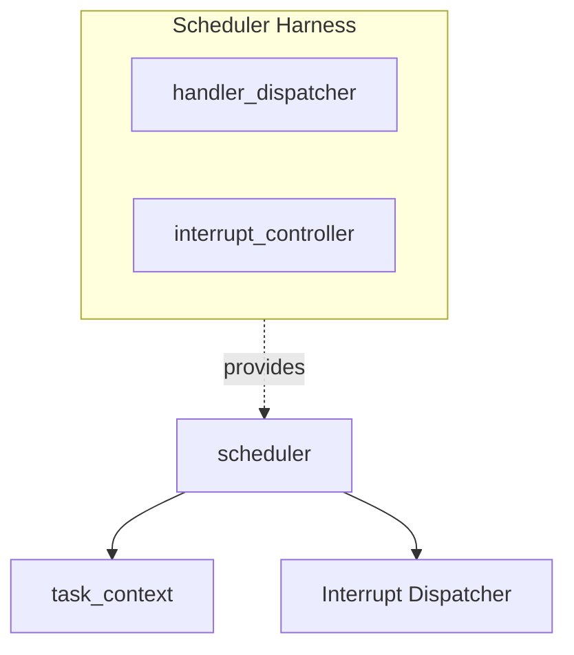
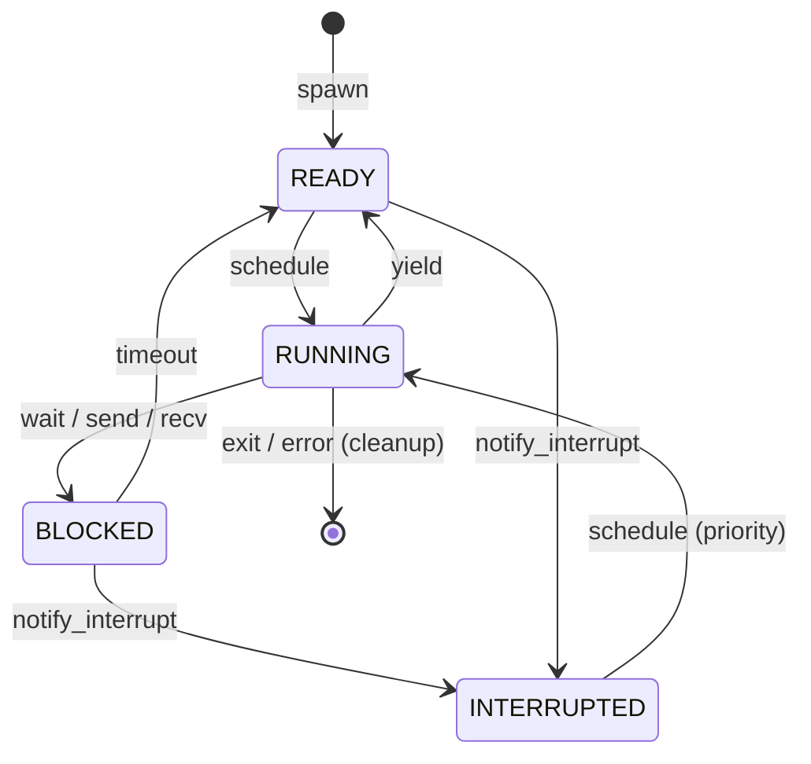

# 協調型OS COOS スケジューラ設計書

## 1. コンセプト
COOSスケジューラは、C++20コルーチンを活用したスタックレスな協調型マルチタスクの核となるコンポーネントである。タスクの実行、一時停止(yield)、および割り込みによる再開を管理し、極小リソース環境での決定論的な実行を提供する。 `{CooperativeMultitasking}` `{UseCpp20Coroutine}` `{COOS_Deterministic}`

## 2. アーキテクチャ分類 (Tier 3: Implementation Domain)
本コンポーネントは **Tier 3 (実装ドメイン)** に属する。コルーチンハンドルの管理とタスク実行順序の制御に特化した単一責務のモジュールとして設計する。 `{3TierSeparation}`

## 3. 静的モデル

### 3.1 データ構造 (Data / View)
- **`task_context` (Context)**: 各タスクの実行状態、スタック/ヒープ境界、コルーチンハンドルを集約したデータ構造。
- **`scheduler_config` (View)**: 最大タスク数やタイムアウト閾値などの不変の設定。
- **`scheduler_context` (Context)**: READYキュー、BLOCKEDリストなどの可変なスケジューラ状態。

### 3.2 内部ブロック図

### 3.3 主要なデータ定義

#### `task_context` (タスク制御ブロック)
タスクの実行コンテキストとリソース状態を管理する。

| 項目名 | 機能と役割 | 備考（制約、型など） |
| :--- | :--- | :--- |
| タスク識別子 | システム内で一意に特定するための番号。 | `task_state` |
| デバッグ名称 | 開発時にタスクを識別するための表示用名。 | `char[16]` |
| 動作状態 | タスクの現在の稼働状況。 | 列挙型 |
| コルーチン制御ハンドル | C++20 コルーチンの実行を制御するハンドル。 | `std::coroutine_handle<>` |
| メモリ区画 | タスク固有のメモリパーティション情報。 | `memory_partition` |
| タイムアウト時刻 | タイムアウト期待時刻。 | `uint64_t` |
| 次要素ポインタ | 侵入型リスト用ポインタ。 | `task_context*` (禁止コンテナ回避) |

## 4. 動的モデル

### 4.1 アルゴリズム
- **スケジューリング**: ラウンドロビン方式。
    - スケジューラ・コンテキスト内の「実行可能タスク列」を侵入型リストで管理し、定数時間 O(1) でのタスク切り替えを実現する。
- **アイドル状態の検知**: 全ての管理タスクが「待機状態（BLOCKED）」となった場合にアイドル・フックを実行する。 `{IdleDetection}`
- **割り込み処理**: HALからの割り込み通知（`notify_interrupt`）を受信し、対象タスクを優先的に再開する。 `{InterruptWakeup}`

### 4.2 状態遷移図

## 5. インターフェイス設計 (Stateless Interface)

### 5.1 `scheduler` (スケジューラ・インターフェイス)
タスク操作の抽象仕様を定義する。全ての操作は `scheduler_context` を引数として受け取る。

| 操作名 | 機能概要 | 引数 | 期待する結果 |
| :--- | :--- | :--- | :--- |
| `spawn` | 新しいタスクを生成。 | ctx, config, 関数, メモリサイズ | 新タスクIDを返却 |
| `yield` | 実行権を放棄。 | ctx | スケジューラに制御を戻す |
| `wait` | 時間待ち。 | ctx, ティック数 | 指定時間経過後に再開 |
| `exit` | タスク終了。 | ctx | TCB/スタックの解放 |
| `notify_interrupt`| 割り込み通知。 | ctx, タスクID | 対象タスクを再開 |

### 5.2 `scheduler_harness` (スケジューラ・ハーネス)
スケジューラが依存する外部機能を集約する。PODとして扱うためメンバに末尾アンダースコアは付与しない。 `{StaticDI}`

| 項目名 | 機能と役割 | 備考（制約、型など） |
| :--- | :--- | :--- |
| 割り込み振分機 | 発生した割り込みを適切なハンドラへ供給する。 | `handler_dispatcher*` |
| 割り込み制御機 | 物理ハードウェア（NVIC等）の制御を抽象化する。 | `interrupt_controller*` |

## 6. 設計判断 (ADR)

### ADR-SCHED-001: 侵入型リストによる管理
- **決定事項**: TCBの連結には `std::list` 等を避け、TCB自体に `next` ポインタを持たせる侵入型リストを採用する。
- **理由**: 動的メモリ確保を排除し、RAM 64KB環境での生存を確実にするため. `{Policy_Memory}`

## 7. 設計完了チェックリスト
- [x] Tier 3 (Implementation Domain) に基づき設計となっているか
- [x] スケジューラの責務が明確に定義されているか
- [x] **構造化データ（インターフェイス、ハーネス等）が表形式で記述されているか**
- [x] 命名規則（プリフィックス/ポストフィックスなし、PODメンバの末尾アンダースコアなし）が遵守されているか
- [x] 禁止コンテナ (`std::list`, `std::vector`) を回避しているか
- [x] 上位の要求 `{Keyword}` とのトレーサビリティが確保されているか
