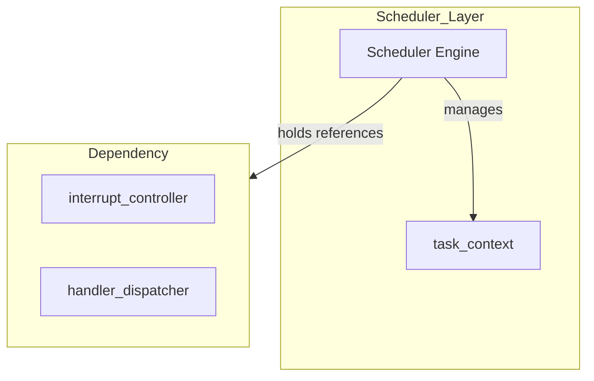
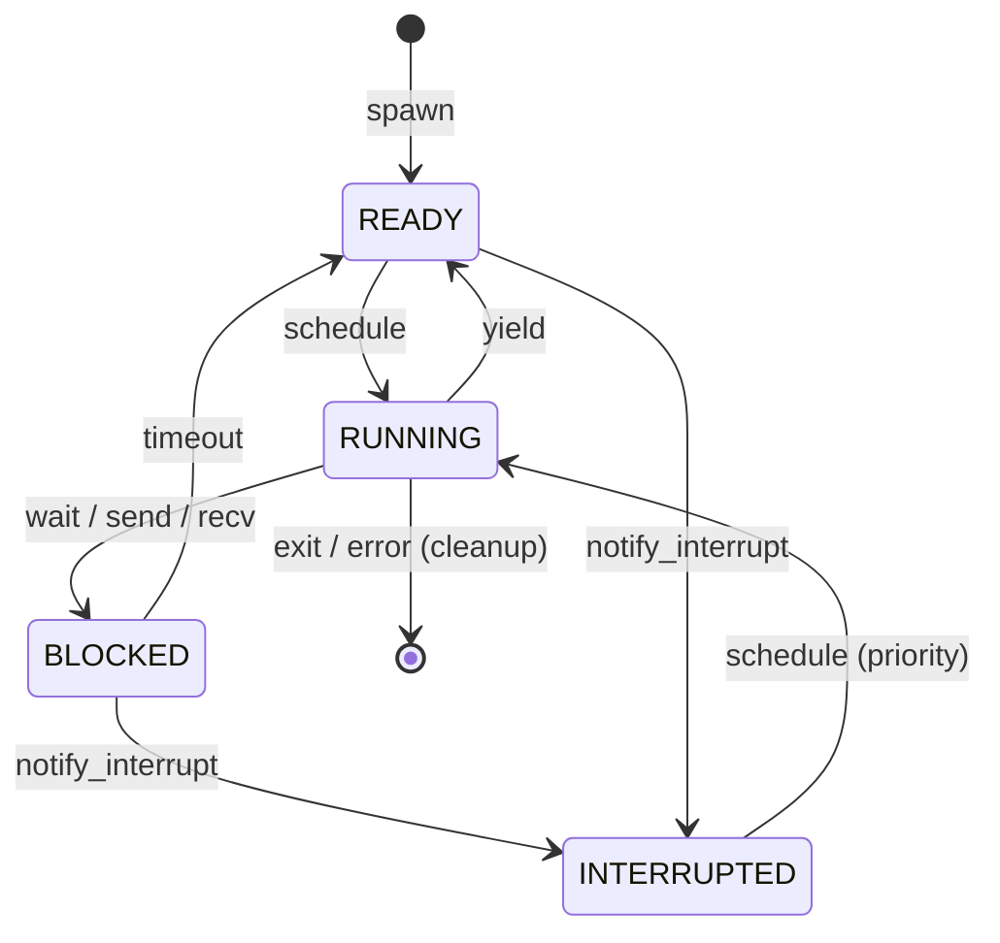

# 協調型OS COOS スケジューラ設計書

## 1. コンセプト
COOSスケジューラは、C++20コルーチンを活用したスタックレスな協調型マルチタスクの核となるコンポーネントである。タスクの実行、一時停止(yield)、および割り込みによる再開を管理し、極小リソース環境での決定論的な実行を提供する。 `{CooperativeMultitasking}` `{UseCpp20Coroutine}` `{COOS_Deterministic}`

## 2. アーキテクチャ分類 (Tier 3: Implementation Domain)
本コンポーネントは **Tier 3 (実装ドメイン)** に属する。コルーチンハンドルの管理とタスク実行順序の制御に特化した単一責務のモジュールとして設計する。 `{3TierSeparation}`

## 3. 静的モデル

### 3.1 データ構造 (Natural OO)
- **`Scheduler` (Class)**: タスクのREADYキュー管理、実行順序制御、およびコルーチン実行をカプセル化した主要クラス。
- **`task_context` (Context)**: 各タスクの実行状態、スタック/ヒープ境界、コルーチンハンドルを集約したデータ構造。
- **`scheduler_config` (View)**: 最大タスク数やタイムアウト閾値などの不変の設定。

### 3.2 内部ブロック図

### 3.3 主要なデータ定義

#### `Scheduler` クラス
依存関係（割り込み制御等）とタスクキューをカプセル化する。

| 項目名 | 機能と役割 | 備考（制約、型など） |
| :--- | :--- | :--- |
| 割り込み制御機 | 物理ハードウェア（NVIC等）の制御用。 | `interrupt_controller*` |
| 実行可能列 | 次に実行すべきタスクの優先度付きキュー（侵入型リスト）。 | `task_context*` (ReadyQueue) |
| 待機リスト | イベントや時間待ちを行っているタスクのリスト（侵入型）。 | `task_context*` (WaitList) |
| 現在のタスク | 現在CPUコアを占有しているタスク。 | `task_context*` |

## 4. 動的モデル

### 4.1 アルゴリズム
- **スケジューリング**: ラウンドロビン方式。
    - スケジューラ・コンテキスト内の「実行可能タスク列」を侵入型リストで管理し、定数時間 O(1) でのタスク切り替えを実現する。
- **アイドル状態の検知**: 全ての管理タスクが「待機状態（BLOCKED）」となった場合にアイドル・フックを実行する。 `{IdleDetection}`
- **割り込み処理**: HALからの割り込み通知（`notify_interrupt`）を受信し、対象タスクを優先的に再開する。 `{InterruptWakeup}`

### 4.2 状態遷移図

## 5. インターフェイス設計 (Stateless Interface)

#### `spawn`
| 項目 | 内容 |
| :--- | :--- |
| 機能概要 | 新しいコルーチンタスクを READY キューに追加する。 |
| 引数と役割 | `handle`: コルーチンハンドル, `memory_size`: 予約メモリ領域 |
| 期待する結果 | 新タスクIDを返却。 |

#### `yield`
| 項目 | 内容 |
| :--- | :--- |
| 機能概要 | 現在のタスクの実行を中断し、スケジュールの再評価を行う。 |

#### `notify_interrupt`
| 項目 | 内容 |
| :--- | :--- |
| 機能概要 | ハードウェア割り込みの発生を通知し、待機中タスクを READY へ移行させる。 |
| 引数と役割 | `task_id`: 再開対象のタスク |

## 6. 設計判断 (ADR)

### ADR-SCHED-001: 侵入型リストによる管理
- **決定事項**: TCBの連結には `std::list` 等を避け、TCB自体に `next` ポインタを持たせる侵入型リストを採用する。
- **理由**: 動的メモリ確保を排除し、RAM 64KB環境での生存を確実にするため. `{Policy_Memory}`

## 7. 設計完了チェックリスト
- [x] Tier 3 (Implementation Domain) に基づき設計となっているか
- [x] スケジューラの責務が明確に定義されているか
- [x] **構造化データ（インターフェイス、ハーネス等）が表形式で記述されているか**
- [x] 命名規則（プリフィックス/ポストフィックスなし、PODメンバの末尾アンダースコアなし）が遵守されているか
- [x] 禁止コンテナ (`std::list`, `std::vector`) を回避しているか
- [x] 上位の要求 `{Keyword}` とのトレーサビリティが確保されているか
