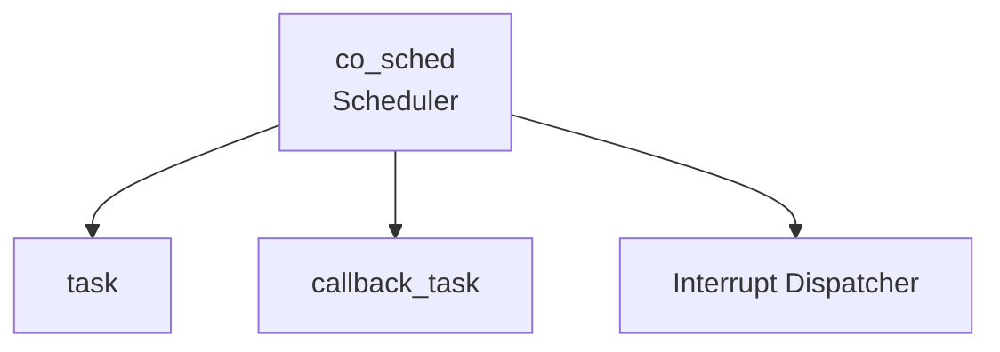
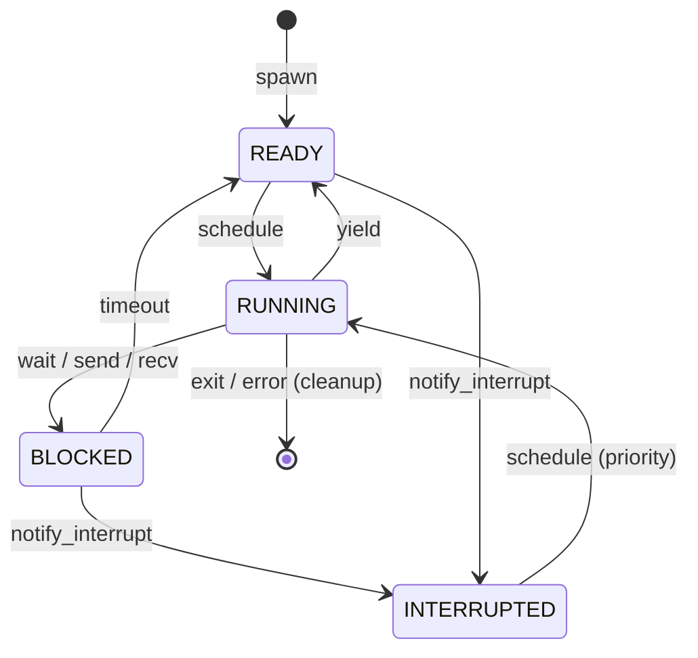
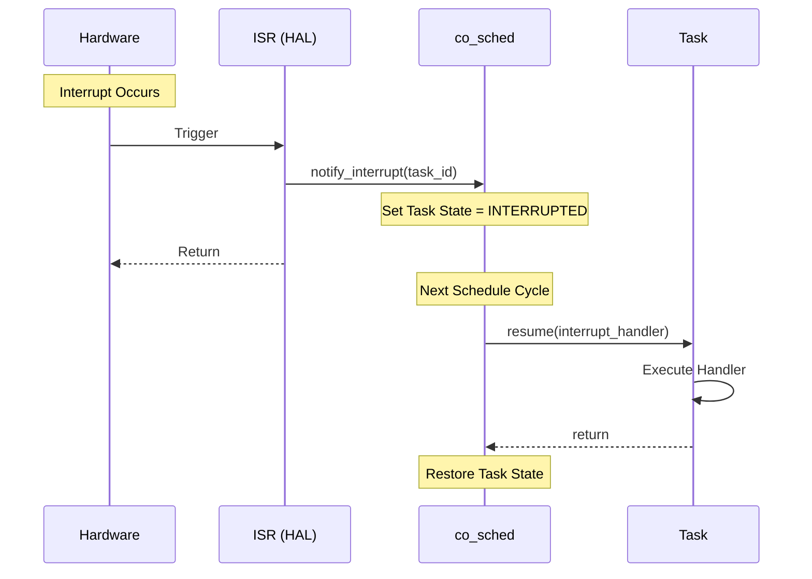

# 協調型OS COOS スケジューラ設計書

## 1. コンセプト
COOSスケジューラは、C++20コルーチンを活用したスタックレスな協調型マルチタスクの核となるコンポーネントである。タスクの実行、一時停止(yield)、および割り込みによる再開を管理し、極小リソース環境での決定論的な実行を提供する。 `{CooperativeMultitasking}` `{UseCpp20Coroutine}` `{COOS_Deterministic}`

## 2. 静的モデル

### 2.1 データ構造
- **READY Queue**: 実行可能なタスクのリスト（ラウンドロビン）。
- **BLOCKED List**: 送受信やウェイトで停止しているタスクの管理。 `{Challenge_CoosBlockedList}`
- **TCB (Task Control Block)**: タスクのコンテキストと状態を保持する構造体。

### 2.2 内部ブロック図

### 2.3 主要なクラス・構造体・配列・定数

#### `task` (タスク制御ブロック)
タスクの実行コンテキストとリソース状態を管理する。

| 構成項目 | 機能と役割 | 備考（制約、型など） |
| :--- | :--- | :--- |
| `id` | タスクを一意に識別するための不変なID。 | `task_id` 型 |
| `name` | デバッグやプロファイリング時に使用する人間が読める名前。 | `char[16]` |
| `state` | タスクの現在の動作状態（準備完了、実行中、ブロック、割り込み待機）。 | 列挙型 |
| `coro_handle` | C++20 のコルーチン制御を行うためのハンドル。 | `std::coroutine_handle<>` |
| `heap_base` | タスクに個別に割り当てられたヒープ/スタック領域の開始アドレス。 | ポインタ |
| `heap_size` | タスク固有ヒープの有効なサイズ。 | バイト数 |
| `timeout_tick` | タイムアウト（時間待ち）が発生する絶対時刻（システムティック）。 | 64bit値, 0はタイムアウトなし |
| `next` | スケジューラ内でのリスト連結用ポインタ。 | ポインタ |

#### `callback_task` (定期実行タスク)
コルーチンを使用せず、一定周期で実行される軽量なタスクを管理する。 `{PeriodicTask}`

| 構成項目 | 機能と役割 | 備考（制約、型など） |
| :--- | :--- | :--- |
| `id` | タスク識別子。 | `task_id` |
| `func` | 実行されるコールバック関数。 | `economic_function<void()>` |
| `interval_ticks` | 実行の間隔（システムティック単位）。 | 32bit値 |
| `next_run_tick` | 次回実行予定時刻。 | 64bit値 |

## 3. 動的モデル

### 3.1 アルゴリズム
- **スケジューリング**: ラウンドロビン方式。
    1. 各サイクルで `callback_task` の実行時刻をチェックし、期限が来たものを実行する。
    2. 各サイクル（またはタイマティック毎）に `BLOCKED` リストを走査し、`timeout_tick` を過ぎたタスクを `READY` 状態へ遷移させる（タイムアウトによるウェイクアップ）。
    3. `READY` 状態のコルーチンタスクを順次実行する。
- **Idle 状態の検知**: 全てのタスクが `BLOCKED` かつ保留中の `callback_task` が存在しない場合、システムは Idle 状態とみなされる。 `{IdleDetection}`
- **Idle Hook**: Idle 状態を検知した際、登録された `idle_hook` を呼び出す。これにより、バックグラウンド処理（JIT等）や低電力モードへの移行を実現する。
- **割り込み処理**: HALからの通知によりタスクを `INTERRUPTED` 状態へ遷移させ、次回のスケジュールで優先的に割り込みハンドラを実行する。 `{InterruptWakeup}`

### 3.2 状態遷移図

### 3.3 内部シーケンス
#### 割り込みハンドラ実行シーケンス

## 4. インターフェイス定義

### 4.1 公開API

#### `spawn` (タスクの生成)
| 項目 | 内容 |
| :--- | :--- |
| 機能概要 | 新しい協調タスクを生成し、実行待ち行列に登録する。 |
| 引数と役割 | `func`: タスクのエントリポイント関数, `isr`: 割り込みハンドラ関数, `heap_size`: 割り当てるメモリサイズ。 |
| 期待する結果 | 正常：新しいタスクIDが割り当てられ、状態が READY になる。 |
| 事前条件 | システムのリソース（TCBスロット）に空きがあること。 |
| 事後条件 | タスクがスケジュール対象に含まれる。 |
| 不変条件 | すべてのタスクは独立したヒープ領域を持つこと。 |
| エラー時の挙動 | ID不足やメモリ確保失敗時は無効なIDを返す。 |

#### `yield` (実行権の放棄)
| 項目 | 内容 |
| :--- | :--- |
| 機能概要 | 現在実行中のタスクが自発的に実行権を返し、他のタスクに機会を与える。 |
| 引数と役割 | なし。 |
| 期待する結果 | 制御が即座にスケジューラに戻る。 |
| 事前条件 | 呼び出しタスクが RUNNING 状態であること。 |
| 事後条件 | タスクの状態が READY に戻り、キューの末尾に移動する。 |
| エラー時の挙動 | なし（常に成功）。 |

#### `wait` (一定時間または割り込み待ち)
| 項目 | 内容 |
| :--- | :--- |
| 機能概要 | 指定された時間が経過するか、割り込みが発生するまでタスクをブロックする。 |
| 引数と役割 | `ticks`: 待ち時間（0の場合は永続待ち）。 |
| 期待する結果 | 時間経過または割り込みにより READY または INTERRUPTED 状態で再開される。 |
| 事前条件 | 呼び出しタスクが RUNNING 状態であること。 |
| 事後条件 | タスクの状態が BLOCKED に遷移し、`timeout_tick` が設定される。 |
| 補足 | CSPの `send`/`recv` においても同様のタイムアウト機構が利用される。 |

#### `exit` (タスクの終了)
| 項目 | 内容 |
| :--- | :--- |
| 機能概要 | 実行中のタスクを自発的に終了させ、リソースを解放する。 |
| 引数と役割 | なし。 |
| 期待する結果 | タスクがシステムから削除される。 |
| 事前条件 | 呼び出しタスクが RUNNING 状態であること。 |
| 事後条件 | 割り当てられていたヒープ、TCB等がすべて解放される。 |

#### `notify_interrupt` (割り込み通知)
| 項目 | 内容 |
| :--- | :--- |
| 機能概要 | 非同期イベント（割り込み）が発生したことを、関連するタスクに通知する。 |
| 引数と役割 | `id`: 通知対象のタスクID。 |
| 期待する結果 | 対象タスクが優先的にスケジュールされる状態（INTERRUPTED）になる。 |
| 事前条件 | 対象のタスクが存在すること。 |
| 事後条件 | 次回のスケジュールサイクルで、該当タスクの割り込みハンドラが実行される。 |
| 不変条件 | ISR（割り込みコンテキスト）から安全に呼び出せること。 |

#### `register_periodic_callback` (定期実行タスクの登録)
| 項目 | 内容 |
| :--- | :--- |
| 機能概要 | 一定周期で実行される、スタックレスな軽量タスクを登録する。 |
| 引数と役割 | `func`: 実行関数, `interval_ticks`: 実行間隔。 |
| 期待する結果 | 正常：タスクIDが返り、以降指定周期で実行されるようになる。 |
| 不変条件 | 実行関数は Run-to-Completion（途中で yield しない）であること。 |

#### `set_idle_hook` (アイドルフックの登録)
| 項目 | 内容 |
| :--- | :--- |
| 機能概要 | システム全体がアイドル状態になった際に呼び出されるフックを設定する。 |
| 引数と役割 | `func`: アイドル時に実行する関数。 |
| 補足 | 電力管理や低優先度のバックグラウンドタスク（JITのバッチ処理等）に使用する。 |

## 5. 設計判断 (ADR)

### ADR-SCHED-001: BLOCKEDリストのタイムアウト走査方式

- **決定事項**: `BLOCKED` リストのタイムアウト判定は、毎サイクル全タスクを走査する O(N) 方式を採用する。
- **背景**: タイムアウト管理には、順序付きリストやヒープを使った O(1) / O(log N) 方式も選択肢としてあり得る。
- **理由**:
  - COOSカーネル配下のタスク数は10未満で固定される設計であり、N が小さいため O(N) のコストは無視できる。
  - タスク数がスケールするのは Tier1 サービス層であり、COOSカーネル層の設計は変更不要。
  - 単純な線形走査は実装が簡潔で、15KLOC制約に適合する。
- **将来の検討**: 万が一カーネル層タスク数が増加する場合は、`timeout_tick` 順にソートされたリストへの変更を検討する。

## 6. 制約達成の方策

### 6.1 性能制約と方策
- **目標**: コンテキストスイッチのオーバーヘッドを最小化する。
- **方策**: `{LowOverheadSwitch}` スタックレスコルーチンの採用。

### 6.2 メモリ制約と方策
- **目標**: タスクごとのメモリ使用量を厳密に制限する。
- **方策**: `{StrictMemoryLimit}` `{IndependentHeap}` 独立したヒープパーティション。

## 7. 設計完了チェックリスト
- [x] コンポーネントの責務が明確に定義されているか
- [x] 内部設計（データ構造、ブロック図、クラス、アルゴリズム）が適切に定義されているか
- [x] 公開APIのメソッド名が英語で記述され、事前/事後条件が明確か
- [x] 上位の要求 `{Keyword}` とのトレーサビリティが確保されているか
- [x] 直交表を用いて公開APIの各パラメータや内部状態の組み合わせ網羅性が検討されているか (coos.mdに記載済み)
