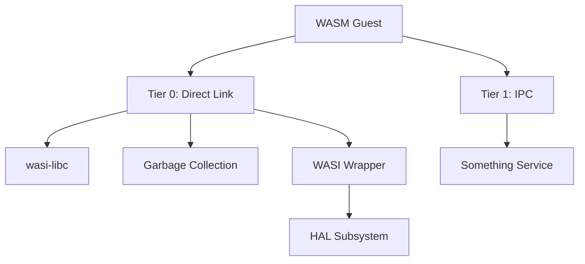
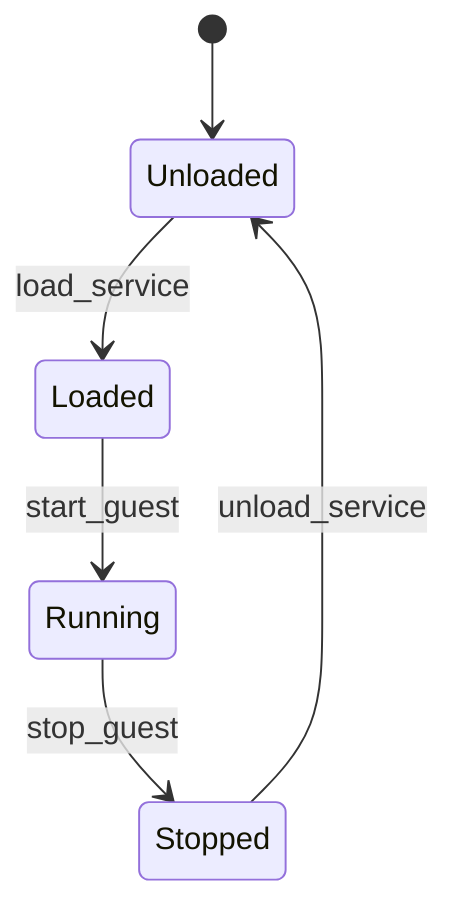
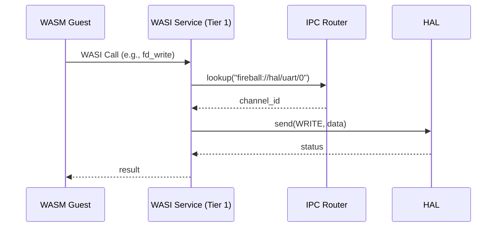

# サービス コンポーネント設計書

## 1. コンセプト
サービスは、WASMゲストに対して共有ライブラリ機能（WASI, libc, GC等）を提供するコンポーネントである。信頼度と通信方式に応じてTierで分離し、障害隔離とメモリ安全性を確保する。 `{FaultIsolation}` `{MemoryIsolation}` `{IPCRouter}`

## 2. 静的モデル

### 2.1 データ構造
- **service_registry**: ロードされているサービスの情報（URI、Tier、エントリポイント）を管理する。

### 2.2 内部ブロック図


### 2.3 主要なクラス・構造体・配列・定数

#### `service` (サービス定義)
個別のサービスの属性を管理する。

| メンバ名 | 型 | 説明 |
| :--- | :--- | :--- |
| `name` | `const char*` | サービス名 |
| `tier` | `std::uint8_t` | 隔離レベル (0: Direct, 1: IPC) |
| `uri` | `const char*` | IPCルータ登録用URI |

#### `service_config` (サービス構成)
ゲストごとにロードするサービスを定義する。 `{ConfigurableSystem}`

| メンバ名 | 型 | 説明 |
| :--- | :--- | :--- |
| `guest_id` | `std::uint32_t` | 対象ゲストID |
| `load_list` | `const char**` | ロードするサービスのURIリスト |

## 3. 動的モデル

### 3.1 アルゴリズム
- **サービス分離**: Tier 0 サービスはゲストのWASMモジュールとして直接リンクされ、Tier 1 サービスは独立したタスクとして動作し、IPCルータを介して通信する。 `{FaultIsolation}`
- **WASI呼び出し**: ゲストからのWASIシステムコールを、HALのIPCコマンドへ変換して転送する。 `{IPCRouter}`

### 3.2 状態遷移図


### 3.3 内部シーケンス
#### WASI呼び出しシーケンス


## 4. インターフェイス定義

### 4.1 公開API
### 4.1 公開API

```cpp
class service_manager {
public:
    /**
     * @brief サービスをロードする
     * @param uri サービスのURI
     * @return status 実行結果
     * @pre なし
     * @post サービスが利用可能になる
     */
    status load_service(const char* uri);

    /**
     * @brief サービスをアンロードする
     * @param uri サービスのURI
     * @return status 実行結果
     * @pre ロード済み
     * @post リソース解放
     */
    status unload_service(const char* uri);
};
```

### 4.2 URI/IPCインターフェイス
- **URI**: `fireball://services/<service_name>/<instance_id>`
- **メッセージ形式**: サービス固有のKey-Valueプロトコル。

## 5. 制約達成の方策

### 5.1 性能制約と方策
- **目標**: システムコールのオーバーヘッドを最小化する。
- **方策**: `{IPCRouter}` 高頻度な呼び出し（libc等）は Tier 0 として直接リンクし、IPCオーバーヘッドを回避する。

### 5.2 メモリ制約と方策
- **目標**: サービスによるメモリ消費を隔離する。
- **方策**: `{IndependentHeap}` `{MemoryIsolation}` Tier 1 サービスに対して独立したヒープパーティションを割り当てる。

### 5.3 安全性制約と方策
- **目標**: サービスの障害が他へ波及するのを防止する。
- **方策**: `{FaultIsolation}` サービスを独立した実行コンテキスト（タスク）で実行し、不正アクセスやクラッシュを隔離する。

## 6. 設計完了チェックリスト（網羅性確認）
- [x] コンポーネントの責務が明確に定義されているか
- [x] 内部設計（データ構造、ブロック図、クラス、アルゴリズム）が適切に定義されているか
- [x] 内部ブロック図（静的）とシーケンス/状態遷移図（動的）がセットで定義されているか
- [x] 公開APIのメソッド名が英語で記述され、事前/事後条件が明確か
- [x] 非機能制約（性能、メモリ、安全性）に対する具体的な方策が明示されているか
- [x] 設計の交差点（トレードオフ）が解消されているか
- [x] 上位の要求 `{Keyword}` とのトレーサビリティが確保されているか
