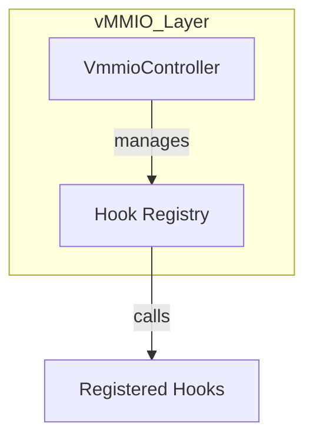
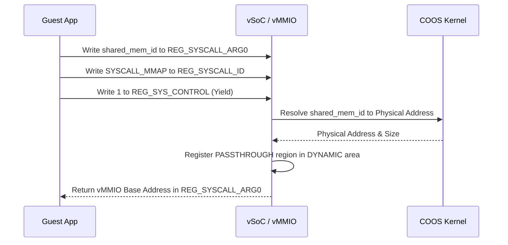

# vMMIO コンポーネント設計書

## 1. コンセプト
vMMIO (Virtual Memory-Mapped I/O) は、WASMゲストアプリケーションに対して仮想的なハードウェアレジスタインターフェイスを提供スル。WASMの仕様に基づき、**割り当て単位は1ページ（64KB）**とし、各デバイス領域は64KB境界に配置される。これにより、WASMのメモリアクセスチェックと親和性の高いトラップ＆エミュレートを実現する。 `{RestrictedPhysicalAccess}` `{vMMIO_TrapAndEmulate}` `{PhysicalPassthrough}` `{WasmPageAlignment}`

## 2. アーキテクチャ分類 (Tier 3: Implementation Domain)
本コンポーネントは **Tier 3 (実装ドメイン)** に属する。仮想的なレジスタアクセスとDMA転送に特化した単一責務のモジュールとして設計する。 `{3TierSeparation}`

## 3. 静的モデル

### 3.1 データ構造 (Natural OO)
- **`VmmioController` (Class)**: 仮想アドレスのデコード、ハンドラへのディスパッチ、および動的マッピングを管理する主要クラス。
- **`vmmio_config` (View)**: 静的な領域定義 (`vmmio_static_region`) の不変なテーブル。 `{Static_Resolution}`
- **`vmmio_dynamic_region` (Internal)**: 実行時に追加された動的マッピング情報のリスト（プライベートメンバ）。初期化時に予約された静的領域もここで管理される。

### 3.2 内部ブロック図

#### `VmmioController` クラス
アドレス空間定義（静的）とフック管理（動的）をカプセル化する。

| 項目名 | 機能と役割 | 型分類 | サイズ・制約 |
| :--- | :--- | :--- | :--- |
| 静的マップ参照 | ROM上のデバイスマップ定義への参照 | 構造体への参照 | `const vmmio_static_region` |
| フックレジストリ | 実行時に登録されたハンドラ群の保持 | アクセス辞書 | `vmmio_hook_registry` |
| 動的領域数 | 現在使用中の DYNAMIC 領域のスロット数 | エントリ数 | - |

#### `vmmio_handler` (ハンドラ定義)
読み書きアクセス発生時に呼び出される関数の共通インターフェイス。

| 項目名 | 機能と役割 | 型分類 | サイズ・制約 |
| :--- | :--- | :--- | :--- |
| アクセス形式定義 | 相対オフセットとデータ列（可変バイナリビュー）を引数に取る関数の形式 | 関数ポインタ | `status(offset, span, is_write)` |

## 4. 動的モデル

- **ディスパッチ**:
    1. ゲストのアドレスが `vmmio_base` 以降である場合、ROM上の `VMMIO_STATIC_MAP` を二分探索する。 `{SortedIndexedArray}`
    2. 該当エントリの `hook_id` を用いて、内部のハンドラレジストリから `vmmio_handler` を取得する。
    3. ハンドラが登録されていれば、指定された `std::span` （バイト/ハーフワード/ワード/連番アクセスを包含）を渡して呼び出す。
- **パススルー処理**: `type` が `PASSTHROUGH` の場合、フック内で `FB_CONF_VMMIO_ALLOWED_ADDRS` との照合を行い、許可されている場合のみ物理メモリへアクセスする。
- **フォールバック**: 該当する領域がない場合は、メモリアクセス違反としてトラップを発生させる。

### 4.1 アルゴリズム: 仮想DMA (VDMA)
ゲストリニアメモリと vMMIO 空間（または他のメモリ領域）間の高速転送を実現する。 `{VDMA}`

1. **転送設定**: ゲストが `REG_VDMA_SRC`, `REG_VDMA_DST`, `REG_VDMA_COUNT` にパラメータを書き込む。
2. **トリガー**: `REG_VDMA_CTRL` の `START` ビットを `1` に書き込む。
3. **実行**: 
   - vMMIO ハンドラが物理アドレスを解決（境界チェック含む）。
   - `std::memcpy` または HAL経由のDMAを用いて一括転送を実行。
4. **完了**: 転送完了後、必要に応じてゲストに仮想割り込み（`IRQ_VDMA_DONE`）を通知する。

### 4.2 仮想デバイスマップ (Default Map)
各領域は 64KB (WASM 1 page) 単位で割り当てられる。 `vMMIO_BASE = 0x4000_0000` とする。

| ページ番号 | ページ数 | デバイス名 | 説明 |
| :--- | :--- | :--- | :--- |
| `0` | `1` | **SYSCTL** | システム制御（Yield, Halt, etc.） |
| `1` | `1` | **IPCR** | IPCルータ連携レジスタ |
| `2` | `1` | **VDMA** | 仮想DMA（バルク転送） |
| `4096` | `4096` | **DYNAMIC** | 動的マッピング領域 (0x5000_0000 〜) |

### 4.3 SYSCTL レジスタ詳細
| オフセット | レジスタ名 | R/W | 説明 |
| :--- | :--- | :--- | :--- |
| `0x00` | `REG_SYS_CONTROL` | W | `1`: Reset, `2`: Yield, `3`: Halt, `4`: Syscall |
| `0x04` | `REG_SYS_STATUS` | R | システム状態フラグ |
| `0x08` | `REG_IRQ_FLAGS` | R/W | 仮想割り込みフラグ |
| `0x10` | `REG_SYSCALL_ID` | R/W | サービスID |
| `0x14` | `REG_SYSCALL_ARG0` | R/W | 第1引数 / 戻り値 |
| `0x18` | `REG_SYSCALL_ARG1` | R/W | 第2引数 |
| `0x1C` | `REG_SYSCALL_ARG2` | R/W | 第3引数 |

### 4.4 VDMA レジスタ詳細
| オフセット | レジスタ名 | R/W | 説明 |
| :--- | :--- | :--- | :--- |
| `0x00` | `REG_VDMA_SRC` | R/W | 転送元アドレス |
| `0x04` | `REG_VDMA_DST` | R/W | 転送先アドレス |
| `0x08` | `REG_VDMA_COUNT` | R/W | 転送バイト数 |
| `0x0C` | `REG_VDMA_CTRL` | W | 制御（Bit0: START） |

### 4.5 動的マッピング (mmap) シーケンス
ゲストがHAL等のサービスから受け取った `shared_mem_id` を vMMIO 空間にマッピングし、直接アクセスを可能にする。

#### 動的マッピングのライフサイクルと安全
1. **Map (SYSCALL_MMAP)**: 共有メモリIDから物理範囲を特定し、vMMIO `DYNAMIC` 領域に `PASSTHROUGH` エントリを作成。
2. **Access**: ゲストが返却された仮想アドレス経由で物理メモリを直接操作。
3. **Unmap (SYSCALL_MUNMAP)**: ゲストが明示的にアンマップを要求、またはタスク終了時に vSoC がエントリを破棄し、物理アクセスを遮断。 `{RestrictedPhysicalAccess}`

### 4.6 静的予約 (Static Reservation)
`DYNAMIC` 領域の一部を、システムの初期化時に特定のデバイス用として永続的に予約する。これにより、実行時の動的確保のオーバーヘッドを排除する。 `{Static_Resolution}`
予約された領域は、ゲストからは通常の `DYNAMIC` 領域の一部として見えるが、vSoC内部では固定されたマッピングとして扱われる。

## 5. インターフェイス定義

### 5.1 公開API
外部から利用可能なオブジェクト指向APIを定義する。

#### `register_hook`

| 項目 | 内容 |
| :--- | :--- |
| 機能概要 | 既に定義（ROM）されている領域に対して、ホスト側の `vmmio_handler` 実装を紐づける。 |
| シグネチャ | `register_hook(hook_id: ID値, handler: 関数ポインタ) -> 結果型` |
| 引数 | `hook_id`: 対象の領域識別子 `handler`: ハンドラ実装 |
| 戻り値 | 結果型 |
| 期待する結果 | 正常：フックが登録され、以降のアクセスで呼び出される。 |

#### `map_buffer`

| 項目 | 内容 |
| :--- | :--- |
| 機能概要 | 物理的なバッファを、ゲストからアクセス可能な vMMIO 空間（DYNAMIC領域）に一時的にマッピングする。 |
| シグネチャ | `map_buffer(phys_addr: アドレス値, size: バイト数) -> アドレス値` |
| 引数 | `phys_addr`: 物理基点アドレス `size`: バイト数 |
| 戻り値 | アドレス値 (マッピング先の vMMIO 仮想アドレス) |

#### `reserve_static_regions`

| 項目 | 内容 |
| :--- | :--- |
| 機能概要 | `DYNAMIC` 領域の先頭から指定されたページ数を静的に予約する。システム初期化時に一度だけ呼び出されることを想定する。 |
| シグネチャ | `reserve_static_regions(pages_count: ページ数) -> void` |
| 引数 | `pages_count`: 予約する総ページ数 |
| 戻り値 | なし (失敗時はアボート) |
| 期待する結果 | 正常：`DYNAMIC` 領域の管理情報が更新され、予約済み領域としてマークされる。 |

#### `dispatch_access`

| 項目 | 内容 |
| :--- | :--- |
| 機能概要 | vSoC 実行エンジンからトラップされたメモリアクセスを解析し、適切なハンドラへ振り分ける。 |
| シグネチャ | `dispatch_access(addr: アドレス値, buffer: 可変バイナリビュー, is_write: ブール値) -> 結果型` |
| 引数 | `addr`: 基点アドレス `buffer`: データビュー (read時はout, write時はin) `is_write`: 書き込みフラグ |
| 戻り値 | 結果型 |
| 期待する結果 | 正常：登録されたハンドラが一括実行され、レジスタ操作の結果がゲストに反映される。 |

## 6. 制約達成の方策

### 6.1 性能制約と方策
- **目標**: MMIOアクセスのオーバーヘッドを最小化する。
- **方策**: `{ConfigurableSystem}` 頻繁にアクセスされるデバイス（SYSCTL等）をマップの先頭に配置し、探索コストを削減する。

### 6.2 メモリ制約と方策
- **目標**: マップ管理用のメモリを最小化する。
- **方策**: `{ConfigurableSystem}` 最大登録数をコンパイル時に固定し、静的配列として確保する。

## 7. 設計完了チェックリスト（網羅性確認）
- [x] Tier 3 (Implementation Domain) に基づき設計となっているか
- [x] vMMIOの責務が明確に定義されているか
- [x] コンポーネントの責務が明確に定義されているか
- [x] 内部設計（データ構造、ブロック図、クラス、アルゴリズム）が適切に定義されているか
- [x] 仮想デバイスマップが具体的に定義されているか
- [x] 公開APIのメソッド名が英語で記述され、事前/事後条件が明確か
- [x] 非機能制約（性能、メモリ）に対する具体的な方策が明示されているか
- [x] 設計の交差点（トレードオフ）が解消されているか
- [x] 上位の要求 `{Keyword}` とのトレーサビリティが確保されているか
