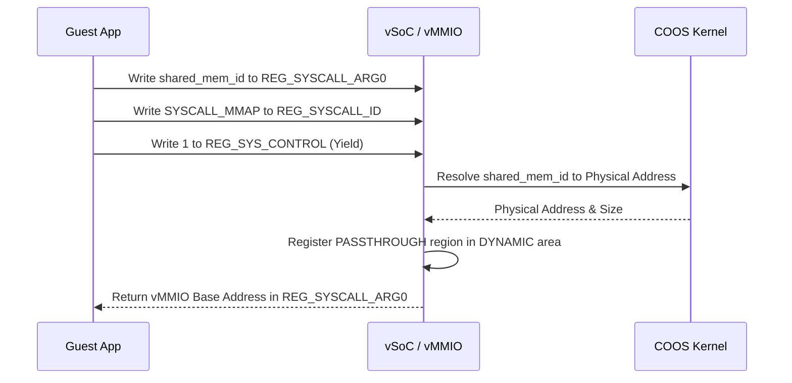

# vMMIO コンポーネント設計書

## 1. コンセプト
vMMIO (Virtual Memory-Mapped I/O) は、WASMゲストアプリケーションに対して仮想的なハードウェアレジスタインターフェイスを提供スル。WASMの仕様に基づき、**割り当て単位は1ページ（64KB）**とし、各デバイス領域は64KB境界に配置される。これにより、WASMのメモリアクセスチェックと親和性の高いトラップ＆エミュレートを実現する。 `{RestrictedPhysicalAccess}` `{vMMIO_TrapAndEmulate}` `{PhysicalPassthrough}` `{WasmPageAlignment}`

## 2. アーキテクチャ分類 (Tier 3: Implementation Domain)
本コンポーネントは **Tier 3 (実装ドメイン)** に属する。仮想的なレジスタアクセスとDMA転送に特化した単一責務のモジュールとして設計する。 `{3TierSeparation}`

## 3. 静的モデル

### 3.1 データ構造 (Harness / Context / View)
- **`vmmio_harness` (Harness)**: vMMIOが依存する `hook_registry` へのアクセスインターフェイスを集約した構造体。 `{StaticDI}`
- **`vmmio_context` (Context)**: 動的なマッピング領域 (`vmmio_dynamic_region`) の管理情報。
- **`vmmio_config` (View)**: 静的な領域定義 (`vmmio_static_region`) の不変なテーブル。 `{Static_Resolution}`

### 2.2 内部ブロック図
```mermaid
    subgraph vMMIO_Layer
        Harness[vmmio_harness]
        Dispatcher[vmmio_dispatcher]
        Context[vmmio_context]
    end

    subgraph Dependency
        Registry[hook_registry]
    end

    Dispatcher -- uses --> Harness
    Harness -- points to --> Registry
    Dispatcher -- operates on --> Context
    Registry -- calls --> Hook[Registered Hooks]
```

### 2.3 主要なクラス・構造体・配列・定数

#### `vmmio_static_region` (ROM領域定義)
コンパイル時に確定し、ROMに配置される静的な領域。

| 項目名 | 機能と役割 | 備考（制約、型など） |
| :--- | :--- | :--- |
| 開始ページ番号 | vMMIO基底アドレスからのオフセットページ。 | `(addr - base) >> 16` |
| ページ数 | 領域の広さをWASMページ（64KB）単位で定義する。 | 1ページ=64KB |
| フック登録ID | 実行時に対応付けるフック（RAM登録）の識別番号。 | 数値索引 |

#### `vmmio_hook_registry` (RAMフック管理)
実行時にフックを登録・差し替え可能な実体。

| 項目名 | 機能と役割 | 備考（制約、型など） |
| :--- | :--- | :--- |
| 読み出し関数 | メモリ参照発生時に呼び出されるコールバック。 | 関数ポインタ |
| 書き込み関数 | メモリ書き込み発生時に呼び出されるコールバック。 | 関数ポインタ |
| `context` | フックに渡す任意のコンテキスト。 | ポインタ |

#### `vmmio_handler` (ハンドラ定義)
読み書きアクセス発生時に呼び出される関数の共通インターフェイス。

| 項目名 | 機能と役割 | 備考（制約、型など） |
| :--- | :--- | :--- |
| アクセス形式定義 | 相対オフセットとデータ列（span）を引数に取る関数の形式。 | `status(offset, span<uint8_t>, is_write)` |

## 4. 動的モデル

- **ディスパッチ**:
    1. ゲストのアドレスが `vmmio_base` 以降である場合、ROM上の `VMMIO_STATIC_MAP` を二分探索する。 `{SortedIndexedArray}`
    2. 該当エントリの `hook_id` を用いて、内部のハンドラレジストリから `vmmio_handler` を取得する。
    3. ハンドラが登録されていれば、指定された `std::span` （バイト/ハーフワード/ワード/連番アクセスを包含）を渡して呼び出す。
- **パススルー処理**: `type` が `PASSTHROUGH` の場合、フック内で `FB_CONF_VMMIO_ALLOWED_ADDRS` との照合を行い、許可されている場合のみ物理メモリへアクセスする。
- **フォールバック**: 該当する領域がない場合は、メモリアクセス違反としてトラップを発生させる。

### 3.2 アルゴリズム: 仮想DMA (VDMA)
ゲストリニアメモリと vMMIO 空間（または他のメモリ領域）間の高速転送を実現する。 `{VDMA}`

1. **転送設定**: ゲストが `REG_VDMA_SRC`, `REG_VDMA_DST`, `REG_VDMA_COUNT` にパラメータを書き込む。
2. **トリガー**: `REG_VDMA_CTRL` の `START` ビットを `1` に書き込む。
3. **実行**: 
   - vMMIO ハンドラが物理アドレスを解決（境界チェック含む）。
   - `std::memcpy` または HAL経由のDMAを用いて一括転送を実行。
4. **完了**: 転送完了後、必要に応じてゲストに仮想割り込み（`IRQ_VDMA_DONE`）を通知する。

### 3.3 仮想デバイスマップ (Default Map)
各領域は 64KB (WASM 1 page) 単位で割り当てられる。 `vMMIO_BASE = 0x4000_0000` とする。

| ページ番号 | ページ数 | デバイス名 | 説明 |
| :--- | :--- | :--- | :--- |
| `0` | `1` | **SYSCTL** | システム制御（Yield, Halt, etc.） |
| `1` | `1` | **IPCR** | IPCルータ連携レジスタ |
| `2` | `1` | **VDMA** | 仮想DMA（バルク転送） |
| `4096` | `4096` | **DYNAMIC** | 動的マッピング領域 (0x5000_0000 〜) |

### 3.3 SYSCTL レジスタ詳細
| オフセット | レジスタ名 | R/W | 説明 |
| :--- | :--- | :--- | :--- |
| `0x00` | `REG_SYS_CONTROL` | W | `1`: Reset, `2`: Yield, `3`: Halt, `4`: Syscall |
| `0x04` | `REG_SYS_STATUS` | R | システム状態フラグ |
| `0x08` | `REG_IRQ_FLAGS` | R/W | 仮想割り込みフラグ |
| `0x10` | `REG_SYSCALL_ID` | R/W | サービスID |
| `0x14` | `REG_SYSCALL_ARG0` | R/W | 第1引数 / 戻り値 |
| `0x18` | `REG_SYSCALL_ARG1` | R/W | 第2引数 |
| `0x1C` | `REG_SYSCALL_ARG2` | R/W | 第3引数 |

### 3.4 VDMA レジスタ詳細
| オフセット | レジスタ名 | R/W | 説明 |
| :--- | :--- | :--- | :--- |
| `0x00` | `REG_VDMA_SRC` | R/W | 転送元アドレス |
| `0x04` | `REG_VDMA_DST` | R/W | 転送先アドレス |
| `0x08` | `REG_VDMA_COUNT` | R/W | 転送バイト数 |
| `0x0C` | `REG_VDMA_CTRL` | W | 制御（Bit0: START） |

### 3.5 動的マッピング (mmap) シーケンス
ゲストがHAL等のサービスから受け取った `shared_mem_id` を vMMIO 空間にマッピングし、直接アクセスを可能にする。



#### 動的マッピングのライフサイクルと安全
1. **Map (SYSCALL_MMAP)**: 共有メモリIDから物理範囲を特定し、vMMIO `DYNAMIC` 領域に `PASSTHROUGH` エントリを作成。
2. **Access**: ゲストが返却された仮想アドレス経由で物理メモリを直接操作。
3. **Unmap (SYSCALL_MUNMAP)**: ゲストが明示的にアンマップを要求、またはタスク終了時に vSoC がエントリを破棄し、物理アクセスを遮断。 `{RestrictedPhysicalAccess}`

## 5. インターフェイス定義

### 4.1 公開API
外部から利用可能なオブジェクト指向APIを定義する。

#### `register_hook`
| 項目 | 内容 |
| :--- | :--- |
| 機能概要 | 既に定義（ROM）されている領域に対して、ホスト側の `vmmio_handler` 実装を紐づける。 |
| 引数と役割 | `reg`: hook_registry, `hook_id`: 対象の領域識別子, `handler`: ハンドラ実装 |
| 期待する結果 | 正常：フックが登録され、以降のアクセスで呼び出される。 |
| 事前条件 | 有効な `hook_id` であること。 |
| 事後条件 | RAM上のレジストリが更新される。 |
| 不変条件 | ROM上のアドレス定義は変更されない。 |
| エラー時の挙動 | 不正なIDの場合はエラー。 |
| 補足 | 起動時、または各デバイスサービスの初期化時に呼び出される。 |

#### `map_buffer`
| 項目 | 内容 |
| :--- | :--- |
| 機能概要 | 物理的なバッファを、ゲストからアクセス可能な vMMIO 空間（DYNAMIC領域）に一時的にマッピングする。 |
| 引数と役割 | `ctx`: vmmio_context, `phys_addr`: 物理基点アドレス, `size`: バイト数 |
| 期待する結果 | 正常：マッピング先の vMMIO 仮想アドレス。 |
| 事前条件 | 指定された物理範囲が安全（アクセス許可内）であること。 |
| 事後条件 | DYNAMIC領域内のスロットが消費され、PASSTHROUGHリージョンが作成される。 |
| 不変条件 | バッファ境界を越えた物理メモリアクセスが発生しないこと。 |
| エラー時の挙動 | DYNAMIC領域に空きがない場合、または安全でない物理アドレスの場合はエラー。 |
| 補足 | 共用メモリ共有やDMAバッファ共有に使用される。 |

#### `dispatch_access`
| 項目 | 内容 |
| :--- | :--- |
| 機能概要 | vSoC 実行エンジンからトラップされたメモリアクセスを解析し、適切なハンドラへ振り分ける。 |
| 引数と役割 | `harness`: vmmio_harness, `ctx`: vmmio_context, `addr`: 基点アドレス, `buffer`: データ (`std::span`), `is_write`: 方向 |
| 期待する結果 | 正常：登録されたハンドラが一括実行され、レジスタ操作の結果がゲストに反映される。 |
| 補足 | `std::span` を用いることで、バイト/ワード単位のアクセスおよび連続領域へのバルクアクセスを統一的に扱う。 |

## 6. 制約達成の方策

### 5.1 性能制約と方策
- **目標**: MMIOアクセスのオーバーヘッドを最小化する。
- **方策**: `{ConfigurableSystem}` 頻繁にアクセスされるデバイス（SYSCTL等）をマップの先頭に配置し、探索コストを削減する。

### 5.2 メモリ制約と方策
- **目標**: マップ管理用のメモリを最小化する。
- **方策**: `{ConfigurableSystem}` 最大登録数をコンパイル時に固定し、静的配列として確保する。

## 7. 設計完了チェックリスト（網羅性確認）
- [x] Tier 3 (Implementation Domain) に基づき設計となっているか
- [x] vMMIOの責務が明確に定義されているか
- [x] コンポーネントの責務が明確に定義されているか
- [x] 内部設計（データ構造、ブロック図、クラス、アルゴリズム）が適切に定義されているか
- [x] 仮想デバイスマップが具体的に定義されているか
- [x] 公開APIのメソッド名が英語で記述され、事前/事後条件が明確か
- [x] 非機能制約（性能、メモリ）に対する具体的な方策が明示されているか
- [x] 設計の交差点（トレードオフ）が解消されているか
- [x] 上位の要求 `{Keyword}` とのトレーサビリティが確保されているか
