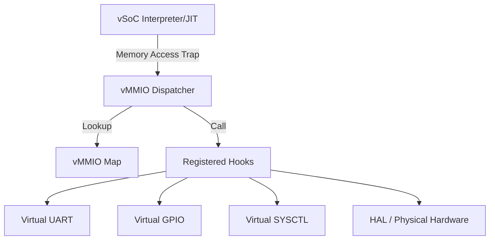
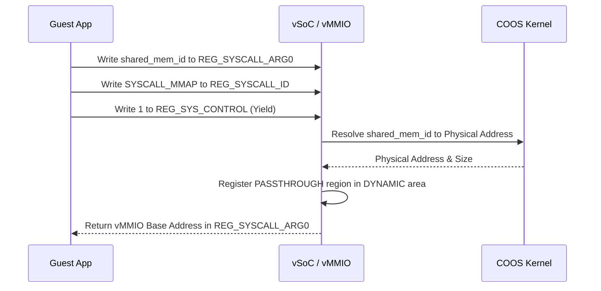

# vMMIO コンポーネント設計書

## 1. コンセプト
vMMIO (Virtual Memory-Mapped I/O) は、WASMゲストアプリケーションに対して仮想的なハードウェアレジスタインターフェイスを提供する。ゲストからの特定のメモリ範囲へのアクセスをトラップし、登録されたコールバック関数（フック）を呼び出すことで、仮想デバイスの動作をシミュレートする。また、安全性が確認された特定の物理レジスタへのパススルーアクセスも提供する。 `{RestrictedPhysicalAccess}` `{vMMIO_TrapAndEmulate}` `{PhysicalPassthrough}`

## 2. 静的モデル

### 2.1 データ構造
- **vmmio_region_t**: 仮想アドレス範囲と、それに対応する読み書きハンドラ（コールバック）を保持する。
- **vmmio_type_t**: 領域の種別（EMULATED, PASSTHROUGH）を定義する。
- **vmmio_map_t**: 登録されたすべての `vmmio_region_t` を管理する静的配列。

### 2.2 内部ブロック図


### 2.3 主要な構造体・クラス・定数

#### `vmmio_handler_t` (ハンドラ関数型)
```cpp
typedef status_t (*vmmio_read_handler_t)(uint32_t addr, uint32_t* val);
typedef status_t (*vmmio_write_handler_t)(uint32_t addr, uint32_t val);
```

#### `vmmio_region_t` (vMMIO領域定義)
| メンバ名 | 型 | 説明 |
| :--- | :--- | :--- |
| `base_addr` | `uint32_t` | 領域の開始アドレス |
| `size` | `uint32_t` | 領域のサイズ |
| `type` | `vmmio_type_t` | 領域種別 (EMULATED / PASSTHROUGH) |
| `read_fn` | `vmmio_read_handler_t` | 読み出しハンドラ |
| `write_fn` | `vmmio_write_handler_t` | 書き込みハンドラ |
| `target_phys_addr` | `uintptr_t` | パススルー時の物理アドレス (PASSTHROUGH時のみ) |

## 3. 動的モデル (Dynamic Model)

### 3.1 アルゴリズム
- **ディスパッチ**: ゲストのアドレスが `vmmio_base` 以降である場合、`vmmio_map` を線形探索し、該当する領域のハンドラを呼び出す。
- **パススルー処理**: `type` が `PASSTHROUGH` の場合、ハンドラ内で `FB_CONF_VMMIO_ALLOWED_ADDRS` との照合を行い、許可されている場合のみ物理メモリへアクセスする。
- **フォールバック**: 該当する領域がない場合は、メモリアクセス違反としてトラップを発生させる。

### 3.2 仮想デバイスマップ (Default Map)
ベースアドレス | デバイス名 | 説明 |
:--- | :--- | :--- |
`0x4000_0000` | **SYSCTL** | システム制御（Yield, Halt, IRQ状態, Syscall引数） |
`0x4000_1000` | **IPCR** | IPCルータ連携レジスタ |
`0x4000_2000` | **VDMA** | 仮想DMA（リニアメモリ・vMMIO間バッチ転送） |
`0x4100_0000` | **DYNAMIC** | 動的マッピング領域（mmap用） |

### 3.3 SYSCTL レジスタ詳細
| オフセット | レジスタ名 | R/W | 説明 |
| :--- | :--- | :--- | :--- |
| `0x00` | `REG_SYS_CONTROL` | W | `1`: Yield, `2`: Halt |
| `0x04` | `REG_SYS_STATUS` | R | システム状態フラグ |
| `0x08` | `REG_IRQ_FLAGS` | R/W | 仮想割り込みフラグ |
| `0x10` | `REG_SYSCALL_ID` | R/W | サービスID (fireball_call用) |
| `0x14` | `REG_SYSCALL_ARG0` | R/W | 第1引数 / 戻り値 |
| `0x18` | `REG_SYSCALL_ARG1` | R/W | 第2引数 |
| `0x1C` | `REG_SYSCALL_ARG2` | R/W | 第3引数 |

### 3.4 VDMA レジスタ詳細
オフセット | レジスタ名 | R/W | 説明 |
:--- | :--- | :--- | :--- |
`0x00` | `REG_VDMA_SRC` | R/W | 転送元アドレス（LMオフセットまたはvMMIOアドレス） |
`0x04` | `REG_VDMA_DST` | R/W | 転送先アドレス（LMオフセットまたはvMMIOアドレス） |
`0x08` | `REG_VDMA_COUNT` | R/W | 転送ワード数 (32-bit words) |
`0x0C` | `REG_VDMA_CTRL` | W | Bit0: START, Bit1: DIR (0:LM->vMMIO, 1:vMMIO->LM), Bit2: INC_SRC, Bit3: INC_DST |

### 3.5 動的マッピング (mmap) シーケンス
ゲストがHAL等のサービスから受け取った `shared_mem_id` を vMMIO 空間にマッピングし、直接アクセスを可能にする。



## 4. インターフェイス定義

### 4.1 公開API
| メソッド名 | 引数 | 戻り値 | 説明 | 事前条件 | 事後条件 |
| :--- | :--- | :--- | :--- | :--- | :--- |
`register_hook` | `region` | `status_t` | vMMIO領域を登録する | なし | 領域がマップに追加される |
`map_buffer` | `phys_addr, size` | `uint32_t` | 物理メモリを動的領域にマップ | なし | vMMIOアドレスを返却 |
`unmap_buffer` | `vmmio_addr` | `status_t` | マッピングを解除 | マップ済み | 領域が解放される |
`dispatch_read` | `addr, val` | `status_t` | 読み出しアクセスを処理 | なし | ハンドラが実行される |
`dispatch_write` | `addr, val` | `status_t` | 書き込みアクセスを処理 | なし | ハンドラが実行される |

## 5. 制約達成の方策

### 5.1 性能制約と方策
- **目標**: MMIOアクセスのオーバーヘッドを最小化する。
- **方策**: `{ConfigurableSystem}` 頻繁にアクセスされるデバイス（SYSCTL等）をマップの先頭に配置し、探索コストを削減する。

### 5.2 メモリ制約と方策
- **目標**: マップ管理用のメモリを最小化する。
- **方策**: `{ConfigurableSystem}` 最大登録数をコンパイル時に固定し、静的配列として確保する。

## 6. 設計完了チェックリスト（網羅性確認）
- [x] コンポーネントの責務が明確に定義されているか
- [x] 内部設計（データ構造、ブロック図、クラス、アルゴリズム）が適切に定義されているか
- [x] 仮想デバイスマップが具体的に定義されているか
- [x] 公開APIのメソッド名が英語で記述され、事前/事後条件が明確か
- [x] 非機能制約（性能、メモリ）に対する具体的な方策が明示されているか
