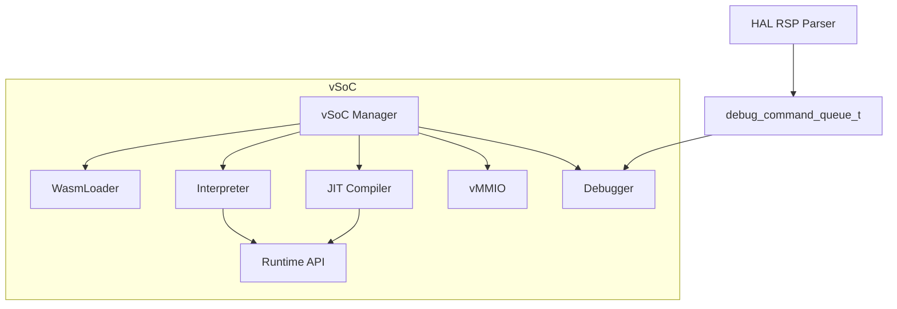
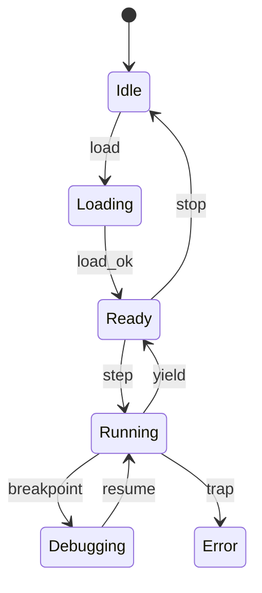
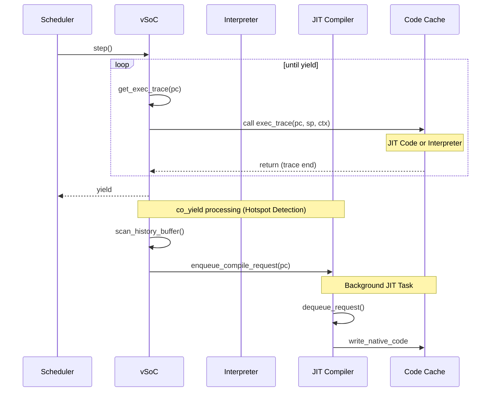

# vSoC コンポーネント設計書

## 1. コンセプト
vSoC (Virtual System-on-Chip) は、WASM実行環境の統合マネージャであり、Loader、Interpreter、JIT、vMMIO、Debugger を統括して実行制御を行う。各サブコンポーネントを統合する「環境」としての役割を持ち、`vsoc_runtime_t` を `execution_context_t` から参照される Environment として提供する。 `{LowLatencyJIT}` `{MemoryIsolation}` `{FaultIsolation}` `{EnvironmentPointer}`

## 2. 静的モデル

### 2.1 データ構造
- **vsoc_runtime**: vSoCが管理する実行ユニットの集合（Loader/Interpreter/JIT/vMMIO/Debuggerの参照）。
- **JIT Code Cache**: コンパイル済みのネイティブコードを保持するダブルバッファ領域。 `{JIT_DoubleBuffer_Cache}`
- **vMMIO Map**: 仮想的なメモリマップドI/Oのフック情報を管理する。

### 2.2 内部ブロック図


### 2.3 主要なクラス・構造体・配列・定数

#### `vsoc_runtime` (vSoC実行ユニット)
vSoCが管理する実行構成を保持する。実行コンテキストの詳細は Interpreter で定義する。

| メンバ名 | 型 | 説明 |
| :--- | :--- | :--- |
| `loader` | `loader*` | WASMローダ参照 |
| `module_view` | `module_view*` | 現在ロードされているモジュールのビュー |
| `interpreter` | `interpreter*` | インタープリタ参照 |
| `jit` | `jit_compiler*` | JITコンパイラ参照 |
| `debugger` | `debugger*` | デバッガ参照 |
| `vmmio` | `vmmio*` | vMMIO参照 |
| `interrupt_flags` | `std::uint32_t` | 仮想割り込みフラグ `{Challenge_InterruptSafety}` |

#### `vsoc_config` (vSoC構成)
vSoCの動作パラメータを定義する。 `{ConfigurableSystem}`

| メンバ名 | 型 | 説明 |
| :--- | :--- | :--- |
| `jit_enabled` | `bool` | JITコンパイルの有効化フラグ |
| `code_cache_size` | `std::size_t` | JITコードキャッシュのサイズ |
| `ram_base` | `std::uint32_t` | ゲストRAMの開始アドレス (通常 0x0) |
| `ram_size` | `std::uint32_t` | ゲストRAMのサイズ |
| `vmmio_base` | `std::uint32_t` | vMMIO領域の開始アドレス (通常 0x4000_0000) |

## 3. 動的モデル

### 3.1 アルゴリズム
- **実行エンジン委譲 (exec_trace)**: vSoCは `step()` で現在のPCに対応する `exec_trace` を呼び出す。 `exec_trace` はインタープリタのディスパッチャまたはJITコードを指し、呼び出し側は実行エンジンを意識する必要がない。 `{ThreadedInterpreter}` `{CopyAndPatchJIT}`
- **概算Yield**: 監視対象の `yield_count` を基準に `co_yield` を発行する。 `{Challenge_ApproximateYield}`
- **デバッグ連携**: `step()` 前後で Debugger を呼び出し、HAL層からのコマンドを処理する。

### 3.2 状態遷移図


### 3.3 内部シーケンス
#### WASM実行およびJIT遷移シーケンス


## 4. インターフェイス定義

### 4.1 公開API
### 4.1 公開API

```cpp
class vsoc_manager {
public:
    /**
     * @brief WASMモジュールをロードする
     * @param data モジュールデータ
     * @return status 実行結果
     * @pre なし
     * @post 状態がReadyになる
     */
    status load(const module_data& data);

    /**
     * @brief 実行を再開/継続する
     * @return status 実行結果
     * @pre Ready状態
     * @post yieldまたは終了まで実行
     */
    status step();

    /**
     * @brief 仮想割り込みを通知する
     * @param irq_id 割り込みID
     * @pre なし
     * @post コンテキストにフラグがセットされる
     */
    void notify_interrupt(irq_id irq_id);

    /**
     * @brief vMMIOフックを登録する
     * @param addr 開始アドレス
     * @param size サイズ
     * @param cb コールバック関数
     * @return status 実行結果
     * @pre なし
     * @post フックが有効になる
     */
    status register_vmmio_hook(std::uint32_t addr, std::uint32_t size, vmmio_callback cb);
};
```

### 4.2 Native API エクスポート (Single Trap 方式)
WASMゲストからホストサービスを呼び出すための最小限のインターフェイスを提供する。 `{NativeAPI_Export}`

Fireballでは、ホスト側のコードサイズを極限まで削減するため、標準的なWASIの実装をホストから排除し、単一のトラップ命令とvMMIOレジスタによるサービス提供を行う。

- **トラップ命令**: `void fireball_call(uint32_t service_id)`
  - ゲストはこの関数をインポートし、サービスIDを指定して呼び出す。
  - 引数および戻り値の受け渡しは vMMIO レジスタ（`REG_SYSCALL_ARG0`等）を介して行う。
- **WASI互換性**: ゲスト側で `wasi-libc` と Fireball専用の Shim ライブラリをリンクすることで実現する。

### 4.3 マルチモジュール対応
複数のWASMモジュール間の依存関係を解決し、動的にリンクする。 `{MultiModule_Support}`

- **Module Registry**: ロード済みのモジュールを名前で管理する。
- **Dynamic Linking**: インポートセクションに基づき、他モジュールのエクスポートを解決する。

### 4.4 URI/IPCインターフェイス
- **URI**: `fireball://vsoc/control/<instance_id>`
- **メッセージ形式**: 実行制御、状態取得用のKey-Valueプロトコル。

### 4.5 関連コンポーネントとの連携
| コンポーネント | 連携内容 | 参照データ構造 |
| :--- | :--- | :--- |
| **Interpreter** | インタープリタ実行の委譲とホットスポット履歴の取得 | `interpreter`, 履歴バッファ |
| **JIT Compiler** | トレース単位のコンパイル要求とコードキャッシュ管理 | `jit_compiler`, `JIT Code Cache` |
| **Wasm Loader** | モジュールロードと `module_view` の管理 | `loader`, `module_view` |
| **Debugger** | デバッグコマンドの処理と実行状態の同期 | `debugger`, `debug_command_queue` |

## 5. 制約達成の方策

### 5.1 性能制約と方策
- **目標**: WAMRインタープリタを上回る実行速度を実現する。
- **方策**: `{LowLatencyJIT}` `{ThreadedInterpreter}` コピーアンドパッチJITによるネイティブ実行と、スレッドインタープリタによる高速フォールバックを組み合わせる。

### 5.2 メモリ制約と方策
- **目標**: 64KB RAM環境で動作させる。
- **方策**: `{JIT_DoubleBuffer_Cache}` `{IndependentHeap}` ダブルバッファによる効率的なキャッシュ管理と、厳密なヒープ分離によりメモリ使用量を制御する。
- **高速アドレス判定**: ゲストRAMを `0x0` から配置し、単一の比較命令でRAMアクセスを判定することで、インタープリタおよびJITのオーバーヘッドを最小化する。

### 5.3 安全性制約と方策
- **目標**: ゲストアプリケーションの暴走を完全に隔離する。
- **方策**: `{MemoryBoundaryCheck}` `{RestrictedPhysicalAccess}` JITコードへの境界チェック埋め込みと、vMMIOによる物理アクセスの制限を行う。

## 6. 設計完了チェックリスト（網羅性確認）
- [x] コンポーネントの責務が明確に定義されているか
- [x] 内部設計（データ構造、ブロック図、クラス、アルゴリズム）が適切に定義されているか
- [x] 内部ブロック図（静的）とシーケンス/状態遷移図（動的）がセットで定義されているか
- [x] 公開APIのメソッド名が英語で記述され、事前/事後条件が明確か
- [x] 非機能制約（性能、メモリ、安全性）に対する具体的な方策が明示されているか
- [x] 設計の交差点（トレードオフ）が解消されているか
- [x] 上位の要求 `{Keyword}` とのトレーサビリティが確保されているか
