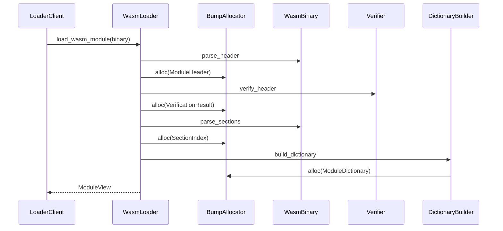
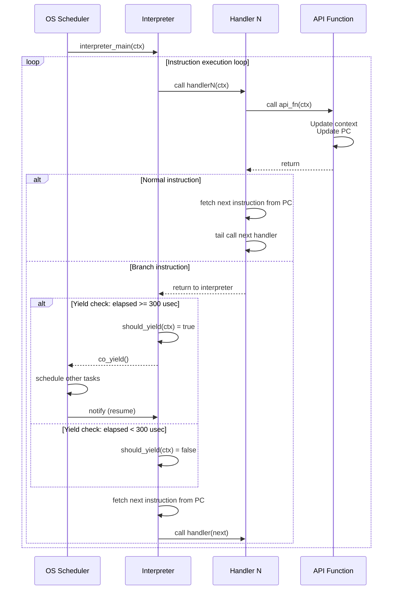

# vSoC

vSoC (Virtual System-on-Chip) は、リソース制限の厳しい組み込み環境において、セキュアかつ高性能なWASM実行環境を提供する仮想SoCコンポーネントである。ハードウェア抽象化、低レイテンシ実行、セキュアな隔離を実現し、複数のゲストアプリケーションを安全に実行する。

## コンセプト

vSoCは3つの主要な設計原則に基づいている。

- **ハードウェア抽象化**: WASMゲストに対し、仮想的なレジスタ、メモリマップドI/O (vMMIO)、および割り込み機構を提供し、ベアメタルに近いプログラミングモデルを実現する。
- **低レイテンシ実行**: コピーアンドパッチ方式のJITコンパイルにより、インタープリタの柔軟性とネイティブ実行に近い性能を両立する。 `{LowLatencyJIT}`
- **セキュアな隔離**: WASMのサンドボックス構造と、COOSによるメモリパーティショニングを組み合わせ、ゲストアプリケーション間の干渉を完全に排除する。 `{MemoryIsolation}` `{FaultIsolation}`

## 構成要素

vSoCはいくつかの主要コンポーネントで構成される：wasmローダ、ランタイムAPI、インタープリタ、デバッガ、JITコンパイラ、vMMIO。各コンポーネントは独立した責務を持ち、協調して動作する。

### wasmローダ

wasmバイナリをパースする。

- ひとつのランタイムに複数のwasmモジュールがロードできる。
- ハイパーバイザ組み込みのwasmモジュールをサービス (@docs/oders/components/services.md)と呼ぶ。
- wasmバイナリはRAMに展開しない。ROM上でパースし、アクセスを効率化するための辞書を持つ。 `{ROMParsing}` `{AccessDictionary}`
- wasmバイナリの正当性を検証するベリファイアは簡易的なものにする。 `{LightweightVerifier}`
- ローダで使用するメモリはモジュールが破棄されるまで解放されないのでバンプアロケータ (＠docs/oders/patterns/stdlib.md) でメモリを確保する。 `{BumpAllocator}`
- 辞書は `/workspaces/fireball/docs/oders/patterns/stdlib.md` で示されるKey-Value配列を用いる。

シーケンスの概要は下記の通り。

### ランタイムAPI

ランタイムAPIはwasm命令の抽象化を行わない。ランタイムの性能のポイントはインタープリタではなく最適化されたランタイムAPIにある。

- ランタイムAPIの機能は原則としてwasm命令と一対一で対応する。
- インタープリタでは算術演算命令以外は実行コンテキストを引数にランタイムAPIを呼び出すだけである。
- ランタイムAPIの関数の型はJITコンパイラの簡略化のためすべて同一である。

### インタープリタ

インタープリタはwasmバイナリを実行する。

- ハンドラを継続渡しで連鎖させるスレッドインタープリタとする。 `{ThreadedInterpreter}`
  - ハンドラではランタイムAPIをインライン展開して呼び出す。
  - ジャンプ、分岐命令は継続渡しをせずインタープリタに戻ってくる。
  - この仕組みでトレース単位で継続渡しでwasm命令が連続実行される。
- デバッガが動いている場合はテーブルのジャンプ先を入れ替える。 `{DebuggerLabelTableSwitch}`
- ジャンプ命令や関数呼び出し時にwasmゲストの連続実行時間が300usecを超えていた場合、co_yieldし、別のタスクに制御を渡す。 `{YieldOnTimeLimit}`
  - 300usecを計測するのにはタイマを用いず、実行したトレースの数で超概算する。
  - トレースの平均実行時間を10usecとした場合、300usecは30トレースを意味する。
- ジャンプ命令や関数呼び出し時にHALから割り込みフラグが立てられていた場合、さらに割り込み要因をチェックし、wasmゲストの割り込み処理を行う。 `{InterruptCheckOnBranch}` `{TaskPollInterruptFlag}`
- インタープリタの実行状態はコンテキスト構造体に保持され、PIC対応のJITコードと共有される。 `{InterpreterContextInterruptManagement}`
- 将来的なJITコンパイラの出力バイナリをPICとするため、インタープリタからアクセスする情報はコンテキストに集約する。 `{PositionIndependentCode}` `{ContextPointerRegister}`

実装すべき最小セットのwasm命令は、clang++が出力するバイナリの仕様から導出される。

### デバッガ

wasmゲストをデバッグするためにRSP (GDB Remote Serial Protocol) をサポートする。

- x64環境では標準出力とする。
- x64以外ではUARTを出力先とする。
- 省メモリ環境では無効化可能とする。

実装すべき最小セットのRSPコマンドは、VSCodeのC/C++拡張機能が必要とする仕様から導出される。

### JITコンパイラ

コピーアンドパッチ方式のJITコンパイラにより、コンパイルレイテンシの最小化と実行性能を両立する。 `{LowLatencyJIT}`

- WASMバイナリは生成時に最適化済みであるため、JIT実行時のデータフロー解析等は行わず、事前定義された命令テンプレートを連結する。 `{CopyAndPatchJIT}`
- 算術演算命令以外はランタイムAPIを呼び出すコードを埋め込む。重い処理をAPIに委ねることで、JITエンジンの複雑さを抑制する。
- コンパイルが高速であるため、キャッシュミス時の再生成コストが低い。これにより、小規模なコードキャッシュ領域でも十分な性能が得られ、複雑なホットスポットプロファイラを不要とする。 `{SimpleJITArchitecture}`
- デバッガやサービスによる命令フックが有効な場合、追加コードを埋め込む。
- LRU方式でコンパイルキャッシュを管理し、限られたメモリ領域を効率的に利用する。キャッシュ領域はコンパイル時に固定サイズで確保された静的配列を用いる。 `{JITCodeCache}`
- 出力バイナリはPIC (Position Independent Code) とし、コンテキストポインタをレジスタに保持する。 `{PositionIndependentCode}` `{ContextPointerRegister}`

### vMMIO

wasmゲストから見たメモリマップドI/O処理コンポーネント。

- システムコール、ネイティブライブラリ呼び出し、ハードウェアアクセスなどの機能を呼び出す。
- コンフィグで許可された物理アドレスをvMMIO経由でゲストに公開できる。 `{RestrictedPhysicalAccess}`
  - 応答性が必要なGPIOなどはvMMIO内で直接アクセスする。

## インターフェイス

vSoCはCOOSタスクとして動作し、以下の3つのインターフェイスグループを提供する。

### ゲスト制御インターフェイス

ゲストアプリケーションのライフサイクルを管理する。ゲストはyieldで短時間で戻ってくるため、step呼び出しを繰り返して実行を継続する。 `{GuestLifecycleControl}`

- `load(module_data)`: WASMバイナリをロードし、実行コンテキストを初期化する。
- `step()`: ゲストの実行を再開する。yieldで中断した地点から実行を継続し、次のyieldまたは終了まで実行する。
- `stop()`: ゲストの実行を停止し、リソースを解放する。

### vMMIOアクセスインターフェイス

メモリアクセス時のフック処理を登録し、カスタム処理を実装する。

- `register_read_hook(address, size, callback)`: 指定されたアドレス範囲の読み出し時に実行されるコールバック関数を登録する。
- `register_write_hook(address, size, callback)`: 指定されたアドレス範囲の書き込み時に実行されるコールバック関数を登録する。
- `unregister_hook(address)`: 指定されたアドレスのフック処理を削除する。

### 割り込みインターフェイス

ゲストへの割り込み通知を提供する。

- `notify_interrupt(irq_id)`: ゲストに対し仮想割り込みを通知する。

## 機能制約達成のための方策

### 浮動小数点演算の非サポート

組み込みターゲットのFPU有無に依存せず、バイナリサイズを削減するため、浮動小数点命令はトラップまたはエラーとする。 `{NoFloatingPoint}`

### 決定論的実行

JITコンパイル時および実行時のメモリ確保を、事前に割り当てられたヒープパーティション内で行うことで、実行時間の予測可能性を確保する。 `{DeterministicExecution}`

## 非機能制約達成のための方策

### 性能制約と方策

低レイテンシ実行を実現するための方策。

- **コピーアンドパッチJIT**: 複雑な最適化を省き、事前定義された命令テンプレートを連結することで、コンパイル時間を最小化しつつ実行速度を向上させる。 `{CopyAndPatchJIT}`
- **LRUキャッシュ**: コンパイル済みコードをLRU (Least Recently Used) 方式で管理し、限られたコードキャッシュ領域を効率的に利用する。 `{JITCodeCache}`

### メモリ制約と方策

メモリ効率を実現するための方策。

- **ヒープパーティショニング**: `WASMランタイムヒープ` と `ゲストモジュールヒープ` を分離し、ゲストの暴走がランタイム自体に影響を与えないようにする。 `{IndependentHeap}`
- **スタックレス実行**: インタープリタおよびJITコードにおいて、ホスト側のスタック消費を最小限に抑える設計とする。 `{StacklessExecution}` インタープリタコンテキストはすべての実行状態を保持し、ホスト側スタックを使用しない。 `{InterpreterContextStackless}`

### 安全性制約と方策

セキュアな隔離を実現するための方策。

- **境界チェックのJIT埋め込み**: メモリアクセス命令に対し、JITコンパイル時に境界チェックコードをインライン展開し、不正アクセスを即座にトラップする。 `{MemoryBoundaryCheck}`
- **物理アドレスアクセスの制限**: vMMIO経由の物理アドレスアクセスは、コンフィグで明示的に許可された範囲に限定し、HAL層で検証を行う。 `{RestrictedPhysicalAccess}`

## 付録A: サポートするWASM命令セット

各命令は実装すべき最小セットとして選定されている。

### 制御フロー命令

プログラムの実行フローを制御する命令。

| 命令 | オペランド | 説明 |
|------|-----------|------|
| `block` | blocktype | ブロック開始 |
| `loop` | blocktype | ループ開始 |
| `if` | blocktype | 条件分岐開始 |
| `else` | - | else分岐 |
| `end` | - | ブロック/ループ/if終了 |
| `br` | labelidx | 無条件分岐 |
| `br_if` | labelidx | 条件付き分岐 |
| `br_table` | vec(labelidx), labelidx | テーブル分岐 |
| `return` | - | 関数から戻る |
| `call` | funcidx | 関数呼び出し |
| `call_indirect` | typeidx, tableidx | 間接関数呼び出し |

### メモリ命令

メモリへのアクセスを行う命令。

| 命令 | オペランド | 説明 |
|------|-----------|------|
| `i32.load` | memarg | メモリからi32をロード |
| `i32.load8_s` | memarg | メモリからi32をロード（符号拡張） |
| `i32.load8_u` | memarg | メモリからi32をロード（ゼロ拡張） |
| `i32.load16_s` | memarg | メモリからi32をロード（符号拡張） |
| `i32.load16_u` | memarg | メモリからi32をロード（ゼロ拡張） |
| `i32.store` | memarg | メモリにi32をストア |
| `i32.store8` | memarg | メモリにi32をストア（下位8ビット） |
| `i32.store16` | memarg | メモリにi32をストア（下位16ビット） |
| `memory.size` | - | メモリサイズを取得 |
| `memory.grow` | - | メモリを拡張 |

### 算術演算命令

整数演算を行う命令。

| 命令 | オペランド | 説明 |
|------|-----------|------|
| `i32.const` | i32 | 定数をプッシュ |
| `i32.add` | - | 加算 |
| `i32.sub` | - | 減算 |
| `i32.mul` | - | 乗算 |
| `i32.div_s` | - | 符号付き除算 |
| `i32.div_u` | - | 符号なし除算 |
| `i32.rem_s` | - | 符号付き剰余 |
| `i32.rem_u` | - | 符号なし剰余 |
| `i32.and` | - | ビット論理積 |
| `i32.or` | - | ビット論理和 |
| `i32.xor` | - | ビット排他的論理和 |
| `i32.shl` | - | 左シフト |
| `i32.shr_s` | - | 算術右シフト |
| `i32.shr_u` | - | 論理右シフト |
| `i32.rotl` | - | 左ローテート |
| `i32.rotr` | - | 右ローテート |

### 比較命令

値の比較を行う命令。

| 命令 | オペランド | 説明 |
|------|-----------|------|
| `i32.eqz` | - | ゼロ比較 |
| `i32.eq` | - | 等値比較 |
| `i32.ne` | - | 不等値比較 |
| `i32.lt_s` | - | 符号付き小なり比較 |
| `i32.lt_u` | - | 符号なし小なり比較 |
| `i32.le_s` | - | 符号付き小なり等しい比較 |
| `i32.le_u` | - | 符号なし小なり等しい比較 |
| `i32.gt_s` | - | 符号付き大なり比較 |
| `i32.gt_u` | - | 符号なし大なり比較 |
| `i32.ge_s` | - | 符号付き大なり等しい比較 |
| `i32.ge_u` | - | 符号なし大なり等しい比較 |

### スタック操作命令

スタック上の値を操作する命令。

| 命令 | オペランド | 説明 |
|------|-----------|------|
| `drop` | - | スタックトップを削除 |
| `select` | - | 条件付き選択 |
| `local.get` | localidx | ローカル変数を取得 |
| `local.set` | localidx | ローカル変数を設定 |
| `local.tee` | localidx | ローカル変数を設定（値を保持） |
| `global.get` | globalidx | グローバル変数を取得 |
| `global.set` | globalidx | グローバル変数を設定 |

### その他の命令

| 命令 | オペランド | 説明 |
|------|-----------|------|
| `unreachable` | - | 到達不可能 |
| `nop` | - | 何もしない |

## 付録B: サポートするRSPコマンド

VSCodeのC/C++拡張機能が必要とするGDB Remote Serial Protocol (RSP) コマンドの最小セット。各コマンドはデバッグセッションの管理、メモリアクセス、ブレークポイント設定などを実現する。

### セッション管理

デバッグセッションの制御を行うコマンド。

| コマンド | 形式 | 説明 |
|---------|------|------|
| `?` | `?` | 停止理由を問い合わせ |
| `c` | `c[addr]` | 実行を継続 |
| `C` | `C sig[;addr]` | シグナル付きで継続 |
| `s` | `s[addr]` | ステップ実行 |
| `S` | `S sig[;addr]` | シグナル付きでステップ実行 |
| `k` | `k` | ターゲットを終了 |

### メモリアクセス

メモリの読み書きを行うコマンド。

| コマンド | 形式 | 説明 |
|---------|------|------|
| `m` | `m addr,length` | メモリを読み出す |
| `M` | `M addr,length:XX...` | メモリに書き込む |
| `X` | `X addr,length:XX...` | バイナリデータでメモリに書き込む |

### レジスタアクセス

レジスタの読み書きを行うコマンド。

| コマンド | 形式 | 説明 |
|---------|------|------|
| `g` | `g` | すべてのレジスタを読み出す |
| `G` | `G XX...` | すべてのレジスタに書き込む |
| `p` | `p n` | レジスタnを読み出す |
| `P` | `P n=XX...` | レジスタnに書き込む |

### ブレークポイント

ブレークポイントとウォッチポイントを管理するコマンド。

| コマンド | 形式 | 説明 |
|---------|------|------|
| `z` | `z type,addr,kind` | ブレークポイント/ウォッチポイントを削除 |
| `Z` | `Z type,addr,kind` | ブレークポイント/ウォッチポイントを設定 |

ブレークポイントタイプ:
- `0`: ソフトウェアブレークポイント
- `1`: ハードウェアブレークポイント
- `2`: 書き込みウォッチポイント
- `3`: 読み出しウォッチポイント
- `4`: アクセスウォッチポイント

### スレッド情報

スレッド情報を取得するコマンド。

| コマンド | 形式 | 説明 |
|---------|------|------|
| `H` | `H op thread-id` | スレッドを選択 |
| `T` | `T thread-id` | スレッド情報を取得 |

### 情報取得

デバッガの機能や状態を問い合わせるコマンド。

| コマンド | 形式 | 説明 |
|---------|------|------|
| `q` | `q name [params]` | 一般的な情報を問い合わせ |
| `Q` | `Q name params` | 一般的な情報を設定 |

主要なqコマンド:
- `qSupported`: サポート機能を問い合わせ
- `qTStatus`: トレース状態を問い合わせ
- `qOffsets`: セクションオフセットを問い合わせ
- `qSymbol`: シンボル情報を問い合わせ
- `qfThreadInfo`: スレッド一覧を問い合わせ
- `qsThreadInfo`: スレッド一覧の続き

### 実行制御

複合的な実行制御を行うコマンド。

| コマンド | 形式 | 説明 |
|---------|------|------|
| `vCont` | `vCont[;action[:thread-id]]...` | 複合実行制御 |

アクション:
- `c`: 継続
- `s`: ステップ
- `t`: 停止
- `r`: 範囲ステップ

### 応答形式

RSPコマンドに対する応答形式。

| 応答 | 説明 |
|------|------|
| `OK` | コマンド成功 |
| `ENN` | エラー（NNはエラーコード） |
| `S AA` | シグナルAAで停止 |
| `T AA name:r value;...` | 停止情報（レジスタ値付き） |
| `W AA` | シグナルAAで終了 |
| `X AA` | シグナルAAで終了 |
