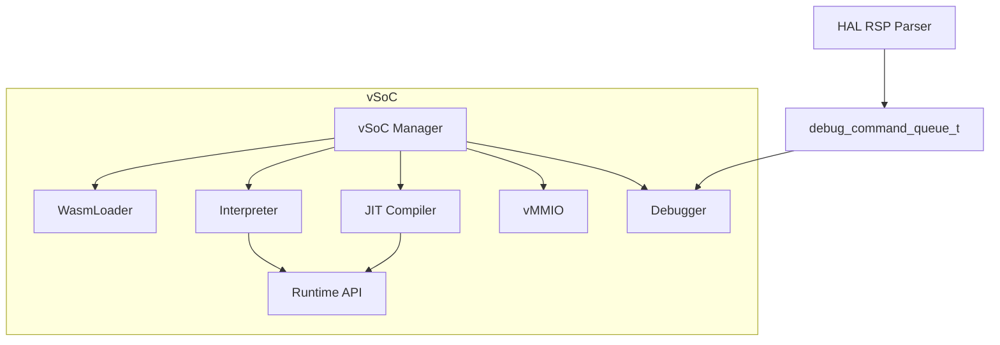
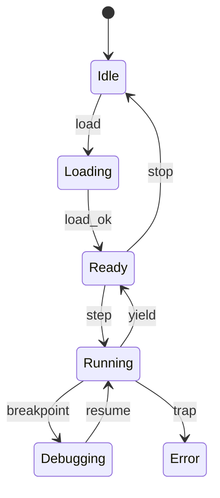
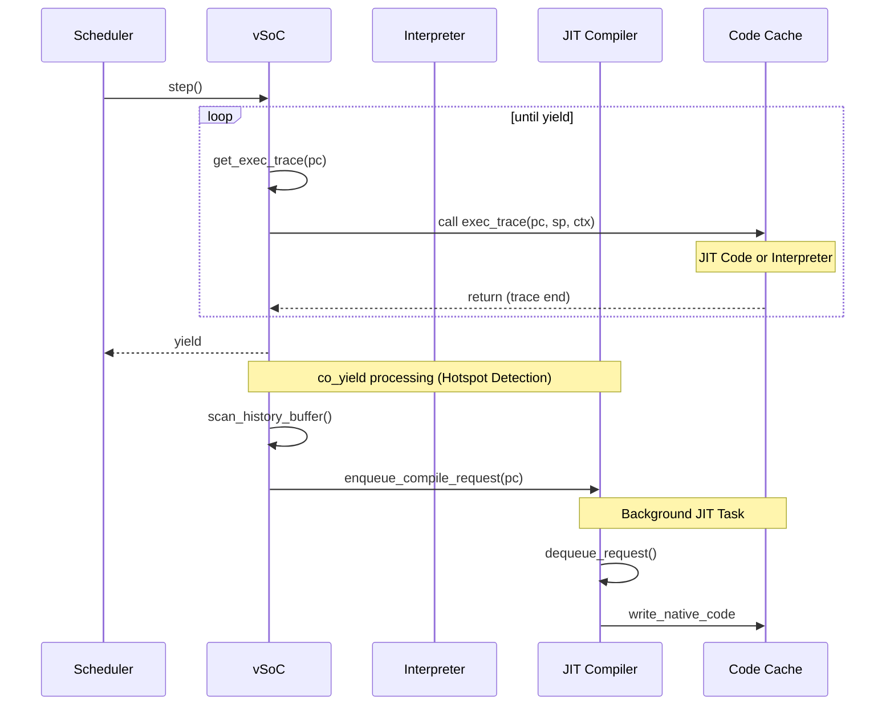

# vSoC コンポーネント設計書

## 1. コンセプト
vSoC (Virtual System-on-Chip) は、WASM実行環境の統合マネージャであり、Loader、Interpreter、JIT、vMMIO、Debugger を統括して実行制御を行う。各サブコンポーネントを統合する「環境」としての役割を持ち、`vsoc_runtime_t` を `execution_context_t` から参照される Environment として提供する。 `{LowLatencyJIT}` `{MemoryIsolation}` `{FaultIsolation}` `{EnvironmentPointer}`

## 2. 静的モデル

### 2.1 データ構造
- **vsoc_runtime_t**: vSoCが管理する実行ユニットの集合（Loader/Interpreter/JIT/vMMIO/Debuggerの参照）。
- **JIT Code Cache**: コンパイル済みのネイティブコードを保持するダブルバッファ領域。 `{JIT_DoubleBuffer_Cache}`
- **vMMIO Map**: 仮想的なメモリマップドI/Oのフック情報を管理する。

### 2.2 内部ブロック図

### 2.3 主要な構造体・クラス・定数

#### `vsoc_runtime_t` (vSoC実行ユニット)
vSoCが管理する実行構成を保持する。実行コンテキストの詳細は Interpreter で定義する。

| メンバ名 | 型 | 説明 |
| :--- | :--- | :--- |
| `loader` | `loader_t*` | WASMローダ参照 |
| `module_view` | `module_view_t*` | 現在ロードされているモジュールのビュー |
| `interpreter` | `interpreter_t*` | インタープリタ参照 |
| `jit` | `jit_compiler_t*` | JITコンパイラ参照 |
| `debugger` | `debugger_t*` | デバッガ参照 |
| `vmmio` | `vmmio_t*` | vMMIO参照 |
| `interrupt_flags` | `uint32_t` | 仮想割り込みフラグ `{Challenge_InterruptSafety}` |

#### `vsoc_config_t` (vSoC構成)
vSoCの動作パラメータを定義する。 `{ConfigurableSystem}`

| メンバ名 | 型 | 説明 |
| :--- | :--- | :--- |
| `jit_enabled` | `bool` | JITコンパイルの有効化フラグ |
| `code_cache_size` | `size_t` | JITコードキャッシュのサイズ |
| `ram_base` | `uint32_t` | ゲストRAMの開始アドレス (通常 0x0) |
| `ram_size` | `uint32_t` | ゲストRAMのサイズ |
| `vmmio_base` | `uint32_t` | vMMIO領域の開始アドレス (通常 0x4000_0000) |

## 3. 動的モデル

### 3.1 アルゴリズム
- **実行エンジン委譲 (exec_trace)**: vSoCは `step()` で現在のPCに対応する `exec_trace` を呼び出す。 `exec_trace` はインタープリタのディスパッチャまたはJITコードを指し、呼び出し側は実行エンジンを意識する必要がない。 `{ThreadedInterpreter}` `{CopyAndPatchJIT}`
- **概算Yield**: 監視対象の `yield_count` を基準に `co_yield` を発行する。 `{Challenge_ApproximateYield}`
- **デバッグ連携**: `step()` 前後で Debugger を呼び出し、HAL層からのコマンドを処理する。

### 3.2 状態遷移図

### 3.3 内部シーケンス
#### WASM実行およびJIT遷移シーケンス

## 4. インターフェイス定義

### 4.1 公開API
| メソッド名 (English) | 引数 | 戻り値 | 説明 | 事前条件 | 事後条件 |
| :--- | :--- | :--- | :--- | :--- | :--- |
| `load` | `module_data` | `status_t` | WASMモジュールをロード | なし | 状態がReadyになる |
| `step` | `void` | `status_t` | 実行を再開/継続 | Ready状態 | yieldまたは終了まで実行 |
| `notify_interrupt` | `irq_id` | `void` | 仮想割り込みを通知 | なし | コンテキストにフラグセット |
| `register_vmmio_hook` | `addr, size, cb` | `status_t` | vMMIOフックを登録 | なし | フックが有効になる |

### 4.2 Native API エクスポート (WAMR互換)
WASMゲストからホスト関数を呼び出すためのインターフェイスを提供する。 `{NativeAPI_Export}`

- **NativeSymbol**: 関数名、関数ポインタ、シグネチャのペア。
- **シグネチャ形式**: `(ii)i` (i32, i32 -> i32) 等。
  - `*`: バッファアドレス (自動変換)
  - `~`: バッファサイズ (境界チェック)
  - `$`: 文字列 (自動変換)

### 4.3 マルチモジュール対応
複数のWASMモジュール間の依存関係を解決し、動的にリンクする。 `{MultiModule_Support}`

- **Module Registry**: ロード済みのモジュールを名前で管理する。
- **Dynamic Linking**: インポートセクションに基づき、他モジュールのエクスポートを解決する。

### 4.4 URI/IPCインターフェイス
- **URI**: `fireball://vsoc/control/<instance_id>`
- **メッセージ形式**: 実行制御、状態取得用のKey-Valueプロトコル。

### 4.5 関連コンポーネントとの連携
| コンポーネント | 連携内容 | 参照データ構造 |
| :--- | :--- | :--- |
| **Interpreter** | インタープリタ実行の委譲とホットスポット履歴の取得 | `interpreter_t`, 履歴バッファ |
| **JIT Compiler** | トレース単位のコンパイル要求とコードキャッシュ管理 | `jit_compiler_t`, `JIT Code Cache` |
| **Wasm Loader** | モジュールロードと `module_view_t` の管理 | `loader_t`, `module_view_t` |
| **Debugger** | デバッグコマンドの処理と実行状態の同期 | `debugger_t`, `debug_command_queue_t` |

## 5. 制約達成の方策

### 5.1 性能制約と方策
- **目標**: WAMRインタープリタを上回る実行速度を実現する。
- **方策**: `{LowLatencyJIT}` `{ThreadedInterpreter}` コピーアンドパッチJITによるネイティブ実行と、スレッドインタープリタによる高速フォールバックを組み合わせる。

### 5.2 メモリ制約と方策
- **目標**: 64KB RAM環境で動作させる。
- **方策**: `{JIT_DoubleBuffer_Cache}` `{IndependentHeap}` ダブルバッファによる効率的なキャッシュ管理と、厳密なヒープ分離によりメモリ使用量を制御する。
- **高速アドレス判定**: ゲストRAMを `0x0` から配置し、単一の比較命令でRAMアクセスを判定することで、インタープリタおよびJITのオーバーヘッドを最小化する。

### 5.3 安全性制約と方策
- **目標**: ゲストアプリケーションの暴走を完全に隔離する。
- **方策**: `{MemoryBoundaryCheck}` `{RestrictedPhysicalAccess}` JITコードへの境界チェック埋め込みと、vMMIOによる物理アクセスの制限を行う。

## 6. 設計完了チェックリスト（網羅性確認）
- [x] コンポーネントの責務が明確に定義されているか
- [x] 内部設計（データ構造、ブロック図、クラス、アルゴリズム）が適切に定義されているか
- [x] 内部ブロック図（静的）とシーケンス/状態遷移図（動的）がセットで定義されているか
- [x] 公開APIのメソッド名が英語で記述され、事前/事後条件が明確か
- [x] 非機能制約（性能、メモリ、安全性）に対する具体的な方策が明示されているか
- [x] 設計の交差点（トレードオフ）が解消されているか
- [x] 上位の要求 `{Keyword}` とのトレーサビリティが確保されているか
