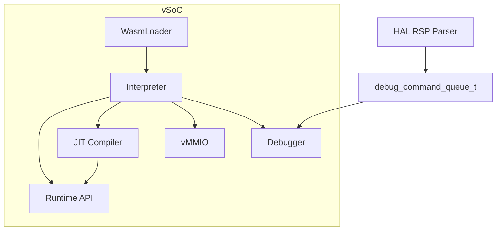
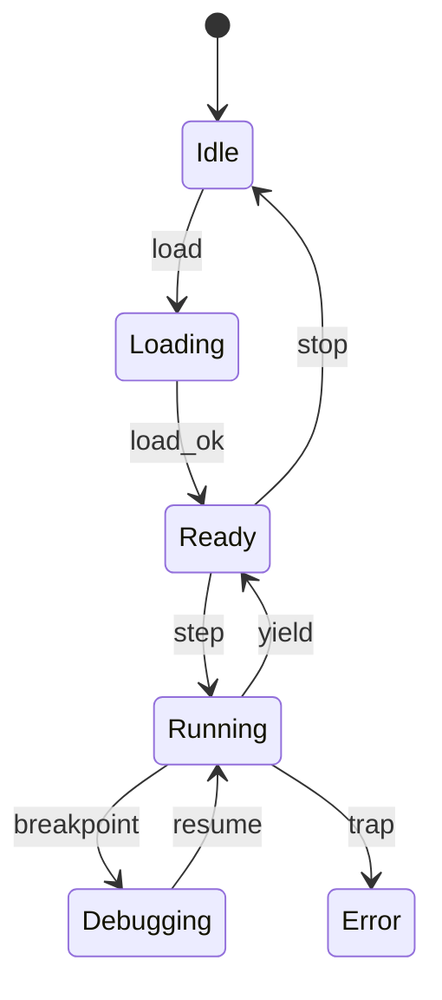
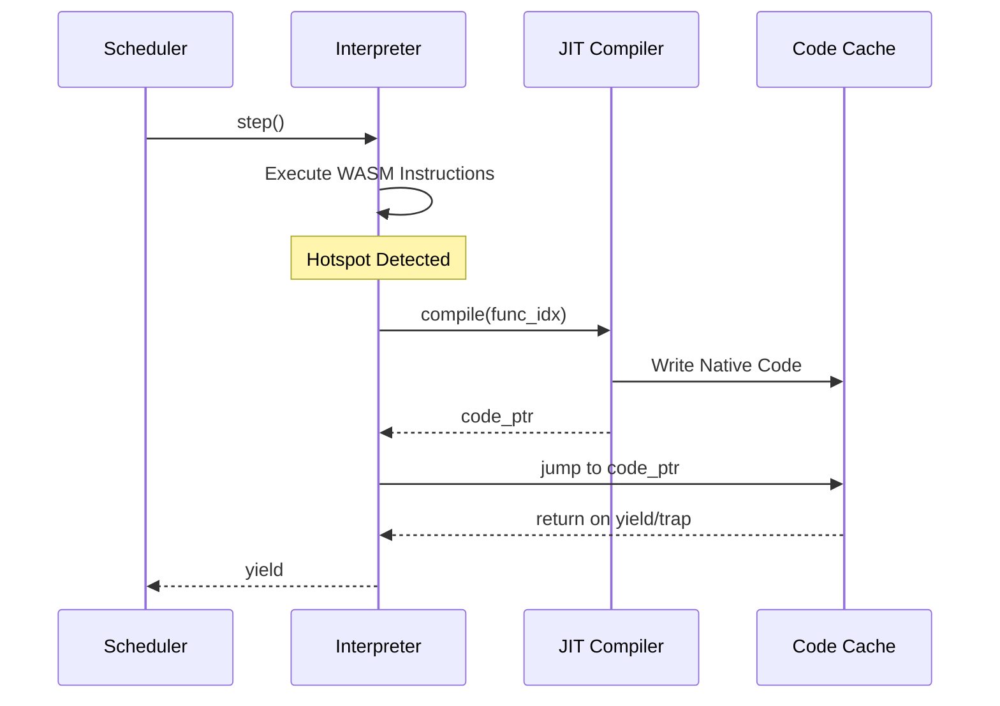

# vSoC コンポーネント設計書

## 1. コンセプト
vSoC (Virtual System-on-Chip) は、リソース制限の厳しい組み込み環境において、セキュアかつ高性能なWASM実行環境を提供する。ハードウェア抽象化 (vMMIO)、低レイテンシ実行 (Copy-and-Patch JIT)、および厳密な隔離を実現する。また、HAL層から供給されるデバッグコマンドキューを介して、外部デバッガとの連携を可能にする。 `{LowLatencyJIT}` `{MemoryIsolation}` `{FaultIsolation}`

## 2. 静的モデル

### 2.1 データ構造
- **execution_context_t**: WASMのレジスタ、スタック、メモリ、および実行状態を保持する。 `{InterpreterContextStackless}`
- **JIT Code Cache**: コンパイル済みのネイティブコードを保持するダブルバッファ領域。 `{JIT_DoubleBuffer_Cache}`
- **vMMIO Map**: 仮想的なメモリマップドI/Oのフック情報を管理する。

### 2.2 内部ブロック図

### 2.3 主要な構造体・クラス・定数

#### `execution_context_t` (実行コンテキスト)
WASMゲストの全実行状態を管理する。 `{PositionIndependentCode}` `{ContextPointerRegister}`

| メンバ名 | 型 | 説明 |
| :--- | :--- | :--- |
| `pc` | `uint32_t` | プログラムカウンタ |
| `stack_ptr` | `uint32_t*` | オペランドスタックポインタ |
| `memory_base` | `uint8_t*` | リニアメモリ開始アドレス |
| `memory_size` | `uint32_t` | リニアメモリサイズ |
| `yield_count` | `uint32_t` | 次のyieldまでの残りトレース数 `{Challenge_ApproximateYield}` |
| `frame_ptr` | `call_frame_t*` | 現在のコールフレームへのポインタ |

#### `call_frame_t` (コールフレーム)
関数呼び出しごとの実行状態を保持する。

| メンバ名 | 型 | 説明 |
| :--- | :--- | :--- |
| `return_address` | `uint32_t` | 呼び出し元のPC（戻り先） |
| `frame_base` | `uint32_t*` | このフレームのスタック基点 |
| `prev_frame` | `call_frame_t*` | 前のコールフレームへのポインタ |
| `func_idx` | `uint32_t` | 関数インデックス |

#### `vsoc_config_t` (vSoC構成)
vSoCの動作パラメータを定義する。 `{ConfigurableSystem}`

| メンバ名 | 型 | 説明 |
| :--- | :--- | :--- |
| `jit_enabled` | `bool` | JITコンパイルの有効化フラグ |
| `code_cache_size` | `size_t` | JITコードキャッシュのサイズ |
| `ram_base` | `uint32_t` | ゲストRAMの開始アドレス (通常 0x0) |
| `ram_size` | `uint32_t` | ゲストRAMのサイズ |
| `vmmio_base` | `uint32_t` | vMMIO領域の開始アドレス (通常 0x4000_0000) |

## 3. 動的モデル (Dynamic Model)

### 3.1 アルゴリズム
- **スレッドインタープリタ**: ハンドラを継続渡しで連鎖させ、高速な命令実行を実現する。 `{ThreadedInterpreter}`
- **Copy-and-Patch JIT**: 命令テンプレートを連結し、実行時にパッチを当てることで、最小限のレイテンシでネイティブコードを生成する。 `{CopyAndPatchJIT}`
- **概算Yield**: 実行したトレース数をカウントし、一定数を超えた場合に `co_yield` を発行する。 `{Challenge_ApproximateYield}`
- **デバッグ連携**: `step()` 実行前後にデバッガコンポーネントを呼び出し、HAL層から供給されたデバッグコマンド（ブレークポイント設定、レジスタ参照等）を処理する。

### 3.2 状態遷移図

### 3.3 内部シーケンス
#### WASM実行およびJIT遷移シーケンス

## 4. インターフェイス定義

### 4.1 公開API
| メソッド名 (English) | 引数 | 戻り値 | 説明 | 事前条件 | 事後条件 |
| :--- | :--- | :--- | :--- | :--- | :--- |
| `load` | `module_data` | `status_t` | WASMモジュールをロード | なし | 状態がReadyになる |
| `step` | `void` | `status_t` | 実行を再開/継続 | Ready状態 | yieldまたは終了まで実行 |
| `notify_interrupt` | `irq_id` | `void` | 仮想割り込みを通知 | なし | コンテキストにフラグセット |
| `register_vmmio_hook` | `addr, size, cb` | `status_t` | vMMIOフックを登録 | なし | フックが有効になる |

### 4.2 Native API エクスポート (WAMR互換)
WASMゲストからホスト関数を呼び出すためのインターフェイスを提供する。 `{NativeAPI_Export}`

- **NativeSymbol**: 関数名、関数ポインタ、シグネチャのペア。
- **シグネチャ形式**: `(ii)i` (i32, i32 -> i32) 等。
  - `*`: バッファアドレス (自動変換)
  - `~`: バッファサイズ (境界チェック)
  - `$`: 文字列 (自動変換)
- **呼び出し規約**: 第1引数は常に `execution_context_t*` とする。

### 4.3 マルチモジュール対応
複数のWASMモジュール間の依存関係を解決し、動的にリンクする。 `{MultiModule_Support}`

- **Module Registry**: ロード済みのモジュールを名前で管理する。
- **Dynamic Linking**: インポートセクションに基づき、他モジュールのエクスポートを解決する。

### 4.4 URI/IPCインターフェイス
- **URI**: `fireball://vsoc/control/<instance_id>`
- **メッセージ形式**: 実行制御、状態取得用のKey-Valueプロトコル。

## 5. 制約達成の方策

### 5.1 性能制約と方策
- **目標**: WAMRインタープリタを上回る実行速度を実現する。
- **方策**: `{LowLatencyJIT}` `{ThreadedInterpreter}` コピーアンドパッチJITによるネイティブ実行と、スレッドインタープリタによる高速フォールバックを組み合わせる。

### 5.2 メモリ制約と方策
- **目標**: 64KB RAM環境で動作させる。
- **方策**: `{JIT_DoubleBuffer_Cache}` `{IndependentHeap}` ダブルバッファによる効率的なキャッシュ管理と、厳密なヒープ分離によりメモリ使用量を制御する。
- **高速アドレス判定**: ゲストRAMを `0x0` から配置し、単一の比較命令でRAMアクセスを判定することで、インタープリタおよびJITのオーバーヘッドを最小化する。

### 5.3 安全性制約と方策
- **目標**: ゲストアプリケーションの暴走を完全に隔離する。
- **方策**: `{MemoryBoundaryCheck}` `{RestrictedPhysicalAccess}` JITコードへの境界チェック埋め込みと、vMMIOによる物理アクセスの制限を行う。

## 6. 設計完了チェックリスト（網羅性確認）
- [x] コンポーネントの責務が明確に定義されているか
- [x] 内部設計（データ構造、ブロック図、クラス、アルゴリズム）が適切に定義されているか
- [x] 内部ブロック図（静的）とシーケンス/状態遷移図（動的）がセットで定義されているか
- [x] 公開APIのメソッド名が英語で記述され、事前/事後条件が明確か
- [x] 非機能制約（性能、メモリ、安全性）に対する具体的な方策が明示されているか
- [x] 設計の交差点（トレードオフ）が解消されているか
- [x] 上位の要求 `{Keyword}` とのトレーサビリティが確保されているか
