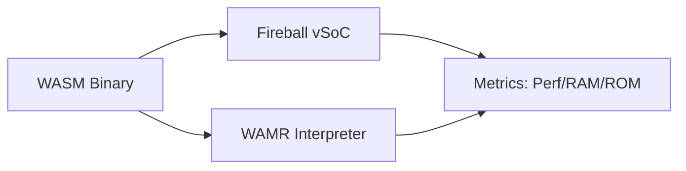

# vSoC ベンチマーク計画 (改定案)

## 1. 背景と仮説
Fireball vSoCの設計が、既存のWAMR（WebAssembly Micro Runtime）に対して、特にインタープリタ性能とメモリ効率の面で優位性を持つことを証明する必要がある。

## 2. 理論的裏付け

### 2.1 評価指標 (Metrics)
1.  **実行性能 (Performance)**: CoreMark等の計算タスクの完了時間。
2.  **メモリフットプリント (RAM)**: ピーク時のメモリ消費量。
3.  **バイナリサイズ (ROM)**: ランタイム自体のコードサイズ。

### 2.2 理論モデル: 比較構成

## 3. 検証とシミュレーション

### 3.1 ベンチマーク環境
- **ホスト**: Linux (x86_64)
- **条件**: AOT/JIT無効、浮動小数点無効。
- **タスク**: 算術演算ループ、再帰呼び出し、メモリアクセス。

## 4. 設計完了チェックリスト（網羅性確認）

- [x] 解決したい課題と仮説が論理的に結びついているか
- [x] 評価指標が具体的かつ定量的か
- [x] 比較対象（WAMR）との条件が公平に設定されているか

## 5. 設計へのフィードバック
- **反映先**: `{vSoC_Benchmark_Goal}`
- **反映内容**: 計測結果に基づき、JITテンプレートのパッチ効率やインタープリタのハンドラ連鎖を最適化する。

## 6. 参考文献・リソース
- **WAMR**: [GitHub](https://github.com/bytecodealliance/wasm-micro-runtime)
- **CoreMark**: [EEMBC](https://www.eembc.org/coremark/)
