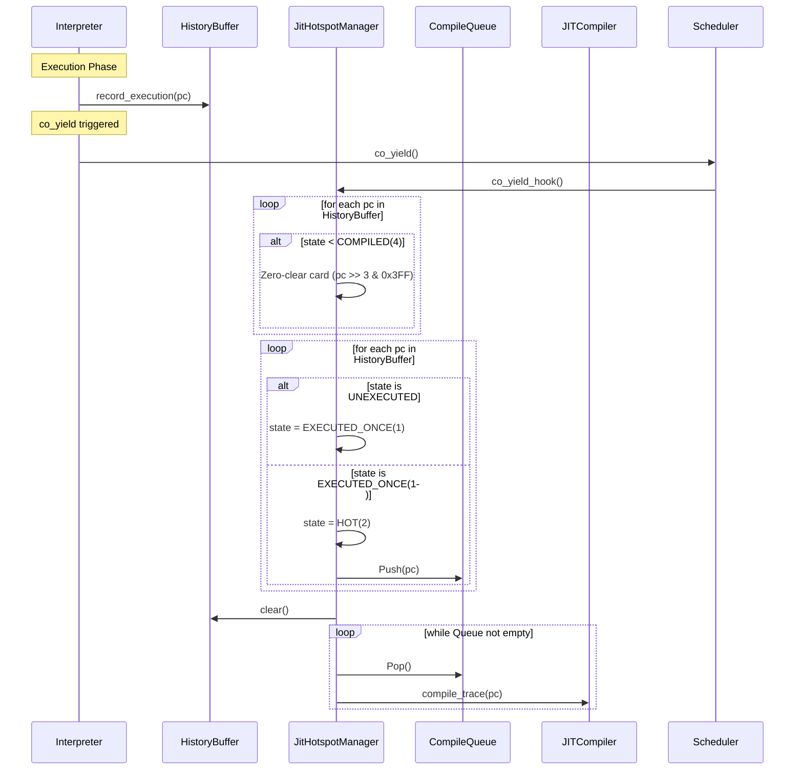

# コンセプトコード: JITコンパイルキューへのトレース投入

このドキュメントでは、FireballのJITコンパイラにおける「履歴ベースのホットスポット検知」と「コンパイルキューへの投入」の仕組みをPythonによるコンセプトコードで示す。

## 設計のポイント

- **3-bit カードビットマップ**: 1024枚のカードを3ビットずつで管理する（実装上は4ビットまたは1バイト単位での管理を検討）。
- **ハッシュインデックス**: カードインデックスは `(pc >> 3) & 0x3FF` で計算し、バッティングを許容する。
- **実行履歴の分離**: 実行時はPCを履歴バッファに積むのみ。
- **遅延判定と状態管理**: `co_yield` 直前に履歴バッファを走査する。
- **状態遷移**: 
    - `0`: 未実行（またはバッチ開始時にリセット）
    - `1`: 1回実行
    - `2`: 2回実行（HOT / キュー投入対象）
- **効率的な初期化**: 
    1. 走査対象のカードが **`2 (HOT)` 未満の場合のみ** `0` にクリアする。
    2. `2 (HOT)` のカードは、既にJITコンパイル済みであるため、リセットせず維持する。
    3. 履歴を再度走査し、ビットをインクリメントする。
    4. 状態が `2` に達したら、キューへ投入する。

## コンセプトコード (Python)

```python
import collections

class JitHotspotManager:
    """
    Fireball JIT 履歴ベース・ホットスポット検知のコンセプトコード (2-bit/状態管理版)
    """
    
    NUM_CARDS = 1024
    INDEX_MASK = 0x3FF
    
    STATE_UNEXECUTED = 0
    STATE_EXECUTED_ONCE = 1
    STATE_HOT = 2
    
    def __init__(self, queue_capacity=16):
        # 実装の簡略化のため、1カード2バイトを使用 (実際はビットパック検討)
        self.bitmap = bytearray(self.NUM_CARDS)
        
        # 実行履歴バッファ (実行中にPCを記録)
        self.history_buffer = []
        
        # コンパイルキュー (JIT化待ちのPC)
        self.compile_queue = collections.deque(maxlen=queue_capacity)
        
    def _get_card_state(self, card_idx):
        return self.bitmap[card_idx]
        
    def _set_card_state(self, card_idx, state):
        self.bitmap[card_idx] = state

    def record_execution(self, pc):
        """
        インタープリタのループまたは分岐先で呼び出される。
        PCを履歴バッファに追加するのみ。
        """
        self.history_buffer.append(pc)

    def co_yield_hook(self):
        """
        co_yield 直前に呼び出される判定・コンパイル処理。
        """
        if not self.history_buffer:
            return

        # 1. 履歴にあるカードを条件付きでクリア
        for pc in self.history_buffer:
            card_idx = (pc >> 3) & self.INDEX_MASK
            if self._get_card_state(card_idx) < self.STATE_HOT:
                self._set_card_state(card_idx, self.STATE_UNEXECUTED)

        # 2. 履歴を走査してカウントアップ
        for pc in self.history_buffer:
            card_idx = (pc >> 3) & self.INDEX_MASK
            current_state = self._get_card_state(card_idx)
            
            if current_state == self.STATE_UNEXECUTED:
                self._set_card_state(card_idx, self.STATE_EXECUTED_ONCE)
            elif current_state == self.STATE_EXECUTED_ONCE:
                # 2回目 -> HOT! キューへ投入し、状態を HOT(2) に
                self._set_card_state(card_idx, self.STATE_HOT)
                
                if pc not in self.compile_queue:
                    self.compile_queue.append(pc)
            # STATE_HOT(2) の場合はスルー
        
        # 履歴をクリア
        self.history_buffer.clear()
        
        # 3. キューに溜まったPCを順次コンパイル
        if self.compile_queue:
            print(f"--- Batch Compilation (Queue size: {len(self.compile_queue)}) ---")
            while self.compile_queue:
                pc = self.compile_queue.popleft()
                self._compile_trace(pc)
            
    def _compile_trace(self, pc):
        """
        実際のJITコンパイル処理 (Copy-and-Patch)
        """
        print(f"  Compiling trace starting at PC: 0x{pc:04x} ... Done.")

# --- 使用例 ---
if __name__ == "__main__":
    manager = JitHotspotManager()
    
    # 実行フェーズ 1
    print("Executing batch 1...")
    manager.record_execution(0x1010) # 1回目
    manager.record_execution(0x1010) # 2回目 -> HOT & Queue
    manager.co_yield_hook()
    
    # 実行フェーズ 2
    print("\nExecuting batch 2...")
    manager.record_execution(0x1010) # 既に 2 なのでリセットされず、スルーされる
    manager.record_execution(0x1020) # 新規 1回目
    manager.co_yield_hook()
```

## 処理フロー



## トレーサビリティ

- `{SimpleJITArchitecture}`: 状態管理ビットマップと履歴バッファによる低負荷なホットスポット検知。
- `{JIT_DoubleBuffer_Cache}`: 遅延バッチコンパイルによるキャッシュ効率の向上。
- `{LowLatencyJIT}`: `co_yield` 時の高速なコンパイル。
