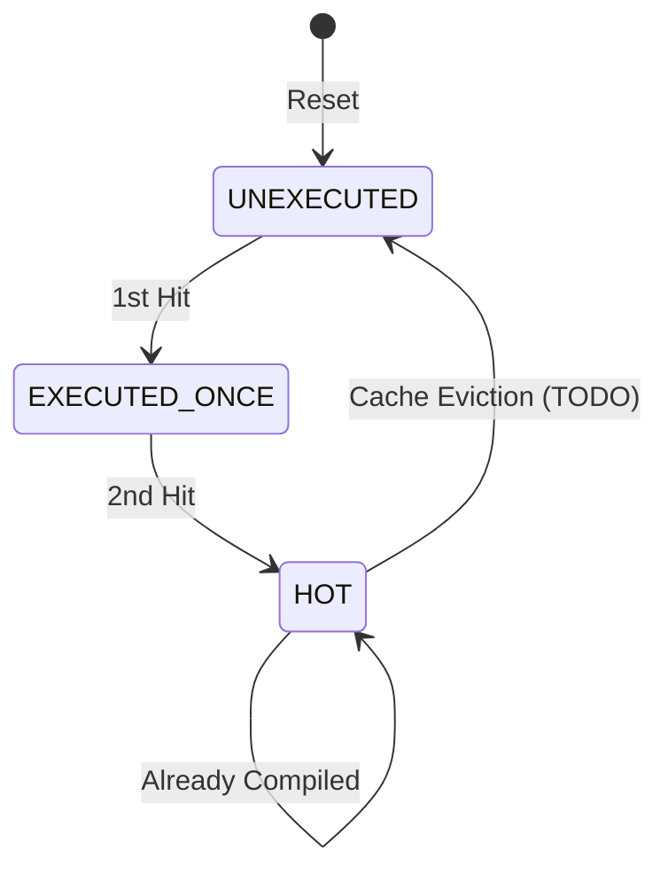

# JITコンパイルキューとホットスポット検知

## 1. 背景と仮説
実行時のプロファイリング負荷を最小化するため、インタープリタ実行中はPCの記録のみを行い、`co_yield` 時のアイドル時間に一括してホットスポット判定とコンパイルを行う「遅延バッチ判定」を提案する。

## 2. 理論的裏付け

### 2.1 アルゴリズム解説: 2-bit 状態管理
1.  **記録**: 実行中、分岐先やループ頭のPCを履歴バッファ（128エントリ）に積む。
2.  **カードマーキング**: PCからカードIDを計算し、カード状態ビットマップを更新する。
    - **カードID**: `card_id = (pc >> 3) & 0x3FF`
    - **備考**: 1カードあたり8バイト境界で分類し、最大1024カードを管理する。
3.  **クリア**: `co_yield` 時、履歴にあるPCに対応するカードを、既にHOTでない場合のみリセットする。
4.  **カウント**: 履歴を再走査し、カードの状態をインクリメントする（0:未実行 -> 1:実行済み -> 2:HOT）。
5.  **投入**: 状態が 2 (HOT) に達したPCをコンパイルキューに投入する。

### 2.2 JITトレース検索の高速化
メモリ消費を抑えつつ検索を高速化するため、カードマーキングによる絞り込み、グループインデックス、および二分探索を組み合わせる。 `{SimpleJITArchitecture}`

1. **JITエントリ構造 (6 bytes)**:
   - `pc` (uint32_t): WASMバイトコードオフセット。
   - `code_offset` (uint16_t): コードキャッシュ先頭からのオフセット（8バイト境界、`actual_offset >> 3`）。
   - ※ `__attribute__((packed))` により、アライメントパディングを排除する。
2. **JITエントリ配列**: エントリを **カードID順（同一カード内はPC順）** で保持する（Active/Old別）。
3. **カードグループインデックス (128 bytes)**:
   - 16カード（128バイト範囲）ごとの先頭エントリインデックスを `uint16_t` 配列で保持する。
   - `index_table[card_id >> 4]`
4. **検索手順**:
   - **事前フィルタ**: カード状態ビットマップを確認し、該当PCのカードが `HOT` でない場合は即座にインタープリタへフォールバックする。
   - **範囲絞り込み**: `index_table` を用いて、探索対象のインデックス範囲を特定する。
   - **二分探索**: 絞り込まれた範囲内（通常数エントリ）を `pc` で二分探索する。
   - **ヒット時**: `code_cache_base + (code_offset << 3)` を実行エントリとして返す。
4. **最大エントリ数**:
   - `max_entries = code_cache_size / 2 / 32`
   - 平均コードサイズを32バイトと仮定し、エントリ数を算出する。
   - 例: 4KBキャッシュ（片側2KB）の場合、64エントリ。
   - メタデータ合計: 64エントリ * 6バイト = 384バイト。

### 2.3 理論モデル: 状態遷移図

## 3. 検証とシミュレーション

### 3.1 コンセプトコードによる動作検証
- **検証方法**: [`docs/orders/concept/jit_compile_queue.md`](../../orders/concept/jit_compile_queue.md) のPythonコードによるシミュレーション。
- **結果**: 2回の出現で確実にキュー投入され、かつ実行時のオーバーヘッドがPCの記録（配列へのプッシュ）のみに抑えられることを確認。
- **考察**: 履歴バッファサイズを128に制限することで、`co_yield` 時の走査時間も組み込み環境で許容範囲内となる。 `{SimpleJITArchitecture}`

## 4. 設計完了チェックリスト（網羅性確認）

- [x] 解決したい課題と仮説が論理的に結びついているか
- [x] 理論やアルゴリズムが第三者に理解可能なレベルで解説されているか
- [x] 検証によって仮説の妥当性が示されているか
- [x] 設計上のトレードオフ（検知精度 vs 実行負荷）が分析されているか

## 5. 設計へのフィードバック
- **反映先**: `{vSoC}` のJITコンパイラおよびインタープリタのメインループ。
- **反映内容**: 実行履歴バッファの実装と、`co_yield` フックの追加。

## 6. 参考文献・リソース
- **コンセプトコード**: [`docs/orders/concept/jit_compile_queue.md`](../../orders/concept/jit_compile_queue.md)
