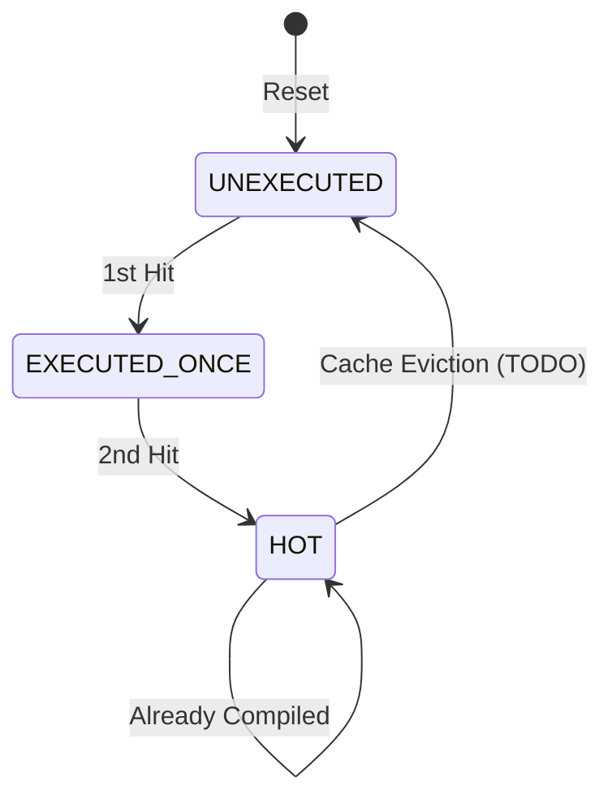

# JITコンパイルキューとホットスポット検知 (改定案)

## 1. 背景と仮説
実行時のプロファイリング負荷を最小化するため、インタープリタ実行中はPCの記録のみを行い、`co_yield` 時のアイドル時間に一括してホットスポット判定とコンパイルを行う「遅延バッチ判定」を提案する。

## 2. 理論的裏付け

### 2.1 アルゴリズム解説: 2-bit 状態管理
1.  **記録**: 実行中、分岐先やループ頭のPCを履歴バッファ（128エントリ）に積む。
2.  **クリア**: `co_yield` 時、履歴にあるPCに対応するカード（ビットマップ）を、既にHOTでない場合のみリセットする。
3.  **カウント**: 履歴を再走査し、カードの状態をインクリメントする（0:未実行 -> 1:実行済み -> 2:HOT）。
4.  **投入**: 状態が 2 (HOT) に達したPCをコンパイルキューに投入する。

### 2.2 理論モデル: 状態遷移図

## 3. 検証とシミュレーション

### 3.1 コンセプトコードによる動作検証
- **検証方法**: [`docs/orders/concept/jit_compile_queue.md`](../../orders/concept/jit_compile_queue.md) のPythonコードによるシミュレーション。
- **結果**: 2回の出現で確実にキュー投入され、かつ実行時のオーバーヘッドがPCの記録（配列へのプッシュ）のみに抑えられることを確認。
- **考察**: 履歴バッファサイズを128に制限することで、`co_yield` 時の走査時間も組み込み環境で許容範囲内となる。 `{SimpleJITArchitecture}`

## 4. 設計完了チェックリスト（網羅性確認）

- [x] 解決したい課題と仮説が論理的に結びついているか
- [x] 理論やアルゴリズムが第三者に理解可能なレベルで解説されているか
- [x] 検証によって仮説の妥当性が示されているか
- [x] 設計上のトレードオフ（検知精度 vs 実行負荷）が分析されているか

## 5. 設計へのフィードバック
- **反映先**: `{vSoC}` のJITコンパイラおよびインタープリタのメインループ。
- **反映内容**: 実行履歴バッファの実装と、`co_yield` フックの追加。

## 6. 参考文献・リソース
- **コンセプトコード**: [`docs/orders/concept/jit_compile_queue.md`](../../orders/concept/jit_compile_queue.md)
