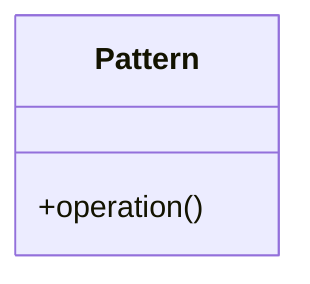
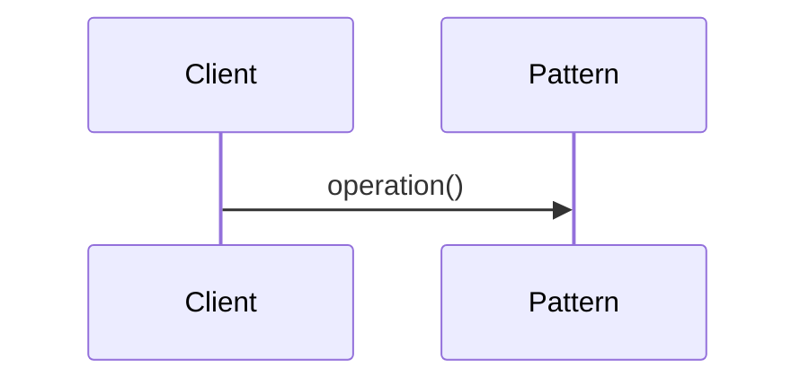

# 設計パターンフォーマット

このドキュメントは、システム全体で再利用される設計パターン、データ構造、または共通アルゴリズムを定義するための標準フォーマットである。

## 1. 意図
このパターンがどのような問題を解決し、どのような利益をもたらすかを簡潔に記述する。

## 2. 構造
パターンの静的な構造や、構成要素間の関係を記述する。

### 2.1 クラス図 / ブロック図
Mermaid記法を用いて構造を視覚化する。



### 2.2 相互作用
パターンがどのように動作するかをシーケンス図等で記述する。



## 3. 適用ガイドライン
Fireballプロジェクトにおいて、このパターンをいつ、どこで、どのように適用すべきかの指針。

- **適用対象**: どのようなコンポーネントや状況で使うか。
- **トレードオフ**: 使用することで得られるメリットと、支払うべきコスト（メモリ、速度等）。

## 4. コンセプトコード
パターンの動作原理を理解するための簡潔なコード例。Pythonで記述すること。

```python
# Concept implementation in Python
class Pattern:
    def operation(self):
        pass
```

## 5. 関連パターン
このパターンと組み合わせて使用される、あるいは代替となる他のパターンへの参照。

## 6. 設計完了チェックリスト（網羅性確認）
パターン定義が完了したとみなすためのチェックリスト。確認してチェックすること。

- [ ] パターンの解決する問題（意図）が明確か
- [ ] 静的構造と動的相互作用が図解されているか
- [ ] 適用時のメリット・デメリット（トレードオフ）が明示されているか
- [ ] コンセプトコード（Python）が提供され、動作原理が理解可能か
- [ ] 他のパターンとの関係性が整理されているか
- [ ] 直交表を用いてパターンの適用条件（バリエーション）の網羅性が検討されているか
