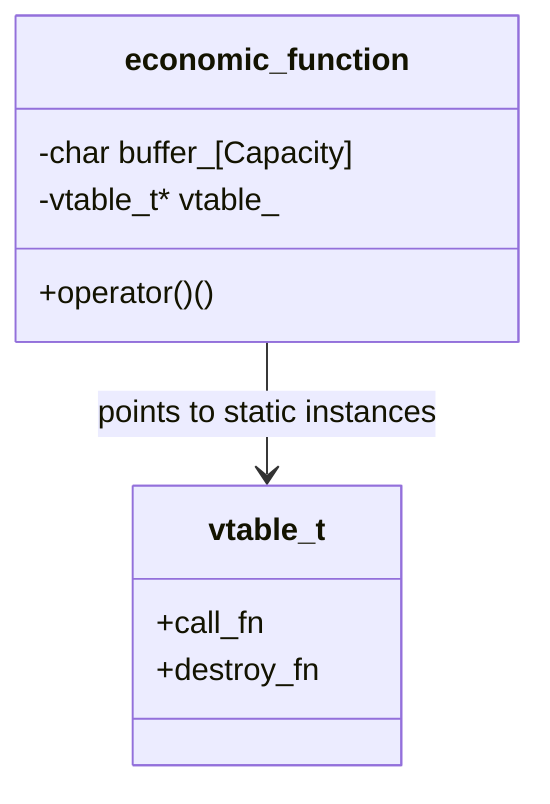
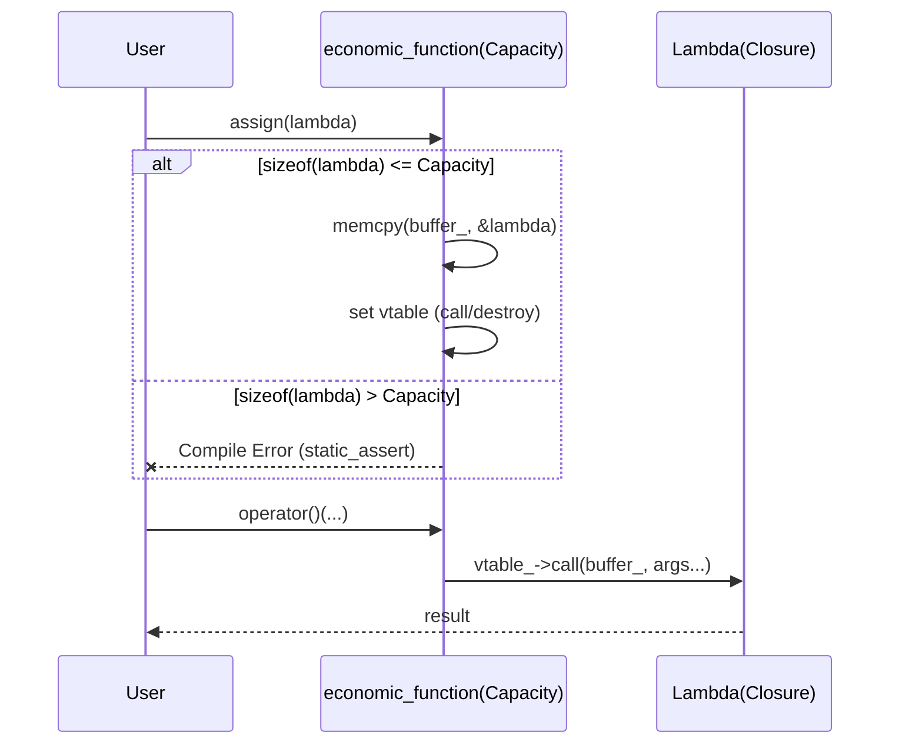

# 経済的な関数 (Economic Function) 設計パターン

## 1. 意図
リソース制約の厳しい（RAM 64KB）環境において、`std::function` のような型消去（Type Erasure）と状態保持（ラムダキャプチャ）を実現しつつ、ヒープメモリの使用を完全に排除する。SBO（Small Buffer Optimization）に頼るのではなく、静的にバッファサイズを強制し、それを超える場合はコンパイルエラー（`static_assert`）とすることで、メモリ消費の予測可能性を担保する。 `{Policy_Memory}` `{Static_Resolution}`

## 2. 構造

### 2.1 静的モデル



### 2.2 相互作用



## 3. 適用ガイドライン

- **適用対象**: 状態を持ちうる非同期コールバック（vMMIOハンドラ、COOSイベントハンドラ等）。
- **原則**:
    - **ヒープ使用禁止**: `new`/`delete` を一切行わず、内部の `Capacity` バイトのスタック/メンバ領域にラムダを配置する。
    - **静的検証**: ラムダのキャプチャサイズが `Capacity` を超えた場合、`static_assert` でビルドを停止させる。
    - **所有権**: 現時点ではシンプルさを優先し、コピー禁止・ムーブのみを基本とする。

## 4. コンセプトコード

```python
# Concept: Economic Function (Heap-less type erasure)
class EconomicFunction:
    def __init__(self, capacity):
        self.capacity = capacity
        self.callable = None

    def assign(self, f, size):
        if size > self.capacity:
            raise Exception("Static Assert: Too large!")
        self.callable = f

    def __call__(self, *args):
        return self.callable(*args)
```

## 5. 関連パターン
- **標準ライブラリ利用パターン**: `std::function` の禁止に関連。
- **制御の反転 (IoC)**: コールバックの型定義に使用。

## 6. 設計完了チェックリスト

- [x] ヒープ不使用が保証されているか (`static_assert`)
- [x] 型消去が正しく実装されているか
- [x] メモリレイアウト（アラインメント）が考慮されているか
- [x] 意図が明確に文書化されているか
