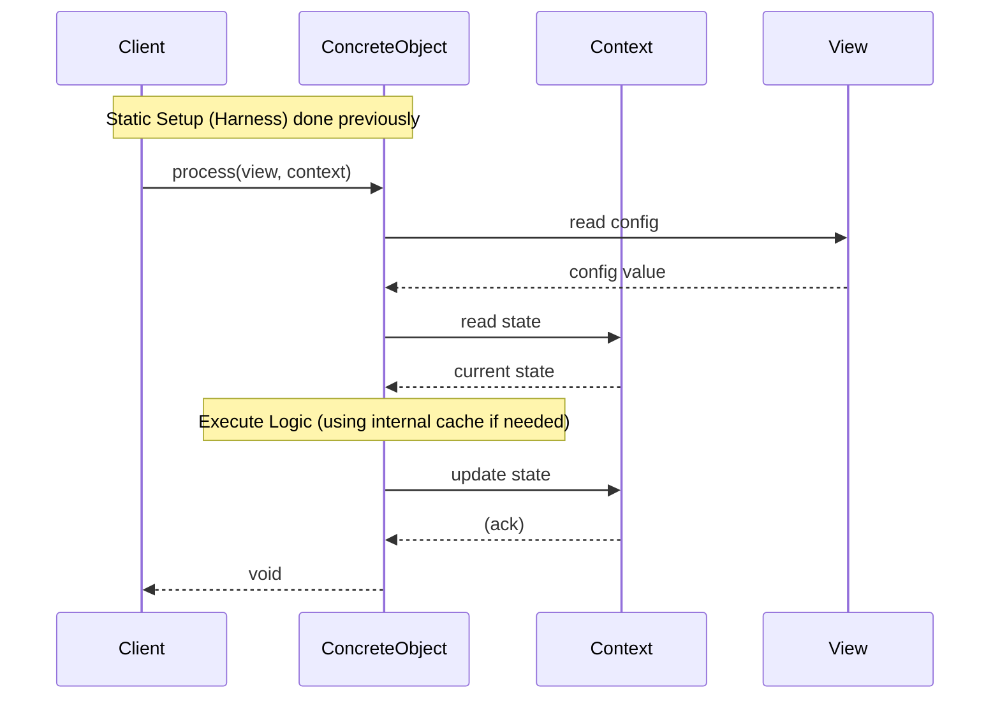

# インターフェイス設計パターン (Tier 2: サブシステムドメイン)

## 1. 意図
リソース制約の厳しい組み込み環境において、高い抽象度（OO）と実行効率（Functional）を両立するための設計ルールを定める。

**インターフェイスは「状態を持たない純粋な振る舞いの契約」** として定義し、**オブジェクト（実装クラス）は「内部状態（キャッシュや設定）」** をカプセル化する。
アプリケーションの状態（Context）は、メソッドの引数として明示的に渡される。

## 2. 構造

システムを「神クラス」や「深い階層」で構築せず、**Harness (依存)**、**Data (状態)**、**View (不変定義)**、**Interface (操作)** の4要素に分解・平坦化する。

### 2.1 クラス図 / ブロック図

**4つの構成要素**:
1.  **Harness (Dependencies)**: システム構成要素（インターフェイス）へのポインタを集約した構造体。DIコンテナとして機能する。
2.  **Data (Context)**: 実行時の可変状態（State）を集約した構造体。オブジェクト内部に隠蔽せず、DTOとして公開する。
3.  **View (Immutable)**: 読み取り専用データへの構造化されたビュー。
4.  **Interface (Contract)**: 純粋仮想関数のみを持つインターフェイス。メンバ変数（状態）を持たない。
    - **Concrete Object (Implementation)**: インターフェイスの実装。JITキャッシュや変換テーブルなどの「内部状態」を持つことができるが、実行コンテキスト（Data）は持たない。

```mermaid
graph TD
    Client[Client Code]
    
    subgraph Structure
        Harness[Harness (Static DI)]
        Int[Interface (IExecutor)]
        Obj[Concrete Object]
        Internal[Internal State (Cache)]
    end

    subgraph App_State
        Data[Context (Mutable)]
        View[View (Immutable)]
    end

    Client -- holds --> Harness
    Harness -- points to --> Int
    Int <|.. Obj : implements
    Obj -- owns --> Internal
    
    Client -- passes --> Data
    Client -- passes --> View
    
    Obj -- reads/writes --> Data
    Obj -- reads --> View
```

### 2.2 相互作用

ステートレスなインターフェイスに対し、データ(Context/View)を引き渡すことで処理を行う。



## 3. 適用ガイドライン

### 3.1 インターフェイスとオブジェクトの役割分担
- **インターフェイスは状態を持たない**: インターフェイス定義にメンバ変数を含めてはならない。純粋な「操作の型」を定義する。
- **オブジェクトは内部状態を持つ**: 実装クラスは、その責務を果たすために必要な内部リソース（例：JITコンパイラのコードキャッシュ、インタープリタのジャンプテーブル）を保持してよい。これらは外から見えないプライベートな状態である。
- **コンテキストは引数で渡す**: 「何を実行するか」というアプリケーションの状態（PC, レジスタ等）は、オブジェクトのメンバにせず、必ずメソッドの引数として渡す。

### 3.2 ハーネスによる静的依存性注入 (Static DI)
- **Harnessによる集約**: コンポーネントが依存する他のサービス（インターフェイス）は、`harness` 構造体として一括で渡す。
- **Static DI**: 依存関係の解決（Wiring）は、実行時の動的な検索ではなく、コンパイル時または初期化時に静的に行い、`const harness` として確定させることを推奨する。 `{StaticDI}` `{ConfigurableSystem}`
    - メリット：構成ミスを早期発見でき、ROM化や定数畳み込みの恩恵を受けやすい。
- **所有権の分離**: ハーネスは「参照」を保持するものであり、所有権は保持しない。コンポーネントの実体は、より上位（Main/System）で静的またはスタック上に確保される。

### 3.3 データとビューの分離 (Data/View Separation)
- **View**: ROM上のバイナリや定数データは、コピーせず `std::span` 等を用いた「View」として扱う。
- **Context**: 実行に必要な変数は全て `context` 構造体に集約し、メソッド間でリレーする。

### 3.4 命名とContract
- **名前空間とインターフェイス**: 機能のまとまりはインターフェイス（抽象クラス）で表現し、詳細な構成は名前空間で整理する。
- **Contract**: メソッドは入力（Context, View）に対して何を行うか、事前・事後条件をコメントで明記する。

## 4. コンセプトコード

```python
# Concept: Stateless Interface matched with Stateful Object (Generic)

from abc import ABC, abstractmethod
from dataclasses import dataclass
from typing import List

# 1. Data & View (DTOs)
# Context: Mutable application state (passed as argument)
@dataclass
class ProcessingContext:
    counter: int = 0
    buffer: List[int] = None

# View: Immutable configuration/data (passed as argument)
@dataclass(frozen=True)
class ProcessingConfig:
    multiplier: int = 1
    max_limit: int = 100

# 2. Interface (Pure Contract - Stateless)
class IDataProcessor(ABC):
    @abstractmethod
    def process(self, config: ProcessingConfig, ctx: ProcessingContext) -> None:
        """
        Process data based on config and context.
        Note: The interface itself holds NO state.
        """
        pass

# 3. Implementation (Object - Has Internal State)
class BufferedProcessor(IDataProcessor):
    def __init__(self, cache_size: int):
        # Internal State: Specific to this implementation (Hidden)
        self._cache = [] 
        self._cache_size = cache_size

    def process(self, config: ProcessingConfig, ctx: ProcessingContext) -> None:
        # Use Internal State
        if len(self._cache) < self._cache_size:
            self._cache.append(ctx.counter)
            print(f"Cached: {ctx.counter}")

        # Operate on App State (Context) using Config (View)
        ctx.counter += config.multiplier
        if ctx.counter > config.max_limit:
            ctx.counter = 0

# 4. Harness (Static DI)
@dataclass(frozen=True)
class SystemHarness:
    processor: IDataProcessor
    
# Usage
# Setup (Static DI)
harness = SystemHarness(processor=BufferedProcessor(cache_size=5))
config = ProcessingConfig(multiplier=2)
ctx = ProcessingContext()

# Runtime Loop
harness.processor.process(config, ctx)
harness.processor.process(config, ctx)
```

## 5. 設計完了チェックリスト

- [x] オブジェクト階層を作らず、フラットな関数群として定義されているか
- [x] 状態（Data）と定義（View）が明確に分離されているか
- [x] インターフェイスは状態定義を含まないか
- [x] 依存関係は Harness 構造体を通じて外部から与えられているか(Static DI)
