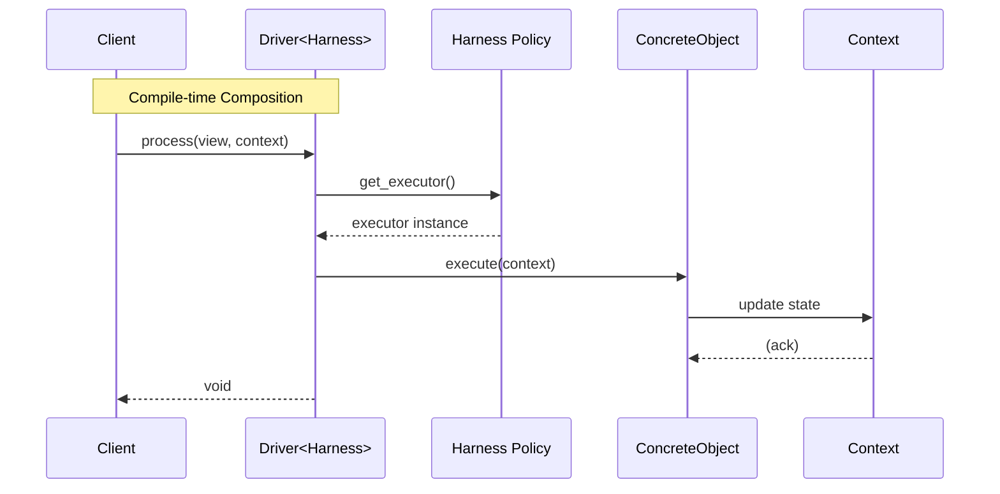

# インターフェイス設計パターン (Tier 2: サブシステムドメイン)

## 1. 意図
リソース制約の厳しい組み込み環境において、高い抽象度（OO）と実行効率（Functional）を両立するための設計ルールを定める。

**インターフェイスは「状態を持たない純粋な振る舞いの契約」** として定義し、**オブジェクト（実装クラス）は「内部状態（キャッシュや設定）」** をカプセル化する。
アプリケーションの状態（Context）は、メソッドの引数として明示的に渡される。

## 2. 構造

システムを「神クラス」や「深い階層」で構築せず、**Harness (Policy)**、**Data (State)**、**View (Immutable)**、**Interface (Contract)** の4要素に分解・平坦化する。

### 2.1 クラス図 / ブロック図

**4つの構成要素**:
1.  **Harness (Policy)**: システムの振る舞いを決定するポリシー型。テンプレート引数として注入される。依存コンポーネントへのアクセサを提供する。
2.  **Data (Context)**: 実行時の可変状態（State）を集約した構造体。オブジェクト内部に隠蔽せず、DTOとして公開する。
3.  **View (Immutable)**: 読み取り専用データへの構造化されたビュー。
4.  **Interface (Contract)**: 純粋仮想関数のみを持つインターフェイス。メンバ変数（状態）を持たない。

```mermaid
graph TD
    Client[Client Code]
    
    subgraph Parameter
        Concept[Harness Policy Concept]
    end

    subgraph Structure
        Driver[Driver<HarnessPolicy>]
        Harness[Harness Implementation]
        Int[Interface (IExecutor)]
        Obj[Concrete Object]
    end

    subgraph App_State
        Data[Context (Mutable)]
        View[View (Immutable)]
    end

    Client -- instantiates --> Driver
    Driver -- uses type --> Harness
    Harness -- provides --> Int
    Int <|.. Obj : implements
    
    Client -- passes --> Data
    Client -- passes --> View
    
    Obj -- reads/writes --> Data
    Obj -- reads --> View
```

### 2.2 相互作用

ポリシーベースデザイン（Policy-Based Design）を採用し、コンパイル時に依存関係を解決する。



## 3. 適用ガイドライン

### 3.1 インターフェイスとオブジェクトの役割分担
- **インターフェイスは状態を持たない**: インターフェイス定義にメンバ変数を含めてはならない。純粋な「操作の型」を定義する。
- **オブジェクトは内部状態を持つ**: 実装クラスは、その責務を果たすために必要な内部リソースを保持してよい。
- **コンテキストは引数で渡す**: 「何を実行するか」というアプリケーションの状態は、必ずメソッドの引数として渡す。

### 3.2 ポリシーベースデザインによる依存性注入 (Policy-Based DI)
- **型による注入**: 依存コンポーネントはインスタンスではなく「型（Policy）」としてテンプレート引数で渡す。
- **Harness Policy**: 渡される型は、デフォルトコンストラクタを持ち、必要なインターフェイスへのアクセサ（またはその場での生成機能）を提供しなければならない。
    - メリット：
        - **疎結合**: 特定のグローバルインスタンスに依存せず、型が満たすべき要件（Concept）に依存する。
        - **最適化**: 空のポリシー型であれば、EBCO (Empty Base Class Optimization) 等によりサイズオーバーヘッドをゼロにできる。
        - **テスト容易性**: モック用のポリシー型を渡すだけで、テスト環境を構築できる。

### 3.3 静的コンフィギュレーション (Static Configuration Pattern)
- **テンプレート引数による設定**: 不変な設定値（メモリマップ等）は、`const` 参照のテンプレート引数として注入する。
    - 適用例：`vSoC` のインスタンス設定、メモリコントローラのバンク構成など。

### 3.4 データとビューの分離 (Data/View Separation)
- **View**: ROM上のバイナリや定数データは、コピーせず `std::span` 等を用いた「View」として扱う。
- **Context**: 実行に必要な変数は全て `context` 構造体に集約し、メソッド間でリレーする。

## 4. コンセプトコード

```python
# Concept: Policy-Based Design for Dependency Injection
from typing import Protocol

# 1. Interface (Contract)
class ILoader(Protocol):
    def load(self, data: bytes) -> None: ...

# 2. Policy (Dependency Provision Strategy)
class ProductionHarnessPolicy:
    def get_loader(self) -> ILoader:
        return RealLoader()

class MockHarnessPolicy:
    def get_loader(self) -> ILoader:
        return MockLoader()

# 3. Host Class (Parameterized by Policy)
class SystemRuntime:
    def __init__(self, policy_type):
        self.policy = policy_type()  # Default Construct

    def run(self, data: bytes):
        # Use Policy to get dependency
        loader = self.policy.get_loader()
        loader.load(data)

# Usage
# Compile-time like composition (in Python via class passing)
runtime = SystemRuntime(ProductionHarnessPolicy)
runtime.run(b"data")

test_runtime = SystemRuntime(MockHarnessPolicy)
test_runtime.run(b"test")
```

## 5. 設計完了チェックリスト

- [x] オブジェクト階層を作らず、フラットな関数群として定義されているか
- [x] 状態（Data）と定義（View）が明確に分離されているか
- [x] 依存関係はテンプレート引数（Policy）を通じて渡されているか
- [x] ポリシー型はデフォルト構築可能でステートレス（または自己完結）か

## 6. C++実装例: Policy-Based DI & Static Config

```cpp
// 1. Definition (Policy Concept)
template <typename T>
concept HarnessPolicy = requires(T t) {
    { t.loader() } -> std::convertible_to<loader_interface*>;
};

// 2. Implementation (Host Class)
template <typename Harness, const runtime_instance_config& Config>
class runtime {
    // EBCO friendly member declaration if needed, or just composition
    Harness harness_; 
public:
    void step() {
        // Use Harness Policy to get dependency
        auto* loader = harness_.loader();
        loader->do_something(Config.buffer_size);
    }
};

// 3. Usage
struct my_harness_policy {
    loader_impl loader_instance;
    loader_interface* loader() { return &loader_instance; }
};

static constexpr runtime_instance_config my_config = { .buffer_size = 1024 };

// Instantiation: Injects Type, not Instance
runtime<my_harness_policy, my_config> my_runtime;
```
