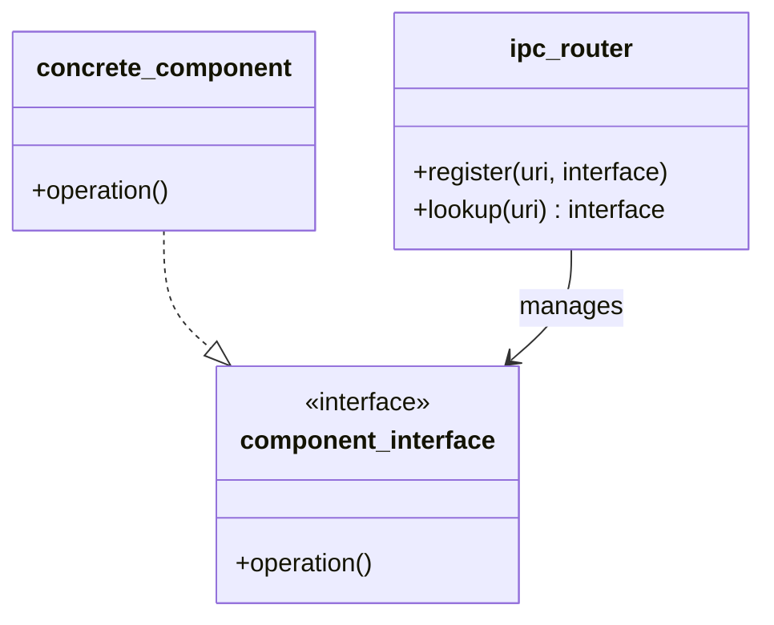
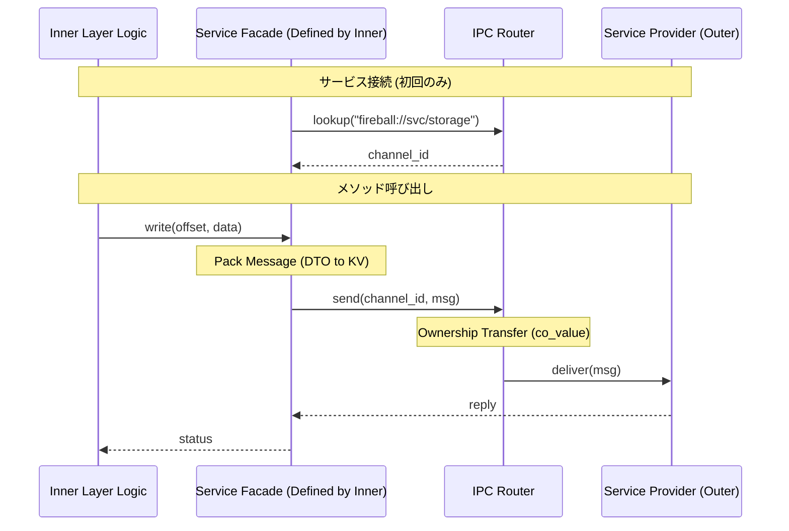

# インターフェイス設計パターン

## 1. 意図
コンポーネント間の結合度を下げ、移植性と拡張性を最大化するためのインターフェイス設計原則を定義する。クリーンアーキテクチャとIoC（制御の反転）を基盤とし、組み込み環境特有の制約とモダンな設計手法を両立させる。

## 2. 構造

### 2.1 クラス図 / ブロック図



### 2.2 相互作用 (Service Facade Pattern)

IPCのプリミティブな操作を隠蔽し、依存性の逆転 (IoC) を実現するため、内側の層（利用側）が「サービスファサード」を定義する。 `{ServiceFacade}` `{IoC}`



## 3. 適用ガイドライン

- **適用対象**: 全てのコンポーネント間API。
- **原則**:
    - **IoC (Inversion of Control)**: インターフェイスの仕様は「利用側（内側の層）」が定義する。 `{CleanArchitecture}`
    - **URIによる抽象化**: サービスはURI（例：`fireball://hal/uart/0`）で識別し、具体的な実装クラスを隠蔽する。 `{URIAbstraction}`
    - **DTOの型安全性**: `void*` の使用を禁止し、型が確定できない場合は構造化データ（辞書形式等）を用いる。
    - **ファサードによる隠蔽とIoC**: IPCのハンドル管理、メッセージ構築、所有権移譲のボイラープレートは、内側の層が定義するファサード層に閉じ込める。これにより、内側の層は外側の層（サービス提供側）の具体的なメッセージ構造に依存しなくなる。 `{ServiceFacade}` `{IoC}`
- **トレードオフ**:
    - **メリット**: 実装の差し替えが容易になり、単体テストが容易になる。
    - **コスト**: 間接参照（ルックアップ）による僅かなオーバーヘッドが発生する。

## 4. 設計完了チェックリスト（網羅性確認）

- [x] パターンの解決する問題（意図）が明確か
- [x] 静的構造と動的相互作用が図解されているか
- [x] 適用時のメリット・デメリット（トレードオフ）が明示されているか
- [x] コンセプトコード（Python）が提供され、動作原理が理解可能か
- [x] 他のパターンとの関係性が整理されているか

## 5. コンセプトコード

```python
# Concept implementation of URI-based DI and Interface
class service_interface:
    def execute(self):
        raise NotImplementedError

class uart_service(service_interface):
    def execute(self):
        print("UART Output")

class ipc_router:
    def __init__(self):
        self.registry = {}

    def register(self, uri, provider):
        self.registry[uri] = provider

    def lookup(self, uri):
        return self.registry.get(uri)

# Usage
router = ipc_router()
router.register("fireball://hal/uart/0", uart_service())

# Client side (Inner Layer)
service = router.lookup("fireball://hal/uart/0")
if service:
    service.execute()
```

## 6. 関連パターン
- **IPCルータ**: DIコンテナとしての具体的な実装。
- **標準ライブラリ利用パターン**: DTOやデータ構造の定義に関する指針。
