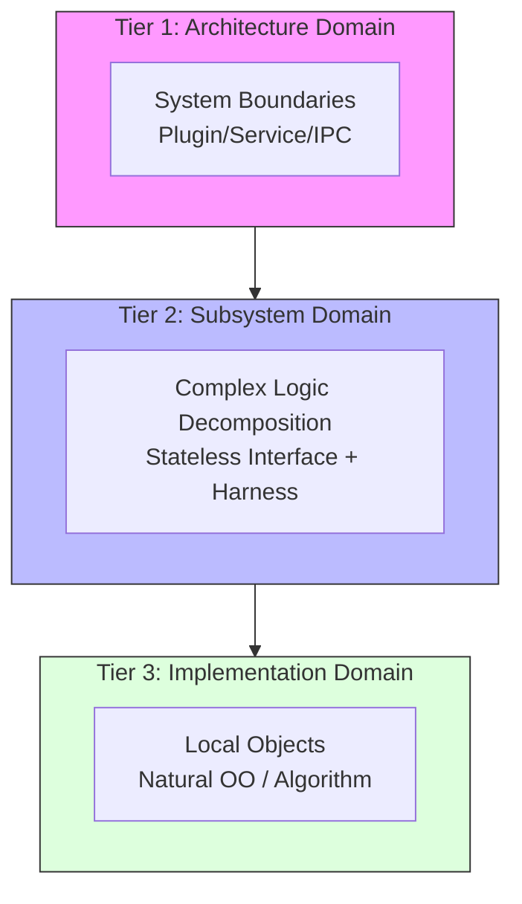
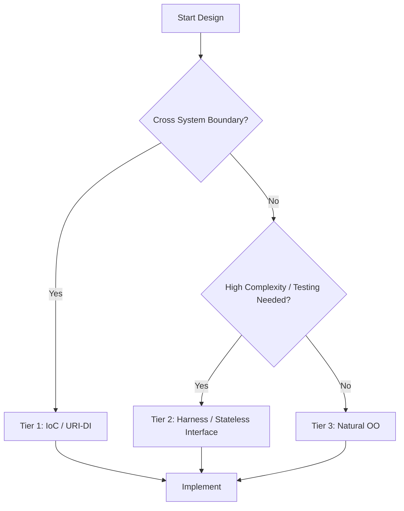

# モジュールの分離方式 (3-Tier Module Separation Policy)

## 1. 意図
システム全体の複雑度に応じて、適切なモジュール分離方式を選択するための指針を定義する。
過度な抽象化によるオーバーヘッドと、密結合による柔軟性の欠如のトレードオフを最適化することを目的とする。

## 2. 構造

### 2.1 コンセプト図 (3-Tier Model)

システムを複雑度と役割に応じて3つの階層に分類する。

### 2.2 意思決定フロー

### 2.3 3-Tier 分離構造

| Tier | ドメイン | 適用対象 | 分離方式 | 参照パターン |
| :--- | :--- | :--- | :--- | :--- |
| **Tier 1** | **アーキテクチャドメイン** | システム全体の主要境界 | クリーンアーキテクチャ、IoC、URIベースDI | [docs/orders/patterns/ioc.md](docs/orders/patterns/ioc.md) |
| **Tier 2** | **サブシステムドメイン** | 複雑な内部構造を持つサブシステム | インターフェイスとハーネスによる分離 (Stateless Interface) | [docs/orders/patterns/harness.md](docs/orders/patterns/harness.md) |
| **Tier 3** | **実装ドメイン** | 複雑度が低く、限定的なスコープのモジュール | オブジェクト指向による自然な分割 (Encapsulation) | - |

---

### Tier 1: アーキテクチャドメインモジュール (Clean Architecture / IoC)

**設計原則**:
- システム全体を疎結合なレベルで分割し、配置・移植の単位とする。 `{CleanArchitecture}`
- インターフェイスの仕様は「利用側（内側の層）」が定義し、実装側への依存を逆転させる。 `{IoC}`
- サービスの識別にはURIを用い、ルックアップにより動的または静的に依存関係を解決する。 `{URIAbstraction}` `{IPCDI}`

**目的**:
- ハードウェア依存部（HAL）とビジネスロジック（Kernel/App）の完全な分離。
- 実行環境（vSoC）と周辺サービス（Storage/Network）のプラグイン化。

---

### Tier 2: サブシステムドメインモジュール (Decomposition / Harness)

**設計原則**:
- 単一のサブシステム（例：vSoC本体）が巨大化・複雑化した場合の分解手法。 `{ComponentHarness}`
- 内部をさらなるサブコンポーネント（Loader, Executor等）に分解する。
- **Stateless Interface** と **Harness** を用いて、依存関係をフラットに集約する。 `{StaticDI}`

**目的**:
- サブシステム内部のユニットテスト容易性の確保。
- 実装の詳細（JITかインタープリタか等）をハーネスの背後に隠蔽。

---

### Tier 3: 実装ドメインモジュール (Natural OO)

**設計原則**:
- 複雑度が十分に低く、単一の責務が明確なモジュールに適用する。
- クラスによるカプセル化（メンバ変数、プライベートメソッド）を許容する。
- 過度なインターフェイス分離やハーネス化を避け、C++の直接的なオブジェクト指向機能を利用する。

**目的**:
- 開発スピードと実行効率の最大化。
- 過剰な抽象化によるコードの難読化を防止。

## 3. 選択基準

1.  **システム境界を跨ぐか？** → YESなら **Tier 1**
2.  **モジュール内部で複数の独立した責務を並行開発・テストする必要があるか？** → YESなら **Tier 2**
3.  **それ以外（単純なユーティリティ、計算ロジック、単一責務のオブジェクト）** → **Tier 3**

## 4. 設計完了チェックリスト

- [ ] 対象モジュールの複雑度に対し、適切なTierが選択されているか
- [ ] Tier 1/2 を選択した場合、該当するパターンドキュメントの原則を遵守しているか
- [ ] Tier 3 を選択したモジュールが将来的に Tier 2/1 に移行する可能性を考慮しているか
