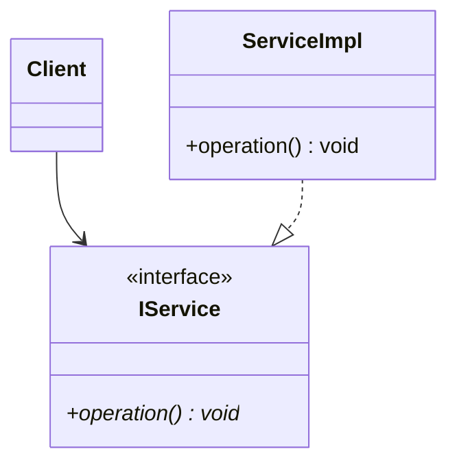
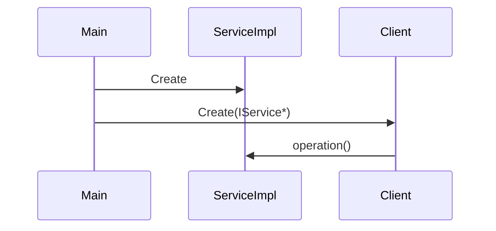

# インターフェイス設計パターン

## 1. 意図
リソース制約の厳しい組み込み環境において、高い抽象度、移植性、およびメモリ効率を両立するための C++ インターフェイス定義ルールを定める。特に生成AIによるコード生成において、曖昧さを排除し、堅牢なシステムを構築することを目的とする。

## 2. 構造

### 2.1 依存性の逆転 (IoC) と DI
コンポーネント間の結合は、具象クラスではなくインターフェイス（純粋仮想関数を持つクラス）を介して行う。



### 2.2 相互作用：依存性注入
オブジェクトの生成と依存関係の解決を分離する。原則としてコンパイル時または初期化時にコンストラクタで依存性を注入する。



## 3. 適用ガイドライン

### 3.1 命名とスタイル
- **純粋仮想クラス**: クラス名は責務を表す名詞（例: `scheduler`, `router`）とし、`I` プレフィックスなどは付けない（C++20/23の思想に準拠）。
- **Contract の記述**: 全ての公開メソッドには、自然言語で以下の「契約」をコメントとして記述する。
    - `@pre`: 前提条件（呼び出し側が保証すべきこと）
    - `@post`: 事後条件（関数実行後にシステムが保証すること）
    - `@return`: 戻り値の意味とエラーコード

### 3.2 標準ライブラリと制約
- **`economic_function` の利用**: `std::function` はヒープ確保を伴うため禁止する。代わりに [economic_function](file:///workspaces/fireball/docs/orders/patterns/economic_function.md) パターンを採用する。
    - **メリット**: ラムダ（キャプチャ付き）を利用可能にしつつ、ヒープ不使用を `static_assert` で保証し、開発者体験とメモリ安全性を両立する。
- **例外の禁止**: 例外は使用せず、戻り値（`status` または `std::optional`）でエラーを通知する。

### 3.3 データ転送 (DTO) と ゼロコピー
- **`std::span` / `std::string_view` の利用**: メモリバッファや文字列を渡す際は必ずこれらを用い、コピーを排除しつつ境界チェックを行う。
- **所有権の明示**: インターフェイスを跨ぐオブジェクト渡しにおいて、誰が所有権を持つかを明確にする。原則として所有権の移動（`std::move`）が発生する場合は、インターフェイスの引数に `&&` またはスマートポインタ（カスタムアロケータ対応）を使用する。

### 3.4 静的設定とROMの活用
- **ROM配置の推奨**: 設定値（Config構造体等）は原則として `const` 修飾し、ROM領域に配置する。
- **ポインタによる参照**: インスタンス生成時（DI時）に、設定値はコピーしてメンバに保持するのではなく、ROM上の実体を指すポインタ（`const config*`）として取り込み、保持する。これにより、RAM消費を最小化する。

### 3.5 コンポーネント・ハーネス (Component Harness)
複数のサブコンポーネントに依存するマネージャクラス（例: `vSoC`）において、依存性を個別に注入するのではなく、それらを集約した構造体（ハーネス）を用いて一括注入する。

- **役割の集約**: ハーネスは、インタープリタ、JIT、バス、デバッガなどの「役割」に応じた抽象型のポインタを保持する。
- **セットでの差し替え**: インタープリタとJITのように緊密に結合し、個別の差し替えが論理的に不自然な場合は、一つの「実行エンジン」として統合したインターフェイスをハーネスに含める。
- **環境ポインタ (Environment Pointer)**: 実行時コンテキスト（`execution_context`）において、ハーネス（またはそのエイリアスとしての `runtime`）を保持することで、サブコンポーネント間での型安全な相互アクセス（例: `ctx->env->mmio->dispatch(...)`）を実現する。

## 4. コンセプトコード

```python
# Concept: Interface with ROM-based static configuration
class VSoCConfig:
    # This represents a struct in ROM
    def __init__(self, ram_size: int):
        self.ram_size = ram_size

class VSoC:
    def __init__(self, config: VSoCConfig):
        # Hold a POINTER (reference) to the ROM config, do not copy fields
        self._config = config 

    def get_ram_limit(self):
        return self._config.ram_size
```

## 5. 関連パターン
- **標準ライブラリ利用パターン**: `std::span` や `status` コードの定義。
- **ソート済みインデックス付き配列**: インターフェイス内でのデータ探索。
- **コンポーネント・ハーネス**: 依存性の一括注入とサブコンポーネントのプラグイン化。

## 6. 設計完了チェックリスト

- [x] パターンの解決する問題（意図）が明確か
- [x] 依存性の逆転 (IoC) が図解されているか
- [x] メソッドごとの Contract 記述ルールが定義されているか
- [x] `std::function` を使わないイベント通知方法が示されているか
- [x] ゼロコピー（DTO）に関する指針が含まれているか
- [x] コンセプトコード（Python）が提供されているか
