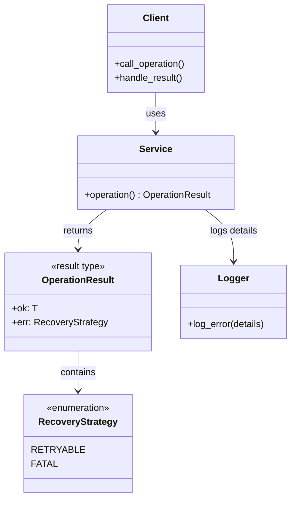
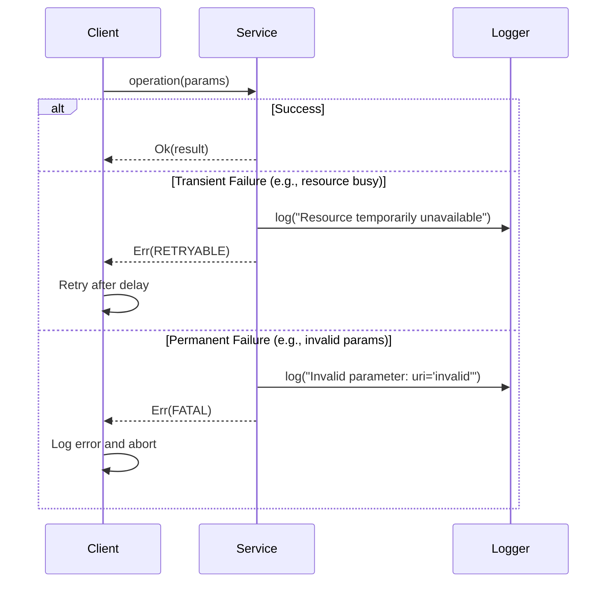

# リカバリー戦略パターン (Recovery Strategy Pattern)

## 1. 意図

エラーコードではなくリカバリー戦略を返すことで、呼び出し側が具体的なアクション（リトライ/諦める）を決定できるようにする。実装詳細をインターフェースから分離し、クリーンアーキテクチャの原則を遵守する。 `{CleanArchitecture}` `{RecoveryStrategy}`

### 解決する問題

従来のエラーコードベースの設計には以下の問題がある:

1. **実装詳細の漏洩**: `HARDWARE_ERROR`、`TIMEOUT`等は実装の内部状態であり、ドメイン層が知るべきではない
2. **アクション不明**: エラーコードを受け取っても、呼び出し側は何をすべきか（リトライ?諦める?）が分からない
3. **標準化の困難**: すべてのサービスで共通のエラーコード体系を維持するのは現実的でない
4. **デバッグ情報の混在**: 失敗の詳細理由はログで確認すべきであり、インターフェースに含める必要がない

### 1.1 背景と哲学 (Rationale)

本パターンは、エラーコード（C言語パラダイム）と例外機構（C++標準/Java）の課題を解消し、組み込み環境に適した安全性と可読性を提供するために設計された。

| アプローチ | 特徴 | Fireballでの評価 |
| :--- | :--- | :--- |
| **エラーコード** (`int`) | C言語的。無視されやすく、値の意味が文脈依存。 | ❌ **不採用**。パラダイムが古く、型安全性に欠ける。 |
| **例外機構** (`throw`) | 標準C++。強力だが、実行時コストとコードサイズ増大が伴う。また制御フローが見えにくい。 | ❌ **不採用**。組み込み環境（リソース制約、リアルタイム性）でのコストと予測不可能性を回避するため。 |
| **Result型** (`Result<T, E>`) | Rust/Modern C++。戻り値確認を強制し、型安全。 | ✅ **採用**。ただし、`E` を「エラー原因」ではなく「**リカバリー戦略**」とすることで、呼び出し側の責務を明確化する。 |

Fireballでは、**「例外は使えないが、型で対処法（リカバリー戦略）を明示したい」** という思想のもと、RustのResult型 (`Result<T, E>`) の `E` を「エラーの詳細 (Why)」ではなく「対抗処置 (How)」に特化させた `Result<T, RecoveryStrategy>` を採用する。

## 2. 構造

### 2.1 パターン構造



### 2.2 相互作用



## 3. 適用ガイドライン

### 3.1 適用対象

- **Tier 1（アーキテクチャドメイン）**: システム境界を跨ぐインターフェース（WIT定義のAPI）
- **Tier 2（サブシステムドメイン）**: 複雑なサブシステムの公開API
- 呼び出し側が失敗時にリトライ可能性を判断する必要がある操作

### 3.2 適用条件

以下のいずれかに該当する場合、このパターンを適用すること:

1. クリーンアーキテクチャを採用しており、実装詳細を内側の層から隠蔽したい
2. エラーの詳細理由（why）ではなく、リカバリーアクション（what to do）を伝えたい
3. デバッグ情報はログシステムで管理され、インターフェースに含める必要がない

### 3.3 トレードオフ

#### メリット
- **実装詳細の分離**: `HARDWARE_ERROR`等の内部状態がインターフェースから消える
- **アクション指向**: 呼び出し側は明確なアクション（リトライ/諦める）を決定できる
- **標準化の簡素化**: すべての操作で統一された`RecoveryStrategy`を使用
- **デバッグ情報の分離**: ログシステムに詳細を任せ、インターフェースをシンプルに保つ

#### デメリット
- **情報の粒度低下**: 失敗理由の詳細がインターフェースから消える
- **ログ依存**: デバッグ時はログを確認する必要がある

## 4. コンセプトコード

### 4.1 WIT定義

```wit
/// Recovery strategy for operation failures.
enum recovery-strategy {
    /// Retry with same parameters may succeed (transient failure).
    retryable,
    /// Operation cannot succeed with current parameters (permanent failure).
    fatal
}

type operation-result = result<_, recovery-strategy>;
```

### 4.2 C++実装例（コンセプト）

```python
from enum import Enum
from typing import Union, TypeVar

T = TypeVar('T')

class RecoveryStrategy(Enum):
    RETRYABLE = "retryable"
    FATAL = "fatal"

class OperationResult:
    def __init__(self, value=None, error: RecoveryStrategy = None):
        self.value = value
        self.error = error
    
    def is_ok(self):
        return self.error is None

# Service implementation
class service_manager:
    def load_service(self, uri: str) -> OperationResult:
        if not self._is_valid_uri(uri):
            logger.error(f"Invalid URI: {uri}")
            return OperationResult(error=RecoveryStrategy.FATAL)
        
        if not self._has_sufficient_memory():
            logger.warn("Insufficient memory, retry later")
            return OperationResult(error=RecoveryStrategy.RETRYABLE)
        
        # Success
        return OperationResult(value=service_handle)

# Client usage
def client_code():
    result = service_manager_instance.load_service("fireball://services/my-service")
    
    if result.is_ok():
        use_service(result.value)
    elif result.error == RecoveryStrategy.RETRYABLE:
        # Retry after delay
        schedule_retry(lambda: service_manager_instance.load_service("fireball://services/my-service"))
    else:  # FATAL
        # Log and abort
        logger.error("Failed to load service, aborting")
        abort()
```

### 4.3 リカバリー戦略の決定ガイドライン

| 失敗理由 | リカバリー戦略 | 理由 |
| :--- | :--- | :--- |
| メモリ不足 | `RETRYABLE` | 一時的な状態。GC実行後やメモリ解放後に成功する可能性 |
| タイムアウト | `RETRYABLE` | 一時的なビジー状態。リトライで成功する可能性 |
| リソース使用中 | `RETRYABLE` | 他タスクの完了後に利用可能になる可能性 |
| 不正なパラメータ | `FATAL` | パラメータを変更しない限り成功しない |
| リソースが存在しない | `FATAL` | 構成エラー。システム再起動や再設定が必要 |
| 既に実行済み | `FATAL` | 状態の矛盾。リトライしても同じ結果 |

## 5. 関連パターン

- **[クリーンアーキテクチャ (interface.md)](interface.md)**: 本パターンはTier 1のインターフェイス設計原則に準拠する
- **[ハーネスパターン (harness.md)](harness.md)**: Tier 2でも同様のリカバリー戦略を適用可能
- **[ロギング (../components/logging.md)](../components/logging.md)**: デバッグ情報の詳細記録はログシステムに委譲

## 6. 設計完了チェックリスト（網羅性確認）

- [x] パターンの解決する問題（意図）が明確か
- [x] 静的構造と動的相互作用が図解されているか
- [x] 適用時のメリット・デメリット（トレードオフ）が明示されているか
- [x] コンセプトコード（Python）が提供され、動作原理が理解可能か
- [x] 他のパターンとの関係性が整理されているか
- [x] リカバリー戦略の決定ガイドラインが提供されているか
