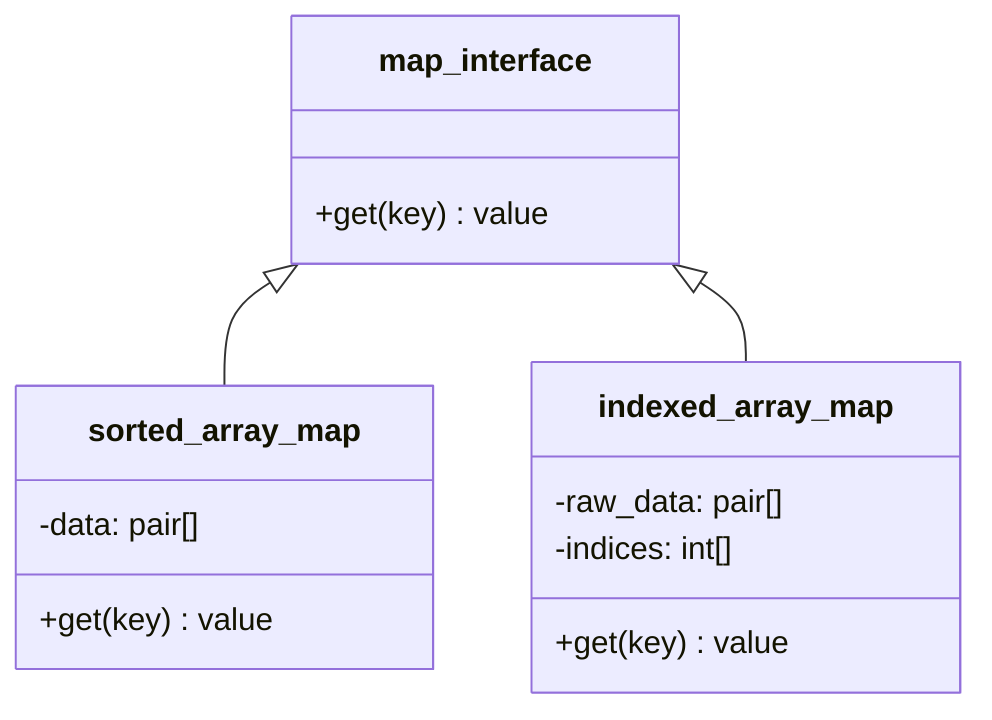
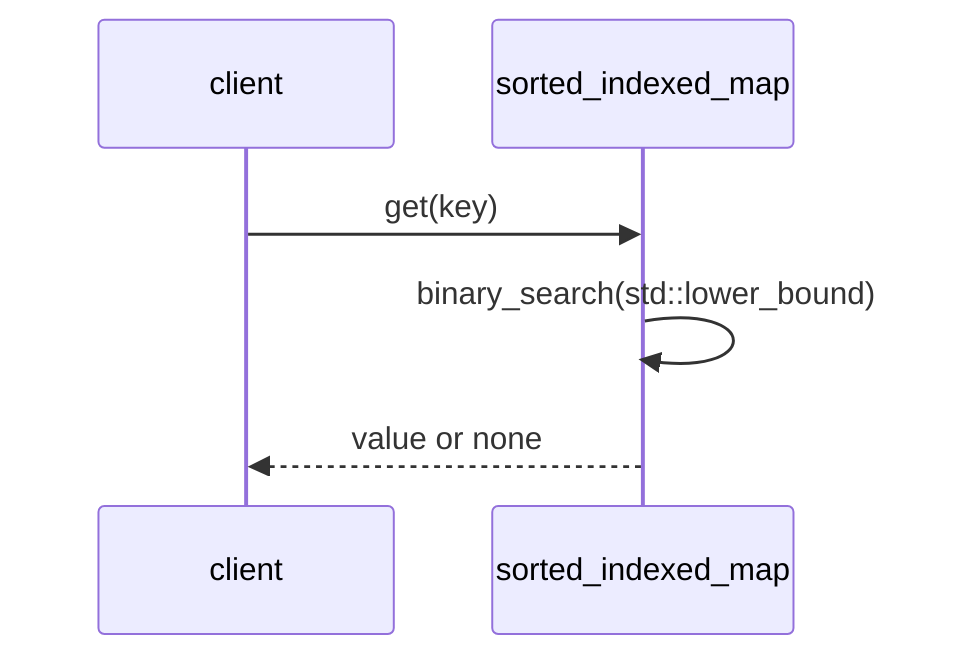

# ソート済みインデックス付き配列パターン

## 1. 意図
`std::map` や `std::unordered_map` の使用が禁止されている環境において、メモリ断片化を避けつつ、効率的な Key-Value 検索を実現する。特に、データが ROM にある場合や、検索回数が多い場合に最適化された手法を提供する。

## 2. 構造

### 2.1 クラス図 / ブロック図



### 2.2 相互作用



## 3. 適用ガイドライン

- **適用対象**:
    - **sorted_array_map**: データの更新がなく、検索回数が10回以上の場合。
    - **indexed_array_map**: データが ROM にある、コピーコストが高い、または要素数が100以下でインデックス管理が効率的な場合。
- **トレードオフ**:
    - **メリット**: メモリ断片化が発生せず、`std::map` よりもフットプリントが小さい。
    - **コスト**: 構築時にソートコストがかかる。動的な挿入・削除には不向き（再ソートが必要）。

## 4. コンセプトコード

```python
import bisect

class sorted_array_map:
    """パターン 1: Key-Value ペアの直接ソート"""
    def __init__(self, data_dict):
        self.data = sorted(data_dict.items())
        self.keys = [item[0] for item in self.data]

    def get(self, key):
        idx = bisect.bisect_left(self.keys, key)
        if idx < len(self.keys) and self.keys[idx] == key:
            return self.data[idx][1]
        return None

class indexed_array_map:
    """パターン 2: インデックス配列を用いたソートと検索"""
    def __init__(self, data_list):
        self.data = data_list
        self.indices = sorted(range(len(data_list)), key=lambda i: data_list[i][0])

    def get(self, key):
        low, high = 0, len(self.indices)
        while low < high:
            mid = (low + high) // 2
            if self.data[self.indices[mid]][0] < key:
                low = mid + 1
            else:
                high = mid
        if low < len(self.indices) and self.data[self.indices[low]][0] == key:
            return self.data[self.indices[low]][1]
        return None
```

## 5. 関連パターン
- **標準ライブラリ利用パターン**: `std::map` の代替としての位置付け。


## 6. 設計完了チェックリスト（網羅性確認）

- [x] パターンの解決する問題（意図）が明確か
- [x] 静的構造と動的相互作用が図解されているか
- [x] 適用時のメリット・デメリット（トレードオフ）が明示されているか
- [x] コンセプトコード（Python）が提供され、動作原理が理解可能か
- [x] 他のパターンとの関係性が整理されているか
