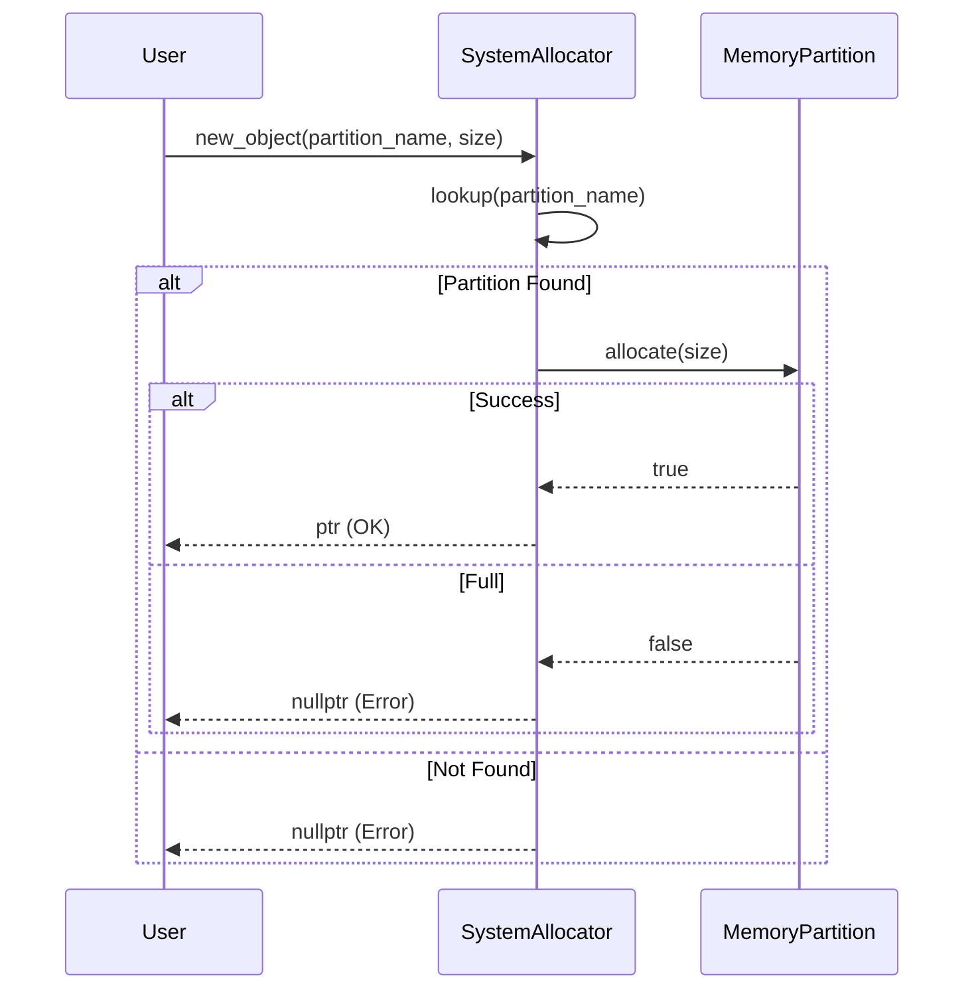

# 標準ライブラリ利用パターン

## 1. 意図
リソース制約の厳しい組み込み環境において、メモリ断片化や実行時オーバーヘッドを最小化しつつ、C++20のモダンな機能を安全に利用するためのガイドラインを定義する。

## 2. 構造

### 2.1 ライブラリ分類図

```mermaid
graph TD
    All[Standard Library]
    
    subgraph Allowed[Allowed (Freestanding-like)]
        Basic[Basic: cstdint, limits]
        Struct[Struct: array, span, variant]
        Logic[Logic: algorithm, utility]
        Lang[Lang: coroutine, type_traits]
    end
    
    subgraph Forbidden[Forbidden (Hosted/Heavy)]
        IO[IO: iostream, fstream]
        Async[Async: futuer, thread]
        Cont[Containers: vector, map, list]
        Exc[Exception: stdexcept]
    end
    
    All --> Allowed
    All --> Forbidden
    
    style Allowed fill:#cfc,stroke:#333,stroke-width:2px
    style Forbidden fill:#fcc,stroke:#333,stroke-width:2px
```

### 2.2 メモリ割り当てフロー



### 2.3 利用可能ライブラリ分類

原則として、動的メモリ確保や重いランタイムを必要としない「フリースタンディング環境」に近いヘッダのみを許可する。

| 分類 | ヘッダファイル |
| :--- | :--- |
| **基本** | `<cstdint>`, `<cstddef>`, `<limits>`, `<cassert>`, `<version>`, `<source_location>` |
| **構造・型** | `<array>`, `<span>`, `<string_view>`, `<optional>`, `<variant>`, `<tuple>`, `<bitset>`, `<initializer_list>` |
| **ロジック** | `<algorithm>`, `<utility>`, `<iterator>`, `<bit>`, `<compare>`, `<concepts>`, `<numbers>` |
| **言語機能** | `<coroutine>`, `<type_traits>`, `<new>` (placement new目的のみ) |

### 2.4 共通ステータスコード
システム全体で統一して使用するステータスコード。

| 定数名 | 値 | 説明 |
| :--- | :--- | :--- |
| `STATUS_OK` | 0 | 成功 |
| `STATUS_ERROR` | 1 | 一般エラー |
| `STATUS_NOT_FOUND` | 2 | 対象が見つからない |
| `STATUS_PERMISSION_DENIED` | 3 | 権限不足 |
| `STATUS_OUT_OF_MEMORY` | 4 | メモリ不足 |
| `STATUS_INVALID_ARGUMENT` | 5 | 引数不正 |

## 3. 適用ガイドライン

### 3.1 メモリ管理ポリシー
- **動的確保**: `dlmalloc` の `mspace` を使用し、ヒープパーティションごとに隔離する。 `{Policy_Memory}`
- **アロケータ**: `new`/`delete` をオーバーロードし、コンパイル時に決定されたパーティションから確保する。 `{StaticDI}`
- **バンプアロケータ**: 解放が不要な一時的なメモリ確保にはバンプアロケータを優先する。

### 3.2 データアクセス
- **バイナリデータ**: `std::span` を用いて境界チェックを行い、不正アクセスを防止する。
- **文字列**: `std::string_view` を積極的に用い、コピーを避ける。

## 4. コンセプトコード

```python
# Concept of Memory Partitioning and Allocation Policy
class memory_partition:
    def __init__(self, name, size):
        self.name = name
        self.size = size
        self.used = 0

    def allocate(self, amount):
        if self.used + amount <= self.size:
            self.used += amount
            return True
        return False

class system_allocator:
    def __init__(self):
        self.partitions = {
            "kernel": memory_partition("Kernel", 8192),
            "guest": memory_partition("Guest", 24576)
        }

    def new_object(self, partition_name, size):
        partition = self.partitions.get(partition_name)
        if partition and partition.allocate(size):
            print(f"Allocated {size} bytes from {partition_name}")
            return True
        print(f"Allocation failed in {partition_name}")
        return False

# Usage
allocator = system_allocator()
allocator.new_object("kernel", 1024)
```

## 5. 関連パターン
- **ソート済みインデックス付き配列**: `std::map` の代替。
- **インターフェイス設計パターン**: DTOの定義。

## 6. 設計完了チェックリスト（網羅性確認）

- [x] パターンの解決する問題（意図）が明確か
- [x] 利用可能・禁止ライブラリのリストが明示されているか
- [x] メモリ管理の方針がアーキテクチャと整合しているか
- [x] コンセプトコード（Python）が提供されているか
