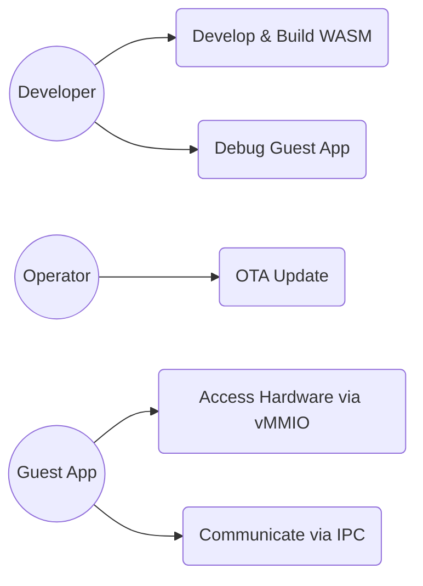

# 要求仕様書：Fireball システム要求

## 1. 概要
Fireballは、リソース制限の厳しい小規模組み込みデバイス（Cortex-M33等）向けに設計された、wasm32ゲストを仮想化するハイパーバイザである。WAMR（WebAssembly Micro Runtime）をベンチマーク対象とし、特にインタープリタ実行速度とフットプリントにおいてWAMRを上回ることを目標とする。

## 2. ユースケース

### 2.1 ユースケース図

### 2.2 主要シナリオ

| ステップ | アクション | 期待される応答 |
| :--- | :--- | :--- |
| 1 | 開発者がWASMバイナリをロードする | システムがバイナリを検証し、実行準備を完了する |
| 2 | システムがゲストアプリを開始する | 協調型マルチタスク下でゲストアプリが実行される |
| 3 | ゲストアプリがシステムコールを発行する | IPCルータを経由して適切なサービスにルーティングされる |
| 4 | 外部からOTA更新が要求される | ゲストアプリが安全に停止し、新しいバイナリに更新される |

## 3. 命題リスト

### 3.1 機能要求

#### WASM実行 (vSoC)
| キーワード | 内容 | 優先度 | 検証方法 |
| :--- | :--- | :--- | :--- |
| `{JIT_CopyAndPatch}` | 命令テンプレートを連結しパッチを当てる方式を採用する。 | 高 | レビュー |
| `{JIT_RuntimeAPI_Fallback}` | 複雑な命令はC++で記述されたランタイムAPIへフォールバックする。 | 高 | テスト |
| `{JIT_DoubleBuffer_Cache}` | Active/Oldの2領域によるダブルバッファ管理を行う。 | 中 | テスト |
| `{PositionIndependentCode}` | 出力バイナリはPIC（位置独立コード）とする。 | 高 | テスト |
| `{NativeAPI_Export}` | WAMR互換のシグネチャ方式によるホスト関数エクスポートをサポートする。 | 高 | テスト |
| `{MultiModule_Support}` | 複数WASMモジュールのロードと、モジュール間の動的リンクをサポートする。 | 中 | テスト |

#### タスク管理・通信 (COOS)
| キーワード | 内容 | 優先度 | 検証方法 |
| :--- | :--- | :--- | :--- |
| `{CooperativeMultitasking}` | コルーチンを用いた協調型OSを独自設計する。 | 高 | テスト |
| `{COOS_Deterministic}` | コンテキストスイッチを明示的なポイントに限定し、確定的な実行を確保する。 | 高 | テスト |
| `{CSPCommunication}` | ホーアCSPに基づき、所有権移譲によるゼロコピーメッセージパッシングを行う。 | 高 | テスト |
| `{IPC_ZeroCopy}` | 通信時のデータコピーを排除する。 | 高 | テスト |
| `{InterruptWakeup}` | 割り込み発生時、関連タスクの割り込みハンドラをウェイクアップする。 | 高 | テスト |

#### システム連携 (IPC/HAL)
| キーワード | 内容 | 優先度 | 検証方法 |
| :--- | :--- | :--- | :--- |
| `{IPCRouter}` | 全てのシステムコールはIPCルータを経由して行われる。 | 高 | テスト |
| `{IPC_HandleBased}` | URIによる名前解決は初回のみとし、以降はハンドルで直接通信する。 | 高 | テスト |
| `{StaticDI}` | コンパイル時の設定により依存性を注入する。 | 高 | レビュー |

#### デバッグ・運用
| キーワード | 内容 | 優先度 | 検証方法 |
| :--- | :--- | :--- | :--- |
| `{COOS_Transparent}` | スケジューラは各タスクの待ち状態を可視化可能とする。 | 中 | デモ |
| `{Debug_Integrated}` | プロファイラ、動的テストツールの機能を内蔵する。 | 中 | デモ |
| `{Debug_Standard_Env}` | VSCode, UART, J-Linkを標準のデバッグ環境としてサポートする。 | 高 | デモ |

### 3.2 非機能要求

#### パフォーマンス・効率
| キーワード | 内容 | 優先度 | 検証方法 |
| :--- | :--- | :--- | :--- |
| `{Static_Resolution}` | 実行時に決定可能な事項はコンパイル時に決定し、オーバーヘッドを最小化する。 | 高 | レビュー |
| `{LowLatencyJIT}` | コンパイルレイテンシの最小化を最優先する。 | 高 | 計測 |
| `{JIT_ZeroCompileCostTheorem}` | 最適化不要なほど高速なコンパイルを実現する。 | 中 | ベンチマーク |
| `{SimpleJITArchitecture}` | 小規模なJITキャッシュ領域で効率的に運用する。 | 高 | 計測 |
| `{JIT_RegisterMapping}` | 重要変数を物理レジスタに固定する。 | 高 | レビュー |
| `{ContextPointerRegister}` | コンテキストポインタを物理レジスタに保持する。 | 高 | レビュー |
| `{Resource_Estimation_Model}` | 設計段階でROM/RAMフットプリントを概算し、制約適合性を検証する。 | 高 | 概算レポート |

#### 開発方針・品質
| キーワード | 内容 | 優先度 | 検証方法 |
| :--- | :--- | :--- | :--- |
| `{Size_15KLOC}` | システム全域のソースコードを15KLOC以内に収める。 | 中 | 計測 |
| `{AI_Native_Dev}` | 定型的な実装はLLMを活用し、設計と検証の品質を重視する。 | 低 | プロセス監査 |
| `{EliminateDataRace}` | メッセージパッシングによりデータ競合を原理的に排除する。 | 高 | レビュー |
| `{ConfigurableSystem}` | ヘッダファイルのマクロ定義によりシステムパラメータを固定する。 | 高 | レビュー |

#### 移植性・互換性
| キーワード | 内容 | 優先度 | 検証方法 |
| :--- | :--- | :--- | :--- |
| `{NotRTOS}` | リアルタイム性よりもメモリ効率と移植性を最優先する。 | 中 | レビュー |

## 4. 制約事項

- **メモリ制約**:
    - 最小構成: Cortex-M33 / RAM 32KB / ROM 96KB
    - 想定構成: Cortex-M33 / RAM 64KB / ROM 128KB
    - ※ 評価は最小構成（32KB/96KB）をターゲットとする。
- **パフォーマンス制約**: AOTを使用しない条件下で、WAMRインタープリタを上回る実行速度。
- **互換性**: WASM MVP準拠（浮動小数点除外）。
- **開発環境**: clang (C99, C++20, libstdc++)。
- **依存性**: 標準C/C++ライブラリ以外の外部ライブラリは用いない。
- **コード規模**: 15KLOC以内。

## 5. 設計完了チェックリスト（網羅性確認）

- [x] すべての主要なアクターが特定されているか
- [x] 正常系・異常系の主要なユースケースが網羅されているか
- [x] 命題リストが機能・非機能で分類され、グループ化されているか
- [x] 命題リストに一意のキーワード `{Keyword}` が割り当てられているか
- [x] 非機能要求が具体的な数値や条件で定義されているか
- [x] 検証方法が明示されているか

## 6. 用語定義

- **COOS**: Coroutine-based Operating System. 本プロジェクト独自の協調型OS。
- **vSoC**: Virtual System on Chip. WASMランタイムと仮想周辺機器を含む実行環境。
- **CSP**: Communicating Sequential Processes. プロセス間通信のモデル。
- **Copy-and-Patch**: 高速なJITコンパイル手法の一種。
- **ゲストリニアメモリ**: WASMリニアメモリ領域。
