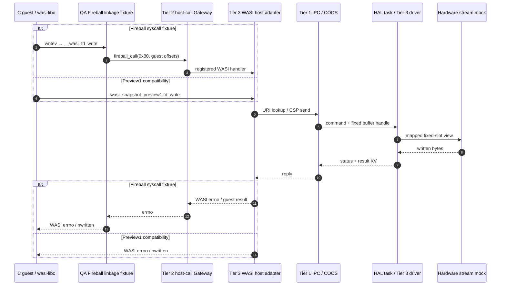

# コンポーネント間 結合テスト仕様書 (Integration Test Specification)

## 1. 目的と対象範囲

本書は、Fireball ハイパーバイザの全 Tier におけるコンポーネント間の結合動作を定義する。対象 Tier は Tier 1 Core、Tier 2 Runtime、Tier 3 Plugins、Tier 3 Platform である。

本書はシステム結合テストシナリオの正本である。単体・結合テストの分類と実行入口は[README.md](README.md)に示す。
既存12シナリオのWASMはWATから生成する。LLDB結合ケースではClangでDWARF付きWASMを生成する。
SDKゲストの層横断試験は、実WASI-SDKとwasi-libcを使ってCから生成する。
Scenario 9、11、12はPythonからIPC、ドライバ、ホスト互換層を直接呼び出す。
要求として定義した受入条件と、各入口が実際に検査する範囲を区別する。

### 1.1 本番実装と参照実装の位置づけ

本書に定める結合テストシナリオ群は、Fireball ハイパーバイザのアーキテクチャ受入基準（Acceptance Criteria）であり、特定の実装言語や実行環境に従属するものではない。

- **本番実装（Production Implementation / C++ Hypervisor）**:
  - 本書で定義されるシナリオ仕様（WAT ゲストバイナリ、入出力シーケンス、アーキテクチャ不変条件）は、Fireball 本番ハイパーバイザ（C++23 実装）が満たすべき受入テストスイート（Acceptance Test Suite）の正本仕様となる。
  - 各コンポーネントの C++ 実装に対し、ホスト結合ハーネス等を介して本シナリオ群を検証する。
- **参照実装（Reference Implementation / Python Simulator）**:
  - アーキテクチャの早期妥当性確認、状態遷移の探索、および Gotchas（実装上の勘所・不変条件）の抽出を目的とした Python 製の参照シミュレータ（`experiments/pysim`）。
  - 各シナリオには参照スクリプト（`experiments/pysim/qa/scenarios/`）がある。スクリプトの成功は、実行したassertの期待結果が成立したことを示す。仕様全体の実証状況は1.3のRTMに記録する。

- **対象 Tier**: Tier 1 Core/Interface、Tier 2 Runtime、Tier 3 Plugins/Platform。各コンポーネントは次節に列挙する。
- **参照実装テストスイート**: `experiments/pysim/qa/scenarios/`
- **シナリオランナー**: [`run_all.py`](experiments/pysim/qa/scenarios/run_all.py)
- **結合テストランナー**: [`run_all.py`](experiments/pysim/qa/integration/run_all.py)

### 1.2 コンポーネントと現行シナリオの観測範囲

この対応表はコンポーネントの全要求を網羅した割合を表さない。対象範囲の22コンポーネントについて、実行入口と検査対象を記録する。

| 分類 / Tier | コンポーネント設計書 | 現行スクリプトの観測 | シナリオ | 残る受入条件 |
| :--- | :--- | :--- | :--- | :--- |
| Tier 1 Core | [`os_coos.md`](docs/components/tier1_core/os_coos.md) | 実native guestの協調進捗、結果とCSP所有権 | 6, 9 | 継続呼出しのスタック非退避 |
| Tier 1 Core | [`os_scheduler.md`](docs/components/tier1_core/os_scheduler.md) | 実LOOPしきい値のCOOS中断順序とタスク完了結果 | 6, 9 | 割り込み配送時の再スケジュール境界 |
| Tier 1 Core | [`system_config.md`](docs/components/tier1_core/system_config.md) | 設定値を利用したメモリ初期化 | 1, 10 | 静的容量の上限と超過時の拒否 |
| Tier 1 Core | [`system_containers.md`](docs/components/tier1_core/system_containers.md) | ローダ、ルータ、JIT、ロガーでの利用 | 1, 4, 5, 9 | 各コンテナ契約の独立検査 |
| Tier 1 Interface | [`ipc_router.md`](docs/components/tier1_interface/ipc_router.md) | URI、RBAC、CSP所有権の成功と拒否 | 9 | 障害時の回収と状態不変性の全条件 |
| Tier 1 Interface | [`system_service.md`](docs/components/tier1_interface/system_service.md) | サービス状態遷移のassertなし | 未検証 | load_service、start_guest、障害隔離、イベント起因の自己再起動 |
| Tier 1 Interface | [`system_memory.md`](docs/components/tier1_interface/system_memory.md) | IPC用領域とHAL固定バッファの利用 | 9, 11, 12 | パーティション隔離と資源回収の独立検査 |
| Tier 2 Runtime | [`runtime_vsoc.md`](docs/components/tier2_runtime/runtime_vsoc.md) | System資源の接続とRuntimeEngine呼出し | 1, 4, 5, 6, 8 | vSoC協調境界、割り込み配送、ゲストの開始と終了 |
| Tier 2 Runtime | [`runtime_loader.md`](docs/components/tier2_runtime/runtime_loader.md) | WASM読込、data配置、elem経由のcall_indirect | 1, 3, 8 | リンク失敗と境界拒否の独立検査 |
| Tier 2 Runtime | [`runtime_vmmio.md`](docs/components/tier2_runtime/runtime_vmmio.md) | RAM、デバイス、SHM、TLBと拒否ステータス | 10 | ハッシュ衝突と拒否時の物理副作用不在 |
| Tier 2 Runtime | [`runtime_memory.md`](docs/components/tier2_runtime/runtime_memory.md) | memory.grow後のページ読み書き | 1 | MPU領域保護と拒否時の状態保持 |
| Tier 2 Runtime | [`runtime_logging.md`](docs/components/tier2_runtime/runtime_logging.md) | 書式拒否、レベルフィルタ、明示flush | 9 | 容量超過時の上書きとCOOS idle_hook結線 |
| Tier 2 Runtime | [`runtime_syscall.md`](docs/components/tier2_runtime/runtime_syscall.md) | ホストPreview1互換入口の出力と終了状態 | 2 | Fireball公開host callを通るゲストABIの検査 |
| Tier 2 Runtime | [`hal_dispatch.md`](docs/components/tier2_runtime/hal_dispatch.md) | ホスト互換層とHALコマンドの接続 | 2, 12 | 未対応操作、バッファ境界、poll待機の全条件 |
| Tier 2 Runtime | [`interpreter.md`](docs/components/tier2_runtime/interpreter.md) | 指定WASM例の戻り値、メモリ、グローバル | 1〜6, 8, 10 | ABI、不変条件、未使用命令と境界の独立検査 |
| Tier 3 Plugins | [`jit_compiler.md`](docs/components/tier3_plugins/jit_compiler.md) | トレース生成と戻り値の差分 | 4, 5 | JIT実行到達、共有状態同期、フォールバック |
| Tier 3 Plugins | [`jit_runtime.md`](docs/components/tier3_plugins/jit_runtime.md) | Activeトレース存在と複数関数のPC上位値 | 4, 5 | 製品lookup、カード遷移、3面ローテーションと昇格 |
| Tier 3 Plugins | [`debugger.md`](docs/components/tier3_plugins/debugger.md) | 実TCP RSPと静的構成のnative停止フック | 7, 8 | 実機Sinkと全opcodeのデバッグ網羅 |
| Tier 3 Plugins | [`guest_profiler.md`](docs/components/tier3_plugins/guest_profiler.md) | 集計結果のassertなし | 未検証 | コールグラフと時間集計 |
| Tier 3 Platform | [`interface_wit.md`](docs/components/tier3_platform/interface_wit.md) | ホストURI別名解決とPreview1 import接続 | 2, 12 | Core WASMゲストと公開WITのadapter結線 |
| Tier 3 Platform | [`platform_driver.md`](docs/components/tier3_platform/platform_driver.md) | StreamTransport、stdio、Timer、互換バックエンド | 2, 7, 9, 11, 12 | GPIO、I2C、SPIとエッジIRQ |
| Tier 3 Platform | [`libfireball.md`](docs/components/tier3_platform/libfireball.md) | ゲスト側アダプタを実行しない | 未検証 | Preview1から公開Fireball IFへのゲスト側変換は未実装 |

### 1.3 仕様キーワード・不変条件カバレッジ追跡表 (Requirements Traceability Matrix: RTM)
<!-- traceability: {OwnerMismatchTrap} {UnregisteredPageTrap} {TraceBoundaryInvariant} {ADR_LoopBackedgeYield} {ServiceSelfReboot} {SelfReboot_via_Event} {WASI_ScatteredIO} {WASI_InMemVFS} -->

本表は2026-10-01のソース監査に基づくassertの対応表である。「観測あり」は記載した期待結果を検査するassertが存在することを示す。実行成功の記録は3.1に分ける。「一部」は要求の一部だけを検査する。「未検証」は要求に対応するassertがないことを示す。テストケースIDを列挙しただけで要求を合格にしない。

| 仕様キーワード / 不変条件 | 定義元設計書 | 仕様上の定義・要件 | 対応テスト ID | 現行assertの観測と限界 |
| :--- | :--- | :--- | :--- | :--- |
| `META_BinarySearch` | `system_containers.md`, `jit_runtime.md` | 疎なJIT Code-section PCエントリのソート配列二分探索（Radix表なし） | `TEST-INT-40`, `TEST-INT-41` | 未検証。Scenario 5のsorted/bisect_left照合はテスト側で作った表を検索し、製品lookupを呼ばない |
| `FlatMapView_BinarySearch` | `system_containers.md`, `ipc_router.md` | 静的ソート配列に対する二分探索と動的割当なしの検索 | `TEST-INT-01`, `TEST-INT-80` | 一部。URI検索結果を検査する。計算量と割当不在は検査しない |
| `RingBuffer_Overwrite` | `system_containers.md`, `runtime_logging.md` | 満杯時の最古エントリ自動上書き | `TEST-INT-82` | 未検証。Scenario 9は2件をflushし、容量超過を発生させない |
| `BitView_CardMarking` | `system_containers.md`, `jit_runtime.md` | 2-bitカードのUNEXEC→EXEC→HOT→COMPILED遷移 | `TEST-INT-30`, `TEST-INT-31` | 一部。Activeトレースの存在を検査する。各カード状態と遷移順序を検査しない |
| `DirectSwitch` | `os_coos.md`, `os_scheduler.md` | スタック退避なしの継続関数呼び出し | `TEST-INT-50`, `TEST-INT-51` | 未検証。汎用コルーチンの完了結果だけでは継続呼出し方式を判別できない |
| `FuelExhaustion_Yield`（旧表記） / `ADR_LoopBackedgeYield` | `interpreter.md`, `runtime_vsoc.md` | C++ dispatcherの継続実行、LOOP後方分岐しきい値到達時にRuntimeEngineへ戻り、vSoCが協調yieldを発行する | `TEST-INT-50` | 観測あり。Scenario 6は共通LOOP後方分岐しきい値4で24境界の進捗を検査する |
| `DictionaryBasedIPC` | `runtime_logging.md` | 危険書式（%s / %p）の登録時拒絶 | `TEST-INT-82` | 一部。%s拒絶を検査する。%pの独立ケースはない |
| `BufferedLogging` | `runtime_logging.md` | リングバッファ蓄積からCOOS idle_hookでUARTへflushする | `TEST-INT-82` | 一部。logger.flushを直接呼ぶ。idle_hookからの実行は検査しない |
| `WASI_ScatteredIO` | `libfireball.md` | ゲスト側アダプタによる多要素iovecの書込みと読込み | `TEST-INT-10`, `TEST-INT-104`, `TEST-INT-121`〜`TEST-INT-126` | 一部。SDK/libc guestの3要素writev、空要素、HAL分割、占有拒否、実IPC経路を追加検査する。製品ゲストadapterと多要素fd_readは未検証 |
| `Syscall_ProcExit` | `runtime_syscall.md` | ゲスト終了と終了コード伝播 | `TEST-INT-11` | 観測あり。halted=Trueとexit_code=42を検査する。複数ゲストの終了隔離は検査しない |
| `ThreeStageRouting` | `ipc_router.md` | URI検索、RBAC判定、CSP所有権移譲 | `TEST-INT-80`, `TEST-INT-81` | 観測あり。成功時のメッセージと所有権、URI/RBAC拒否を検査する |
| `PreflightRejection` | `ipc_router.md` | RBAC拒否・サイズ超過で送信側所有権を維持する | `TEST-INT-81` | 観測あり。拒否ステータスとSENDER_OWNSを検査する |
| `RAM_Bypass_Bit31` | `runtime_vmmio.md` | Bit 31が0のRAMアクセスでページテーブルを参照しない | `TEST-INT-90` | 一部。OK_GUEST_RAMを検査する。ページテーブル不参照を直接検査しない |
| `DirectMappedTLB32` | `runtime_vmmio.md` | Folding XOR Hashによる32エントリTLB | `TEST-INT-92` | 一部。同一ページの再アクセスでヒット数が1増える。ハッシュ式と衝突時の置換は検査しない |
| `OwnerMismatchTrap` | `runtime_vmmio.md` | 非所有者SHMアクセスの遮断 | `TEST-INT-93` | 一部。OWNER_MISMATCHを検査する。物理副作用不在の独立assertはない |
| `UnregisteredPageTrap` | `runtime_vmmio.md` | Revoke後のSHMアクセスを遮断する | `TEST-INT-94` | 観測あり。Revoke後のUNREGISTERED_PAGEを検査する |
| `ActiveDataSegments` | `runtime_loader.md` | Active dataセグメントをリニアメモリへ配置する | `TEST-INT-01` | 観測あり。2セグメントの文字列とバイト配列を検査する |
| `CPS_4Args` | `interpreter.md` | ctx、sp、local_base、tosの4論理引数によるディスパッチ | `TEST-INT-01`〜`TEST-INT-105` | 未検証。通常の計算結果だけでは引数配置とABI境界の違反を判別できない |
| `SignZeroExtension` | `interpreter.md` | メモリ命令の符号拡張とゼロ拡張 | `TEST-INT-70` | 一部。指定した8/16/32-bit入力の合成結果65757を検査する。各演算の独立結果と全境界値は検査しない |
| `ControlFrameCleanup` | `interpreter.md` | ネスト脱出時の制御フレーム不変性とリーク防止 | `TEST-INT-20`, `TEST-INT-22` | 一部。再帰値とbr_tableの行先の結果を検査する。実行前後のフレーム状態を直接検査しない |
| `RSPMinimalSet` | `debugger.md`, `gdb_rsp_protocol.md` | RSP最小コマンドとsの1命令ステップ | `TEST-INT-60`〜`TEST-INT-64`, `TEST-INT-129` | 実TCPと構成済みnativeフックでs、ブレークポイント、停止状態の読書き、継続と正常終了を検査する。LLDB結合ケースはDWARF関数名からZ0設定と停止まで確認する |
| `DebuggerInterpreterComposition` | `debugger.md`, `runtime_vsoc.md` | Interpreter + Debugger構成とDebugger + JIT構成の拒否 | `TEST-DBG-13`, `TEST-VSOC-23` | 別スイート。[test_runtime_composer.py](experiments/pysim/qa/tier2_runtime/test_runtime_composer.py)と[test_vsoc.py](experiments/pysim/qa/tier2_runtime/test_vsoc.py)で検査する。結合12シナリオの合格数へ含めない |
| `HAL_PeripheralDrivers` | `platform_driver.md` | GPIO、エッジIRQ、I2C、SPI、Timer | `TEST-INT-100`〜`TEST-INT-102` | 未検証。Scenario 11にGPIO/I2C/SPI操作がない。Timerはtick_countと時計の非減少だけを検査する |
| `WASI_InMemVFS` | `libfireball.md` | ゲスト側WASI互換アダプタによるVFS、乱数、クロック委譲 | `TEST-INT-103`〜`TEST-INT-105`, `TEST-INT-125`〜`TEST-INT-128` | 一部。SDK/libc guestから既存バックエンド境界へ読書き、close、u64時計を委譲し、失敗結果も照合する。実uvwasi、製品ゲストadapter、乱数品質、時計の単調増加は別の検証である |
| `CopyAndPatch_JIT` | `jit_compiler.md` | Copy-and-Patchトレースの生成と実行 | `TEST-INT-30`, `TEST-INT-40` | 一部。生成トレースの存在と戻り値を検査する。JIT実行回数を直接検査しない |
| `TraceBoundaryInvariant` | `jit_compiler.md` | 境界のスタック自己完結性、状態同期、フォールバック | `TEST-INT-31`, `TEST-INT-41` | 未検証。戻り値の一致だけでは各境界の状態不変条件を実証できない |
| `ThreeBankCacheEviction` | `jit_runtime.md` | Active/Warm/Oldest代謝とOldestからActiveへの昇格 | `TEST-INT-31`, `TEST-INT-41` | 未検証。バンク移動と昇格の状態を検査するassertがない |

`TEST-INT-63`は実TCPのs後にPCとstackを読み、local.getだけが実行されたことを検査する。[test_debugger.py](experiments/pysim/qa/tier3_plugins/debugger/test_debugger.py)の反例も、構成済みnativeフックを通る通常の回帰テストである。

サービスの受入条件は[system_service.md](docs/components/tier1_interface/system_service.md)のLoaded→Running→Failed→Loadedと障害隔離である。Scenario 2、11、12のI/O成功はload_service、start_guest、自己再起動、retry/restart/panicの結果を検査しない。libfireballのゲスト側WASI adapterは[libfireball.md](docs/components/tier3_platform/libfireball.md)に記載された未実装範囲である。ホスト互換層と参照バックエンドの成功を、その実装実証へ振り替えない。

---

## 2. 結合テストシナリオ一覧

以下の表は受入条件を定義する。現行スクリプトがその条件を検査できない場合も要求は残す。実装済みの観測と未検証条件はRTMおよび各シナリオの実行範囲に記録する。

### シナリオ 1: Tier 1 Core + Tier 2 Loader & Linear Memory
- **対象コンポーネント**: `runtime_loader`, `interpreter`, `system_containers` (RadixBinaryTreeView, FlatMapView)
- **参照実装スクリプト (Reference Script)**: [`scenario1_loader_and_memory.py`](experiments/pysim/qa/scenarios/scenario1_loader_and_memory.py)
- **WAT シナリオ**:
  - アクティブデータセグメント（Active Data Segments）による ROM 文字列・バイナリ配列の初期配置
  - ゲスト関数からのリニアメモリアクセス（`i32.load` / `i32.store`）
  - 動的メモリ拡張（`memory.grow` / `memory.size`）と拡張ページ（Page 2: offset 131,072）への境界超過アクセス
  - グローバル変数（`global.get` / `global.set`）の変更と状態保持

| テストケースID | 検証項目 | 前提条件 | 手順 | 期待結果 | 紐付け |
| :--- | :--- | :--- | :--- | :--- | :--- |
| TEST-INT-01 | データセグメント初期展開 | WASMロード完了 | メモリ特定番地を参照 | `256` 番地に文字列、`1024` 番地にバイト列が正確に配置される | `ActiveDataSegments`, `ThreadedInterpreter` |
| TEST-INT-02 | 動的メモリ拡張とページ境界アクセス | 1ページ（64KB）で起動 | `test_grow(2)` を実行し Page 2 へストア | メモリが3ページ（192KB）に拡張され、新領域への書き込み・読み出しが成功する | `WasmPageAlignment`, `MemoryBoundaryCheck` |
| TEST-INT-03 | グローバル変数ミューテーション | 初期値 100 | `inc_global(25)`, `inc_global(-50)` | `125`, `75` が返却され、モジュール内グローバル状態が保持される | `ThreadedInterpreter` |

---

### シナリオ 2: Tier 2 Runtime + System Call & WASI I/O
- **対象コンポーネント**: `interpreter`, `runtime_syscall`, `hal_dispatch`, `libfireball`
- **参照実装スクリプト (Reference Script)**: [`scenario2_wasi_syscall_io.py`](experiments/pysim/qa/scenarios/scenario2_wasi_syscall_io.py)
- **WAT シナリオ**:
  - WASI 標準 ABI（`wasi_snapshot_preview1`）による `fd_write` および `proc_exit` のインポート解決
  - 複数 iovec 構造体（分散ギャザー I/O: Header + Payload）の stdout フラッシュ
  - `proc_exit` システムコールによるゲストタスク停止および終了コード伝播

| テストケースID | 検証項目 | 前提条件 | 手順 | 期待結果 | 紐付け |
| :--- | :--- | :--- | :--- | :--- | :--- |
| TEST-INT-10 | 分散ギャザー `fd_write` | iovec 配列2要素を構成 | `fd_write(fd=1, iovs, 2)` を実行 | 合計 23 バイトが書き込まれ、ホストトランスポートから `"HELLO-WASI [SYSTEM_OK]\n"` が得られる | `WASI_ScatteredIO` |
| TEST-INT-11 | ゲスト `proc_exit` 停止 | 実行中 | `proc_exit(42)` を実行 | システムが `halted=True` に遷移し、`exit_code=42` が正確に記録される | `Syscall_ProcExit` |

現行スクリプトはPreview1を直接importするWASMをWasiHostContextへ接続する。libfireballをリンクしたゲストは実行しない。ゲスト側WASI変換の受入条件は未検証である。

---

### シナリオ 3: Tier 2 Interpreter + Recursion & Indirect Table Dispatch
- **対象コンポーネント**: `interpreter`（統合値領域、関数呼出し記述子）
- **参照実装スクリプト (Reference Script)**: [`scenario3_recursion_and_tables.py`](experiments/pysim/qa/scenarios/scenario3_recursion_and_tables.py)
- **WAT シナリオ**:
  - 再帰フィボナッチ関数（`fib(12)`）による深いコールスタック構築と巻き戻し
  - WASM テーブル（`table` / `elem`）と `call_indirect` による動的関数ポインタディスパッチ（加算・減算・乗算・XOR）
  - `br_table` による多分岐ジャンプテーブル処理

| テストケースID | 検証項目 | 前提条件 | 手順 | 期待結果 | 紐付け |
| :--- | :--- | :--- | :--- | :--- | :--- |
| TEST-INT-20 | 深い再帰呼び出しとフレーム巻き戻し | 統合スタック初期化 | `fib(12)` を実行 | スタックオーバーフローやフレーム破壊を起こさず、正確に `144` を返す | `ThreadedInterpreter`, `ControlFrameCleanup` |
| TEST-INT-21 | テーブル動的ディスパッチ (`call_indirect`) | 関数テーブル登録済み | `dispatch_calc(op_id, a, b)` | 指定した演算関数（add/sub/mul/xor）が型安全にディスパッチされて正しい値を返す | `ThreadedInterpreter`, `CPS_4Args` |
| TEST-INT-22 | 多段ジャンプスイッチ (`br_table`) | ブロックネスト | `test_br_table(selector)` | セレクタ値（0/1/2/default）に応じて対応するブロック外へ正確にジャンプする | `ControlFrameCleanup` |

---

### シナリオ 4: Tier 2 Runtime + Tier 3 Plugins Hybrid Compilation
<!-- traceability: {TraceBoundaryInvariant} -->
- **対象コンポーネント**: `interpreter`, `runtime_engine` (CardMarking, HistoryRing), `jit_compiler`, `jit_runtime`
- **参照実装スクリプト (Reference Script)**: [`scenario4_hybrid_jit_loop.py`](experiments/pysim/qa/scenarios/scenario4_hybrid_jit_loop.py)
- **WAT シナリオ**:
  - エラトステネスの篩（素数計算: 1000 未満の素数探索）
  - ホットループ実行時の 2-bit Card Marking による HOT 検出
  - COOS `idle_hook` での JIT トレース自動コンパイルと Active キャッシュバンク格納
  - Tier 2 インタープリタ単独実行と Tier 3 ハイブリッド実行の計算結果完全一致（Differential Testing）

| テストケースID | 検証項目 | 前提条件 | 手順 | 期待結果 | 紐付け |
| :--- | :--- | :--- | :--- | :--- | :--- |
| TEST-INT-30 | ホットスポット検出と JIT 自動コンパイル | ループ実行 | `idle_hook` を呼び出す | ループ内の BasicBlock が HOT 昇格し、JIT キャッシュバンクに登録される | `BitView_CardMarking`, `JIT_MultiBuffer_Cache` |
| TEST-INT-31 | JIT / インタープリタ差分検証 | 同一ワークロード | Tier 2 と Tier 3 の結果を比較 | 双方が正確に `168`（1000未満の素数の個数）を返し、値が 100% 一致する | `JIT_CopyAndPatch`, `TraceBoundaryInvariant` |

現行assertは戻り値168とActiveトレースの存在を検査する。カードの各遷移、COOS idle_hook結線、JIT実行到達、および境界状態の同期は独立に検査しない。

---

### シナリオ 5: Code-section PC & sparse JIT lookup
<!-- traceability: {WasmCodeSectionPC} -->
- **対象コンポーネント**: `jit_runtime`, `jit_compiler`, `system_containers` (StaticVector / sorted entry array)
- **参照実装スクリプト (Reference Script)**: [`scenario5_multimodule_unified_pc.py`](experiments/pysim/qa/scenarios/scenario5_multimodule_unified_pc.py)
- **WAT シナリオ**:
  - 複数関数（3D 内積 `dot3`、マンハッタン距離 `manhattan3`、バッチ処理 `batch_metrics`）の相互呼び出し
  - 関数間のPCはCode section payload内の命令先頭オフセットで区別する。モジュール横断キーは`(module_id, pc)`とする
  - コンパイル済みJIT entryは少数の疎なキー集合として保持し、ソート配列の二分探索で検索（Radix表なし）

| テストケースID | 検証項目 | 前提条件 | 手順 | 期待結果 | 紐付け |
| :--- | :--- | :--- | :--- | :--- | :--- |
| TEST-INT-40 | 複数関数にまたがるCode-section PCのJITトレース | 複数関数がホット化 | `cache.active.traces` を検査 | 同じモジュール内の各関数のトレースが、それぞれCode section payload内の異なるPCで正常に共存・実行される | `JIT_MultiBuffer_Cache` |
| TEST-INT-41 | 少数の疎なモジュールPCエントリを二分探索 | トレース登録済み | 製品キャッシュのlookupへmodule IDとCode-section PCを渡す | 各`(module_id, pc)`に対し二分探索で正しいJITトレースを取得する。Radix表を構築しない | `META_BinarySearch`, `ThreeBankCacheEviction` |

現行の二分探索assertは、テスト側で構築したソート表をbisect_leftで検索する。製品キャッシュのlookupと、3面バンク移動後の検索は未検証である。

---

### シナリオ 6: COOS Cooperative Multitasking & 協調Yield境界
- **対象コンポーネント**: `os_scheduler`, `os_coos`, `interpreter`
- **参照実装スクリプト (Reference Script)**: [`scenario6_coos_multitask_yield.py`](experiments/pysim/qa/scenarios/scenario6_coos_multitask_yield.py)
- **WAT シナリオ**:
  - プロデューサ・タスク（メモリへ 100 件のデータ書き込み）
  - コンシューマ・タスク（メモリから 100 件のデータを読み込み合計 50,500 を算出）
  - 中断と再開はランタイム（vSoC / COOS）の責務である。現行正本は[interpreter.md](docs/components/tier2_runtime/interpreter.md)と[runtime_vsoc.md](docs/components/tier2_runtime/runtime_vsoc.md)のC++ dispatcherの継続実行、LOOP後方分岐しきい値を使用する。しきい値に達したdispatcherがRuntimeEngineへ戻り、vSoCがco_yieldを発行する。

| テストケースID | 検証項目 | 前提条件 | 手順 | 期待結果 | 紐付け |
| :--- | :--- | :--- | :--- | :--- | :--- |
| TEST-INT-50 | LOOP後方分岐しきい値での決定論的中断と状態保持 | RuntimeEngineの共通しきい値を設定 | しきい値到達とvSoCの協調yieldを観測し、完了まで再開する | 指定回数条件で複数回中断し、各境界のローカル変数とスタック状態を保持して完走する | `CooperativeMultitasking`, `ADR_LoopBackedgeYield` |
| TEST-INT-51 | 共有メモリを介したタスク間データ受け渡し | 同一 ExecEnv 共有 | プロデューサ完走後にコンシューマ実行 | プロデューサが書き込んだデータが正しく読み取られ、合計値 `50500` が得られる | `CooperativeMultitasking`, `DirectContextSwitch` |

2026-10-02に、テスト用yieldアダプタを既存のSystem.run_guest経路へ置き換えた。
初期値0の新しい共有メモリで、独立した実NativeInterpreterのproducerとconsumerをCOOSへ登録する。
共通LOOP後方分岐しきい値4で、進捗(4,4)から(96,96)まで全24境界のREADY状態と順序を照合する。
全100要素の10〜1000、範囲外の保存、結果100と50500、両タスクの終了を検査する。
通常Interpreterのstep粒度を変更せず、ランタイムへ別の1命令経路を追加しない。
継続呼出しの実機スタック非退避は、このPython側の観測だけでは実証しない。

---

### シナリオ 7: GDB Remote Serial Protocol (RSP) Socket Debugger
- **対象コンポーネント**: `debugger`, `runtime_vsoc`, `interpreter`
- **参照実装スクリプト (Reference Script)**: [`scenario7_gdb_socket_debugger.py`](experiments/pysim/qa/scenarios/scenario7_gdb_socket_debugger.py)
- **通信シナリオ**:
  - GDB サーバー（`GDBServer`）が実 TCP ソケットでリッスン
  - GDB クライアントからの接続、パケット送受信（`?`, `g`, `G`, `m`, `M`, `Z0`, `z0`, `s`, `c`）
  - 仮想レジスタ（PC, SP, FP, TOS, Locals）の読み出し・動的書き換え
  - ブレークポイント設定とヒット時の `$S05`（SIGTRAP）停止
  - デバッグ構成のInterpreter-only実行とDebugger + JIT同時構成の拒否（`{DebuggerInterpreterComposition}`）
  - 単歩ステップ実行（`s`）と正常終了（`$W00`）

| テストケースID | 検証項目 | 前提条件 | 手順 | 期待結果 | 紐付け |
| :--- | :--- | :--- | :--- | :--- | :--- |
| TEST-INT-60 | TCP ソケット接続と停止理由クエリ | GDBServer 稼働中 | `?` パケット送信 | クライアント接続が受理され、`$S05#b8`（SIGTRAP）が返却される | `RSPMinimalSet` |
| TEST-INT-61 | 20 仮想レジスタ読み出し・書き換え | 停止中 | `g` および `G` パケット送信 | 160文字 HEX 列で全仮想レジスタが正しく取得・変更される | `RSPMinimalSet` |
| TEST-INT-62 | メモリ検査・書き換え | 停止中 | `m` および `M` パケット送信 | 指定オフセットのバイト列が読み書きされ、JITキャッシュ操作は発生しない | `RSPMinimalSet`, `MemoryBoundaryCheck` |
| TEST-INT-63 | ブレークポイント停止とステップ実行 | 実行中 | `Z0` でブレークポイント設定後 `c` / `s` | 指定 PC で正確にトラップ停止し、単歩ステップ実行で 1 命令進む | `RSPMinimalSet` |
| TEST-INT-64 | プログラム正常完走とデタッチ | ブレークポイント解除済み | `c` パケット送信 | プログラムが最後まで完走し、`$W00#b7`（終了）が返る | `RSPMinimalSet` |
| TEST-INT-129 | LLDBのDWARF関数ブレークポイント | Clang/LLDBを利用可能、DWARF付きWASMをロードし`code`セクションをPC空間の0へ対応付け済み | LLDBから`breakpoint set -n add_one`、`process continue` | LLDBがRSPの`Z0`を登録し、Fireballが実行を関数位置で停止する。LLDB出力の停止理由、Fireballの登録状態、停止PCを照合する | `RSPMinimalSet`, `WasmCodeSectionPC` |

RSPは静的構成のExecutionControlを呼び、nativeフックが命令位置で停止する。s後はPCが2byte進み、stack=[100]でlocal1=0のままとなる。次の定数と乗算は未実行である。同じ状態からcを再開し、結果498とW00を得る。

`test_lldb_debugger.py`は外部LLDBを実クライアントとして起動する。LLDBのDWARF関数名解決、セクションロードアドレス設定、RSPの`Z0`送信、Fireballの停止応答までを検査する。ClangまたはLLDBがない環境ではこのケースをskipする。LLDBの対象レジスタ定義はQA一時ファイルで与える。

---

### シナリオ 8: Storage Coverage (Globals / Locals / Memory Full-Width) & GDB Debugger
- **対象コンポーネント**: `interpreter`, `debugger`, `runtime_loader`
- **参照実装スクリプト (Reference Script)**: [`scenario8_comprehensive_storage_coverage.py`](experiments/pysim/qa/scenarios/scenario8_comprehensive_storage_coverage.py)
- **WAT & デバッグシナリオ**:
  - 全幅メモリアクセス: `i32.store8`/`load8_u`/`load8_s`, `i32.store16`/`load16_u`/`load16_s`, `i32.store`/`load`
  - 可変グローバル変数（`global.get`, `global.set`）と呼び出し間状態永続性
  - ローカル変数パイプライン演算（`local.get`, `local.set`, パラメータ保持）
  - リアルタイム GDB RSP ソケット経由でのブレークポイント捕捉、ローカル変数改変、およびインタープリタ実行中のリニアメモリ書き換え

| テストケースID | 検証項目 | 前提条件 | 手順 | 期待結果 | 紐付け |
| :--- | :--- | :--- | :--- | :--- | :--- |
| TEST-INT-70 | 全幅メモリ読み書きと符号/ゼロ拡張 | モジュールロード完了 | `test_memory_widths()` 実行 | 8/16/32-bit の符号/ゼロ拡張が正しく反映され期待値 `65757` を返す | `SignZeroExtension` |
| TEST-INT-71 | グローバル変数パイプライン演算 | 初期値 100 | `pipeline_process(5, 200)` | メモリ配列との乗算累積が正確に実行され、グローバル値が `550` $\to$ `1000` へ更新保持される | `ThreadedInterpreter` |
| TEST-INT-72 | デバッガからのストレージ動的改変 | ブレークポイント停止中 | `G` でローカル変数変更、`M` でメモリパッチ | 実行コンテキストとリニアメモリが即座に更新され、後続ステップに正確に反映される | `RSPMinimalSet`, `MemoryBoundaryCheck` |
| TEST-INT-73 | ストレージ改変後の単歩ステップと完走 | 改変完了後 | `s` でステップ実行後 `c` で完走 | 改変後のローカル変数とメモリに基づき正確に完走（結果 `150`）し正常終了する | `RSPMinimalSet` |

計算部分は純粋Interpreterであり、JIT差分実行は存在しない。RSP部分は静的構成のnativeフックを使う。s後のstack=[15]とlocal1=0を照合し、乗算の先行実行を拒否する。同じ状態からcを再開し、結果150とW00を得る。

---

### シナリオ 9: Tier 1 Interface IPC Router & Structured Logging
- **対象コンポーネント**: `ipc_router`, `runtime_logging`, `system_containers`, `platform_driver`
- **参照実装スクリプト (Reference Script)**: [`scenario9_ipc_router_and_logging.py`](experiments/pysim/qa/scenarios/scenario9_ipc_router_and_logging.py)
- **検証シナリオ**:
  - 3段階ルーティングパイプライン: FlatMapView URI 検索、RBAC ロール権限判定、Zero-Copy 所有権移譲
  - キュー溢れ時の Rollback 復元とターゲットフォールト時の Drop Handler リソース回収
  - `LogDictionary` によるポインタ書式（`%s`）の静的拒絶と、COOS アイドルフラッシュによる UART 出力

| テストケースID | 検証項目 | 前提条件 | 手順 | 期待結果 | 紐付け |
| :--- | :--- | :--- | :--- | :--- | :--- |
| TEST-INT-80 | IPC 3段階ルーティングと所有権移譲 | 送信元 `RUNTIME` | `send` 実行後 `receive` | 所有権が `SENDER_OWNS` $\to$ `IN_FLIGHT` $\to$ `RECEIVER_OWNS` へ遷移する | `ThreeStageRouting` |
| TEST-INT-81 | RBAC 権限拒絶とメッセージサイズ超過 | 未許可ロール / kv_pair数が8個を超過 | メッセージ送信 | `ERR_PERMISSION_DENIED` / `ERR_MSG_TOO_LARGE` で安全に拒絶され、所有権は送信側のまま維持される | `PreflightRejection` |
| TEST-INT-82 | 構造化ロギングと安全書式検証 | LogDictionary 登録 | `log_event` 後 `flush()` | 不正書式 `%s` が拒絶され、ログレベルフィルタを経て UART へ正常出力される | `DictionaryBasedIPC`, `BufferedLogging` |

現行ロギングケースは2件の成功ログと1件のフィルタ結果を検査し、logger.flushを直接呼ぶ。COOS idle_hookによるflush、満杯時の上書き、キュー溢れ時のRollback、およびターゲット障害時のDrop Handlerは本シナリオで未検証である。

---

### シナリオ 10: Tier 2 Runtime vMMIO Virtual Devices & Address Translation
<!-- traceability: {OwnerMismatchTrap} {UnregisteredPageTrap} -->
- **対象コンポーネント**: `runtime_vmmio`, `runtime_syscall`, `runtime_memory`, `system_config`
- **参照実装スクリプト (Reference Script)**: [`scenario10_vmmio_virtual_devices.py`](experiments/pysim/qa/scenarios/scenario10_vmmio_virtual_devices.py)
- **実行条件**: `wasmtime`を必須依存とする。依存がない場合はimportで失敗し、guest部分を省略した成功判定を返さない。
- **検証シナリオ**:
  - Bit 31 RAM Bypass フラグ: ゲストリニア RAM（Bit 31 == 0）の $O(1)$ 高速パス
  - 仮想デバイス（FC=0xC）、共有メモリ（FC=0xE）、物理パススルー（FC=0xF）の PTE マッピング
  - 5-bit Folding XOR Hash による Direct-Mapped Software TLB[32] ヒット/ミス遷移
  - マップ済みSHMの非所有者アクセス時の`OWNER_MISMATCH`遮断
  - Revoke後のアンマップ済みSHMアクセス時の`UNREGISTERED_PAGE`遮断

| テストケースID | 検証項目 | 前提条件 | 手順 | 期待結果 | 紐付け |
| :--- | :--- | :--- | :--- | :--- | :--- |
| TEST-INT-90 | Bit 31 RAM Bypass 高速パス | リニア RAM アドレス | `access()` 実行 | ページテーブルを介さず `OK_GUEST_RAM` で即時バイパスされる | `RAM_Bypass_Bit31` |
| TEST-INT-91 | 仮想デバイス書き込みとハンドラディスパッチ | デバイスページ登録済み | `access()` で書き込み | `OK_STATIC_DEVICE` が返り登録ハンドラが呼び出される | `vMMIO_TrapAndEmulate` |
| TEST-INT-92 | 32エントリ Direct-Mapped TLB キャッシュ | 同一ページ反復アクセス | 連続 `access()` | 2回目以降が TLB ヒットとなり `tlb_hits` が増加する | `DirectMappedTLB32` |
| TEST-INT-93 | マップ済みSHMへの非所有者アクセス | task A所有のSHM PTEが登録済みでRevoke前、task Bが実行中 | task Bから同じアドレスを`access()`する | `TRAP_OWNER_MISMATCH`で遮断され、物理アクセスは発生しない | `OwnerMismatchTrap` |
| TEST-INT-94 | Revoke後のSHMアクセス | 所有権移譲に伴いSHM PTEをRevoke済み | 非所有タスクから同じアドレスを`access()`する | TLBが無効化され、`TRAP_UNREGISTERED_PAGE`で遮断される | `UnregisteredPageTrap` |

---

### シナリオ 11: HAL Peripheral Drivers & WASI Preview 1 Full Dummy Stack
- **対象コンポーネント**: `platform_driver`, `interface_wit`, `hal_dispatch`, `libfireball`, `runtime_syscall`, `interpreter`
- **参照実装スクリプト (Reference Script)**: [`scenario11_hal_and_wasi_drivers.py`](experiments/pysim/qa/scenarios/scenario11_hal_and_wasi_drivers.py)
- **検証シナリオ**:
  - **HAL 周辺機器ダミードライバ**:
    - GPIO コントローラ（16ピン）: 入出力モード設定、ピン読み出し/書き込み、エッジ割り込み IRQ コールバック
    - I2C バス・温度センサ（LM75 `0x48`）: 16-bit 温度レジスタ読み出し（`25.5℃` $\to$ `0x1980`）および設定レジスタ書き換え
    - SPI バス・4KB EEPROM（25LC040）: WREN(0x06), WRITE(0x02), READ(0x03) による全二重トランザクション
    - タイマードライバ: 単調増加ナノ秒クロック（`monotonic_ns`）およびハードウェア Tick 進行
  - **WASI Preview 1 インメモリスタック**:
    - 仮想ファイルディスクリプタ（`fd_read`, `fd_write`, `fd_seek`: SET/CUR/END）
    - 標準入出力（stdin バッファ入力、stdout/stderr キャプチャ）
    - ユーティリティ（`random_get` 乱数エントロピ充填、`clock_time_get` 高精度タイムスタンプ）

| テストケースID | 検証項目 | 前提条件 | 手順 | 期待結果 | 紐付け |
| :--- | :--- | :--- | :--- | :--- | :--- |
| TEST-INT-100 | HAL GPIO 入出力とエッジ IRQ | GPIO ドライバ初期化 | ピン出力設定後値トグル | ピン状態が正しく反転し、登録された IRQ コールバックがトリガされる | `HAL_PeripheralDrivers` |
| TEST-INT-101 | HAL I2C 仮想温度センサ読み書き | I2C バス初期化 | 0x48 のレジスタ R/W | 温度値 `0x1980` が読み出され、設定レジスタが正常に更新される | `HAL_PeripheralDrivers` |
| TEST-INT-102 | HAL SPI 4KB EEPROM 書き込み・読み出し | SPI ドライバ初期化 | WREN $\to$ Write $\to$ Read | 指定アドレスに書き込んだバイト列が 100% 一致して読み出される | `HAL_PeripheralDrivers` |
| TEST-INT-103 | WASI In-Memory VFS シークと読み書き | 仮想 FD 3 (config.ini) | `fd_seek` 後 `fd_read`/`fd_write` | ファイルポインタが移動し、指定位置から正確に読み書きできる | `WASI_InMemVFS` |
| TEST-INT-104 | WASI 標準ストリームバッファリング | stdin にデータ充填 | `fd_read(fd=0)` 実行 | ストリームバッファから指定バイト数が正しく読み込まれる | `WASI_ScatteredIO` |
| TEST-INT-105 | WASI 乱数取得 & 高精度クロック | ゲストリニアメモリ指定 | `random_get`, `clock_time_get` | 乱数バッファが充填され、単調増加ナノ秒タイムスタンプが得られる | `WASI_InMemVFS` |

現行スクリプトはstdioのDummyDriverとTimerをPythonから直接操作する。GPIO、I2C、SPI操作は存在せず、TEST-INT-100〜102は未検証である。TEST-INT-103〜105の一部はUvwasiReferenceContextへ直接呼び出す。WASMゲスト、libfireball、ゲストhost call経由の結線は未検証である。fd_readのiovecは1要素だけである。乱数は16バイトが全ゼロでないことだけを検査する。クロックは1回の値が0より大きいことだけを検査する。

---

### シナリオ 12: WASI 0.3p Hierarchical URI Resolver & IPC Commands

- **対象コンポーネント**: `interface_wit`, `hal_dispatch`, `runtime_syscall`, `libfireball`, `platform_driver`
- **参照実装スクリプト (Reference Script)**: [`scenario12_wasi03p_uri_resolver.py`](experiments/pysim/qa/scenarios/scenario12_wasi03p_uri_resolver.py)
- **検証シナリオ**:
  - 階層型 URI と WASI 0.3p エイリアスの解決。
  - 標準入出力・Timer ドライバの能力照会と未対応コマンドの拒否。
  - HAL 固定バッファを用いたストリーム書き込みと Timer コマンドの IPC 処理。
  - WASI 0.1p の URI 解決・クロック処理への委譲。

現行スクリプトはWasi03pEngineとWasiHostContextへPythonから直接呼び出す。stdoutの能力照会とHAL固定バッファの書込みは検査する。Timerコマンド、未対応コマンドの拒否、公開WITのゲスト結線、およびlibfireballは未検証である。処理件数のassertは1件以上だけを確認する。

---

### SDKゲストによる層横断試験
<!-- traceability: {WASI_Implementation} {WASI_ScatteredIO} {WASI_InMemVFS} {IPCRouter} {HAL_Interface} {IPC_ZeroCopy} {MemoryBoundaryCheck} -->

実行入口は[`test_wasi_guest.py`](experiments/pysim/qa/workloads/test_wasi_guest.py)である。
WASMバイナリワークロードランナーへ登録し、単体・結合テストとは別に集計する。
WASI-SDKのClang、headers、実wasi-libc archiveでreactor guestをコンパイルする。
ゲストの`writev`、`read`、`close`、`clock_gettime`はlibcの実装を使う。
Preview1 importと、既存Fireball syscall ABIを通すリンク用fixtureの2構成を使う。
後者のfixtureはQAに置き、製品libfireballのWASI/HAL guest adapterへ数えない。
実機の確認予定を理由に、このモック試験を省略・延期しない。



NativeInterpreter、RuntimeEngine、Gateway、WASI変換、IPC、COOS、HALタスク、DummyDriverを実実装で接続する。
物理ストリーム境界を置換し、実HALタスク上の呼出し、固定スロットの参照、guestの結果更新前の実行を観測する。
標準出力以外のWASI委譲は、既存uvwasi portの制御可能なモックを使う。
製品のUVWASI実装や物理ハードウェアの適合確認とは独立した試験である。

| テストケースID | 検証項目 | 前提条件 | 手順 | 期待結果 | 紐付け |
| :--- | :--- | :--- | :--- | :--- | :--- |
| TEST-INT-120 | SDK/libcの実リンクとimport | 実SDKとlibc archiveがある | C guestを2構成でビルドし、mapと最終importを検査する | 実libcのwritevとclock_gettimeをリンクし、必要なimportだけを残す。全importを実ホスト入口へ解決する | `test_sdk_linkage_uses_real_libc_and_resolves_expected_imports` |
| TEST-INT-121 | stdoutの層横断転送 | 実HALタスクと物理ストリームモックを結線する | 長さ0/1/255/256/257/513/800の3要素writevを実guestから実行する | guest結果、全出力、分割境界、空要素、HAL実行主体、固定スロット、範囲外byte、操作後unmapが期待値と一致する | `test_sdk_stdout_traverses_ipc_hal_task_and_physical_boundary` |
| TEST-INT-122 | 連続I/Oでのスロット再利用 | 1〜3回のwritev履歴を生成する | 各操作後に出力を取得し、状態を照合する | 重複・欠落なく全byteが一致する。次の操作前にunmapされ、他スロットを保存する | `test_sdk_repeated_stdout_operations_reuse_unmapped_slots` |
| TEST-INT-123 | stderrのログ経路分離 | ログSinkをstdoutと別に注入する | 実guestからfd=2へ1/257byteを書き込む | ログ全byteが一致する。stdout、HALコマンド、uvwasi委譲へ流れず、HALスロットを保存する | `test_sdk_stderr_uses_log_endpoint_and_preserves_hal_slots` |
| TEST-INT-124 | マッピング占有時の拒否と再試行 | 別タスクがスロットを保持する | writevを拒否させ、所有者のunmap後に同じguestを再試行する | libcは-1とEAGAINを返す。拒否時はI/O、byte変更、所有者変更がない。解放後は正常に転送する | `test_sdk_busy_mapping_preserves_owner_and_recovers_after_owner_unmaps` |
| TEST-INT-125 | fd>=3のバックエンド委譲 | モックが成功/BADF/IO/NOSYSを定める | 実guestのwritevから要求を発行する | 指定fdと全byteがバックエンドへ届く。stdoutとログへ流れない。失敗はlibcの-1とerrnoになる | `test_sdk_nonstandard_fd_write_reaches_backend_and_returns_libc_errno` |
| TEST-INT-126 | libc readのABIと返却byte | バックエンドが既知byte列または失敗を返す | 実guestから32byteのreadを発行する | 読込長とbyte列が一致し、未書込みの末尾を保存する。失敗は-1とerrnoになる | `test_sdk_read_observes_backend_bytes_and_preserves_unwritten_tail` |
| TEST-INT-127 | u64時刻とlibc変換 | バックエンドが既知のu64値または失敗を返す | 実guestからclock_gettimeを発行する | MONOTONICへ委譲し、timespecから再構成した全64bit値が一致する。失敗は-1とerrnoになる | `test_sdk_clock_keeps_full_u64_through_libc_timespec_conversion` |
| TEST-INT-128 | libc closeの委譲 | バックエンドが成功/BADFを返す | 実guestからcloseを発行する | 指定fdがバックエンドへ届き、成功または-1とerrnoが一致する | `test_sdk_close_reaches_configured_backend` |

SDK構成は2水準を全ケースで実行する。
stdout長は固定7水準でバッファ境界を補い、生成履歴は各構成32成功例を探索する。
バックエンドの返却状態4水準も両構成で実行する。
これらの局所因子を、既存の横断pairwise因子表の網羅へ加算しない。

範囲は単一ページのreactor guestである。
`_start`、argv/environ、stdioの初期化、printf、ファイルpreopen、Component Model Canonical ABIは未検証である。
GPIO/I2C/SPIとIRQの製品ドライバはこの試験の対象外であり、個別の公開操作へ同じ方法で層横断試験を接続する。

## 3. 実装検証環境と実証実績

本書に定義された結合テストシナリオは、Fireball ハイパーバイザの本番実装および参照実装に対する共通の受入基準（Acceptance Criteria）として機能する。

### 3.1 参照実装（pysim）による検証実績

現行ランナーは12個のシナリオファイルをpytestで起動し、各プロセスの終了コードを集計する。12/12の終了成功を得ても、未検証の受入条件を合格へ変更しない。実行記録には日付、環境、revision、コマンド、およびpassed/failed/skipped/xfail件数を記録する。

2026-10-01にLinux x86_64、CPython 3.14.6で次のコマンドを実行した。12ファイルが成功終了し、pytestの集計は12件成功、0件失敗、0件skip、0件xfailである。約11.0秒で完了した。この成功は、RTMに明示した未検証要求の達成を表さない。

```bash
.venv/bin/python experiments/pysim/qa/scenarios/run_all.py
```

- **差分検査の実装範囲**: Scenario 4と5が純粋InterpreterとNativeInterpreter + RuntimeEngineの戻り値を比較する。全シナリオの差分実行やメモリ全バイト比較は実装されていない。JITトレースの存在は検査するが、JIT実行到達は独立に検査しない。
- **HALとWASIの実装範囲**: Scenario 2はホストPreview1互換層経由のWASM出力を検査する。Scenario 11と12はPythonからドライバ、参照バックエンド、ホスト互換層を呼び出す。ゲスト側libfireball adapterを含む完全な経路は未実装である。
- **結合受入の未達と未検証**: サービス障害隔離と自己再起動、GPIO/I2C/SPI、JITバンク遷移が残る。RTMの「一部」「未検証」と別スイートの既知失敗を追跡する。

SDKゲストはWASMバイナリワークロードとして実行する。
ワークロードはC/C++ソースからClangでコンパイルする。
Linux x86_64、CPython 3.14.6、WASI-SDK 27.0、Clang 20.1.8で52件が成功した。
固定50条件と生成試験2件を含む。
生成履歴は各構成32成功例であり、pytest件数へ加算しない。
この結果を既存12シナリオの集計や、製品libfireball guest adapterの完成へ加算しない。

コンポーネント数と成功ファイル数から要求カバレッジ率を算出しない。受入の判断は要求に対応するassert、境界状態、観測値、および独立した期待結果に基づく。

#### 結合テストランナーの実行方法

```bash
# ペアワイズ結合試験と12シナリオを実行
uv run --system-certs --with wasmtime python experiments/pysim/qa/integration/run_all.py
```

### 3.2 本番実装（C++ Hypervisor）への適用方針

本番ハイパーバイザ（C++23 実装）の開発においては、本書の各シナリオで定義された WAT ゲストモジュール、前提条件、入力、および期待結果・不変条件をそのまま受入テストケースとして適用する。ホストテストハーネス上で同一の WAT バイナリを実行し、参照実装と同等の入出力整合性および状態遷移不変条件を満たすことを検証する。

## 実行入口の試験

| テストケースID | 契約 | 操作 | 期待結果 | 実行先 |
| :--- | :--- | :--- | :--- | :--- |
| TEST-ENTRY-01 | 読者向けデモの入口 | `main.py`を実行する | 実行を完了し、デモの出力を提示する。各機能の適合は個別契約テストで検査する | `test_entrypoint.py` |
| TEST-ENTRY-02 | 登録された検証の実行 | 試験モジュールと通常ランナーを照合する | 全試験が一度ずつ登録される | `test_entrypoint_02_every_test_module_is_registered` |
| TEST-ENTRY-03 | 未登録試験の検出 | 未登録の試験と補助モジュールを配置する | 試験だけを未登録として拒否する。登録後は受理する | `test_entrypoint_03_unregistered_test_module_fails_gate` |
| TEST-ENTRY-04 | 登録一覧の整合 | 重複と試験ゼロの登録を与える | 実行前に拒否する | `test_entrypoint_04_duplicate_or_stale_registration_fails_gate` |
| TEST-ENTRY-05 | 検証マトリクスの分母 | Tier階層とWASM階層に試験仕様を配置する | 両階層の試験仕様を集計する | `test_entrypoint_05_matrix_counts_tier_and_wasm_test_specs` |
| TEST-ENTRY-06 | 製品とQA依存の分離 | 製品Tierのimport文を検査する | QAパッケージ、テストframework、WASM oracleのimportがない | `test_entrypoint_06_product_modules_do_not_import_qa_support` |
| TEST-ENTRY-07 | テスト依存の配置 | Pythonプロジェクトmetadataとdependency groupsを読む | QA packageがproject runtime dependenciesに含まれない | `test_entrypoint_07_test_dependencies_are_dev_only` |
| TEST-ENTRY-08 | QA import pathの分離 | `pytest.ini`の`pythonpath`を読む | QA rootをtop-level import pathに含めない | `test_entrypoint_08_qa_is_not_a_top_level_pytest_import_root` |

正本は [`verification_factor_matrix.md`](docs/qa/verification_factor_matrix.md) とする。実行コマンドを示す。

```bash
uv run pytest -q experiments/pysim/qa/cross_cutting/test_entrypoint.py
```

入口の試験は各機能の受入試験を代替しない。
