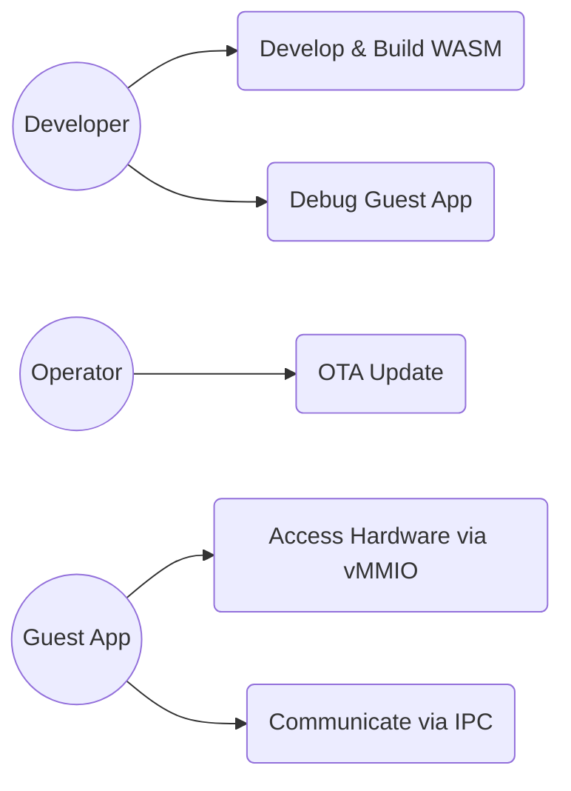

# Fireball システム要求仕様書

## 1. 概要
Fireballは、リソース制限の厳しい小規模組み込みデバイス（Cortex-M33等）向けに設計された、wasm32ゲストを仮想化するハイパーバイザである。WAMR（WebAssembly Micro Runtime）をベンチマーク対象とし、特にインタープリタとの比較での実行速度とフットプリントにおいてWAMRを上回ることを目標とする。

## 2. ユースケース

### 2.1 ユースケース図

### 2.2 主要シナリオ

| ステップ | アクション | 期待される応答 |
| :--- | :--- | :--- |
| 1 | 開発者がWASMバイナリをロードする | システムがバイナリを検証し、実行準備を完了する |
| 2 | システムがゲストアプリを開始する | 協調型マルチタスク下でゲストアプリが実行される |
| 3 | ゲストアプリがシステムコールを発行する | IPCルータを経由して適切なサービスにルーティングされる |
| 4 | 外部からOTA更新が要求される | ゲストアプリが安全に停止し、新しいバイナリに更新される |

## 3. 命題リスト

### 3.1 機能要求

#### 3.1.1 WASM実行 (vSoC)
| キーワード | 内容 | 優先度 | 検証方法 |
| :--- | :--- | :--- | :--- |
| `{JIT_CopyAndPatch}` | 命令テンプレートを連結しパッチを当てる方式を採用する。 | 高 | レビュー |
| `{JIT_MultiBuffer_Cache}` | Active/Warm/Oldest 等のマルチバッファ（デフォルト 3面: 2KB x 3）による循環キャッシュ管理を行い、キャッシュ置換の局所性を高める。 | 高 | テスト |
| `{PositionIndependentCode}` | 出力バイナリはPIC（位置独立コード）とする。 | 高 | テスト |
| `{NativeAPI_Export}` | 最小限のトラップ命令とvMMIOによるホストサービス提供をサポートする。 | 高 | テスト |
| `{JIT_Encoder}` | C++の constexpr 機能を活用し、ビルド時に命令テンプレートを生成する。 | 高 | レビュー |
| `{MultiModule_Support}` | 複数WASMモジュールのロードと、モジュール間の動的リンクをサポートする。 | 中 | テスト |
| `{ThreadedInterpreter}` | `__fastcall` 継続渡し（CPS）による主要変数のレジスタ保持、テーブルディスパッチによる高速な命令実行、およびJITコードとの完全な呼び出し規約整合を実現する。 | 高 | テスト |
| `{JIT_LazyChaining}` | JITコードの末尾をデフォルトでインタープリタへ戻るようにし、実行時検索のオーバーヘッドを削減する。 | 高 | レビュー |
| `{Interpreter_LazyJITSwitch}` | インタープリタのループ戻り時にJITキャッシュを再判定し、動的なネイティブ移行を実現する。 | 高 | レビュー |
| `{vMMIO_TrapAndEmulate}` | ゲストからのメモリアクセスをトラップし、ホスト側のフックを呼び出す。 | 高 | テスト |
| `{VDMA}` | 仮想DMAにより、ゲストリニアメモリと仮想・物理アドレス間の高速転送を実現する。 | 中 | テスト |
| `{JIT_ReverseCompilationOrder}` | キューを逆順（LIFO）で処理し、コンパイル直後の即時チェイニング率を向上させる。 | 高 | レビュー |
| `{DynamicMmap}` | 共有メモリIDを指定し、外部バッファをvMMIO空間に一時的にマッピングする。 | 高 | テスト |
| `{EnvironmentPointer}` | 周辺コンポーネントへの参照を環境ポインタ (`vsoc_runtime*`) 経由で型安全に行う。 | 高 | レビュー |
| `{ROMParsing}` | WASMモジュールをRAMに展開せず、ROM上のデータを直接解析・実行する (Zero Copy Loading)。 | 高 | テスト |
| `{MemoryBoundaryCheck}` | メモリアクセス時の境界チェックを強制し、隔離性を保証する。 | 高 | テスト |
| `{WasmPageAlignment}` | メモリ割り当てをWASMページ単位（64KB）で行い、アドレス変換を効率化する。 | 中 | レビュー |
| `{UnifiedAccessModel}` | 物理、論理、共有メモリの全アクセスをvMMIO層に一本化し、セキュリティを一律化する。 | 高 | レビュー |
| `{Wasm32Only}` | MVP命令セットのみをサポートし、浮動小数点演算をオプション化してリソースを削減する。 | 高 | テスト |
| `{FastAddressCheck}` | ゲストアドレスの境界チェックをビット演算（マスク）で高速化する。 | 中 | レビュー |
| `{vMMIO_Isolation}` | vMMIO空間へのアクセスのみをデバイスI/Oとして許可し、メモリ安全性を確保する。 | 高 | テスト |
| `{JIT_RuntimeAPI_Fallback}` | 複雑な命令をランタイムAPI呼び出しにフォールバックさせ、JITエンジンの複雑さを抑える。 | 高 | レビュー |
| `{InterpreterContextStackless}` | Cスループを使わないスタックレスなインタープリタ実行。 | 高 | レビュー |
| `{SinglePassCompilation}` | 中間表現を介さず、1パスでバイナリを生成する。 | 高 | レビュー |
| `{JIT_OldestOnly_Promote}` | 最も古いエントリのみを上位バッファへ昇格させるキャッシュ追い出しポリシー。 | 高 | レビュー |

#### 3.1.2 タスク管理・通信 (COOS)
| キーワード | 内容 | 優先度 | 検証方法 |
| :--- | :--- | :--- | :--- |
| `{CooperativeMultitasking}` | コルーチンを用いた協調型OSを独自設計する。 | 高 | テスト |
| `{GLOBAL_UseCpp23Library}` | C++23 std::flat_map 等の標準コンテナを活用し、メモリ効率と検索速度を両立する。 | 高 | レビュー |
| `{GLOBAL_UseCpp20Coroutine}` | C++20/23 コルーチンを活用し、標準的な言語機能によるコンテキストスイッチを実現する。 | 高 | レビュー |
| `{LowOverheadSwitch}` | コンテキスト切り替え時のレジスタ退避・復帰を最小化し、数サイクルでのタスク遷移を目指す。 | 高 | 計測 |
| `{COOS_Deterministic}` | コンテキストスイッチを明示的なポイントに限定し、確定的な実行を確保する。 | 高 | テスト |
| `{CSPCommunication}` | ホーアCSPに基づき、所有権移譲によるゼロコピーメッセージパッシングを行う。 | 高 | テスト |
| `{IPC_ZeroCopy}` | 通信時のデータコピーを排除する。 | 高 | テスト |
| `{GLOBAL_InterruptWakeup}` | 割り込み発生時、関連タスクの割り込みハンドラをウェイクアップする。 | 高 | テスト |
| `{CSP_Handoff}` | 送受信時に相手が待機状態であれば、相手タスクをReady状態に遷移させ、スケジューラを介して迅速にコンテキストをスイッチする。 | 高 | テスト |
| `{GLOBAL_PeriodicTask}` | システムティックまたはアイドルループを利用した定期実行タスクをサポートする。 | 中 | テスト |
| `{GLOBAL_IdleDetection}` | システムのアイドル状態を検知し、バックグラウンド処理（GC/ログ出力）を実行する. | 中 | テスト |
| `{DirectContextSwitch}` | コルーチンとスケジューラのReady管理下を経由する、超低レイテンシなタスク切り替え。 | 高 | ベンチマーク |
| `{TaskPollInterruptFlag}` | タスクがポーリングにより割り込みフラグをチェックする安全な通知モデル。 | 高 | レビュー |

#### 3.1.3 システム連携 (IPC/HAL/WIT)
| キーワード | 内容 | 優先度 | 検証方法 |
| :--- | :--- | :--- | :--- |
| `{IPCRouter}` | 全てのシステムコールはIPCルータを経由して行われる。 | 高 | テスト |
| `{IPC_HandleBased}` | URIによる名前解決は初回のみとし、以降はハンドルで直接通信する。 | 高 | テスト |
| `{URIAbstraction}` | コンポーネント間の依存関係を「スキーマ://ドメイン/サービス/ID」形式のURIで疎結合に記述する。 | 高 | レビュー |
| `{IPCDI}` | IPCを介したサービス呼び出し時に、URIベースで依存性を解決し注入する。 | 高 | レビュー |
| `{RoleBasedAccessControl}` | URIとロールマトリックスに基づく静的なアクセス制御を実施する。 | 高 | テスト |
| `{OwnershipTransfer}` | メッセージパッシング時にデータの所有権を論理的に移動し、不必要なコピーを避ける。 | 高 | テスト |
| `{DictionaryBasedIPC}` | 文字列キーを静的辞書のオフセットに変換し、IPC転送量を削減する。 | 高 | テスト |
| `{LowLatencyLookup}` | ソート済み配列と二分探索により、サービス検索の計算量を O(log N) に抑える。 | 高 | ベンチマーク |
| `{Fast_Path_GPIO}` | 遅延に敏感なI/O操作（GPIO等）のために、抽象化層をバイパスする高速パスを提供する。 | 高 | 計測 |
| `{Asynchronous_Notification}` | WASIのポーリングリソース (`pollable`) を介してホストからの非同期イベントを通知する。 | 中 | テスト |
| `{IPCRegistry}` | URIベースのサービス情報を保持する std::flat_map ベースの静的テーブル。 | 高 | レビュー |
| `{ServiceFacade}` | 低レイヤーのIPC通信を隠蔽し、型安全なメソッドとして提供する薄いラッパー。 | 高 | レビュー |
| `{WIT_Interface_Spec}` | WebAssembly Interface Types (WIT) を用いた、言語非依存のインターフェース定義手法。 | 高 | レビュー |
| `{WIT_Common_Types}` | 複数のWIT定義間で共有される基本型定義。 | 高 | レビュー |
| `{WIT_Interface_Purpose}` | インターフェース設計の背景と論理的な不変条件の記述。 | 高 | レビュー |
| `{Trap_Interface}` | 高速パスのためのトラップ命令ベースの同期通信インターフェース。 | 高 | テスト |
| `{Syscall_Mapping}` | WASMゲストの命令とホスト側のシステムコールIDの静的な紐付け。 | 高 | レビュー |
| `{HAL_Interface}` | 物理デバイス操作を抽象化し、IPC経由で提供する標準インターフェース。 | 高 | レビュー |
| `{HAL_Interface}` | 物理デバイス操作を抽象化し、IPC経由で提供する標準インターフェース。 | 高 | レビュー |
| `{Syscall_Return_Value}` | システムコールの戻り値型とエラー伝播の標準。 | 高 | レビュー |
| `{Errorcode_To_Strategy}` | errno 等を具体的なリカバリ戦略へ変換する仕組み。 | 高 | レビュー |
| `{WASI_Implementation}` | WASI標準APIのFireball上での実装。 | 高 | テスト |
| `{TypeSafeMessaging}` | std::flat_map を用いた、IPCメッセージの型安全かつ検索効率の高い構造定義。 | 高 | レビュー |
| `{PhysicalPassthrough}` | メモリコピーを介さず、物理リソースへ直接アクセスする高速パス。 | 高 | 計測 |

#### 3.1.4 デバッグ・運用
| キーワード | 内容 | 優先度 | 検証方法 |
| :--- | :--- | :--- | :--- |
| `{COOS_Transparent}` | スケジューラは各タスクの待ち状態を可視化可能とする。 | 中 | デモ |
| `{Debug_Integrated}` | プロファイラ、動的テストツールの機能を内蔵する。 | 中 | デモ |
| `{Debug_Standard_Env}` | VSCode, UART, J-Linkを標準のデバッグ環境としてサポートする。 | 高 | デモ |
| `{RSPMinimalSet}` | VSCodeデバッグに必要な最小限のGDB RSPコマンドセットのみを実装する。 | 高 | デモ |
| `{BufferedLogging}` | ログ出力をリングバッファに一時保存し、アイドル時にまとめて物理ポートへ転送する。 | 中 | テスト |
| `{RSP_Transport_Selectable}` | RSPパケットのトランスポート層（UART/RTT等）を選択可能とする。 | 高 | テスト |
| `{DebuggerLabelTableSwitch}` | デバッグ時にインタプリタのハンドラテーブルをデバッグ用に切り替える。 | 高 | レビュー |

#### 3.1.5 共通基盤・実装パターン
| キーワード | 内容 | 優先度 | 検証方法 |
| :--- | :--- | :--- | :--- |
| `{HistoryBuffer}` | JITホットスポット検出のために、実行履歴を保持するリング状のバッファ。 | 中 | レビュー |
| `{LightweightVerifier}` | ロード時に最小限のチェック（マジック値、バージョン等）のみを行う高速検証器。 | 中 | テスト |
| `{COOS_Scheduling_Refine}` | スケジューリングアルゴリズムの継続的な改善と最適化。 | 中 | レビュー |
| `{vMMIO_TLB}` | ソフトウェアTLBによるvMMIOアクセスの高速化。 | 中 | レビュー |
| `{ZeroCopyIndexing}` | LoaderによるWASMセクションのゼロコピー索引化。 | 高 | テスト |
| `{IPC_DropHandler}` | In-flightリソース回収用のDropハンドラ。 | 高 | テスト |
| `{JIT_Safepoint}` | JITコード内の非同期割込チェックポイント。 | 中 | レビュー |
| `{Debugger_Jit_Flush}` | 介入時のJITキャッシュフラッシュ。 | 高 | レビュー |
| `{WASI_Async_Bridge}` | 同期WASIと非同期IPCの連携ブリッジ。 | 高 | テスト |
| `{ConceptHarnessDI}` | C++20/23 Conceptsを用いた静的依存性注入。 | 高 | レビュー |

### 3.2 非機能要求

#### 3.2.1 パフォーマンス・効率
| キーワード | 内容 | 優先度 | 検証方法 |
| :--- | :--- | :--- | :--- |
| `{LowLatencyJIT}` | コンパイルレイテンシの最小化を最優先する。 | 高 | 計測 |
| `{JIT_ZeroCompileCostTheorem}` | 最適化不要なほど高速なコンパイルを実現する。 | 中 | ベンチマーク |
| `{SimpleJITArchitecture}` | 小規模なJITキャッシュ領域で効率的に運用する。 | 高 | 計測 |
| `{JIT_RegisterMapping}` | 重要変数を物理レジスタに固定する。 | 高 | レビュー |
| `{ContextPointerRegister}` | コンテキストポインタを物理レジスタに保持する。 | 高 | レビュー |
| `{Resource_Estimation_Model}` | 設計段階でROM/RAMフットプリントを概算し、制約適合性を検証する。 | 高 | 概算レポート |
| `{ConsolidatedHeap}` | 【全体管理】物理メモリ全体から各パーティションを切り出す際、単一の物理プール（統合物理プール）として一括管理し、メモリ効率を最大化する。 | 高 | 計測 |
| `{GLOBAL_StrictMemoryLimit}` | 厳格なメモリ割り当て制限（例：20KB/64KB）を適用する。 | 高 | テスト |
| `{GLOBAL_IndependentHeap}` | 【タスク隔離】ゲストタスクの実行環境において、各セキュリティドメインに物理的・論理的に独立したメモリ領域（ゲストRAM）を割り当て、障害を隔離する。 | 高 | テスト |
| `{GLOBAL_Policy_Memory}` | 【実行時コード】カーネルおよびランタイムコードの実行時において、動的なヒープ（malloc/new）の使用を原則禁止し、静的またはスタック割り当て（Placement new等によるプール再利用）を優先する組み込みポリシー。 | 高 | プロセス監査 |
| `{MemoryIsolation}` | ハードウェアまたは論理的な境界により、メモリ空間の安全な隔離を実現する。 | 高 | テスト |
| `{ZeroRuntimeOverhead}` | 抽象化のコストを実行時に支払わない（ゼロコスト抽象化）。 | 高 | ベンチマーク |
| `{LowOverhead}` | 最小限のリソース消費と低遅延なシステム実行。 | 高 | 計測 |
| `{FaultTolerant}` | タスク障害の局所化とフォールトトレラント設計。 | 高 | レビュー |
| `{ServiceSelfReboot}` | 異常終了したサービスの自律的な再起動と復旧機構。 | 高 | テスト |
| `{SelfReboot_via_Event}` | イベント通知を契機としたサービス自己再起動。 | 高 | レビュー |
| `{IPC_Resource_Isolation}` | IPC通信におけるリソースの完全分離と保護。 | 高 | テスト |

#### 3.2.2 開発方針・品質
| キーワード | 内容 | 優先度 | 検証方法 |
| :--- | :--- | :--- | :--- |
| `{Size_15KLOC}` | システム全域のソースコードを15KLOC以内に収める。 | 中 | 計測 |
| `{EliminateDataRace}` | メッセージパッシングによりデータ競合を原理的に排除する。 | 高 | レビュー |
| `{CleanArchitecture}` | クリーンアーキテクチャの原則に基づき、依存方向を内部へ制限する。 | 高 | レビュー |
| `{IoC}` | Dependency Inversion Principleに基づき、制御の反転を実現する。 | 高 | レビュー |
| `{GLOBAL_ComponentHarness}` | コンポーネントの依存関係をハーネス構造体に集約し、テスト時の注入を容易にする。 | 高 | レビュー |
| `{GLOBAL_StaticScalability}` | リソース上限をコンパイル時定数で決定し、動的拡張のオーバーヘッドを排除する。 | 高 | レビュー |
| `{WIT_First}` | WebAssembly Interface Types (WIT) はシステムインターフェースの唯一の真実在であり、設計は常にここから開始する。 | 高 | レビュー |
| `{Type_Vocabulary}` | 仕様と実装を正確に紐付けるための厳格な型エイリアス定義と語彙セット。 | 高 | レビュー |

##### [Template & Meta]
| キーワード | 内容 | 備考 |
| :--- | :--- | :--- |
| `{Decision_Key}` | ADR（アーキテクチャ判定記録）のテンプレート用識別子。 | Template |
| `{Strategy_Key}` | コンポーネント設計（方策）のテンプレート用識別子。 | Template |
| `{Requirement_Key}` | 要求仕様のテンプレート用識別子。 | Template |
| `{req_id}` | パターンドキュメント等で要求IDを示すためのメタ変数。 | Meta |
| `{concept}` | パターンドキュメント等で概念名を示すためのメタ変数。 | Meta |

#### 3.2.3 移植性・互換性
| キーワード | 内容 | 優先度 | 検証方法 |
| :--- | :--- | :--- | :--- |
| `{NotRTOS}` | リアルタイム性よりもメモリ効率と移植性を最優先する。 | 中 | レビュー |

## 4. 設計課題・制約追跡 (Design Challenges & ADRs)

| キーワード | 内容 | ステータス |
| :--- | :--- | :--- |
| `{Challenge_ApproximateYield}` | トレース数ベースの概算Yieldの精度とスターベーション対策。 | 検討中 |
| `{Challenge_InterruptSafety}` | 割り込みハンドラとタスク間の競合回避と安全なウェイクアップ。 | 検討中 |
| `{Challenge_JITCacheEfficiency}` | 小規模メモリ環境におけるJITキャッシュの代謝とヒット率の最適化。 | 検討中 |
| `{Challenge_WasiFdWriteLoop}` | WASI `fd_write` の実装レイヤー分離とバッファ管理。 | 検討中 |
| `{Challenge_SyscallMemorySafety}` | ゲストメモリアクセス時のセキュリティゲート（vMMIO許可テーブル）の有効性。 | 検討中 |
| `{Challenge_CoosBlockedList}` | `BLOCKED` タスクリストの管理コストとリアルタイム性のトレードオフ。 | 検討中 |
| `{Challenge_CspHandoffStarvation}` | CSP Handoff による特定のタスクセットのスターベーションリスク。 | 検討中 |
| `{Challenge_DebuggerResource}` | 極小メモリ環境でのデバッグ用バッファ確保とJIT併用の制約。 | 検討中 |
| `{ADR_ScalableCodeOffset}` | 32/64ビット境界を越えるJITコードオフセットの表現形式決定。 | 決定済 |
| `{ADR_SafeQueuingOnHotMiss}` | ホットスポット検出時の二重コンパイル要求防止策。 | 決定済 |

## 5. 制約事項

- **メモリ制約**:
    - 最小構成: Cortex-M33 / RAM 32KB / ROM 96KB
    - 想定構成: Cortex-M33 / RAM 64KB / ROM 128KB
    - ※ 評価は最小構成（32KB/96KB）をターゲットとする。
- **パフォーマンス制約**: AOTを使用しない条件下で、WAMRインタープリタを上回る実行速度。
- **互換性**: WASM MVP準拠（浮動小数点除外）。
- **開発環境**: clang (C99, C++23, libstdc++)。
- **依存性**: 標準C/C++ライブラリ以外の外部ライブラリは用いない。
- **コード規模**: 15KLOC以内。

## 6. 用語定義

- **COOS**: Coroutine-based Operating System. 本プロジェクト独自の協調型OS。
- **vSoC**: Virtual System on Chip. WASMランタイム and 仮想周辺機器を含む実行環境。
- **CSP**: Communicating Sequential Processes. プロセス間通信のモデル。
- **Copy-and-Patch**: 高速なJITコンパイル手法の一種。
- **ゲストリニアメモリ**: WASMリニアメモリ領域。
