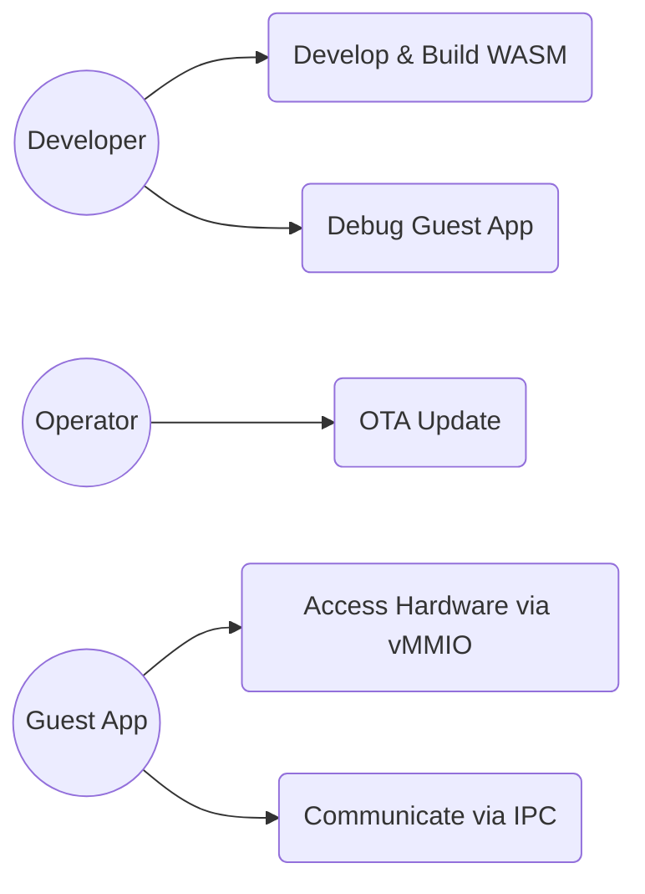

# Fireball システム要求仕様書

## 1. 概要
Fireballは、wasm32ゲストを仮想化する組み込みハイパーバイザである。要求上の評価用RAM/ROMプロファイルは制約事項に定める。ARMv8-Mの具体的な実装方式、物理配置、メモリ保護方式、ABIはTBDとし、x64環境で確認した実行契約を外挿しない。WAMR（WebAssembly Micro Runtime）をベンチマーク対象とし、特にインタープリタとの比較での実行速度とフットプリントにおいてWAMRを上回ることを目標とする。

## 2. ユースケース

### 2.1 ユースケース図

```mermaid
graph LR
    Developer((Developer))
    Operator((Operator))
    GuestApp((Guest App))

    Developer --> UC1(Develop & Build WASM)
    Developer --> UC2(Debug Guest App)
    Operator --> UC3(OTA Update)
    GuestApp --> UC4(Access Hardware via vMMIO)
    GuestApp --> UC5(Communicate via IPC)
```

### 2.2 主要シナリオ

| ステップ | アクション | 期待される応答 |
| :--- | :--- | :--- |
| 1 | 開発者がWASMバイナリをロードする | システムがバイナリを検証し、実行準備を完了する |
| 2 | システムがゲストアプリを開始する | 協調型マルチタスク下でゲストアプリが実行される |
| 3 | ゲストアプリがシステムコールを発行する | IPCルータを経由して適切なサービスにルーティングされる |
| 4 | 外部からOTA更新が要求される | ゲストアプリが安全に停止し、新しいバイナリに更新される |

## 3. 命題リスト

### 3.1 機能要求

#### 3.1.1 WASM実行 (vSoC)

| キーワード | 内容 | 優先度 | 検証方法 |
| :--- | :--- | :--- | :--- |
| `{JIT_CopyAndPatch}` | 命令テンプレートを連結しパッチを当てる方式を採用する。 | 高 | レビュー <!-- definition: {JIT_CopyAndPatch} --> |
| `{JIT_MultiBuffer_Cache}` | 連続8KB（4KBページ×2）のJITコード領域を、共通コード2KB（非エビクション）とActive/Warm/Oldest各2KBの3面循環キャッシュへ固定分割し、キャッシュ置換の局所性を高める。JITエントリ検索は少数疎キー用のXORキャッシュとソート配列二分探索を使い、JIT用Radix表は持たない。 | 高 | テスト <!-- definition: {JIT_MultiBuffer_Cache} --> |
| `{PositionIndependentCode}` | 出力バイナリはPIC（位置独立コード）とする。 | 高 | テスト <!-- definition: {PositionIndependentCode} --> |
| `{WasmCodeSectionPC}` | WASM PCは各モジュールのCode section payload先頭を0とし、payload内にある命令先頭バイトのオフセットで表す。PC単独はモジュールを越えて一意ではなく、モジュール横断の識別には`(module_id, pc)`を使う。 | 高 | テスト <!-- definition: {WasmCodeSectionPC} --> |
| `{NativeAPI_Export}` | 最小限のトラップ命令とvMMIOによるホストサービス提供をサポートする。 | 高 | テスト <!-- definition: {NativeAPI_Export} --> |
| `{JIT_Encoder}` | C++の constexpr 機能を活用し、ビルド時に命令テンプレートを生成する。 | 高 | レビュー <!-- definition: {JIT_Encoder} --> |
| `{MultiModule_Support}` | 複数WASMモジュールのロードと、モジュール間の動的リンクをサポートする。 | 中 | テスト <!-- definition: {MultiModule_Support} --> |
| `{ThreadedInterpreter}` | 命令意味論を処理するRuntime APIと、そのAPIを実行して末尾継続するCPS命令ハンドラを分離する。主要変数のレジスタ保持、関数ポインタ表によるディスパッチ、JITコードとの呼び出し規約整合を実現する。 | 高 | テスト <!-- definition: {ThreadedInterpreter} --> |
| `{JIT_LazyChaining}` | 常駐traceの直線後続へ進む際、共通コード領域のchain dispatcherがTraceヘッダのtarget bodyへtail-jumpする。opcode別の条件評価・C++ Interpreter handler実行はchainに含めない。 | 高 | レビュー <!-- definition: {JIT_LazyChaining} --> |
| `{Interpreter_LazyJITSwitch}` | 制御命令はC++ Interpreterの命令別handlerで処理する。C++ dispatcherは共有後方分岐しきい値へ達するまで、常駐JIT traceまたはC++ handlerを続けて実行する。しきい値到達時にyield statusを返す。接続中のJIT候補観測・cache更新・コンパイルはTier 3 JIT拡張が行い、Tier 2 Runtimeは拡張の境界結果をvSoCへ伝える。分岐handlerからvSoCへは復帰しない。 | 高 | レビュー <!-- definition: {Interpreter_LazyJITSwitch} --> |
| `{vMMIO_TrapAndEmulate}` | ゲストからのメモリアクセスをトラップし、ホスト側のフックを呼び出す。 | 高 | テスト <!-- definition: {vMMIO_TrapAndEmulate} --> |
| `{VDMA}` | host call によるゲストリニアメモリと仮想・物理アドレス間の転送に加え、WASM `memory.copy` ではvMMIO管理下のDYNAMIC・SHM・PASSTHROUGHアドレスを含むコピーを内部転送経路で扱う。リニアメモリ端点同士はCPUでコピーする。vMMIOアドレスは既存の権限・所有権検査を通し、VDMAの制御要求はvMMIOレジスタを経由しない。 | 中 | テスト <!-- definition: {VDMA} --> |
| `{JIT_ReverseCompilationOrder}` | キューを逆順（LIFO）で処理し、コンパイル直後の即時チェイニング率を向上させる。 | 高 | レビュー <!-- definition: {JIT_ReverseCompilationOrder} --> |
| `{DynamicMmap}` | 共有メモリIDを指定し、外部バッファをvMMIO空間に一時的にマッピングする。 | 高 | テスト <!-- definition: {DynamicMmap} --> |
| `{EnvironmentPointer}` | 周辺コンポーネント・リニアメモリへの参照を `execution_context` 内の環境フィールド（`vsoc_runtime` 領域）経由で型安全に行う。 | 高 | レビュー <!-- definition: {EnvironmentPointer} --> |
| `{ROMParsing}` | WASMモジュールをRAMに展開せず、ROM上のデータを直接解析・実行する (Zero Copy Loading)。 | 高 | テスト <!-- definition: {ROMParsing} --> |
| `{MemoryBoundaryCheck}` | メモリアクセス時の境界チェックを強制し、隔離性を保証する。 | 高 | テスト <!-- definition: {MemoryBoundaryCheck} --> |
| `{WasmPageAlignment}` | メモリ割り当てをWASMページ単位（64KB）で行い、アドレス変換を効率化する。 | 中 | レビュー <!-- definition: {WasmPageAlignment} --> |
| `{UnifiedAccessModel}` | 物理・共有メモリへの全アクセスをvMMIO層（PTEマッピング・unmap機構）に一本化してセキュリティを標準化する。未認可領域は unmap によりアクセス不可とし、ゲスト専用RAM（論理メモリ）はレイテンシ最優先のため`FastAddressCheck`による独立した高速境界チェック経路とし、vMMIO層の対象外とする。 | 高 | レビュー <!-- definition: {UnifiedAccessModel} --> |
| `{Wasm32Only}` | wasm32の単一リニアメモリを対象とし、WASM Core 1.0 MVPを基礎に明示選択した`0xFC`命令だけを追加する。Wasm64やマルチスレッド等は除外する。 | 高 | テスト <!-- definition: {Wasm32Only} --> |
| `{WasmFCSubset}` | `0xFC`の飽和型浮動小数点→整数変換8命令と、単一メモリ向け`memory.copy`/`memory.fill`だけをサポートする。変換はNaN・無限大・範囲外値をWASM規則で飽和させ、メモリ操作は全範囲を事前検証する。`memory.copy`はゲストリニアアドレスとvMMIO管理下のDYNAMIC・SHM・PASSTHROUGHアドレスを扱う。vMMIO側は内部vDMA経路で転送し、完了とCPU可視性を確認してから次命令へ進む。内部の同期・非同期は転送対象と操作に応じる。コピーの観測結果はWASMのmemmove意味論を保つ。 | 高 | テスト <!-- definition: {WasmFCSubset} --> |
| `{FastAddressCheck}` | ゲストアドレスの境界チェックをサイズ比較の単一命令で高速化し、境界外は即座にトラップする（黙ったラップアラウンドは不可）。 | 中 | レビュー <!-- definition: {FastAddressCheck} --> |
| `{vMMIO_Isolation}` | vMMIO空間へのアクセスのみをデバイスI/Oとして許可し、メモリ安全性を確保する。 | 高 | テスト <!-- definition: {vMMIO_Isolation} --> |
| `{JIT_RuntimeAPI_Fallback}` | 複雑な命令をランタイムAPI呼び出しにフォールバックさせ、JITエンジンの複雑さを抑える。 | 高 | レビュー <!-- definition: {JIT_RuntimeAPI_Fallback} --> |
| `{OneRuntimeOneGuest}` | 1つのWASMランタイムは厳密に1つのゲストモジュールのみを担当し、マルチインスタンス実行は共有VM内のスレッドではなく独立した別ランタイムの並行起動とIPC協調によって完全なメモリ・障害隔離を実現する。 | 高 | レビュー <!-- definition: {OneRuntimeOneGuest} --> |
| `{Runtime_BumpAllocator}` | 各ランタイムが専用の固定長バンプアロケータ（`bump_allocator`）を所有し、ロードした全モジュールのシステムコンテナストレージ確保を一括管理する。メモリはランタイム破棄時に個別モジュールの破棄なしで $O(1)$ 解放する。 | 高 | テスト <!-- definition: {Runtime_BumpAllocator} --> |
| `{System_Allocator}` | カーネル・仮想化基盤（COOS, vMMIO, IPC Router等）が常駐・運用するシステムコンテナの内部ストレージを dlmalloc（`mspace`）により動的アロケートし、個別解放・自動合体によるメモリ再利用を可能にする。 | 高 | レビュー <!-- definition: {System_Allocator} --> |
| `{Shm_Allocator}` | IPC共有メモリプールから、タスクが要求する可変長（`size`）の `shared_block` バッファを切り出し、独立した4KB仮想予約スロット単位の権限分離を維持しつつ、要求サイズ分の物理バック領域をRAII解放時に再利用する。 | 高 | テスト <!-- definition: {Shm_Allocator} --> |
| `InterpreterContextStackless` | Cスタックを使わないスタックレスなインタープリタ実行。 | 高 | レビュー |
| `{SinglePassCompilation}` | 中間表現を介さず、1パスでバイナリを生成する。 | 高 | レビュー <!-- definition: {SinglePassCompilation} --> |
| `{JIT_OldestOnly_Promote}` | 3面循環コードキャッシュにおいて Oldest バンクでヒットしたコードのみを Active バンクへ昇格させるキャッシュ追い出し・代謝ポリシー（Oldest 限定昇格）。 | 高 | レビュー <!-- definition: {JIT_OldestOnly_Promote} --> |

#### 3.1.2 タスク管理・通信 (COOS)

| キーワード | 内容 | 優先度 | 検証方法 |
| :--- | :--- | :--- | :--- |
| `{CooperativeMultitasking}` | コルーチンを用いた協調型OSを独自設計する。 | 高 | テスト <!-- definition: {CooperativeMultitasking} --> |
| `{GLOBAL_UseCpp23Library}` | C++23 の型・アルゴリズム語彙（`std::span`、二分探索等）を活用し、本プロジェクトの静的コンテナ語彙（`fireball::flat_map_view` 等、`system_containers.md` を正本とする）によってメモリ効率と検索速度を両立する。下位コンテナに `std::vector` を要求する `std::flat_map` はそのままでは `{META_NoStdVector}` に抵触するため採用しない。 | 高 | レビュー |
| `{GLOBAL_UseCpp20Coroutine}` | C++20/23 コルーチンを活用し、標準的な言語機能によるコンテキストスイッチを実現する。 | 高 | レビュー |
| `{LowOverheadSwitch}` | コンテキスト切り替え時のレジスタ退避・復帰を最小化し、数サイクルでのタスク遷移を目指す。 | 高 | 計測 <!-- definition: {LowOverheadSwitch} --> |
| `{COOS_Deterministic}` | コンテキストスイッチを明示的なポイントに限定し、確定的な実行を確保する。 | 高 | テスト <!-- definition: {COOS_Deterministic} --> |
| `CSPCommunication` | ホーアCSPに基づき、所有権移譲によるゼロコピーメッセージパッシングを行う。 | 高 | テスト |
| `{IPC_ZeroCopy}` | 通信時のデータコピーを排除する。 | 高 | テスト <!-- definition: {IPC_ZeroCopy} --> |
| `{GLOBAL_InterruptWakeup}` | 割り込み発生時、固定5ワードの原因付きイベントを有界FIFOへ記録し、協調境界で関連タスクをウェイクアップする。ゲスト配送の階層ディスパッチはvSoCへ委譲する。 | 高 | テスト |
| `{CSP_Handoff}` | 送受信時に相手が待機状態であれば、相手タスクを READY へ遷移させ、スケジューラの READY キュー処理を**経由せずに**対称遷移で実行権を直接移譲する。連続移譲は `FB_CONF_MAX_CONSECUTIVE_HANDOFFS` で有界化し、上限到達時のみスケジューラへ復帰する。 | 高 | テスト <!-- definition: {CSP_Handoff} --> |
| `{GLOBAL_PeriodicTask}` | システムティックまたはアイドルループを利用した定期実行タスクをサポートする。 | 中 | テスト |
| `{GLOBAL_IdleDetection}` | システムのアイドル状態を検知し、バックグラウンド処理（GC/ログ出力）を実行する. | 中 | テスト |
| `{DirectContextSwitch}` | コルーチンの対称遷移により、スケジューラの READY キュー処理を**経由せずに**相手タスクのコルーチンハンドルへ直接ジャンプする超低レイテンシなタスク切り替え。 | 高 | ベンチマーク <!-- definition: {DirectContextSwitch} --> |
| `{TaskPollInterruptEvent}` | ISRがタスク状態を直接書き換えない安全な通知モデル。ISRは固定長FIFOへ原因付きイベントを投函するのみとし、COOSの状態遷移は協調境界で行う。ゲストの階層配送はvSoCがCOOS協調境界でのみ実行する。JIT LOOP後方分岐の有限回数yieldはその境界への復帰を保証し、ネイティブLOOP handler自身はイベントを読み取らない。 | 高 | レビュー <!-- definition: {TaskPollInterruptEvent} --> |

#### 3.1.3 システム連携 (IPC/HAL/WIT)

| キーワード | 内容 | 優先度 | 検証方法 |
| :--- | :--- | :--- | :--- |
| `{IPCRouter}` | 全てのシステムコールはIPCルータを経由して行われる。 | 高 | テスト <!-- definition: {IPCRouter} --> |
| `{IPC_HandleBased}` | URIによる名前解決は初回のみとし、以降はハンドルで直接通信する。 | 高 | テスト <!-- definition: {IPC_HandleBased} --> |
| `{URIAbstraction}` | コンポーネント間の依存関係を「スキーマ://ドメイン/サービス/ID」形式のURIで疎結合に記述する。 | 高 | レビュー <!-- definition: {URIAbstraction} --> |
| `{IPCDI}` | IPCを介したサービス呼び出し時に、URIベースで依存性を解決し注入する。 | 高 | レビュー <!-- definition: {IPCDI} --> |
| `{RoleBasedAccessControl}` | URIとロールマトリックスに基づく静的なアクセス制御を実施する。 | 高 | テスト <!-- definition: {RoleBasedAccessControl} --> |
| `{OwnershipTransfer}` | メッセージパッシング時にデータの所有権を論理的に移動し、不必要なコピーを避ける。 | 高 | テスト <!-- definition: {OwnershipTransfer} --> |
| `{DictionaryBasedIPC}` | 文字列キーを静的辞書のオフセットに変換し、IPC転送量を削減する。 | 高 | テスト <!-- definition: {DictionaryBasedIPC} --> |
| `{LowLatencyLookup}` | ソート済み配列と二分探索により、サービス検索の計算量を O(log N) に抑える。 | 高 | ベンチマーク <!-- definition: {LowLatencyLookup} --> |
| `{Fast_Path_GPIO}` | 遅延に敏感なI/O操作（GPIO等）のために、抽象化層をバイパスする高速パスを提供する。 | 高 | 計測 <!-- definition: {Fast_Path_GPIO} --> |
| `{Asynchronous_Notification}` | ホストからの非同期イベントをゲストへ通知する。WASI操作の完了待ちは専用の `pollable` 型ではなく、ハンドルへの `POLL_CHECK` / `POLL_WAIT` で行う。仮想割り込みはCOOS協調境界を通じて配送する。 | 中 | テスト <!-- definition: {Asynchronous_Notification} --> |
| `{IPCRegistry}` | URIベースのサービス情報を保持する `fireball::flat_map_view` ベースの静的テーブル。 | 高 | レビュー <!-- definition: {IPCRegistry} --> |
| `{ServiceFacade}` | 低レイヤーのIPC通信を隠蔽し、型安全なメソッドとして提供する薄いラッパー。 | 高 | レビュー <!-- definition: {ServiceFacade} --> |
| `{WIT_Interface_Spec}` | WebAssembly Interface Types (WIT) を用いた、言語非依存のインターフェース定義手法。 | 高 | レビュー <!-- definition: {WIT_Interface_Spec} --> |
| `{WIT_Common_Types}` | 複数のWIT定義間で共有される基本型定義。 | 高 | レビュー <!-- definition: {WIT_Common_Types} --> |
| `{WIT_Interface_Purpose}` | インターフェース設計の背景と論理的な不変条件の記述。 | 高 | レビュー <!-- definition: {WIT_Interface_Purpose} --> |
| `{Trap_Interface}` | 高速パスのための同期 host-call import インターフェース。CPUトラップ命令は実装詳細であり、vMMIOレジスタ経路を意味しない。 | 高 | テスト <!-- definition: {Trap_Interface} --> |
| `{Syscall_Mapping}` | WASMゲストの命令とホスト側のシステムコールIDの静的な紐付け。 | 高 | レビュー <!-- definition: {Syscall_Mapping} --> |
| `{HAL_Interface}` | 物理デバイス操作を抽象化し、IPC経由で提供する標準インターフェース。 | 高 | レビュー <!-- definition: {HAL_Interface} --> |
| `{Syscall_Return_Value}` | システムコールの戻り値型とエラー伝播の標準。 | 高 | レビュー <!-- definition: {Syscall_Return_Value} --> |
| `{Errorcode_To_Strategy}` | errno 等を具体的なリカバリ戦略へ変換する仕組み。 | 高 | レビュー <!-- definition: {Errorcode_To_Strategy} --> |
| `{WASI_Implementation}` | WASI標準APIのFireball上での実装。 | 高 | テスト <!-- definition: {WASI_Implementation} --> |
| `{TypeSafeMessaging}` | `fireball::flat_map_view` を用いた、IPCメッセージの型安全かつ検索効率の高い構造定義。 | 高 | レビュー <!-- definition: {TypeSafeMessaging} --> |
| `{PhysicalPassthrough}` | メモリコピーを介さず、物理リソースへ直接アクセスする高速パス。 | 高 | 計測 <!-- definition: {PhysicalPassthrough} --> |

#### 3.1.4 デバッグ・運用

| キーワード | 内容 | 優先度 | 検証方法 |
| :--- | :--- | :--- | :--- |
| `{COOS_Transparent}` | スケジューラは各タスクの待ち状態を可視化可能とする。 | 中 | デモ <!-- definition: {COOS_Transparent} --> |
| `{Debug_Integrated}` | プロファイラ、動的テストツールの機能を内蔵する。 | 中 | デモ <!-- definition: {Debug_Integrated} --> |
| `{Debug_Standard_Env}` | VSCode, UART, J-Linkを標準のデバッグ環境としてサポートする。 | 高 | デモ <!-- definition: {Debug_Standard_Env} --> |
| `{RSPMinimalSet}` | VSCodeデバッグに必要な最小限のGDB RSPコマンドセットのみを実装する。 | 高 | デモ <!-- definition: {RSPMinimalSet} --> |
| `{BufferedLogging}` | ログ出力をリングバッファに一時保存し、アイドル時にまとめて物理ポートへ転送する。 | 中 | テスト <!-- definition: {BufferedLogging} --> |
| `{RSP_Transport_Selectable}` | RSPパケットのトランスポート層（UART/RTT等）を選択可能とする。 | 高 | テスト <!-- definition: {RSP_Transport_Selectable} --> |
| `{DebuggerInterpreterComposition}` | デバッグ実行をインタープリタとデバッガの静的構成に固定する。 | 高 | レビュー <!-- definition: {DebuggerInterpreterComposition} --> |

#### 3.1.5 共通基盤・実装パターン

| キーワード | 内容 | 優先度 | 検証方法 |
| :--- | :--- | :--- | :--- |
| `{HistoryBuffer}` | JITホットスポット検出のために、実行履歴を保持するリング状のバッファ。 | 中 | レビュー <!-- definition: {HistoryBuffer} --> |
| `{RuntimeEventSink}` | Runtimeは意味上の実行境界イベントを固定幅レコードの固定容量イベントリングへ記録し、安全点でversioned little-endian ABIバッチとしてPythonへ渡す。イベント無効構成にはSink、イベントリング、時計、発行経路を含めず、JIT拡張のホットスポット履歴とは独立させる。 | 高 | テスト <!-- definition: {RuntimeEventSink} --> |
| `{RuntimeHotspotProfiler}` | ホットスポット検出を選んだJIT拡張は、Interpreterから受け取る適格な`(module_id, unified_pc)`履歴を固定容量で保持し、Interpreter区間の終了時にカードを更新する。JIT-only区間は記録・分析せず、履歴上書きは欠落状態として示す。Runtime Event Sinkとは独立し、JIT拡張の破棄時に状態を解放する。ホットスポット分析をTier 2 Runtimeの別プラグインとして構成しない。 | 高 | テスト <!-- definition: {RuntimeHotspotProfiler} --> |
| `{LightweightVerifier}` | ロード時に最小限のチェック（マジック値、バージョン等）のみを行う高速検証器。 | 中 | テスト <!-- definition: {LightweightVerifier} --> |
| `{COOS_Scheduling_Refine}` | スケジューリングアルゴリズムの継続的な改善と最適化。 | 中 | レビュー <!-- definition: {COOS_Scheduling_Refine} --> |
| `{vMMIO_TLB}` | ソフトウェアTLBによるvMMIOアクセスの高速化。 | 中 | レビュー <!-- definition: {vMMIO_TLB} --> |
| `{ZeroCopyIndexing}` | LoaderによるWASMセクションのゼロコピー索引化。 | 高 | テスト <!-- definition: {ZeroCopyIndexing} --> |
| `{JIT_BackedgeYield}` | C++ Interpreter handlerが取得したLOOP後方辺を共通回数しきい値までC++ dispatcher内で処理し、到達時にyield statusを返す。handler自身はCOOSへ制御を戻さず、割り込みイベントを読み取らない。接続中のTier 3 JIT拡張は同じ境界結果を処理する。 | 中 | レビュー <!-- definition: {JIT_BackedgeYield} --> |
| `{WASI_Async_Bridge}` | 同期WASIと非同期IPCの連携ブリッジ。 | 高 | テスト <!-- definition: {WASI_Async_Bridge} --> |
| `{ConceptHarnessDI}` | C++20/23 Conceptsを用いた静的依存性注入。 | 高 | レビュー <!-- definition: {ConceptHarnessDI} --> |
| `{FlatViewNarrowing}` | ソート済み静的コンテナに対し、粗索引で探索区間を非所有ビュー(`fireball::flat_map_view` / `fireball::flat_set_view`) へ狭めてから二分探索することで、比較回数と参照範囲を削減する。絞り込みは単調縮小であり多段に合成できる。 | 高 | レビュー <!-- definition: {FlatViewNarrowing} --> |
| `{PackedBitView}` | 1要素が1バイト未満（1/2/4ビット）の密な状態表を、非所有ビュー `fireball::bit_view` により単一ロードとシフト・マスクで参照する。カードマーキング表等のメモリ密度を 1/8〜1/4 に抑える。 | 高 | レビュー <!-- definition: {PackedBitView} --> |

### 3.2 非機能要求

#### 3.2.1 パフォーマンス・効率

| キーワード | 内容 | 優先度 | 検証方法 |
| :--- | :--- | :--- | :--- |
| `{LowLatencyJIT}` | コンパイルレイテンシの最小化を最優先する。 | 高 | 計測 <!-- definition: {LowLatencyJIT} --> |
| `{JIT_ZeroCompileCostTheorem}` | 最適化不要なほど高速なコンパイルを実現する。 | 中 | ベンチマーク <!-- definition: {JIT_ZeroCompileCostTheorem} --> |
| `{SimpleJITArchitecture}` | 小規模なJITキャッシュ領域で効率的に運用する。 | 高 | 計測 <!-- definition: {SimpleJITArchitecture} --> |
| `{JIT_RegisterMapping}` | Interpreter/JIT境界の4論理引数を対象ABIに従って物理レジスタへ割り当てる。Windows x64とSystem V AMD64の割当は定義済み、ARMv8-MはTBDとする。 | 高 | レビュー <!-- definition: {JIT_RegisterMapping} --> |
| `{ContextPointerRegister}` | スタックボトム配置と統合スタックモデルによりコンテキスト基底を渡し、スタック長をコンテキスト管理して不要な状態搬送を減らす。物理引数配置は対象ABIに従い、ARMv8-MはTBDとする。 | 高 | レビュー <!-- definition: {ContextPointerRegister} --> |
| `{Resource_Estimation_Model}` | 設計段階でROM/RAMフットプリントを概算し、制約適合性を検証する。 | 高 | 概算レポート <!-- definition: {Resource_Estimation_Model} --> |
| `{ConsolidatedHeap}` | 【全体管理】物理メモリ全体から各パーティションを切り出す際、単一の物理プール（統合物理プール）として一括管理し、メモリ効率を最大化する。 | 高 | 計測 <!-- definition: {ConsolidatedHeap} --> |
| `{GLOBAL_StrictMemoryLimit}` | 厳格なメモリ割り当て制限を適用する（評価ターゲットである最小構成において静的合計 21KB / 物理 32KB）。 | 高 | テスト |
| `{GLOBAL_IndependentHeap}` | 【タスク隔離】ゲストタスクの実行環境において、各セキュリティドメインに物理的・論理的に独立したメモリ領域（ゲストRAM）を割り当て、障害を隔離する。 | 高 | テスト |
| `{GLOBAL_Policy_Memory}` | 【実行時コード】各ドメイン（ホスト、システム、共有メモリ、WASMゲスト、JIT）に構成で定める固定長パーティション（アリーナ）を割り当てる。用途別の専用アロケータを使い、有界で安全なメモリ管理を行う。実行可能メモリの物理保護方式は対象ABIに従い、ARMv8-MはTBDとする。 | 高 | プロセス監査 |
| `{MemoryIsolation}` | ハードウェアまたは論理的な境界により、メモリ空間の安全な隔離を実現する。 | 高 | テスト <!-- definition: {MemoryIsolation} --> |
| `{ZeroRuntimeOverhead}` | 抽象化のコストを実行時に支払わない（ゼロコスト抽象化）。 | 高 | ベンチマーク <!-- definition: {ZeroRuntimeOverhead} --> |
| `{LowOverhead}` | 最小限のリソース消費と低遅延なシステム実行。 | 高 | 計測 <!-- definition: {LowOverhead} --> |
| `{FaultTolerant}` | タスク障害の局所化とフォールトトレラント設計。 | 高 | レビュー <!-- definition: {FaultTolerant} --> |
| `{ServiceSelfReboot}` | 異常終了したサービスの自律的な再起動と復旧機構。 | 高 | テスト <!-- definition: {ServiceSelfReboot} --> |
| `{SelfReboot_via_Event}` | イベント通知を契機としたサービス自己再起動。 | 高 | レビュー <!-- definition: {SelfReboot_via_Event} --> |
| `{IPC_Resource_Isolation}` | IPC通信におけるリソースの完全分離と保護。 | 高 | テスト <!-- definition: {IPC_Resource_Isolation} --> |

#### 3.2.2 開発方針・品質
<!-- traceability: {VERIFY_LLM} -->

| キーワード | 内容 | 優先度 | 検証方法 |
| :--- | :--- | :--- | :--- |
| `{Size_20KSLOC}` | システム全域の製品ソースコードを20 KSLOC以内に収める。コメントとテストコードは計測対象外とする。 | 中 | 計測 <!-- definition: {Size_20KSLOC} --> |
| `{EliminateDataRace}` | メッセージパッシングによりデータ競合を原理的に排除する。 | 高 | レビュー <!-- definition: {EliminateDataRace} --> |
| `{CleanArchitecture}` | クリーンアーキテクチャの原則に基づき、依存方向を内部へ制限する。 | 高 | レビュー <!-- definition: {CleanArchitecture} --> |
| `{IoC}` | Dependency Inversion Principleに基づき、制御の反転を実現する。 | 高 | レビュー <!-- definition: {IoC} --> |
| `{GLOBAL_ComponentHarness}` | 静的構成の直接依存型を型付きハーネスでコンパイル時に結線し、実行時構成が必要な境界はコンストラクタインジェクションで注入する。テスト時は代替型または代替インスタンスを使えるようにする。 | 高 | レビュー |
| `{GLOBAL_StaticScalability}` | リソース上限をコンパイル時定数で決定し、動的拡張のオーバーヘッドを排除する。 | 高 | レビュー |
| `{WIT_First}` | WebAssembly Interface Types (WIT) はシステムインターフェースの唯一の真実在であり、設計は常にここから開始する。 | 高 | レビュー <!-- definition: {WIT_First} --> |
| `{Type_Vocabulary}` | 仕様と実装を正確に紐付けるための厳格な型エイリアス定義と語彙セット。 | 高 | レビュー <!-- definition: {Type_Vocabulary} --> |

##### [Template & Meta]
| キーワード | 内容 | 備考 |
| :--- | :--- | :--- |
| `{Decision_Key}` | ADR（アーキテクチャ判定記録）のテンプレート用識別子。 | Template |
| `{Strategy_Key}` | コンポーネント設計（方策）のテンプレート用識別子。 | Template |
| `{Requirement_Key}` | 要求仕様のテンプレート用識別子。 | Template |
| `{req_id}` | パターンドキュメント等で要求IDを示すためのメタ変数。 | Meta |
| `{concept}` | パターンドキュメント等で概念名を示すためのメタ変数。 | Meta |

#### 3.2.3 移植性・互換性

| キーワード | 内容 | 優先度 | 検証方法 |
| :--- | :--- | :--- | :--- |
| `{NotRTOS}` | リアルタイム性よりもメモリ効率と移植性を最優先する。 | 中 | レビュー <!-- definition: {NotRTOS} --> |

## 4. 設計課題・制約追跡 (Design Challenges & ADRs)

<!-- traceability: {JIT_BackedgeYield} {Syscall_Mapping} -->

| キーワード | 内容 | ステータス |
| :--- | :--- | :--- |
| `{Challenge_InterruptSafety}` | 割り込みハンドラとタスク間の競合回避と安全なウェイクアップ。 → ISRは固定5ワードの原因イベントをFIFOへ投函するのみとし、実処理はCOOSの協調境界で行う方策を採用（`platform_driver.md`）。 | 決定済 <!-- definition: {Challenge_InterruptSafety} --> |
| `{Challenge_JITCacheEfficiency}` | 3面リングローテーション（Active/Warm/Oldest）と世代Cookieによるキャッシュ代謝を採用する。再利用前にevictされるtraceへのスラッシング防止策は未決である。判断材料としてtraceごとの実行回数と破棄時の回数を記録する。キャッシュ整合性の検証は抑止方策の十分性を保証しない。 | 一部決定・抑止方策は検討中 <!-- definition: {Challenge_JITCacheEfficiency} --> |
| `{Challenge_WasiFdWriteLoop}` | WASI `fd_write` の実装レイヤー分離とバッファ管理。 → `libfireball`側でベクタをループし1ベクタごとに `fireball_call` を発行する設計を採用（`runtime_syscall.md` {Syscall_Mapping}）。 | 決定済 <!-- definition: {Challenge_WasiFdWriteLoop} --> |
| `{Challenge_SyscallMemorySafety}` | ゲストメモリアクセス時のセキュリティ保護方式。 → アクセス不可な領域は仮想アドレス空間から物理的に unmap され未マッピングトラップ（`TRAP_UNREGISTERED_PAGE`）で遮断されるため、別途の `vsoc_validate_ptr` は導入しない（`runtime_syscall.md` {Syscall_Mapping}）。 | 決定済 <!-- definition: {Challenge_SyscallMemorySafety} --> |
| `{Challenge_CoosBlockedList}` | `BLOCKED` タスクリストの管理コストとリアルタイム性のトレードオフ。 → `{ADR_EventDrivenWakeQueue}` として決定。 | 決定済 <!-- definition: {ADR_EventDrivenWakeQueue} --> <!-- definition: {Challenge_CoosBlockedList} --> |
| `{Challenge_CspHandoffStarvation}` | COOS の CSP Handoff 連鎖（IPCルータ含む）が特定のタスクセット間で閉じ、他タスクが実行機会を失うスターベーションリスク。緩和策は `FB_CONF_MAX_CONSECUTIVE_HANDOFFS` による連鎖の有界化。 | 検討中 <!-- definition: {Challenge_CspHandoffStarvation} --> |
| `{Challenge_DebuggerResource}` | 極小メモリ環境でのデバッグ用バッファ確保、インタープリタ専用デバッグ構成、およびJIT同時構成拒否の制約。 | 決定済 <!-- definition: {Challenge_DebuggerResource} --> |
| `{ADR_ScalableCodeOffset}` | 現行x64参照構成の8KBキャッシュではバイト単位のコードオフセットを使用する。64KBを超える拡張の表現とARMv8-Mの物理配置はTBDとする。 | 現行構成は決定済・拡張はTBD <!-- definition: {ADR_ScalableCodeOffset} --> |
| `{ADR_SafeQueuingOnHotMiss}` | ホットスポット検出時の二重コンパイル要求防止策。 | 決定済 <!-- definition: {ADR_SafeQueuingOnHotMiss} --> |
| `{ADR_TosCacheAsymmetry}` | 4つの論理引数と境界での共有状態同期を共通契約とする。値キャッシュと物理レジスタは対象ABIで定め、ARMv8-Mの割当はTBDとする。 | 共通契約は決定済・ARMv8-MはTBD <!-- definition: {ADR_TosCacheAsymmetry} --> |
| `{ADR_RendezvousChannel}` | 要求と応答の双方をバッファなしの同期ランデブーとする。相手の受信待機まで送信側をBLOCKする。ランデブー成立後のCPU実行順序に追加の制約を課さず、COOSに従う。 | 決定済 <!-- definition: {ADR_RendezvousChannel} --> |
| `{ADR_TaskIdLifetime}` | タスクIDは生存期間内だけ有効とする。終了タスクの登録・待機・所有資源を解放した後に再利用を許可する。終了済みIDの使用は契約違反とする。 | 決定済 <!-- definition: {ADR_TaskIdLifetime} --> |
| `{ADR_JitCompileScheduling}` | idle hookを協調境界でも実行する。通常は処理候補数へ予算を適用する。固定キュー満杯時は予算の例外として、その場で全件処理して空にする。 | 決定済 <!-- definition: {ADR_JitCompileScheduling} --> |
| `{ADR_RuntimeEventRetention}` | Runtimeイベントリングは満杯時に最古のイベントを上書きし、最新履歴を保持する。欠落を許容して累積件数を公開する。欠落への対応は分析側の責務とし、Guest Profilerの処理は維持する。 | 決定済 <!-- definition: {ADR_RuntimeEventRetention} --> |
| `{ADR_SharedBlockRaii}` | IPC 転送用共有メモリを `shm-id` ではなく RAII 所有権を持つ `shared-block` リソースとして扱う決定。詳細は `system_memory.md`。 | 決定済 <!-- definition: {ADR_SharedBlockRaii} --> |
| `{ADR_MemoryManagerMinimalSurface}` | メモリマネージャ API から `query`/`check-ownership` を削除し、最小公開面とする決定。詳細は `system_memory.md`。 | 決定済 <!-- definition: {ADR_MemoryManagerMinimalSurface} --> |
| `{ADR_IntrusiveTcbList}` | TCBの連結に `std::list` 等を避け、TCB自体に `next` ポインタを持たせる侵入型リストを採用する決定。 | 決定済 <!-- definition: {ADR_IntrusiveTcbList} --> |
| `{ADR_CoosPureRoundRobin}` | 協調型マルチタスクスケジューラのコアアルゴリズムを、優先度制御を持たない純粋な協調型ラウンドロビンとする決定。 | 決定済 <!-- definition: {ADR_CoosPureRoundRobin} --> |
| `{ADR_EventDrivenWakeQueue}` | `BLOCKED` タスクリストの起床待ちタスク探索を、線形スキャンではなくイベントドリブンな起床キューで行う決定。 | 決定済 |
| `{ADR_InterruptRescheduleGeneration}` | 割り込み発生時の協調的な再スケジュール要求を世代番号で管理し、要求発生時点の実行対象タスクが各自の世代を観測するまで要求を保持する決定。ISRはイベント記録と要求世代の更新だけを行い、タスク状態の変更は協調境界で行う。 | 決定済 <!-- definition: {ADR_InterruptRescheduleGeneration} --> |

## 5. 制約事項

<!-- traceability: {Wasm32Only} -->

- **メモリ制約**:
    - 最小構成: Cortex-M33 / RAM 32KB / ROM 96KB
    - 想定構成: Cortex-M33 / RAM 64KB / ROM 128KB
    - ※ 評価は最小構成（32KB/96KB）をターゲットとする。
- **パフォーマンス制約**: AOTを使用しない条件下で、WAMRインタープリタを上回る実行速度。
- **互換性**: wasm32単一メモリを対象とするWASM Core 1.0 MVPを基礎とし、追加対応は `{WasmFCSubset}` が列挙する`0xFC`の部分集合に限る。Wasm64・マルチスレッド等の非組込み拡張は対象外とする。
- **開発環境**: clang 17+ (C23, C++23, libstdc++)。
- **依存性**: 標準C/C++ライブラリ以外の外部ライブラリは用いない。
- **コード規模**: 製品ソースコードを20 KSLOC以内とする。コメントとテストコードは計測対象外とする。

## 6. 用語定義

- **COOS**: Coroutine-based Operating System. 本プロジェクト独自の協調型OS。
- **vSoC**: Virtual System on Chip. WASMランタイム and 仮想周辺機器を含む実行環境。
- **CSP**: Communicating Sequential Processes. プロセス間通信のモデル。
- **Copy-and-Patch**: 高速なJITコンパイル手法の一種。
- **ゲストリニアメモリ**: WASMリニアメモリ領域。
