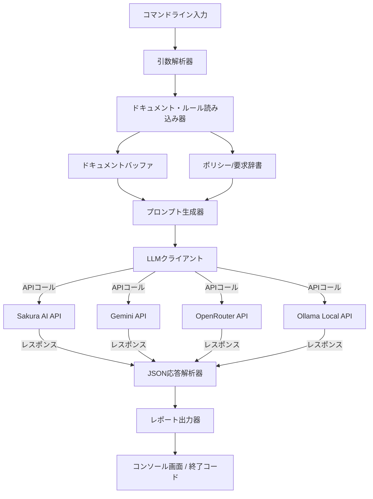
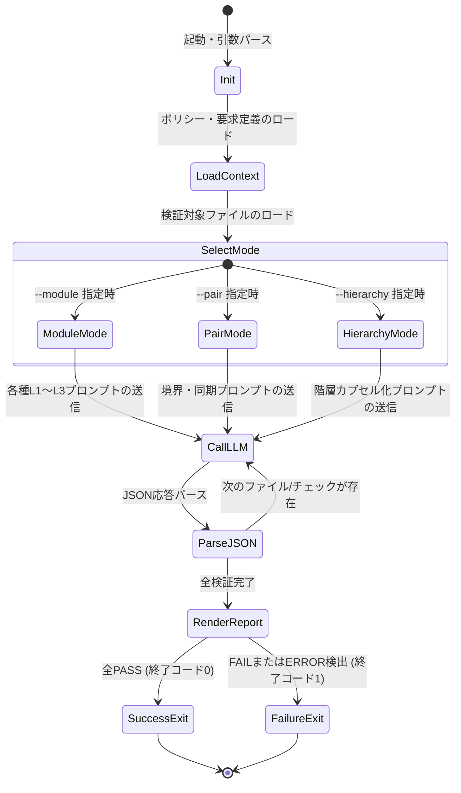
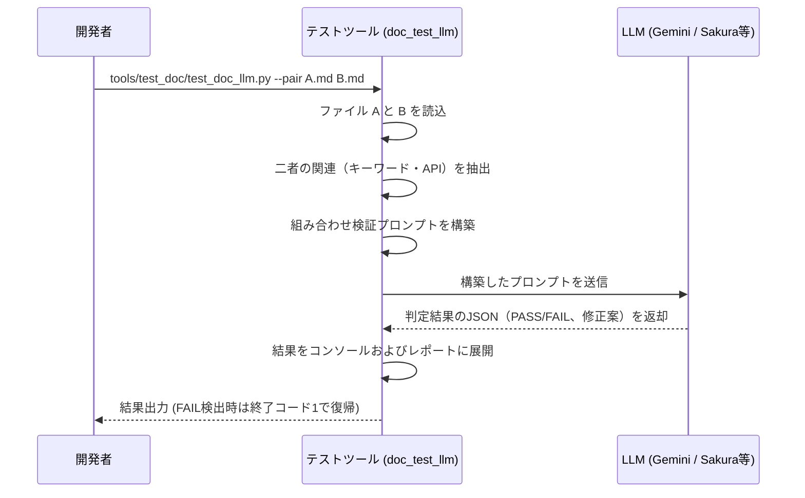

# LLMドキュメント自動テストツール仕様書 (doc_test_llm)

本仕様書は、Fireballプロジェクトにおいて仕様ドキュメントの「一貫性」と「品質」をLLMを介して検証する自動テストツール（`doc_test_llm`）の設計・機能を定義する。 `{AI_Native_Dev}` `{Risk_Tiering}`

---

## 1. コンセプト

LLMを用いた仕様記述においては、同一ドキュメント内の自己矛盾や、関連ドキュメント（クライアント/サーバーなど）との境界条件の齟齬、さらには開発ポリシー（ヒープ禁止など）の違反といった「意味的な不整合」が発生しやすい。
本ツールは、これら静的解析（機械的な正規表現チェック等）では検知不可能な論理矛盾を、LLMの意味理解力を活用してモジュール単位、組み合わせ単位、階層単位で多角的に監査し、一貫した仕様品質を維持するためのものである。

---

## 2. 静的モデル

### 2.1 データ構造
本ツールは、検証対象のドキュメントの他、環境ルールおよび要求仕様書をテキストとして読み込み、LLMのプロンプト（コンテキスト）として組み立てるためのインメモリ構造を有する。

- **仕様データバッファ**: ドキュメントテキストおよびそこから抽出した要求キーワード（Keyword）を保持する。
- **ポリシー辞書**: `.claude/rules/` からロードした開発ポリシー（メモリ・STL制約等）の定義群。
- **要求辞書**: `requirement_list.md` からパースした要求キーワードと説明文のマッピング表。

### 2.2 内部ブロック図
本ツールの構成モジュールと処理フローの関係を以下に示す。



### 2.3 主要なクラス・構造体・配列・定数
主要な管理構造を定義する。

#### 検査結果（check_result） `{AI_Native_Dev}`
LLMからの判定結果をパースして保持するデータ構造。

| 項目名 | 機能と役割 | 備考（制約、型など） |
| :--- | :--- | :--- |
| 判定ステータス | テストの成否（PASS/FAIL/ERROR）を示す。 | 文字列型 |
| 判定理由 | なぜFAILまたはPASSと判断したかの意味的根拠。 | 文字列型、Markdown対応 |
| 改善提案 | FAIL時にドキュメントをどう修正すべきかのコード/テキスト案。 | 文字列型、Markdown対応 |

#### LLMクライアント構成（client_config） `{AI_Native_Dev}`
LLM APIへの接続設定を管理する。


| 項目名 | 機能と役割 | 備考（制約、型など） |
| :--- | :--- | :--- |
| バックエンド名 | 利用するAPIサービス（sakura / openrouter / gemini / ollama）。 | 文字列型 |
| 使用モデル名 | 送信先モデル（gpt-oss-120b、gemini-2.5-flashなど）。 | 文字列型 |
| APIキー | API認証用の認可トークン。 | 環境変数から取得、非ASCII制限あり |
| 最大トークン数 | LLMの生成上限トークン数。 | 整数型、デフォルト1024 |

---

## 3. 動的モデル

### 3.1 アルゴリズム
モジュール、組み合わせ、階層の3つの検証を実行する主要なアルゴリズムフローを定義する。

```python
# LLMドキュメント自動テストツールの制御フロー
def run_document_audit(target_files, policies, kw_definitions, run_mode, args):
    results = []
    
    for doc in target_files:
        doc_content = load_file(doc)
        doc_keywords = extract_keywords(doc_content)
        
        # モジュール検証モード
        if run_mode == "MODULE":
            # 1. 開発ポリシー検証
            policy_prompt = build_policy_prompt(doc, doc_content, policies)
            p_res = call_llm_api(policy_prompt, args)
            
            # 2. 要求仕様充足性検証
            req_prompt = build_traceability_prompt(doc, doc_content, doc_keywords, kw_definitions)
            r_res = call_llm_api(req_prompt, args)
            
            # 3. 記述品質検証
            quality_prompt = build_quality_prompt(doc, doc_content)
            q_res = call_llm_api(quality_prompt, args)
            
            results.append({
                "file": doc,
                "checks": {"policy": p_res, "traceability": r_res, "quality": q_res}
            })
            
        # 組み合わせ検証モード
        elif run_mode == "PAIR":
            for other_doc in args.pair_files:
                pair_content = load_file(other_doc)
                pair_prompt = build_pair_prompt(doc, doc_content, other_doc, pair_content)
                p_res = call_llm_api(pair_prompt, args)
                results.append({
                    "file": doc + " x " + other_doc,
                    "checks": {"combination": p_res}
                })
                
        # 階層検証モード
        elif run_mode == "HIERARCHY":
            # 対象のTier（階層）を取得し、上位および下位のドキュメントと突合
            parent_docs, child_docs = resolve_hierarchy_docs(doc, args.tier)
            for p_doc in parent_docs:
                p_content = load_file(p_doc)
                h_prompt = build_hierarchy_prompt(p_doc, p_content, doc, doc_content)
                h_res = call_llm_api(h_prompt, args)
                results.append({
                    "file": p_doc + " (Parent) x " + doc + " (Child)",
                    "checks": {"hierarchy": h_res}
                })
                
    return evaluate_exit_code(results)
```

### 3.2 状態遷移図
本ツールのプロセスライフサイクルを示す。



### 3.3 内部シーケンス
`--pair` 検証モード時におけるモジュール間のシーケンスを示す。



### 3.4 階層（Tier）定義と関連ファイルの解決ルール

本ツールにおける階層検証（`--hierarchy --tier <N>`）では、仕様ドキュメントの配置ディレクトリをベースにシステム階層（Tier）を以下のように定義する。

- **Tier 0 (システム要求仕様)**: `docs/requires/` 内の要求ドキュメント（主に `requirement_list.md`）
- **Tier 1 (コア/インターフェース階層)**: `docs/components/core/`, `docs/components/interface/`
- **Tier 2 (ランタイム/JIT階層)**: `docs/components/runtime/`, `docs/components/jit/`
- **Tier 3 (プラットフォーム/HAL階層)**: `docs/components/platform/`

#### 階層検証における親子関係の解決ルール:
階層検証実行時、指定されたTier（下位レイヤー）の各ドキュメントに対し、以下のように上位レイヤー（親）ドキュメントを紐付けてLLM検証用プロンプトに注入する。

1. **`--tier 1` の場合**:
   - 下位レイヤー: Tier 1 (`core`, `interface` 配下の md ファイル)
   - 上位レイヤー: Tier 0 (`docs/requires/requirement_list.md`)
   - 目的: 要求仕様がコアモジュール設計において論理的に正しくブレイクダウンされているか検証。
2. **`--tier 2` の場合**:
   - 下位レイヤー: Tier 2 (`runtime`, `jit` 配下の md ファイル)
   - 上位レイヤー: Tier 1 (`core`, `interface` 配下から、その下位レイヤーが参照・依存する上位ドキュメントを自動抽出)
   - 目的: ランタイムやJIT等の詳細実装設計が、コア定義のインターフェースやライフサイクルルールに適合しているか検証。
3. **`--tier 3` の場合**:
   - 下位レイヤー: Tier 3 (`platform` 配下の md ファイル)
   - 上位レイヤー: Tier 2 (`runtime`, `jit` 配下の md ファイル)
   - 目的: プラットフォーム/HALがランタイムの要求するインターフェースやメモリ配置を満たしているか、また逆にプラットフォーム依存の詳細が上位に露出していないかを検証。

※自動抽出ルール: 下位ドキュメント内の見出しやテキスト内に含まれるAPI名、または共通する要求キーワード（例： `JIT_CopyAndPatch` 等の識別子）を手がかりに、同一のキーワードを含む上位ファイルを「親」と判定する。関連が見つからない場合は、該当する上位レイヤーフォルダ内の全ファイルを対象とするか、あるいは主要な定義ドキュメントをフォールバックとして使用する。

---

## 4. インターフェイス定義

### 4.1 公開API
本ツールはCLIから起動されるコマンドラインインターフェイスを提供する。

#### コマンド引数定義 `{AI_Native_Dev}`

| 項目 | 内容 |
| :--- | :--- |
| 機能概要 | 開発者向けのドキュメント自動検証のトリガー機能を提供する。 |
| 引数と役割 | <ul><li>`--module <ファイルパス>`: 指定したドキュメントの単体ポリシー・品質検証を実施。</li><li>`--pair <パスA> <パスB>`: 指定した2つの設計書間の境界整合性を検証。</li><li>`--hierarchy --tier <階層値>`: Tier階層間の抽象化レベル適合性を検証。</li><li>`--backend <名>`: API（sakura / openrouter / gemini / ollama）の明示的指定。</li><li>`--model <名>`: 使用モデルのオーバーライド指定。</li></ul> |
| 期待する結果 | 検証プロセスが走り、コンソールに `rich` を用いた適合性レポートが出力される。 |
| 事前条件 | 環境変数に選択したAPIのアクセスキーが設定されていること（ローカルOllamaの場合は不要）。 |
| 事後条件 | なし |
| 不変条件 | 元のmarkdown仕様書ファイルは本検証処理によって破壊的変更を受けない。 |
| エラー時の挙動 | APIキー不足、JSON解析不能、通信断などの障害時は `ERROR` 判定として画面にログを出力し、終了コード `1` で異常終了する。 |
| 補足 | `--all` オプションを指定した場合、`docs/components/` 以下のすべてのファイルを自動で再帰探索してモジュール検証を実行する。 |

### 4.2 URI/IPCインターフェイス
本ツールはローカル実行専用の開発者支援ツールであるため、URI/IPCによる外部ネットワークインターフェイスおよびRPCサービスは提供しない。

---

## 5. 制約達成の方策

### 5.1 性能制約と方策
- **目標**: 大規模な仕様変更時でも、LLM APIコールの回数と待ち時間を最小限に抑える。
- **方策**: `{AI_Native_Dev}` 検証が不要なドキュメント（前回コミットから差分がないもの）を自動で判別する仕組み（将来拡張）に対応可能なファイル単位のテスト粒度を維持する。

### 5.2 メモリ制約と方策
- **目標**: LLMのコンテキストウインドウ上限を超過しない設計。
- **方策**: 入力ファイルサイズが一定文字数（約6,000文字）を超える場合、セクション単位でドキュメントを分割抽出して検証ループを実行する。

### 5.3 安全性制約と方策
- **目標**: APIキーの安全な取り扱いと機密情報の保護。
- **方策**: APIキー環境変数の読み込み処理（`_read_api_key`）において非ASCII文字の混入を厳格にチェックし、誤ったパスワード送信や不正な接続を未然に防止する。

---

---

## 6. セクション・マトリクスベースの詳細レビューシステム

全体ドキュメント検証の課題として、Tier間の階層検証時に参照ドキュメントが散在するため、LLMが完全なコンテキストを持たないという問題がある。これを解決するため、セクション単位でドキュメントを細分化し、マトリクス形式で統合してからレビューするシステムを導入する。 `{AI_Native_Dev}`

### 6.1 コンセプト

セクション・マトリクスレビューは、以下の3つのフェーズで構成される：

1. **セクション抽出** (`extract_sections.py`): 各ドキュメントを見出し単位で分割し、キーワード情報を抽出。
2. **マトリクス生成** (`build_section_matrix.py`): 親子ドキュメント間のセクションペアを特定し、見出し名とキーワードの対応を可視化。
3. **セクションペアレビュー** (`review_section_matrix.py`): 各セクションペアに対してLLMが詳細なレビューポイント＆リスク検出を実施。

### 6.2 データ構造

#### セクション（Section） `{AI_Native_Dev}`

| 項目 | 機能と役割 | 備考 |
| :--- | :--- | :--- |
| 見出し (heading) | セクションのMarkdown見出しテキスト（`## 見出し名` から `#` を除いた部分）。 | 文字列型 |
| レベル (level) | 見出しのMarkdown階層（2以上、`##` = 2, `###` = 3）。 | 整数型 |
| キーワード (keywords) | セクション内に含まれるすべての `{Keyword}` パターンの集合。 | リスト[文字列] |
| 本文 (body) | 当該セクションから次セクション開始までのテキスト全体。 | 文字列型 |

#### セクション・マトリクスペア

| 項目 | 機能と役割 | 備考 |
| :--- | :--- | :--- |
| 親セクション | 上位レイヤーのセクション。 | Section型 |
| 子セクション | 下位レイヤーのセクション。 | Section型 |
| マッチ信頼度 | キーワード共有度または見出し類似度（0.0～1.0）。 | 浮動小数点型 |
| レビューポイント | LLMが検出した整合性チェック項目と改善提案。 | リスト[文字列] |
| リスク水準 | 当該セクションペアの設計矛盾リスク（高/中/低）。 | 列挙型 |

### 6.3 マッチング戦略

セクション間の対応付けは以下の優先順で実行される：

1. **キーワード共有優先**: 親セクションと子セクション内に共通の `{Keyword}` が存在する場合、それらを対応ペアとする。信頼度は共有キーワード数の比率で算出。
2. **見出し類似度**: キーワード共有がない場合、見出し名の文字列距離（Levenshtein距離等）を計算し、類似度が一定以上（デフォルト 0.5）の場合に対応。
3. **未対応フラグ**: 上記いずれにも該当しないセクションは「未対応」として検出し、設計漏れの警告とする。

### 6.4 レビューポイント自動生成

各セクションペアに対して、LLMは以下の観点からレビューポイントを生成する：

| チェック項目 | 検証内容 |
| :--- | :--- |
| API/インターフェース整合性 | 引数・戻り値の型、説明、シグネチャが一致しているか。 |
| 状態遷移・ライフサイクル | タイミング、プロトコル、所有権移譲ルールの整合性。 |
| キーワード充足性 | 親セクションの全要求キーワードが子セクションで実装されているか。 |
| エラーハンドリング | リカバリ戦略、例外処理方針の齟齬がないか。 |
| メモリ・パフォーマンス | 非機能要求（RAM制約、レイテンシ等）への適合性。 |

### 6.5 ツール使用方法

#### 6.5.1 セクション抽出

```bash
python3 tools/extract_sections.py <markdown_file>
```

**出力フォーマット**: JSON形式でセクション情報を標準出力。

#### 6.5.2 セクション・マトリクス生成

```bash
python3 tools/build_section_matrix.py <parent_file> <child_file> [--format markdown|csv] [--output <path>]
```

**パラメータ**:
- `<parent_file>`: 上位レイヤードキュメント
- `<child_file>`: 下位レイヤードキュメント
- `--format`: 出力形式（MarkdownまたはCSV、デフォルト: markdown）
- `--output, -o`: 出力ファイルパス（指定なしで自動生成）

**出力例**:

| 親セクション | 親キーワード | 子セクション | 子キーワード | マッチ度 |
|---|---|---|---|---|
| `コンセプト` | `{NotRTOS}`, `{CooperativeMultitasking}` | `CooperativeMultitasking実装詳細` | `{CooperativeMultitasking}` | 100% |
| `API定義` | `{TypeSafeMessaging}` | （対応なし） | | — |

#### 6.5.3 セクション・マトリクスLLMレビュー

```bash
python3 tools/review_section_matrix.py <parent_file> <child_file> [--backend sakura|openrouter|gemini|ollama] [--model <name>] [--max-tokens <n>] [--output <path>]
```

**パラメータ**:
- `<parent_file>`, `<child_file>`: マトリクス対象ドキュメント
- `--backend`: LLMバックエンド選択（sakura/openrouter/gemini/ollama）
- `--model`: 使用モデルオーバーライド
- `--max-tokens`: 生成トークン上限（デフォルト: 1024）
- `--output, -o`: レビュー結果のJSON出力先

**環境変数**:
- `SAKURA_AI_API_KEY`: Sakura AI認証トークン
- `OPEN_ROUTER_API_KEY`: OpenRouter認証トークン
- `GEMINI_API_KEY` or `GOOGLE_API_KEY`: Google Gemini API鍵

### 6.6 実行パイプライン例

```bash
# Step 1: requirement_list.md と os_coos.md のセクション対応を可視化
python3 tools/build_section_matrix.py \
  docs/requires/requirement_list.md \
  docs/components/core/os_coos.md \
  --format markdown \
  --output /tmp/tier1_matrix.md

# Step 2: マトリクスのセクションペアに対してLLMレビュー実行
python3 tools/review_section_matrix.py \
  docs/requires/requirement_list.md \
  docs/components/core/os_coos.md \
  --backend sakura \
  --output /tmp/tier1_review.json

# Step 3: レビュー結果を確認
cat /tmp/tier1_review.json | python3 -m json.tool
```

### 6.7 統合フロー

将来的には、以下のようなスクリプトで、全Tier間を一括検証する運用を想定する：

```bash
#!/bin/bash
# Tier別の統合マトリクスレビュー

TIERS=(
  "docs/requires/requirement_list.md:docs/components/core/os_coos.md:Tier1"
  "docs/requires/requirement_list.md:docs/components/interface/interface_wit.md:Tier1_Interface"
  "docs/components/core/os_coos.md:docs/components/runtime/runtime_interpreter.md:Tier2_Runtime"
)

for tier_pair in "${TIERS[@]}"; do
  IFS=':' read -r parent child label <<< "$tier_pair"
  echo "=== Reviewing $label ==="
  python3 tools/review_section_matrix.py "$parent" "$child" --output "/tmp/review_${label}.json"
done
```

---

## 7. 参考実装リスト

本コンポーネントのロジックやアルゴリズムの参考とする資料。

| 名称 | 参照先URL/文献名 | 採用/考慮する理由 |
| :--- | :--- | :--- |
| Fireball 整合性チェッカー | `.claude/scripts/check_consistency.py` | プロンプト送信・解析ロジック、および機械的チェックの親実装として。 |
| セクション抽出器 | `tools/extract_sections.py` | Markdownセクション分割・キーワード抽出の実装基盤。 |
| マトリクス生成器 | `tools/build_section_matrix.py` | 親子ドキュメント間のセクション対応付けロジック。 |
| マトリクスレビュア | `tools/review_section_matrix.py` | セクションペアごとのLLMベース詳細レビュー実装。 |
