# Spec Verification Report: Fireball Hypervisor

**Overall Status**: ❌ **VERIFICATION FAILED**

**Verifier**: `spec-integrator @ 388c37f (UNCOMMITTED CHANGES — result is not reproducible)`

## 1. Executive Summary

| Metric | Value |
| :--- | :--- |
| Total Documents | 4 |
| Total Sections | 66 |
| Total Keywords / Entities | 20 |
| Formal Models (distinct scripts) | 2 |
| Formal Models Passing Audit | 2 |
| WIT Interface Files | 5 |
| Verification Obligations Demanded | 0 |
| Verification Obligations Discharged | 0 |
| Errors | **83** |
| Warnings | 0 |

### Quality Gate Status

| Gate | Status | Issues |
| :--- | :--- | :--- |
| **Format Gate** | 🟢 PASS | 0 |
| **Traceability Gate** | 🔴 FAIL (80 errors) | 80 |
| **Hierarchy Gate** | 🟢 PASS | 0 |
| **Formal Gate** | 🟢 PASS | 0 |
| **WIT Gate** | 🟢 PASS | 0 |
| **Evidence Gate** | 🟢 PASS | 0 |
| **Obligation Gate** | 🔴 FAIL (3 errors) | 3 |
| **Consistency Gate** | 🟢 PASS | 0 |
| **SemanticTopic Gate** | 🟢 PASS | 0 |

## 2. Issues & Violations

| Severity | Gate | Location | Rule | Message |
| :--- | :--- | :--- | :--- | :--- |
| **ERROR** | Traceability | `architecture/verification_factor_matrix.md:1` | `TRACE-UNDEFINED-KEYWORD` | Undefined keyword referenced: '{Pairwise_Combinatorial_Testing}'. No definition found in designated source of truth. |
| **ERROR** | Traceability | `components/tier2_runtime/hal_dispatch.md:1` | `TRACE-UNDEFINED-KEYWORD` | Undefined keyword referenced: '{META_ContractImplSplit}'. No definition found in designated source of truth. |
| **ERROR** | Traceability | `components/tier2_runtime/hal_dispatch.md:10` | `TRACE-UNDEFINED-KEYWORD` | Undefined keyword referenced: '{IPCRouter}'. No definition found in designated source of truth. |
| **ERROR** | Traceability | `components/tier2_runtime/hal_dispatch.md:10` | `TRACE-UNDEFINED-KEYWORD` | Undefined keyword referenced: '{URIAbstraction}'. No definition found in designated source of truth. |
| **ERROR** | Traceability | `components/tier2_runtime/hal_dispatch.md:10` | `TRACE-UNDEFINED-KEYWORD` | Undefined keyword referenced: '{TypeSafeMessaging}'. No definition found in designated source of truth. |
| **ERROR** | Traceability | `components/tier2_runtime/hal_dispatch.md:10` | `TRACE-UNDEFINED-KEYWORD` | Undefined keyword referenced: '{IPC_ZeroCopy}'. No definition found in designated source of truth. |
| **ERROR** | Traceability | `components/tier2_runtime/hal_dispatch.md:10` | `TRACE-UNDEFINED-KEYWORD` | Undefined keyword referenced: '{ADR_RendezvousChannel}'. No definition found in designated source of truth. |
| **ERROR** | Traceability | `components/tier2_runtime/hal_dispatch.md:10` | `TRACE-UNDEFINED-KEYWORD` | Undefined keyword referenced: '{IPCRouter}'. No definition found in designated source of truth. |
| **ERROR** | Traceability | `components/tier2_runtime/hal_dispatch.md:10` | `TRACE-UNDEFINED-KEYWORD` | Undefined keyword referenced: '{URIAbstraction}'. No definition found in designated source of truth. |
| **ERROR** | Traceability | `components/tier2_runtime/hal_dispatch.md:10` | `TRACE-UNDEFINED-KEYWORD` | Undefined keyword referenced: '{TypeSafeMessaging}'. No definition found in designated source of truth. |
| **ERROR** | Traceability | `components/tier2_runtime/hal_dispatch.md:10` | `TRACE-UNDEFINED-KEYWORD` | Undefined keyword referenced: '{IPC_ZeroCopy}'. No definition found in designated source of truth. |
| **ERROR** | Traceability | `components/tier2_runtime/hal_dispatch.md:18` | `TRACE-UNDEFINED-KEYWORD` | Undefined keyword referenced: '{META_3TierSeparation}'. No definition found in designated source of truth. |
| **ERROR** | Traceability | `components/tier2_runtime/hal_dispatch.md:18` | `TRACE-UNDEFINED-KEYWORD` | Undefined keyword referenced: '{IPCRouter}'. No definition found in designated source of truth. |
| **ERROR** | Traceability | `components/tier2_runtime/hal_dispatch.md:18` | `TRACE-UNDEFINED-KEYWORD` | Undefined keyword referenced: '{URIAbstraction}'. No definition found in designated source of truth. |
| **ERROR** | Traceability | `components/tier2_runtime/hal_dispatch.md:18` | `TRACE-UNDEFINED-KEYWORD` | Undefined keyword referenced: '{META_StaticDI}'. No definition found in designated source of truth. |
| **ERROR** | Traceability | `components/tier2_runtime/hal_dispatch.md:18` | `TRACE-UNDEFINED-KEYWORD` | Undefined keyword referenced: '{META_3TierSeparation}'. No definition found in designated source of truth. |
| **ERROR** | Traceability | `components/tier2_runtime/hal_dispatch.md:18` | `TRACE-UNDEFINED-KEYWORD` | Undefined keyword referenced: '{IPCRouter}'. No definition found in designated source of truth. |
| **ERROR** | Traceability | `components/tier2_runtime/hal_dispatch.md:18` | `TRACE-UNDEFINED-KEYWORD` | Undefined keyword referenced: '{URIAbstraction}'. No definition found in designated source of truth. |
| **ERROR** | Traceability | `components/tier2_runtime/hal_dispatch.md:18` | `TRACE-UNDEFINED-KEYWORD` | Undefined keyword referenced: '{META_StaticDI}'. No definition found in designated source of truth. |
| **ERROR** | Traceability | `components/tier2_runtime/hal_dispatch.md:52` | `TRACE-UNDEFINED-KEYWORD` | Undefined keyword referenced: '{META_3TierSeparation}'. No definition found in designated source of truth. |
| **ERROR** | Traceability | `components/tier2_runtime/hal_dispatch.md:52` | `TRACE-UNDEFINED-KEYWORD` | Undefined keyword referenced: '{IPCRouter}'. No definition found in designated source of truth. |
| **ERROR** | Traceability | `components/tier2_runtime/hal_dispatch.md:62` | `TRACE-UNDEFINED-KEYWORD` | Undefined keyword referenced: '{META_ConfigurableSystem}'. No definition found in designated source of truth. |
| **ERROR** | Traceability | `components/tier2_runtime/hal_dispatch.md:62` | `TRACE-UNDEFINED-KEYWORD` | Undefined keyword referenced: '{META_ConfigurableSystem}'. No definition found in designated source of truth. |
| **ERROR** | Traceability | `components/tier2_runtime/hal_dispatch.md:74` | `TRACE-UNDEFINED-KEYWORD` | Undefined keyword referenced: '{TaskPollInterruptEvent}'. No definition found in designated source of truth. |
| **ERROR** | Traceability | `components/tier2_runtime/hal_dispatch.md:74` | `TRACE-UNDEFINED-KEYWORD` | Undefined keyword referenced: '{GLOBAL_InterruptWakeup}'. No definition found in designated source of truth. |
| **ERROR** | Traceability | `components/tier2_runtime/hal_dispatch.md:74` | `TRACE-UNDEFINED-KEYWORD` | Undefined keyword referenced: '{TaskPollInterruptEvent}'. No definition found in designated source of truth. |
| **ERROR** | Traceability | `components/tier2_runtime/hal_dispatch.md:74` | `TRACE-UNDEFINED-KEYWORD` | Undefined keyword referenced: '{GLOBAL_InterruptWakeup}'. No definition found in designated source of truth. |
| **ERROR** | Traceability | `components/tier2_runtime/hal_dispatch.md:82` | `TRACE-UNDEFINED-KEYWORD` | Undefined keyword referenced: '{HAL_Interface}'. No definition found in designated source of truth. |
| **ERROR** | Traceability | `components/tier2_runtime/hal_dispatch.md:82` | `TRACE-UNDEFINED-KEYWORD` | Undefined keyword referenced: '{IPC_ZeroCopy}'. No definition found in designated source of truth. |
| **ERROR** | Traceability | `components/tier2_runtime/hal_dispatch.md:102` | `TRACE-UNDEFINED-KEYWORD` | Undefined keyword referenced: '{URIAbstraction}'. No definition found in designated source of truth. |
| **ERROR** | Traceability | `components/tier2_runtime/hal_dispatch.md:102` | `TRACE-UNDEFINED-KEYWORD` | Undefined keyword referenced: '{IPCRouter}'. No definition found in designated source of truth. |
| **ERROR** | Traceability | `components/tier2_runtime/hal_dispatch.md:102` | `TRACE-UNDEFINED-KEYWORD` | Undefined keyword referenced: '{TypeSafeMessaging}'. No definition found in designated source of truth. |
| **ERROR** | Traceability | `components/tier2_runtime/hal_dispatch.md:102` | `TRACE-UNDEFINED-KEYWORD` | Undefined keyword referenced: '{IPC_ZeroCopy}'. No definition found in designated source of truth. |
| **ERROR** | Traceability | `components/tier2_runtime/hal_dispatch.md:102` | `TRACE-UNDEFINED-KEYWORD` | Undefined keyword referenced: '{HAL_Interface}'. No definition found in designated source of truth. |
| **ERROR** | Traceability | `components/tier2_runtime/hal_dispatch.md:133` | `TRACE-UNDEFINED-KEYWORD` | Undefined keyword referenced: '{WASI_Implementation}'. No definition found in designated source of truth. |
| **ERROR** | Traceability | `components/tier2_runtime/hal_dispatch.md:133` | `TRACE-UNDEFINED-KEYWORD` | Undefined keyword referenced: '{URIAbstraction}'. No definition found in designated source of truth. |
| **ERROR** | Traceability | `components/tier2_runtime/hal_dispatch.md:133` | `TRACE-UNDEFINED-KEYWORD` | Undefined keyword referenced: '{TypeSafeMessaging}'. No definition found in designated source of truth. |
| **ERROR** | Traceability | `components/tier2_runtime/hal_dispatch.md:133` | `TRACE-UNDEFINED-KEYWORD` | Undefined keyword referenced: '{META_ZeroCostAbstraction}'. No definition found in designated source of truth. |
| **ERROR** | Traceability | `components/tier2_runtime/hal_dispatch.md:144` | `TRACE-UNDEFINED-KEYWORD` | Undefined keyword referenced: '{META_ConfigurableSystem}'. No definition found in designated source of truth. |
| **ERROR** | Traceability | `components/tier2_runtime/hal_dispatch.md:144` | `TRACE-UNDEFINED-KEYWORD` | Undefined keyword referenced: '{META_ConfigurableSystem}'. No definition found in designated source of truth. |
| **ERROR** | Traceability | `components/tier2_runtime/tests/hal_dispatch_test_spec.md:8` | `TRACE-UNDEFINED-KEYWORD` | Undefined keyword referenced: '{WASI_Implementation}'. No definition found in designated source of truth. |
| **ERROR** | Traceability | `components/tier2_runtime/tests/hal_dispatch_test_spec.md:8` | `TRACE-UNDEFINED-KEYWORD` | Undefined keyword referenced: '{Fast_Path_GPIO}'. No definition found in designated source of truth. |
| **ERROR** | Traceability | `components/tier3_platform/platform_driver.md:1` | `TRACE-UNDEFINED-KEYWORD` | Undefined keyword referenced: '{META_ContractImplSplit}'. No definition found in designated source of truth. |
| **ERROR** | Traceability | `components/tier3_platform/platform_driver.md:10` | `TRACE-UNDEFINED-KEYWORD` | Undefined keyword referenced: '{Challenge_InterruptSafety}'. No definition found in designated source of truth. |
| **ERROR** | Traceability | `components/tier3_platform/platform_driver.md:10` | `TRACE-UNDEFINED-KEYWORD` | Undefined keyword referenced: '{TaskPollInterruptEvent}'. No definition found in designated source of truth. |
| **ERROR** | Traceability | `components/tier3_platform/platform_driver.md:10` | `TRACE-UNDEFINED-KEYWORD` | Undefined keyword referenced: '{RSPMinimalSet}'. No definition found in designated source of truth. |
| **ERROR** | Traceability | `components/tier3_platform/platform_driver.md:10` | `TRACE-UNDEFINED-KEYWORD` | Undefined keyword referenced: '{Fast_Path_GPIO}'. No definition found in designated source of truth. |
| **ERROR** | Traceability | `components/tier3_platform/platform_driver.md:10` | `TRACE-UNDEFINED-KEYWORD` | Undefined keyword referenced: '{Challenge_InterruptSafety}'. No definition found in designated source of truth. |
| **ERROR** | Traceability | `components/tier3_platform/platform_driver.md:10` | `TRACE-UNDEFINED-KEYWORD` | Undefined keyword referenced: '{TaskPollInterruptEvent}'. No definition found in designated source of truth. |
| **ERROR** | Traceability | `components/tier3_platform/platform_driver.md:10` | `TRACE-UNDEFINED-KEYWORD` | Undefined keyword referenced: '{RSPMinimalSet}'. No definition found in designated source of truth. |
| **ERROR** | Traceability | `components/tier3_platform/platform_driver.md:10` | `TRACE-UNDEFINED-KEYWORD` | Undefined keyword referenced: '{Fast_Path_GPIO}'. No definition found in designated source of truth. |
| **ERROR** | Traceability | `components/tier3_platform/platform_driver.md:14` | `TRACE-UNDEFINED-KEYWORD` | Undefined keyword referenced: '{META_3TierSeparation}'. No definition found in designated source of truth. |
| **ERROR** | Traceability | `components/tier3_platform/platform_driver.md:14` | `TRACE-UNDEFINED-KEYWORD` | Undefined keyword referenced: '{META_3TierSeparation}'. No definition found in designated source of truth. |
| **ERROR** | Traceability | `components/tier3_platform/platform_driver.md:36` | `TRACE-UNDEFINED-KEYWORD` | Undefined keyword referenced: '{RSP_Transport_Selectable}'. No definition found in designated source of truth. |
| **ERROR** | Traceability | `components/tier3_platform/platform_driver.md:68` | `TRACE-UNDEFINED-KEYWORD` | Undefined keyword referenced: '{META_ConfigurableSystem}'. No definition found in designated source of truth. |
| **ERROR** | Traceability | `components/tier3_platform/platform_driver.md:68` | `TRACE-UNDEFINED-KEYWORD` | Undefined keyword referenced: '{META_ConfigurableSystem}'. No definition found in designated source of truth. |
| **ERROR** | Traceability | `components/tier3_platform/platform_driver.md:82` | `TRACE-UNDEFINED-KEYWORD` | Undefined keyword referenced: '{RSP_Transport_Selectable}'. No definition found in designated source of truth. |
| **ERROR** | Traceability | `components/tier3_platform/platform_driver.md:82` | `TRACE-UNDEFINED-KEYWORD` | Undefined keyword referenced: '{TaskPollInterruptEvent}'. No definition found in designated source of truth. |
| **ERROR** | Traceability | `components/tier3_platform/platform_driver.md:82` | `TRACE-UNDEFINED-KEYWORD` | Undefined keyword referenced: '{GLOBAL_InterruptWakeup}'. No definition found in designated source of truth. |
| **ERROR** | Traceability | `components/tier3_platform/platform_driver.md:82` | `TRACE-UNDEFINED-KEYWORD` | Undefined keyword referenced: '{GLOBAL_InterruptWakeup}'. No definition found in designated source of truth. |
| **ERROR** | Traceability | `components/tier3_platform/platform_driver.md:82` | `TRACE-UNDEFINED-KEYWORD` | Undefined keyword referenced: '{TaskPollInterruptEvent}'. No definition found in designated source of truth. |
| **ERROR** | Traceability | `components/tier3_platform/platform_driver.md:82` | `TRACE-UNDEFINED-KEYWORD` | Undefined keyword referenced: '{GLOBAL_InterruptWakeup}'. No definition found in designated source of truth. |
| **ERROR** | Traceability | `components/tier3_platform/platform_driver.md:87` | `TRACE-UNDEFINED-KEYWORD` | Undefined keyword referenced: '{GOTCHA-HAL-01}'. No definition found in designated source of truth. |
| **ERROR** | Traceability | `components/tier3_platform/platform_driver.md:87` | `TRACE-UNDEFINED-KEYWORD` | Undefined keyword referenced: '{HAL_Interface}'. No definition found in designated source of truth. |
| **ERROR** | Traceability | `components/tier3_platform/platform_driver.md:87` | `TRACE-UNDEFINED-KEYWORD` | Undefined keyword referenced: '{IPC_ZeroCopy}'. No definition found in designated source of truth. |
| **ERROR** | Traceability | `components/tier3_platform/platform_driver.md:104` | `TRACE-UNDEFINED-KEYWORD` | Undefined keyword referenced: '{RSP_Transport_Selectable}'. No definition found in designated source of truth. |
| **ERROR** | Traceability | `components/tier3_platform/platform_driver.md:104` | `TRACE-UNDEFINED-KEYWORD` | Undefined keyword referenced: '{TaskPollInterruptEvent}'. No definition found in designated source of truth. |
| **ERROR** | Traceability | `components/tier3_platform/platform_driver.md:104` | `TRACE-UNDEFINED-KEYWORD` | Undefined keyword referenced: '{GLOBAL_InterruptWakeup}'. No definition found in designated source of truth. |
| **ERROR** | Traceability | `components/tier3_platform/platform_driver.md:116` | `TRACE-UNDEFINED-KEYWORD` | Undefined keyword referenced: '{RSPMinimalSet}'. No definition found in designated source of truth. |
| **ERROR** | Traceability | `components/tier3_platform/platform_driver.md:116` | `TRACE-UNDEFINED-KEYWORD` | Undefined keyword referenced: '{RSP_Transport_Selectable}'. No definition found in designated source of truth. |
| **ERROR** | Traceability | `components/tier3_platform/platform_driver.md:116` | `TRACE-UNDEFINED-KEYWORD` | Undefined keyword referenced: '{RSP_Transport_Selectable}'. No definition found in designated source of truth. |
| **ERROR** | Traceability | `components/tier3_platform/platform_driver.md:116` | `TRACE-UNDEFINED-KEYWORD` | Undefined keyword referenced: '{RSPMinimalSet}'. No definition found in designated source of truth. |
| **ERROR** | Traceability | `components/tier3_platform/platform_driver.md:150` | `TRACE-UNDEFINED-KEYWORD` | Undefined keyword referenced: '{HAL_Interface}'. No definition found in designated source of truth. |
| **ERROR** | Traceability | `components/tier3_platform/platform_driver.md:150` | `TRACE-UNDEFINED-KEYWORD` | Undefined keyword referenced: '{IPC_ZeroCopy}'. No definition found in designated source of truth. |
| **ERROR** | Traceability | `components/tier3_platform/platform_driver.md:150` | `TRACE-UNDEFINED-KEYWORD` | Undefined keyword referenced: '{HAL_Interface}'. No definition found in designated source of truth. |
| **ERROR** | Traceability | `components/tier3_platform/platform_driver.md:166` | `TRACE-UNDEFINED-KEYWORD` | Undefined keyword referenced: '{RSP_Transport_Selectable}'. No definition found in designated source of truth. |
| **ERROR** | Traceability | `components/tier3_platform/platform_driver.md:172` | `TRACE-UNDEFINED-KEYWORD` | Undefined keyword referenced: '{META_ConfigurableSystem}'. No definition found in designated source of truth. |
| **ERROR** | Traceability | `components/tier3_platform/platform_driver.md:172` | `TRACE-UNDEFINED-KEYWORD` | Undefined keyword referenced: '{META_ConfigurableSystem}'. No definition found in designated source of truth. |
| **ERROR** | Traceability | `components/tier3_platform/platform_driver.md:177` | `TRACE-UNDEFINED-KEYWORD` | Undefined keyword referenced: '{Challenge_InterruptSafety}'. No definition found in designated source of truth. |
| **ERROR** | Traceability | `components/tier3_platform/platform_driver.md:177` | `TRACE-UNDEFINED-KEYWORD` | Undefined keyword referenced: '{Challenge_InterruptSafety}'. No definition found in designated source of truth. |
| **ERROR** | Obligation | `F:\workspace\mysrc\fireball\.spec-integrator\doc_cache.db:1` | `OBLIG-ASSESSMENT-MISSING` | No risk assessment found in the cache DB. The pipeline cannot claim the specification is verified without first deciding what needs verifying. Run 'spec-integrator llm-assess' before 'check'. |
| **ERROR** | Obligation | `F:\workspace\mysrc\fireball\.spec-integrator\doc_cache.db:1` | `OBLIG-JUDGE-MISSING` | 2 document(s) carry '{VERIFY_LLM}' but the database contains no LLM judge verdict. Run 'spec-integrator llm-judge' to audit the semantic consistency of these specifications. |
| **ERROR** | Obligation | `F:\workspace\mysrc\fireball\.spec-integrator\doc_cache.db:1` | `OBLIG-DOC-JUDGE-MISSING` | 2 document(s) carry '{VERIFY_LLM}' but the database contains no whole-document LLM judge verdict. Run 'spec-integrator llm-judge' to audit the internal consistency of each document. |

## 3. Formal Verification Results (pyModelChecking)

| Component | Model Script | Backs | Status | Details |
| :--- | :--- | :--- | :--- | :--- |
| `tier2_runtime` | `components/tier2_runtime/formal/hal_dispatch_contract_model.py` | `components/tier2_runtime/hal_dispatch.md` | 🟢 PASS | 4 propert(y/ies) audited; 12 states, 8 reachable, branching=3 |
| `tier3_platform` | `components/tier3_platform/formal/interrupt_boundary_model.py` | `components/tier3_platform/platform_driver.md` | 🟢 PASS | 2 propert(y/ies) audited; 8 states, 6 reachable, branching=2 |

### 3.1 Property-level Audit

| Model | Property | Kind | Result | Detail |
| :--- | :--- | :--- | :--- | :--- |
| `components/tier2_runtime/formal/hal_dispatch_contract_model.py` | device_access_never_bypasses_ipc_router | safety | 🟢 PASS | holds at all initial states; guard verified by mutation (violation reachable in 1 state(s) when disabled) |
| `components/tier2_runtime/formal/hal_dispatch_contract_model.py` | data_transfer_never_uses_raw_pointer | safety | 🟢 PASS | holds at all initial states; guard verified by mutation (violation reachable in 1 state(s) when disabled) |
| `components/tier2_runtime/formal/hal_dispatch_contract_model.py` | preflight_rejection_does_not_revoke_ownership | safety | 🟢 PASS | holds at all initial states; guard verified by mutation (violation reachable in 1 state(s) when disabled) |
| `components/tier2_runtime/formal/hal_dispatch_contract_model.py` | dynamic_mapping_is_bound_to_one_guest | safety | 🟢 PASS | holds at all initial states; guard verified by mutation (violation reachable in 1 state(s) when disabled) |
| `components/tier3_platform/formal/interrupt_boundary_model.py` | isr_does_not_update_task_state_directly | safety | 🟢 PASS | holds at all initial states; guard verified by mutation (violation reachable in 1 state(s) when disabled) |
| `components/tier3_platform/formal/interrupt_boundary_model.py` | interrupt_event_reaches_scheduler_boundary | liveness | 🟢 PASS | holds at all initial states; guard verified by mutation (violation reachable in 1 state(s) when disabled) |

## 3.5 Verification Obligations (from Risk Assessment)

- Demanded: **0** / Discharged: **0** (100%)

## 3.6 Change Propagation (Consistency)

- Symbols tracked: **0** / drifting: **0**

## 4. WIT Interface Verification Results

| Component | WIT File | Interfaces / Worlds | Status | Details |
| :--- | :--- | :--- | :--- | :--- |
| `tier2_runtime` | `components/tier2_runtime/wit/vsoc_runtime.wit` | `environment, execution, debug (Worlds: vsoc-runtime)` | 🟢 PASS | Valid WIT specification (3 interface(s), 1 world(s)) |
| `tier1_interface` | `components/tier1_interface/wit/fireball.wit` | `types, resolver, trap (Worlds: fireball)` | 🟢 PASS | Valid WIT specification (3 interface(s), 1 world(s)) |
| `tier1_interface` | `components/tier1_interface/wit/ipc_router.wit` | `types, router (Worlds: ipc-router)` | 🟢 PASS | Valid WIT specification (2 interface(s), 1 world(s)) |
| `tier1_interface` | `components/tier1_interface/wit/memory.wit` | `types, memory (Worlds: memory)` | 🟢 PASS | Valid WIT specification (2 interface(s), 1 world(s)) |
| `tier1_core` | `components/tier1_core/wit/coos_system.wit` | `types, csp, scheduler, logging (Worlds: coos-kernel)` | 🟢 PASS | Valid WIT specification (4 interface(s), 1 world(s)) |
## 5. Traceability Matrix

| Item / Requirement | Defined In | Referenced In (Design Specs) | Status |
| :--- | :--- | :--- | :--- |
| `{IPC_ZeroCopy}` | *(None)* | `components/tier2_runtime/hal_dispatch.md#1. コンセプト` `components/tier2_runtime/hal_dispatch.md#5.1 公開 API（WASI親和性のある契約）` `components/tier2_runtime/hal_dispatch.md#5.2 階層型 URI 命名規則 & WASI 0.3p IPC コマンド仕様` `components/tier3_platform/platform_driver.md#HalBufferPool 固定スロット・境界検査手順（手順アクティビティ図）` `components/tier3_platform/platform_driver.md#5.1 物理実装の勘所・不変条件` | 🔴 Undefined |
| `{RSP_Transport_Selectable}` | *(None)* | `components/tier3_platform/platform_driver.md#3.2 内部ブロック図` `components/tier3_platform/platform_driver.md#4.1 割り込み処理の物理実装` `components/tier3_platform/platform_driver.md#4.2 状態遷移図（物理デバイス状態）` `components/tier3_platform/platform_driver.md#4.3 内部シーケンス (RSP パーサとデバッグキュー)` `components/tier3_platform/platform_driver.md#5.4 RSP デバッグトランスポート仕様` | 🔴 Undefined |
| `{IPCRouter}` | *(None)* | `components/tier2_runtime/hal_dispatch.md#1. コンセプト` `components/tier2_runtime/hal_dispatch.md#2. アーキテクチャ分類` `components/tier2_runtime/hal_dispatch.md#HAL サーバタスク（hal_task）` `components/tier2_runtime/hal_dispatch.md#5.2 階層型 URI 命名規則 & WASI 0.3p IPC コマンド仕様` | 🔴 Undefined |
| `{URIAbstraction}` | *(None)* | `components/tier2_runtime/hal_dispatch.md#1. コンセプト` `components/tier2_runtime/hal_dispatch.md#2. アーキテクチャ分類` `components/tier2_runtime/hal_dispatch.md#5.2 階層型 URI 命名規則 & WASI 0.3p IPC コマンド仕様` `components/tier2_runtime/hal_dispatch.md#5.3 WASI サポート体系（WASI 0.3p とゲストアダプタの境界）` | 🔴 Undefined |
| `{META_ConfigurableSystem}` | *(None)* | `components/tier2_runtime/hal_dispatch.md#HAL構成（hal_config、契約レベル定数）` `components/tier2_runtime/hal_dispatch.md#6.1 性能制約と方策` `components/tier3_platform/platform_driver.md#HAL構成（hal_config、物理値）` `components/tier3_platform/platform_driver.md#6.1 メモリ制約と方策` | 🔴 Undefined |
| `{TaskPollInterruptEvent}` | *(None)* | `components/tier2_runtime/hal_dispatch.md#4.1 コマンドルーティング（契約）` `components/tier3_platform/platform_driver.md#1. コンセプト` `components/tier3_platform/platform_driver.md#4.1 割り込み処理の物理実装` `components/tier3_platform/platform_driver.md#4.2 状態遷移図（物理デバイス状態）` | 🔴 Undefined |
| `{HAL_Interface}` | *(None)* | `components/tier2_runtime/hal_dispatch.md#5.1 公開 API（WASI親和性のある契約）` `components/tier2_runtime/hal_dispatch.md#5.2 階層型 URI 命名規則 & WASI 0.3p IPC コマンド仕様` `components/tier3_platform/platform_driver.md#HalBufferPool 固定スロット・境界検査手順（手順アクティビティ図）` `components/tier3_platform/platform_driver.md#5.1 物理実装の勘所・不変条件` | 🔴 Undefined |
| `{TypeSafeMessaging}` | *(None)* | `components/tier2_runtime/hal_dispatch.md#1. コンセプト` `components/tier2_runtime/hal_dispatch.md#5.2 階層型 URI 命名規則 & WASI 0.3p IPC コマンド仕様` `components/tier2_runtime/hal_dispatch.md#5.3 WASI サポート体系（WASI 0.3p とゲストアダプタの境界）` | 🔴 Undefined |
| `{META_3TierSeparation}` | *(None)* | `components/tier2_runtime/hal_dispatch.md#2. アーキテクチャ分類` `components/tier2_runtime/hal_dispatch.md#HAL サーバタスク（hal_task）` `components/tier3_platform/platform_driver.md#2. アーキテクチャ分類` | 🔴 Undefined |
| `{GLOBAL_InterruptWakeup}` | *(None)* | `components/tier2_runtime/hal_dispatch.md#4.1 コマンドルーティング（契約）` `components/tier3_platform/platform_driver.md#4.1 割り込み処理の物理実装` `components/tier3_platform/platform_driver.md#4.2 状態遷移図（物理デバイス状態）` | 🔴 Undefined |
| `{META_ContractImplSplit}` | *(None)* | `components/tier2_runtime/hal_dispatch.md#HAL 抽象化層（URI Resolver / トランスポート抽象） コンポーネント設計書 {VERIFY_FORMAL} {VERIFY_LLM}` `components/tier3_platform/platform_driver.md#HAL ドライバ実装（UART/SEGGER RTT/GPIO/I2C/SPI/Timer 物理層） コンポーネント設計書 {VERIFY_FORMAL} {VERIFY_LLM}` | 🔴 Undefined |
| `{WASI_Implementation}` | *(None)* | `components/tier2_runtime/hal_dispatch.md#5.3 WASI サポート体系（WASI 0.3p とゲストアダプタの境界）` `components/tier2_runtime/tests/hal_dispatch_test_spec.md#2. テストケース一覧` | 🔴 Undefined |
| `{Fast_Path_GPIO}` | *(None)* | `components/tier2_runtime/tests/hal_dispatch_test_spec.md#2. テストケース一覧` `components/tier3_platform/platform_driver.md#1. コンセプト` | 🔴 Undefined |
| `{Challenge_InterruptSafety}` | *(None)* | `components/tier3_platform/platform_driver.md#1. コンセプト` `components/tier3_platform/platform_driver.md#6.2 安全性制約と方策` | 🔴 Undefined |
| `{RSPMinimalSet}` | *(None)* | `components/tier3_platform/platform_driver.md#1. コンセプト` `components/tier3_platform/platform_driver.md#4.3 内部シーケンス (RSP パーサとデバッグキュー)` | 🔴 Undefined |
| `{Pairwise_Combinatorial_Testing}` | *(None)* | `architecture/verification_factor_matrix.md#検証因子・成果物マトリクス` | 🔴 Undefined |
| `{ADR_RendezvousChannel}` | *(None)* | `components/tier2_runtime/hal_dispatch.md#1. コンセプト` | 🔴 Undefined |
| `{META_StaticDI}` | *(None)* | `components/tier2_runtime/hal_dispatch.md#2. アーキテクチャ分類` | 🔴 Undefined |
| `{META_ZeroCostAbstraction}` | *(None)* | `components/tier2_runtime/hal_dispatch.md#5.3 WASI サポート体系（WASI 0.3p とゲストアダプタの境界）` | 🔴 Undefined |
| `{GOTCHA-HAL-01}` | *(None)* | `components/tier3_platform/platform_driver.md#HalBufferPool 固定スロット・境界検査手順（手順アクティビティ図）` | 🔴 Undefined |

## 6. DocGraph Topology (Mermaid)

```mermaid
graph TD
    classDef fileNode fill:#2d3748,stroke:#4a5568,color:#fff,stroke-width:2px;
    classDef sectionNode fill:#2b6cb0,stroke:#3182ce,color:#fff;
    classDef itemNode fill:#d69e2e,stroke:#b7791f,color:#fff,stroke-width:2px;
    N0["[Doc] architecture/verification_factor_matrix.md"]:::fileNode
    N1["[Doc] components/tier2_runtime/hal_dispatch.md"]:::fileNode
    N2["[Doc] components/tier2_runtime/tests/hal_dispatch_test_spec.md"]:::fileNode
    N3["[Doc] components/tier3_platform/platform_driver.md"]:::fileNode
    N4["[Sec] 検証因子・成果物マトリクス"]:::sectionNode
    N5["[Item] {Pairwise_Combinatorial_Testing}"]:::itemNode
    N6["[Sec] 1. 目的と判定規則"]:::sectionNode
    N7["[Sec] 2. 成果物連鎖マトリクス"]:::sectionNode
    N8["[Sec] 2.1 成果物インベントリ"]:::sectionNode
    N9["[Sec] コンポーネント設計書"]:::sectionNode
    N10["[Sec] コンセプト、形式モデル、テスト仕様"]:::sectionNode
    N11["[Sec] 3. 因子カタログ"]:::sectionNode
    N12["[Sec] 3.1 ペアワイズ完全被覆"]:::sectionNode
    N13["[Sec] 4. シナリオ因子マトリクス"]:::sectionNode
    N14["[Sec] 5. テスト因子から実装不変条件への対応"]:::sectionNode
    N15["[Sec] 6. 検証ゲートマトリクス"]:::sectionNode
    N16["[Sec] 6.1 実行順序"]:::sectionNode
    N17["[Sec] 7. 不足を作らないための変更規則"]:::sectionNode
    N18["[Sec] HAL 抽象化層（URI Resolver / トランスポート抽象） コンポーネント設計書 {VERIFY_FORMAL} {VERIFY_LLM}"]:::sectionNode
    N19["[Item] {META_ContractImplSplit}"]:::itemNode
    N20["[Sec] 1. コンセプト"]:::sectionNode
    N21["[Item] {IPCRouter}"]:::itemNode
    N22["[Item] {URIAbstraction}"]:::itemNode
    N23["[Item] {TypeSafeMessaging}"]:::itemNode
    N24["[Item] {IPC_ZeroCopy}"]:::itemNode
    N25["[Item] {ADR_RendezvousChannel}"]:::itemNode
    N26["[Sec] 2. アーキテクチャ分類"]:::sectionNode
    N27["[Item] {META_3TierSeparation}"]:::itemNode
    N28["[Item] {META_StaticDI}"]:::itemNode
    N29["[Sec] 3. 静的モデル"]:::sectionNode
    N30["[Sec] 3.1 データ構造"]:::sectionNode
    N31["[Sec] ドライバ登録と起動"]:::sectionNode
    N32["[Sec] 3.2 内部ブロック図"]:::sectionNode
    N33["[Sec] 3.3 主要なクラス・構造体・配列・定数"]:::sectionNode
    N34["[Sec] HAL サーバタスク（hal_task）"]:::sectionNode
    N35["[Sec] HAL構成（hal_config、契約レベル定数）"]:::sectionNode
    N36["[Item] {META_ConfigurableSystem}"]:::itemNode
    N37["[Sec] 4. 動的モデル"]:::sectionNode
    N38["[Sec] 4.1 コマンドルーティング（契約）"]:::sectionNode
    N39["[Item] {TaskPollInterruptEvent}"]:::itemNode
    N40["[Item] {GLOBAL_InterruptWakeup}"]:::itemNode
    N41["[Sec] 5. インターフェース定義"]:::sectionNode
    N42["[Sec] 5.1 公開 API（WASI親和性のある契約）"]:::sectionNode
    N43["[Item] {HAL_Interface}"]:::itemNode
    N44["[Sec] 5.2 階層型 URI 命名規則 & WASI 0.3p IPC コマンド仕様"]:::sectionNode
    N45["[Sec] 5.3 WASI サポート体系（WASI 0.3p とゲストアダプタの境界）"]:::sectionNode
    N46["[Item] {WASI_Implementation}"]:::itemNode
    N47["[Item] {META_ZeroCostAbstraction}"]:::itemNode
    N48["[Sec] HAL の公開契約"]:::sectionNode
    N49["[Sec] ゲスト側アダプタ"]:::sectionNode
    N50["[Sec] 6. 制約達成の方策"]:::sectionNode
    N51["[Sec] 6.1 性能制約と方策"]:::sectionNode
    N52["[Sec] 6.2 安全性制約と方策"]:::sectionNode
    N53["[Sec] 7. 形式検証・テスト仕様との対応"]:::sectionNode
    N54["[Sec] 7.1 検証対象の不変条件"]:::sectionNode
    N55["[Sec] 7.2 テスト仕様書との連携"]:::sectionNode
    N56["[Sec] HAL 抽象化層 テスト仕様書 (Test Specification)"]:::sectionNode
    N57["[Sec] 1. 目的と対象範囲"]:::sectionNode
    N58["[Sec] 2. テストケース一覧"]:::sectionNode
    N59["[Item] {Fast_Path_GPIO}"]:::itemNode
    N60["[Sec] 3. テスト検証実績と網羅状況"]:::sectionNode
    N61["[Sec] 4. 未検証・スコープ外"]:::sectionNode
    N62["[Sec] HAL ドライバ実装（UART/SEGGER RTT/GPIO/I2C/SPI/Timer 物理層） コンポーネント設計書 {VERIFY_FORMAL} {VERIFY_LLM}"]:::sectionNode
    N63["[Sec] 1. コンセプト"]:::sectionNode
    N64["[Item] {Challenge_InterruptSafety}"]:::itemNode
    N65["[Item] {RSPMinimalSet}"]:::itemNode
    N66["[Sec] 2. アーキテクチャ分類"]:::sectionNode
    N67["[Sec] 2.1 WASI-HAL結線設定"]:::sectionNode
    N68["[Sec] 3. 静的モデル"]:::sectionNode
    N69["[Sec] 3.1 データ構造"]:::sectionNode
    N70["[Sec] 3.2 内部ブロック図"]:::sectionNode
    N71["[Item] {RSP_Transport_Selectable}"]:::itemNode
    N72["[Sec] 3.3 主要なクラス・構造体・配列・定数"]:::sectionNode
    N73["[Sec] デバイス情報（device）"]:::sectionNode
    N74["[Sec] HAL構成（hal_config、物理値）"]:::sectionNode
    N75["[Sec] 4. 動的モデル"]:::sectionNode
    N76["[Sec] 4.1 割り込み処理の物理実装"]:::sectionNode
    N77["[Sec] HalBufferPool 固定スロット・境界検査手順（手順アクティビティ図）"]:::sectionNode
    N78["[Item] {GOTCHA-HAL-01}"]:::itemNode
    N79["[Sec] 4.2 状態遷移図（物理デバイス状態）"]:::sectionNode
    N80["[Sec] 4.3 内部シーケンス (RSP パーサとデバッグキュー)"]:::sectionNode
    N81["[Sec] 5. インターフェース定義"]:::sectionNode
    N82["[Sec] 5.1 物理実装の勘所・不変条件"]:::sectionNode
    N83["[Sec] 5.4 RSP デバッグトランスポート仕様"]:::sectionNode
    N84["[Sec] 6. 制約達成の方策"]:::sectionNode
    N85["[Sec] 6.1 メモリ制約と方策"]:::sectionNode
    N86["[Sec] 6.2 安全性制約と方策"]:::sectionNode
    N87["[Sec] 7. 形式検証・テスト仕様との対応"]:::sectionNode
    N88["[Sec] 7.1 検証対象の不変条件"]:::sectionNode
    N89["[Sec] 7.2 テスト仕様書との連携"]:::sectionNode
    N0 --> N4
    N4 -.->|refers_to| N5
    N4 --> N6
    N4 --> N7
    N7 --> N8
    N8 --> N9
    N8 --> N10
    N4 --> N11
    N11 --> N12
    N4 --> N13
    N4 --> N14
    N4 --> N15
    N15 --> N16
    N4 --> N17
    N1 --> N18
    N18 -.->|refers_to| N19
    N18 --> N20
    N20 -.->|refers_to| N21
    N20 -.->|refers_to| N22
    N20 -.->|refers_to| N23
    N20 -.->|refers_to| N24
    N20 -.->|refers_to| N25
    N18 --> N26
    N26 -.->|refers_to| N27
    N26 -.->|refers_to| N21
    N26 -.->|refers_to| N22
    N26 -.->|refers_to| N28
    N18 --> N29
    N29 --> N30
    N30 --> N31
    N29 --> N32
    N29 --> N33
    N33 --> N34
    N34 -.->|refers_to| N27
    N34 -.->|refers_to| N21
    N33 --> N35
    N35 -.->|refers_to| N36
    N18 --> N37
    N37 --> N38
    N38 -.->|refers_to| N39
    N38 -.->|refers_to| N40
    N18 --> N41
    N41 --> N42
    N42 -.->|refers_to| N43
    N42 -.->|refers_to| N24
    N41 --> N44
    N44 -.->|refers_to| N22
    N44 -.->|refers_to| N21
    N44 -.->|refers_to| N23
    N44 -.->|refers_to| N24
    N44 -.->|refers_to| N43
    N41 --> N45
    N45 -.->|refers_to| N46
    N45 -.->|refers_to| N22
    N45 -.->|refers_to| N23
    N45 -.->|refers_to| N47
    N45 --> N48
    N45 --> N49
    N18 --> N50
    N50 --> N51
    N51 -.->|refers_to| N36
    N50 --> N52
    N18 --> N53
    N53 --> N54
    N53 --> N55
    N2 --> N56
    N56 --> N57
    N56 --> N58
    N58 -.->|refers_to| N46
    N58 -.->|refers_to| N59
    N56 --> N60
    N56 --> N61
    N3 --> N62
    N62 -.->|refers_to| N19
    N62 --> N63
    N63 -.->|refers_to| N64
    N63 -.->|refers_to| N39
    N63 -.->|refers_to| N65
    N63 -.->|refers_to| N59
    N62 --> N66
    N66 -.->|refers_to| N27
    N66 --> N67
    N62 --> N68
    N68 --> N69
    N68 --> N70
    N70 -.->|refers_to| N71
    N68 --> N72
    N72 --> N73
    N72 --> N74
    N74 -.->|refers_to| N36
    N62 --> N75
    N75 --> N76
    N76 -.->|refers_to| N71
    N76 -.->|refers_to| N39
    N76 -.->|refers_to| N40
    N76 --> N77
    N77 -.->|refers_to| N78
    N77 -.->|refers_to| N43
    N77 -.->|refers_to| N24
    N75 --> N79
    N79 -.->|refers_to| N71
    N79 -.->|refers_to| N39
    N79 -.->|refers_to| N40
    N75 --> N80
    N80 -.->|refers_to| N65
    N80 -.->|refers_to| N71
    N62 --> N81
    N81 --> N82
    N82 -.->|refers_to| N43
    N82 -.->|refers_to| N24
    N81 --> N83
    N83 -.->|refers_to| N71
    N62 --> N84
    N84 --> N85
    N85 -.->|refers_to| N36
    N84 --> N86
    N86 -.->|refers_to| N64
    N62 --> N87
    N87 --> N88
    N87 --> N89
```

