# Spec Verification Report: Fireball Hypervisor

**Overall Status**: ✅ **ALL GATES PASSED**

**Verifier**: `spec-integrator @ 04b290b`

## 1. Executive Summary

| Metric | Value |
| :--- | :--- |
| Total Documents | 32 |
| Total Sections | 677 |
| Total Keywords / Entities | 132 |
| Formal Models (distinct scripts) | 4 |
| Formal Models Passing Audit | 4 |
| WIT Interface Files | 1 |
| Topology Graphs Evaluated | 23 |
| Verification Obligations Demanded | 34 |
| Verification Obligations Discharged | 34 |
| Errors | **0** |
| Warnings | 0 |

### Quality Gate Status

| Gate | Status | Issues |
| :--- | :--- | :--- |
| **Format Gate** | 🟢 PASS | 0 |
| **Traceability Gate** | 🟢 PASS | 0 |
| **Hierarchy Gate** | 🟢 PASS | 0 |
| **Formal Gate** | 🟢 PASS | 0 |
| **WIT Gate** | 🟢 PASS | 0 |
| **Evidence Gate** | 🟢 PASS | 0 |
| **Obligation Gate** | 🟢 PASS | 0 |
| **Consistency Gate** | 🟢 PASS | 0 |
| **Topology Gate** | 🟢 PASS | 0 |

## 2. Issues & Violations

✨ No issues detected. All specification rules, hierarchy boundaries, formal models, and WIT interfaces are valid.

## 3. Formal Verification Results (pyModelChecking)

| Component | Model Script | Backs | Status | Details |
| :--- | :--- | :--- | :--- | :--- |
| `tier1_core` | `components/tier1_core/formal/coos_channel_model.py` | `components/tier1_core/os_coos.md` `components/tier1_core/os_scheduler.md` `components/tier1_core/system_config_details.md` | 🟢 PASS | 3 propert(y/ies) audited; 9 states, 7 reachable, branching=3 |
| `tier1_core` | `components/tier2_runtime/formal/vsoc_state_model.py` | `components/tier1_core/system_config_details.md` `components/tier2_runtime/debug/debug_manager.md` `components/tier2_runtime/runtime_interpreter.md` `components/tier2_runtime/runtime_vmmio.md` `components/tier2_runtime/runtime_vsoc.md` `components/tier3_platform/platform_hal.md` | 🟢 PASS | 2 propert(y/ies) audited; 6 states, 5 reachable, branching=3 |
| `tier1_interface` | `components/tier1_interface/formal/csp_handoff_model.py` | `components/tier1_interface/ipc_router.md` | 🟢 PASS | 2 propert(y/ies) audited; 5 states, 4 reachable, branching=2 |
| `tier3_jit` | `components/tier3_jit/formal/jit_cache_model.py` | `components/tier3_jit/jit_compiler.md` `components/tier3_jit/jit_engine_copy_patch.md` `components/tier3_platform/platform_memory.md` | 🟢 PASS | 5 propert(y/ies) audited; 23 states, 18 reachable, branching=2 |

### 3.1 Property-level Audit

| Model | Property | Kind | Result | Detail |
| :--- | :--- | :--- | :--- | :--- |
| `components/tier1_core/formal/coos_channel_model.py` | deadlock_freedom_under_acyclic_topology | safety | 🟢 PASS | holds at all initial states; guard verified by mutation (violation reachable in 1 state(s) when disabled) |
| `components/tier1_core/formal/coos_channel_model.py` | double_ownership_freedom_proof | safety | 🟢 PASS | holds at all initial states; guard verified by mutation (violation reachable in 1 state(s) when disabled) |
| `components/tier1_core/formal/coos_channel_model.py` | handoff_recovers_to_main_loop | liveness | 🟢 PASS | holds at all initial states |
| `components/tier2_runtime/formal/vsoc_state_model.py` | irq_jit_race_freedom_proof | safety | 🟢 PASS | holds at all initial states; guard verified by mutation (violation reachable in 1 state(s) when disabled) |
| `components/tier2_runtime/formal/vsoc_state_model.py` | safepoint_reachable_definitively | liveness | 🟢 PASS | holds at all initial states |
| `components/tier1_interface/formal/csp_handoff_model.py` | double_ownership_freedom_proof | safety | 🟢 PASS | holds at all initial states; guard verified by mutation (violation reachable in 1 state(s) when disabled) |
| `components/tier1_interface/formal/csp_handoff_model.py` | in_flight_resolves_definitively | liveness | 🟢 PASS | holds at all initial states |
| `components/tier3_jit/formal/jit_cache_model.py` | w_xor_x_safety_proof | safety | 🟢 PASS | holds at all initial states; guard verified by mutation (violation reachable in 1 state(s) when disabled) |
| `components/tier3_jit/formal/jit_cache_model.py` | cache_liveness | liveness | 🟢 PASS | holds at all initial states; guard verified by mutation (violation reachable in 1 state(s) when disabled) |
| `components/tier3_jit/formal/jit_cache_model.py` | no_dangling_chain | safety | 🟢 PASS | holds at all initial states; guard verified by mutation (violation reachable in 1 state(s) when disabled) |
| `components/tier3_jit/formal/jit_cache_model.py` | compiled_requires_hot_transit | safety | 🟢 PASS | holds at all initial states; guard verified by mutation (violation reachable in 1 state(s) when disabled) |
| `components/tier3_jit/formal/jit_cache_model.py` | eviction_always_recompilable | liveness | 🟢 PASS | holds at all initial states; guard verified by mutation (violation reachable in 1 state(s) when disabled) |

## 3.5 Verification Obligations (from Risk Assessment)

- Demanded: **34** / Discharged: **34** (100%)

## 3.6 Change Propagation (Consistency)

- Symbols tracked: **18** / drifting: **0**
- Co-change edges tracked: **132** / stale: **0**

## 4. WIT Interface Verification Results

| Component | WIT File | Interfaces / Worlds | Status | Details |
| :--- | :--- | :--- | :--- | :--- |
| `tier1_interface` | `components/tier1_interface/wit/fireball.wit` | `types, trigger, timer, bus, streaming, trap (Worlds: fireball)` | 🟢 PASS | Valid WIT specification (6 interface(s), 1 world(s)) |
## 4.3 Static Channel & Messaging Topology Verification Details

| Document | Topology Graph | Nodes | Edges | Acyclic (Deadlock Free) | Status |
| :--- | :--- | :---: | :---: | :---: | :--- |
| `architecture/architecture_overview.md` | Mermaid Flowchart Topology (line 33) | 7 | 7 | Yes (DAG) | 🟢 PASS (Acyclic) |
| `architecture/concept_harness.md` | Mermaid Flowchart Topology (line 26) | 8 | 5 | Yes (DAG) | 🟢 PASS (Acyclic) |
| `architecture/resource_budget.md` | Mermaid Flowchart Topology (line 52) | 8 | 7 | Yes (DAG) | 🟢 PASS (Acyclic) |
| `components/tier1_core/os_coos.md` | Mermaid Flowchart Topology (line 28) | 6 | 3 | Yes (DAG) | 🟢 PASS (Acyclic) |
| `components/tier1_core/os_scheduler.md` | Mermaid Flowchart Topology (line 21) | 5 | 3 | Yes (DAG) | 🟢 PASS (Acyclic) |
| `components/tier1_core/system_config.md` | Mermaid Flowchart Topology (line 19) | 7 | 6 | Yes (DAG) | 🟢 PASS (Acyclic) |
| `components/tier1_core/system_logging.md` | Mermaid Flowchart Topology (line 19) | 4 | 2 | Yes (DAG) | 🟢 PASS (Acyclic) |
| `components/tier1_interface/ipc_router.md` | Mermaid Flowchart Topology (line 209) | 8 | 7 | Yes (DAG) | 🟢 PASS (Acyclic) |
| `components/tier1_interface/ipc_router.md` | IPC Router Service Dependency Topology | 4 | 5 | Yes (DAG) | 🟢 PASS (Acyclic) |
| `components/tier1_interface/system_service.md` | Mermaid Flowchart Topology (line 17) | 8 | 7 | Yes (DAG) | 🟢 PASS (Acyclic) |
| `components/tier2_runtime/debug/debug_manager.md` | Mermaid Flowchart Topology (line 19) | 7 | 4 | Yes (DAG) | 🟢 PASS (Acyclic) |
| `components/tier2_runtime/runtime_interpreter.md` | Mermaid Flowchart Topology (line 19) | 7 | 4 | Yes (DAG) | 🟢 PASS (Acyclic) |
| `components/tier2_runtime/runtime_loader.md` | Mermaid Flowchart Topology (line 21) | 8 | 4 | Yes (DAG) | 🟢 PASS (Acyclic) |
| `components/tier2_runtime/runtime_vmmio.md` | Mermaid Flowchart Topology (line 56) | 18 | 11 | Yes (DAG) | 🟢 PASS (Acyclic) |
| `components/tier2_runtime/runtime_vmmio.md` | Mermaid Flowchart Topology (line 349) | 8 | 4 | Yes (DAG) | 🟢 PASS (Acyclic) |
| `components/tier2_runtime/runtime_vsoc.md` | Mermaid Flowchart Topology (line 21) | 10 | 7 | Yes (DAG) | 🟢 PASS (Acyclic) |
| `components/tier3_jit/jit_assembler_constexpr.md` | Mermaid Flowchart Topology (line 18) | 5 | 4 | Yes (DAG) | 🟢 PASS (Acyclic) |
| `components/tier3_jit/jit_compiler.md` | Mermaid Flowchart Topology (line 28) | 11 | 7 | Yes (DAG) | 🟢 PASS (Acyclic) |
| `components/tier3_jit/jit_engine_copy_patch.md` | Mermaid Flowchart Topology (line 19) | 4 | 3 | Yes (DAG) | 🟢 PASS (Acyclic) |
| `components/tier3_jit/jit_runtime_entry.md` | Mermaid Flowchart Topology (line 20) | 6 | 5 | Yes (DAG) | 🟢 PASS (Acyclic) |
| `components/tier3_jit/jit_runtime_hotspot.md` | Mermaid Flowchart Topology (line 19) | 4 | 3 | Yes (DAG) | 🟢 PASS (Acyclic) |
| `components/tier3_platform/platform_hal.md` | Mermaid Flowchart Topology (line 19) | 9 | 8 | Yes (DAG) | 🟢 PASS (Acyclic) |
| `requires/requirement_list.md` | Mermaid Flowchart Topology (line 10) | 8 | 5 | Yes (DAG) | 🟢 PASS (Acyclic) |

## 5. Traceability Matrix

| Item / Requirement | Defined In | Referenced In (Design Specs) | Status |
| :--- | :--- | :--- | :--- |
| `{META_ConfigurableSystem}` | `architecture/document_structure.md#4.2 メタキーワード（共通非機能要件・設計方針）の定義` | `architecture/architecture_overview.md#1. アーキテクチャコンセプト` `architecture/architecture_overview.md#設定方式` `components/tier1_core/system_config.md#1. コンセプト` `components/tier1_core/system_config.md#静的リソース消費の概算モデル` `components/tier1_core/system_config.md#6.2 メモリ制約と方策` `components/tier1_core/system_config.md#6.3 安全性制約と方策` `components/tier1_core/system_config_details.md#1. 概要` `components/tier1_core/system_config_details.md#2.3 HAL` `components/tier1_core/system_config_details.md#2.4 vSoC / vMMIO {VERIFY_FORMAL}` `components/tier1_core/system_config_details.md#2.6 デバッガ` `components/tier1_core/system_config_details.md#2.7 型定義・予約値` `components/tier1_core/system_logging.md#ログ構成（logging_config）` `components/tier1_core/system_logging.md#6.2 メモリ制約と方策` `components/tier1_core/system_logging.md#6.3 安全性制約と方策` `components/tier1_interface/system_service.md#サービス構成（service_config）` `components/tier2_runtime/runtime_interpreter.md#インタプリタ構成（interpreter_config）` `components/tier2_runtime/runtime_loader.md#4.2 メモリ制約` `components/tier2_runtime/runtime_loader.md#4.3 軽量検証スコープ` `components/tier2_runtime/runtime_loader.md#4.4 状態遷移図` `components/tier2_runtime/runtime_loader.md#4.5 内部シーケンス` `components/tier2_runtime/runtime_vmmio.md#4.7 仮想割り込みマッピング` `components/tier2_runtime/runtime_vmmio.md#4.8 ソフトウェアTLB` `components/tier2_runtime/runtime_vmmio.md#6.1 性能制約と方策` `components/tier2_runtime/runtime_vmmio.md#6.2 メモリ制約と方策` `components/tier2_runtime/runtime_vsoc.md#vSoC構成（vsoc_config）` `components/tier3_jit/jit_compiler.md#JIT構成（jit_config）` `components/tier3_jit/jit_compiler.md#初期化（initialize）` `components/tier3_jit/jit_compiler.md#トレース検索（lookup_trace）` `components/tier3_jit/jit_compiler.md#カード状態取得（get_card_state）` `components/tier3_jit/jit_compiler.md#検索範囲取得（get_search_range）` `components/tier3_jit/jit_compiler.md#バッチコンパイル処理（process_batch_compile）` `components/tier3_jit/jit_compiler.md#6.2 URI/IPCインターフェイス` `components/tier3_platform/platform_hal.md#HAL構成（hal_config）` `components/tier3_platform/platform_hal.md#6.1 性能制約と方策` `components/tier3_platform/platform_hal.md#6.2 メモリ制約と方策` | 🟢 Satisfied |
| `{META_3TierSeparation}` | `architecture/document_structure.md#4.2 メタキーワード（共通非機能要件・設計方針）の定義` | `components/tier1_core/os_coos.md#2. アーキテクチャ分類` `components/tier1_core/os_coos.md#2.1 構成要素` `components/tier1_core/os_scheduler.md#2. アーキテクチャ分類` `components/tier1_core/system_config.md#2. アーキテクチャ分類` `components/tier1_core/system_logging.md#2. アーキテクチャ分類` `components/tier1_interface/ipc_router.md#2. アーキテクチャ分類` `components/tier1_interface/system_service.md#2. アーキテクチャ分類` `components/tier2_runtime/debug/debug_manager.md#2. アーキテクチャ分類` `components/tier2_runtime/runtime_interpreter.md#2. アーキテクチャ分類` `components/tier2_runtime/runtime_loader.md#2. アーキテクチャ分類` `components/tier2_runtime/runtime_vmmio.md#2. アーキテクチャ分類` `components/tier2_runtime/runtime_vsoc.md#2. アーキテクチャ分類` `components/tier3_jit/jit_assembler_constexpr.md#2. アーキテクチャ分類` `components/tier3_jit/jit_compiler.md#2. アーキテクチャ分類` `components/tier3_jit/jit_engine_copy_patch.md#2. アーキテクチャ分類` `components/tier3_jit/jit_engine_copy_patch.md#6.2 3層分離設計 (3-Tier Separation)` `components/tier3_jit/jit_runtime_entry.md#2. アーキテクチャ分類` `components/tier3_jit/jit_runtime_hotspot.md#2. アーキテクチャ分類` `components/tier3_platform/platform_hal.md#2. アーキテクチャ分類` `components/tier3_platform/platform_memory.md#1. コンセプト` `components/tier3_platform/platform_memory.md#2. アーキテクチャ分類` `plans/backlog_list.md#Phase 2: Integration（周辺コンポーネント統合 / 将来予定）` | 🟢 Satisfied |
| `{META_Static_Resolution}` | `architecture/document_structure.md#4.2 メタキーワード（共通非機能要件・設計方針）の定義` | `architecture/architecture_overview.md#1. アーキテクチャコンセプト` `components/tier1_core/system_config.md#1. コンセプト` `components/tier1_core/system_config.md#2. アーキテクチャ分類` `components/tier1_core/system_config.md#4.1 アルゴリズム` `components/tier1_core/system_config.md#4.2 状態遷移図` `components/tier1_core/system_config.md#4.3 内部シーケンス` `components/tier1_core/system_config.md#6.1 性能制約と方策` `components/tier2_runtime/runtime_vmmio.md#3.1 データ構造` `components/tier2_runtime/runtime_vmmio.md#3.2 内部ブロック図` `components/tier2_runtime/runtime_vmmio.md#3.3 主要なクラス・構造体・配列・定数` `components/tier2_runtime/runtime_vmmio.md#アドレスフィールド定義 (vmmio_address)` `components/tier2_runtime/runtime_vmmio.md#コントローラ群 (VmmioController)` `components/tier2_runtime/runtime_vmmio.md#静的デバイスページテーブルエントリ (vmmio_pte_static)` `components/tier3_jit/jit_assembler_constexpr.md#1. コンセプト` `components/tier3_jit/jit_assembler_constexpr.md#2. アーキテクチャ分類` `components/tier3_jit/jit_assembler_constexpr.md#6.1 性能制約` `components/tier3_jit/jit_assembler_constexpr.md#6.2 安全性制約` | 🟢 Satisfied |
| `{META_RecoveryStrategy}` | `architecture/document_structure.md#4.2 メタキーワード（共通非機能要件・設計方針）の定義` | `components/tier1_interface/interface_wit.md#3.2 リカバリー戦略とエラーハンドリング` `components/tier1_interface/interface_wit.md#リカバリー戦略の事前・事後条件と不変条件` `components/tier1_interface/interface_wit.md#設計判断` `components/tier1_interface/system_service.md#5.1 エラーハンドリング戦略` `components/tier1_interface/system_service.md#リカバリー戦略の種類と具体的ポリシー` `components/tier1_interface/system_service.md#設計判断` `components/tier1_interface/system_service.md#service_load_result_t の定義` `components/tier1_interface/system_service.md#5.3 URI/IPCインターフェイス` `components/tier2_runtime/runtime_interpreter.md#実行ステップ (`run_step`)` `components/tier2_runtime/runtime_interpreter.md#割り込み同期 (`sync_interrupts`)` `components/tier2_runtime/runtime_interpreter.md#5.2 URI/IPCインターフェイス` `components/tier2_runtime/runtime_interpreter.md#5.3 関連コンポーネントとの連携` `components/tier2_runtime/runtime_vsoc.md#ステップ実行（step）` `components/tier2_runtime/runtime_vsoc.md#`notify-interrupt`` `components/tier2_runtime/runtime_vsoc.md#5.4 URI/IPCインターフェイス` `components/tier2_runtime/runtime_vsoc.md#5.5 関連コンポーネントとの連携` `plans/backlog_list.md#オーナーレビュー観点 & チェックリスト` | 🟢 Satisfied |
| `{META_FlatMapIndexed}` | `architecture/document_structure.md#4.2 メタキーワード（共通非機能要件・設計方針）の定義` | `components/tier1_interface/ipc_router.md#3.1 データ構造` `components/tier1_interface/ipc_router.md#3.2 内部ブロック図` `components/tier1_interface/ipc_router.md#3.3 主要なクラス・構造体・配列・定数` `components/tier1_interface/ipc_router.md#IPCメッセージ（message）` `components/tier1_interface/ipc_router.md#レジストリエントリ（registry_entry）` `components/tier1_interface/ipc_router.md#4.1 アルゴリズム` `components/tier1_interface/ipc_router.md#4.1.1 名前解決パイプラインとアクセス制御フロー` `components/tier1_interface/ipc_router.md#4.2 状態遷移図 (SysML SMD: IPC Router ルーティングフロー)` `components/tier1_interface/ipc_router.md#4.3.1 二分探索による O(log N) 低遅延ルックアップ` `components/tier1_interface/ipc_router.md#4.4 内部シーケンス図` `components/tier2_runtime/runtime_vmmio.md#1. コンセプト` `components/tier2_runtime/runtime_vmmio.md#3.1 データ構造` `components/tier2_runtime/runtime_vmmio.md#コントローラ群 (VmmioController)` `components/tier2_runtime/runtime_vmmio.md#FlatMap ページテーブル定義` `components/tier2_runtime/runtime_vmmio.md#6.2 メモリ制約と方策` `components/tier3_jit/jit_runtime_entry.md#1. コンセプト` | 🟢 Satisfied |
| `{LowLatencyJIT}` | `requires/requirement_list.md#3.2.1 パフォーマンス・効率` | `components/tier2_runtime/runtime_interpreter.md#1. コンセプト` `components/tier2_runtime/runtime_interpreter.md#4.1 アルゴリズム` `components/tier2_runtime/runtime_interpreter.md#4.2 状態遷移図` `components/tier2_runtime/runtime_interpreter.md#4.3 内部シーケンス` `components/tier2_runtime/runtime_vsoc.md#1. コンセプト` `components/tier2_runtime/runtime_vsoc.md#Active/Warm/Oldest 3面マルチバッファとキャッシュローテーション` `components/tier2_runtime/runtime_vsoc.md#6.1 性能制約と方策` `components/tier3_jit/jit_compiler.md#1. コンセプト` `components/tier3_jit/jit_engine_copy_patch.md#1. コンセプト` `components/tier3_jit/jit_engine_copy_patch.md#4.1 アルゴリズム` `components/tier3_jit/jit_engine_copy_patch.md#6.1 性能制約と最優先設計方針` `components/tier3_jit/jit_runtime_hotspot.md#1. コンセプト` `components/tier3_jit/jit_runtime_hotspot.md#6.1 性能制約` `components/tier3_platform/platform_memory.md#9. ハードウェアメモリ保護 (MPU) & W^X 設計` `components/tier3_platform/platform_memory.md#9.2 JIT W^X (Write XOR Execute) 切替プロトコル` `components/tier3_platform/platform_memory.md#トランザクションバッチ化によるレイテンシ両立` | 🟢 Satisfied |
| `{IPCRouter}` | `requires/requirement_list.md#3.1.3 システム連携 (IPC/HAL/WIT)` | `components/tier1_core/system_logging.md#1. コンセプト` `components/tier1_interface/ipc_router.md#1. コンセプト` `components/tier1_interface/ipc_router.md#2. アーキテクチャ分類` `components/tier1_interface/ipc_router.md#サービス検索と接続フロー` `components/tier1_interface/system_service.md#1. コンセプト` `components/tier1_interface/system_service.md#2. アーキテクチャ分類` `components/tier1_interface/system_service.md#4.1 アルゴリズム` `components/tier1_interface/system_service.md#4.2 状態遷移図` `components/tier1_interface/system_service.md#4.3 内部シーケンス` `components/tier1_interface/system_service.md#WASI呼び出しシーケンス` `components/tier1_interface/system_service.md#4.4 WASI API から HAL への変換ラッパー (コンセプトコード)` `components/tier1_interface/system_service.md#6.1 性能制約と方策` `components/tier3_platform/platform_hal.md#1. コンセプト` `components/tier3_platform/platform_hal.md#2. アーキテクチャ分類` | 🟢 Satisfied |
| `{META_FaultIsolation}` | `architecture/document_structure.md#4.2 メタキーワード（共通非機能要件・設計方針）の定義` | `architecture/architecture_overview.md#ヒープパーティション` `components/tier1_interface/system_service.md#1. コンセプト` `components/tier1_interface/system_service.md#4.1 アルゴリズム` `components/tier1_interface/system_service.md#4.2 状態遷移図` `components/tier1_interface/system_service.md#4.3 内部シーケンス` `components/tier1_interface/system_service.md#WASI呼び出しシーケンス` `components/tier1_interface/system_service.md#4.4 WASI API から HAL への変換ラッパー (コンセプトコード)` `components/tier1_interface/system_service.md#6.3 安全性制約と方策` `components/tier2_runtime/runtime_interpreter.md#6.3 安全性制約と方策` `components/tier2_runtime/runtime_vsoc.md#1. コンセプト` `components/tier3_platform/platform_memory.md#7. 共有メモリ (shared-block) のライフサイクル` `components/tier3_platform/platform_memory.md#9. ハードウェアメモリ保護 (MPU) & W^X 設計` `components/tier3_platform/platform_memory.md#9.1 Cortex-M33 PMSAv8 MPU リージョン配分` | 🟢 Satisfied |
| `{META_AccessDictionary}` | `architecture/document_structure.md#4.2 メタキーワード（共通非機能要件・設計方針）の定義` | `components/tier1_interface/ipc_router.md#4.1 アルゴリズム` `components/tier1_interface/ipc_router.md#4.1.1 名前解決パイプラインとアクセス制御フロー` `components/tier1_interface/ipc_router.md#4.2 状態遷移図 (SysML SMD: IPC Router ルーティングフロー)` `components/tier1_interface/ipc_router.md#4.3.1 二分探索による O(log N) 低遅延ルックアップ` `components/tier1_interface/ipc_router.md#4.4 内部シーケンス図` `components/tier1_interface/ipc_router.md#サービス検索と接続フロー` `components/tier2_runtime/runtime_loader.md#1. コンセプト` `components/tier2_runtime/runtime_loader.md#4.1 アルゴリズム` `components/tier2_runtime/runtime_loader.md#4.3 軽量検証スコープ` `components/tier2_runtime/runtime_loader.md#4.4 状態遷移図` `components/tier2_runtime/runtime_loader.md#4.5 内部シーケンス` `components/tier2_runtime/runtime_loader.md#6.1 性能制約と方策` `plans/backlog_list.md#Phase 1.1: WASM 32-bit Binary Loader (`runtime_loader`)` | 🟢 Satisfied |
| `{GLOBAL_IdleDetection}` | `architecture/document_structure.md#4.3 グローバルキーワード（広域仕様・横断ポリシー）の定義` `requires/requirement_list.md#3.1.2 タスク管理・通信 (COOS)` | `components/tier1_core/os_coos.md#1. コンセプト` `components/tier1_core/os_coos.md#4.1 アルゴリズム` `components/tier1_core/os_coos.md#4.2 状態遷移図 (SMD: COOS システムレベル)` `components/tier1_core/os_scheduler.md#4.1 アルゴリズム` `components/tier1_core/os_scheduler.md#4.2 状態遷移図 (SysML SMD: Scheduler 視点)` `components/tier1_core/system_logging.md#1. コンセプト` `components/tier1_core/system_logging.md#4.3 COOS Idle Hook 連携 (Flush Protocol)` `components/tier1_core/system_logging.md#4.4 状態遷移図` `components/tier1_core/system_logging.md#4.5 内部シーケンス` `components/tier3_jit/jit_compiler.md#1. コンセプト` `components/tier3_jit/jit_compiler.md#バッチコンパイル (周期実行またはアイドル時)` `components/tier3_jit/jit_compiler.md#4.2 状態遷移図` `components/tier3_jit/jit_compiler.md#4.3 内部シーケンス` | 🟢 Satisfied |
| `{JIT_CopyAndPatch}` | `requires/requirement_list.md#3.1.1 WASM実行 (vSoC)` | `components/tier2_runtime/runtime_vsoc.md#4.1 アルゴリズム` `components/tier2_runtime/runtime_vsoc.md#4.2 状態遷移図 (SysML SMD: vSoC Engine ライフサイクル)` `components/tier2_runtime/runtime_vsoc.md#4.3 内部シーケンス` `components/tier2_runtime/runtime_vsoc.md#WASM実行およびJIT遷移シーケンス` `components/tier3_jit/jit_compiler.md#1. コンセプト` `components/tier3_jit/jit_compiler.md#Copy-and-Patch コンパイル手順` `components/tier3_jit/jit_compiler.md#7.1 性能制約と方策` `components/tier3_jit/jit_engine_copy_patch.md#1. コンセプト` `components/tier3_jit/jit_engine_copy_patch.md#2. アーキテクチャ分類` `components/tier3_jit/jit_engine_copy_patch.md#4.1 アルゴリズム` `components/tier3_jit/jit_engine_copy_patch.md#6.1 性能制約と最優先設計方針` `plans/backlog_list.md#Phase 1: vSoC First 実装（約3ヶ月） 【GO 判定後に着手】` `plans/backlog_list.md#Phase 1.3: Copy-and-Patch JIT Compiler (`jit_compiler`)` | 🟢 Satisfied |
| `{JIT_MultiBuffer_Cache}` | `requires/requirement_list.md#3.1.1 WASM実行 (vSoC)` | `components/tier1_core/system_config_details.md#2.4 vSoC / vMMIO {VERIFY_FORMAL}` `components/tier1_core/system_config_details.md#2.7 型定義・予約値` `components/tier2_runtime/runtime_vsoc.md#6.2 メモリ制約と方策` `components/tier3_jit/jit_compiler.md#1. コンセプト` `components/tier3_jit/jit_compiler.md#3.1 データ構造` `components/tier3_jit/jit_compiler.md#3.2 内部ブロック図` `components/tier3_jit/jit_compiler.md#3.3 主要なクラス・構造体・配列・定数` `components/tier3_jit/jit_compiler.md#JITトレース検索 & 3面キャッシュ代謝アルゴリズム` `components/tier3_jit/jit_runtime_entry.md#1. コンセプト` `components/tier3_jit/jit_runtime_entry.md#6.2 メモリ制約` `plans/backlog_list.md#オーナーレビュー観点 & チェックリスト` `plans/backlog_list.md#Phase 1.3: Copy-and-Patch JIT Compiler (`jit_compiler`)` | 🟢 Satisfied |
| `{OwnershipTransfer}` | `requires/requirement_list.md#3.1.3 システム連携 (IPC/HAL/WIT)` | `components/tier1_interface/ipc_router.md#1. コンセプト` `components/tier1_interface/ipc_router.md#4.1 アルゴリズム` `components/tier1_interface/ipc_router.md#4.2 状態遷移図 (SysML SMD: IPC Router ルーティングフロー)` `components/tier1_interface/ipc_router.md#4.2.1 所有権移譲状態機械 (Ownership Transfer State Machine)` `components/tier1_interface/ipc_router.md#4.4 内部シーケンス図` `components/tier1_interface/ipc_router.md#6.1 検証対象の不変条件` `components/tier1_interface/ipc_router.md#6.3 安全性制約と方策` `components/tier2_runtime/runtime_vmmio.md#4.6 共有メモリマッピング (FC=14)` `components/tier2_runtime/runtime_vmmio.md#ライフサイクル（ipc_router.md §4.1 に従属）` `components/tier2_runtime/runtime_vmmio.md#4.8 ソフトウェアTLB` `components/tier2_runtime/runtime_vmmio.md#6.3 安全性制約と方策` `components/tier3_platform/platform_memory.md#7. 共有メモリ (shared-block) のライフサイクル` | 🟢 Satisfied |
| `{SimpleJITArchitecture}` | `requires/requirement_list.md#3.2.1 パフォーマンス・効率` | `components/tier2_runtime/runtime_interpreter.md#4.1 アルゴリズム` `components/tier2_runtime/runtime_interpreter.md#4.2 状態遷移図` `components/tier2_runtime/runtime_interpreter.md#4.3 内部シーケンス` `components/tier3_jit/jit_compiler.md#1. コンセプト` `components/tier3_jit/jit_compiler.md#3.1 データ構造` `components/tier3_jit/jit_compiler.md#3.2 内部ブロック図` `components/tier3_jit/jit_compiler.md#3.3 主要なクラス・構造体・配列・定数` `components/tier3_jit/jit_runtime_entry.md#1. コンセプト` `components/tier3_jit/jit_runtime_entry.md#2. アーキテクチャ分類` `components/tier3_jit/jit_runtime_hotspot.md#1. コンセプト` `components/tier3_jit/jit_runtime_hotspot.md#2. アーキテクチャ分類` `components/tier3_jit/jit_runtime_hotspot.md#6.1 性能制約` | 🟢 Satisfied |
| `{RoleBasedAccessControl}` | `requires/requirement_list.md#3.1.3 システム連携 (IPC/HAL/WIT)` | `components/tier1_core/system_config_details.md#2.2 IPCルータ` `components/tier1_core/system_config_details.md#ロールベースアクセス制御の定義` `components/tier1_core/system_config_details.md#2.7 型定義・予約値` `components/tier1_interface/ipc_router.md#1. コンセプト` `components/tier1_interface/ipc_router.md#3.1 データ構造` `components/tier1_interface/ipc_router.md#3.2 内部ブロック図` `components/tier1_interface/ipc_router.md#3.3 主要なクラス・構造体・配列・定数` `components/tier1_interface/ipc_router.md#4.1.1 名前解決パイプラインとアクセス制御フロー` `components/tier1_interface/ipc_router.md#ロール間通信許可マトリクス (FB_CONF_ROUTER_ROLE_MATRIX)` `components/tier1_interface/ipc_router.md#サービス検索と接続フロー` `components/tier1_interface/ipc_router.md#6.3 安全性制約と方策` | 🟢 Satisfied |
| `{ThreadedInterpreter}` | `requires/requirement_list.md#3.1.1 WASM実行 (vSoC)` | `components/tier2_runtime/runtime_interpreter.md#1. コンセプト` `components/tier2_runtime/runtime_interpreter.md#4.1 アルゴリズム` `components/tier2_runtime/runtime_interpreter.md#4.2 状態遷移図` `components/tier2_runtime/runtime_interpreter.md#4.3 内部シーケンス` `components/tier2_runtime/runtime_interpreter.md#6.1 性能制約と方策` `components/tier2_runtime/runtime_interpreter.md#6.2 メモリ制約と方策` `components/tier2_runtime/runtime_vsoc.md#4.1 アルゴリズム` `components/tier2_runtime/runtime_vsoc.md#4.2 状態遷移図 (SysML SMD: vSoC Engine ライフサイクル)` `components/tier2_runtime/runtime_vsoc.md#4.3 内部シーケンス` `components/tier2_runtime/runtime_vsoc.md#6.1 性能制約と方策` `plans/backlog_list.md#Phase 1.2: WASM Stackless Fast Interpreter (`runtime_interpreter`)` | 🟢 Satisfied |
| `{ContextPointerRegister}` | `requires/requirement_list.md#3.2.1 パフォーマンス・効率` | `components/tier2_runtime/runtime_interpreter.md#実行コンテキスト（execution_context）` `components/tier2_runtime/runtime_interpreter.md#コールフレーム（call_frame）` `components/tier2_runtime/runtime_interpreter.md#制御フレーム（control_frame）` `components/tier2_runtime/runtime_interpreter.md#オプコードハンドラ / トレース実行（opcode_handler / exec_trace）` `components/tier2_runtime/runtime_interpreter.md#4.1 アルゴリズム` `components/tier2_runtime/runtime_vsoc.md#4.1 アルゴリズム` `components/tier3_jit/jit_compiler.md#JIT トレース実行シグネチャ (`exec_trace`)` `components/tier3_jit/jit_compiler.md#Copy-and-Patch コンパイル手順` `components/tier3_jit/jit_engine_copy_patch.md#命令テンプレート（jit_template）` `components/tier3_jit/jit_engine_copy_patch.md#4.1 アルゴリズム` `plans/backlog_list.md#Phase 1.2: WASM Stackless Fast Interpreter (`runtime_interpreter`)` | 🟢 Satisfied |
| `{BufferedLogging}` | `requires/requirement_list.md#3.1.4 デバッグ・運用` | `components/tier1_core/os_coos.md#2.1 構成要素` `components/tier1_core/system_config_details.md#2.5 ロギング` `components/tier1_core/system_config_details.md#2.7 型定義・予約値` `components/tier1_core/system_logging.md#1. コンセプト` `components/tier1_core/system_logging.md#4.1 アルゴリズム` `components/tier1_core/system_logging.md#4.4 状態遷移図` `components/tier1_core/system_logging.md#4.5 内部シーケンス` `components/tier1_core/system_logging.md#ログイベント記録 (`log_event`)` `components/tier1_core/system_logging.md#6.1 性能制約と方策` `components/tier1_core/system_logging.md#6.3 安全性制約と方策` | 🟢 Satisfied |
| `{JIT_RuntimeAPI_Fallback}` | `requires/requirement_list.md#3.1.1 WASM実行 (vSoC)` | `components/tier2_runtime/runtime_interpreter.md#オプコードハンドラ / トレース実行（opcode_handler / exec_trace）` `components/tier2_runtime/runtime_interpreter.md#4.1 アルゴリズム` `components/tier2_runtime/runtime_interpreter.md#4.2 状態遷移図` `components/tier2_runtime/runtime_interpreter.md#4.3 内部シーケンス` `components/tier3_jit/jit_compiler.md#JIT トレース実行シグネチャ (`exec_trace`)` `components/tier3_jit/jit_compiler.md#Copy-and-Patch コンパイル手順` `components/tier3_jit/jit_engine_copy_patch.md#4.1 アルゴリズム` `components/tier3_jit/jit_engine_copy_patch.md#トレースコンパイル手順` `components/tier3_jit/jit_engine_copy_patch.md#6.1 性能制約と最優先設計方針` `plans/backlog_list.md#Phase 1.3: Copy-and-Patch JIT Compiler (`jit_compiler`)` | 🟢 Satisfied |
| `{META_StaticDI}` | `architecture/document_structure.md#4.2 メタキーワード（共通非機能要件・設計方針）の定義` | `architecture/architecture_overview.md#1. アーキテクチャコンセプト` `architecture/concept_harness.md#Conceptベースハーネス アーキテクチャ設計書` `components/tier1_core/os_coos.md#5. インターフェイス設計` `components/tier1_core/os_coos.md#5.1 `coos_harness` (システムハーネス)` `components/tier1_core/os_coos.md#5.2 サブコンポーネント・インターフェイス (C++23)` `components/tier2_runtime/runtime_vsoc.md#3.1 データ構造` `components/tier2_runtime/runtime_vsoc.md#3.2 内部ブロック図` `components/tier2_runtime/runtime_vsoc.md#3.3 主要なクラス・構造体・配列・定数` `components/tier3_platform/platform_hal.md#2. アーキテクチャ分類` | 🟢 Satisfied |
| `{DictionaryBasedIPC}` | `requires/requirement_list.md#3.1.3 システム連携 (IPC/HAL/WIT)` | `components/tier1_core/system_logging.md#1. コンセプト` `components/tier1_core/system_logging.md#4.1 アルゴリズム` `components/tier1_core/system_logging.md#4.2 辞書構造` `components/tier1_core/system_logging.md#4.4 状態遷移図` `components/tier1_core/system_logging.md#4.5 内部シーケンス` `components/tier1_core/system_logging.md#5.2 URI/IPCインターフェイス` `components/tier1_interface/ipc_router.md#Key-Valueペア（kv_pair）` `components/tier1_interface/ipc_router.md#スコープ定義` `components/tier1_interface/ipc_router.md#レジストリエントリ（registry_entry）` | 🟢 Satisfied |
| `{EnvironmentPointer}` | `requires/requirement_list.md#3.1.1 WASM実行 (vSoC)` | `components/tier2_runtime/runtime_interpreter.md#1. コンセプト` `components/tier2_runtime/runtime_interpreter.md#実行コンテキスト（execution_context）` `components/tier2_runtime/runtime_interpreter.md#コールフレーム（call_frame）` `components/tier2_runtime/runtime_interpreter.md#制御フレーム（control_frame）` `components/tier2_runtime/runtime_interpreter.md#オプコードハンドラ / トレース実行（opcode_handler / exec_trace）` `components/tier2_runtime/runtime_interpreter.md#4.1 アルゴリズム` `components/tier2_runtime/runtime_vsoc.md#1. コンセプト` `components/tier3_jit/jit_compiler.md#JIT トレース実行シグネチャ (`exec_trace`)` `components/tier3_jit/jit_engine_copy_patch.md#命令テンプレート（jit_template）` | 🟢 Satisfied |
| `{GLOBAL_ComponentHarness}` | `architecture/document_structure.md#4.3 グローバルキーワード（広域仕様・横断ポリシー）の定義` `requires/requirement_list.md#3.2.2 開発方針・品質` | `architecture/architecture_overview.md#1. アーキテクチャコンセプト` `architecture/concept_harness.md#Conceptベースハーネス アーキテクチャ設計書` `architecture/concept_harness.md#2.1 適用範囲と分類` `components/tier1_core/os_coos.md#2. アーキテクチャ分類` `components/tier1_core/os_coos.md#2.1 構成要素` `components/tier1_core/os_coos.md#5.1 `coos_harness` (システムハーネス)` `components/tier1_core/os_coos.md#ハーネスによる依存性注入パターン` `components/tier2_runtime/runtime_vsoc.md#2. アーキテクチャ分類` | 🟢 Satisfied |
| `{GLOBAL_IndependentHeap}` | `architecture/document_structure.md#4.3 グローバルキーワード（広域仕様・横断ポリシー）の定義` `requires/requirement_list.md#3.2.1 パフォーマンス・効率` | `architecture/architecture_overview.md#ヒープパーティション` `components/tier1_core/os_coos.md#4.1 アルゴリズム` `components/tier1_core/os_coos.md#4.2 状態遷移図 (SMD: COOS システムレベル)` `components/tier1_core/system_config_details.md#2.1 メモリ管理` `components/tier1_core/system_config_details.md#メモリプールの分離設計` `components/tier1_core/system_config_details.md#2.7 型定義・予約値` `components/tier2_runtime/runtime_vsoc.md#6.2 メモリ制約と方策` `components/tier3_platform/platform_memory.md#1. コンセプト` | 🟢 Satisfied |
| `{GLOBAL_StrictMemoryLimit}` | `architecture/document_structure.md#4.3 グローバルキーワード（広域仕様・横断ポリシー）の定義` `requires/requirement_list.md#3.2.1 パフォーマンス・効率` | `architecture/architecture_overview.md#ヒープパーティション` `components/tier1_core/os_coos.md#4.1 アルゴリズム` `components/tier1_core/os_coos.md#4.2 状態遷移図 (SMD: COOS システムレベル)` `components/tier1_core/system_config_details.md#2.1 メモリ管理` `components/tier1_core/system_config_details.md#2.4 vSoC / vMMIO {VERIFY_FORMAL}` `components/tier1_core/system_config_details.md#2.7 型定義・予約値` `components/tier3_platform/platform_memory.md#初期化` `components/tier3_platform/platform_memory.md#5. 制約と不変条件` | 🟢 Satisfied |
| `{META_RestrictedPhysicalAccess}` | `architecture/document_structure.md#4.2 メタキーワード（共通非機能要件・設計方針）の定義` | `components/tier1_core/system_config_details.md#2.4 vSoC / vMMIO {VERIFY_FORMAL}` `components/tier1_core/system_config_details.md#物理アクセス許可範囲の定義` `components/tier1_core/system_config_details.md#2.7 型定義・予約値` `components/tier1_core/system_syscall.md#5.3. vMMIO Generic (`0x10`-`0x1F`)` `components/tier1_core/system_syscall.md#5.5. IRQ (`0x30`-`0x3F`)` `components/tier2_runtime/runtime_vmmio.md#1. コンセプト` `components/tier2_runtime/runtime_vmmio.md#6.3 安全性制約と方策` `components/tier2_runtime/runtime_vsoc.md#6.3 安全性制約と方策` | 🟢 Satisfied |
| `{GLOBAL_Policy_Memory}` | `architecture/document_structure.md#4.3 グローバルキーワード（広域仕様・横断ポリシー）の定義` `requires/requirement_list.md#3.2.1 パフォーマンス・効率` | `components/tier1_core/os_coos.md#3.1 データ構造` `components/tier1_core/os_coos.md#3.2 内部ブロック図` `components/tier1_core/os_coos.md#3.3 主要なデータ定義` `components/tier1_core/os_coos.md#CSPチャネル（channel）` `components/tier1_core/os_scheduler.md#ADR-SCHED-001: 侵入型リストによる管理` `components/tier3_platform/platform_memory.md#1. コンセプト` `components/tier3_platform/platform_memory.md#初期化` `components/tier3_platform/platform_memory.md#6. 所有権追跡` | 🟢 Satisfied |
| `{GLOBAL_PeriodicTask}` | `architecture/document_structure.md#4.3 グローバルキーワード（広域仕様・横断ポリシー）の定義` `requires/requirement_list.md#3.1.2 タスク管理・通信 (COOS)` | `components/tier1_core/os_coos.md#1. コンセプト` `components/tier1_core/os_scheduler.md#4.1 アルゴリズム` `components/tier1_core/os_scheduler.md#4.2 状態遷移図 (SysML SMD: Scheduler 視点)` `components/tier3_jit/jit_compiler.md#1. コンセプト` `components/tier3_jit/jit_compiler.md#バッチコンパイル (周期実行またはアイドル時)` `components/tier3_jit/jit_compiler.md#4.2 状態遷移図` `components/tier3_jit/jit_compiler.md#4.3 内部シーケンス` `components/tier3_jit/jit_runtime_hotspot.md#1. コンセプト` | 🟢 Satisfied |
| `{Debug_Integrated}` | `requires/requirement_list.md#3.1.4 デバッグ・運用` | `components/tier2_runtime/debug/debug_manager.md#1. コンセプト` `components/tier2_runtime/debug/debug_manager.md#3.1 データ構造` `components/tier2_runtime/debug/debug_manager.md#デバッガ（Debugger）クラス` `components/tier2_runtime/debug/debug_manager.md#4.1 アルゴリズム` `components/tier2_runtime/runtime_interpreter.md#4.1 アルゴリズム` `components/tier2_runtime/runtime_interpreter.md#4.2 状態遷移図` `components/tier2_runtime/runtime_interpreter.md#4.3 内部シーケンス` `components/tier2_runtime/runtime_vsoc.md#Debugger 介入時のキャッシュ一貫性` | 🟢 Satisfied |
| `{MemoryBoundaryCheck}` | `requires/requirement_list.md#3.1.1 WASM実行 (vSoC)` | `components/tier2_runtime/debug/debug_manager.md#6.3 安全性制約と方策` `components/tier2_runtime/runtime_interpreter.md#実行コンテキスト（execution_context）` `components/tier2_runtime/runtime_interpreter.md#コールフレーム（call_frame）` `components/tier2_runtime/runtime_interpreter.md#制御フレーム（control_frame）` `components/tier2_runtime/runtime_interpreter.md#6.3 安全性制約と方策` `components/tier2_runtime/runtime_vsoc.md#6.3 安全性制約と方策` `components/tier3_jit/jit_compiler.md#7.2 安全性制約と方策` `plans/backlog_list.md#Phase 1.2: WASM Stackless Fast Interpreter (`runtime_interpreter`)` | 🟢 Satisfied |
| `{ROMParsing}` | `requires/requirement_list.md#3.1.1 WASM実行 (vSoC)` | `components/tier2_runtime/runtime_loader.md#1. コンセプト` `components/tier2_runtime/runtime_loader.md#モジュールビュー（module_view）` `components/tier2_runtime/runtime_loader.md#バイナリストリーム（BinaryStream）` `components/tier2_runtime/runtime_loader.md#関数アクセサ（function_accessor）` `components/tier2_runtime/runtime_loader.md#グローバルアクセサ（global_accessor）` `components/tier2_runtime/runtime_loader.md#6.1 性能制約と方策` `plans/backlog_list.md#Phase 1: vSoC First 実装（約3ヶ月） 【GO 判定後に着手】` `plans/backlog_list.md#Phase 1.1: WASM 32-bit Binary Loader (`runtime_loader`)` | 🟢 Satisfied |
| `{Challenge_ApproximateYield}` | `requires/requirement_list.md#4. 設計課題・制約追跡 (Design Challenges & ADRs)` | `architecture/architecture_overview.md#5. 設計判断 (ADR)` `components/tier2_runtime/runtime_interpreter.md#4.1 アルゴリズム` `components/tier2_runtime/runtime_interpreter.md#4.2 状態遷移図` `components/tier2_runtime/runtime_interpreter.md#4.3 内部シーケンス` `components/tier2_runtime/runtime_vsoc.md#4.1 アルゴリズム` `components/tier2_runtime/runtime_vsoc.md#4.2 状態遷移図 (SysML SMD: vSoC Engine ライフサイクル)` `components/tier2_runtime/runtime_vsoc.md#4.3 内部シーケンス` | 🟢 Satisfied |
| `{GLOBAL_InterruptWakeup}` | `architecture/document_structure.md#4.3 グローバルキーワード（広域仕様・横断ポリシー）の定義` `requires/requirement_list.md#3.1.2 タスク管理・通信 (COOS)` | `components/tier1_core/os_coos.md#1. コンセプト` `components/tier1_core/os_coos.md#4.1 アルゴリズム` `components/tier1_core/os_scheduler.md#4.1 アルゴリズム` `components/tier1_core/os_scheduler.md#4.2 状態遷移図 (SysML SMD: Scheduler 視点)` `components/tier3_platform/platform_hal.md#4.1 アルゴリズム` `components/tier3_platform/platform_hal.md#4.2 状態遷移図` `components/tier3_platform/platform_hal.md#4.3 内部シーケンス` | 🟢 Satisfied |
| `{GLOBAL_StaticScalability}` | `architecture/document_structure.md#4.3 グローバルキーワード（広域仕様・横断ポリシー）の定義` `requires/requirement_list.md#3.2.2 開発方針・品質` | `components/tier1_core/system_config.md#6.2 メモリ制約と方策` `components/tier1_core/system_config_details.md#2.2 IPCルータ` `components/tier1_core/system_config_details.md#2.7 型定義・予約値` `components/tier1_core/system_config_details.md#最大タスク数制約` `components/tier1_core/system_config_details.md#最大タスク数のコンパイル時検証` `components/tier1_interface/ipc_router.md#6.2 メモリ制約と方策` `components/tier3_jit/jit_compiler.md#JIT構成（jit_config）` | 🟢 Satisfied |
| `{Resource_Estimation_Model}` | `requires/requirement_list.md#3.2.1 パフォーマンス・効率` | `architecture/resource_budget.md#Fireball Budget Tracking` `components/tier1_core/system_config.md#3.1 データ構造` `components/tier1_core/system_config.md#3.2 内部ブロック図` `components/tier1_core/system_config.md#静的リソース消費の概算モデル` `components/tier1_core/system_config.md#3.3 主要な構造体・クラス・定数` `plans/backlog_list.md#Phase 0.8: 仕様最終レビュー & GO 判定 【進行中 / レビュー中】` `plans/backlog_list.md#オーナーレビュー観点 & チェックリスト` | 🟢 Satisfied |
| `{Challenge_CspHandoffStarvation}` | `requires/requirement_list.md#4. 設計課題・制約追跡 (Design Challenges & ADRs)` | `components/tier1_core/os_coos.md#6.1 検証対象の不変条件` `components/tier1_interface/ipc_router.md#4.1 アルゴリズム` `components/tier1_interface/ipc_router.md#4.2 状態遷移図 (SysML SMD: IPC Router ルーティングフロー)` `components/tier1_interface/ipc_router.md#4.2.1 所有権移譲状態機械 (Ownership Transfer State Machine)` `components/tier1_interface/ipc_router.md#4.3.2 CSP Handoff スターベーション防止対策` `components/tier1_interface/ipc_router.md#4.4 内部シーケンス図` `components/tier1_interface/ipc_router.md#6.1 検証対象の不変条件` | 🟢 Satisfied |
| `{MemoryIsolation}` | `requires/requirement_list.md#3.2.1 パフォーマンス・効率` | `components/tier1_core/system_logging.md#6.2 メモリ制約と方策` `components/tier1_core/system_logging.md#6.3 安全性制約と方策` `components/tier1_interface/system_service.md#1. コンセプト` `components/tier1_interface/system_service.md#6.2 メモリ制約と方策` `components/tier2_runtime/debug/debug_manager.md#1. コンセプト` `components/tier2_runtime/debug/debug_manager.md#6.2 メモリ制約と方策` `components/tier2_runtime/runtime_vsoc.md#1. コンセプト` | 🟢 Satisfied |
| `{VDMA}` | `requires/requirement_list.md#3.1.1 WASM実行 (vSoC)` | `components/tier1_core/system_syscall.md#5.4. VDMA (`0x20`-`0x2F`)` `components/tier1_core/system_syscall.md#5.5. IRQ (`0x30`-`0x3F`)` `components/tier2_runtime/runtime_vmmio.md#4.2 アルゴリズム: 仮想DMA (VDMA)` `components/tier2_runtime/runtime_vmmio.md#4.3 仮想デバイスマップ` `components/tier2_runtime/runtime_vmmio.md#4.4 SYSCTL レジスタ詳細 (FC=12)` `components/tier2_runtime/runtime_vmmio.md#4.5 VDMA レジスタ詳細 (FC=12)` `components/tier2_runtime/runtime_vmmio.md#4.8 ソフトウェアTLB` | 🟢 Satisfied |
| `{LowLatencyLookup}` | `requires/requirement_list.md#3.1.3 システム連携 (IPC/HAL/WIT)` | `components/tier1_interface/ipc_router.md#4.1 アルゴリズム` `components/tier1_interface/ipc_router.md#4.1.1 名前解決パイプラインとアクセス制御フロー` `components/tier1_interface/ipc_router.md#4.2 状態遷移図 (SysML SMD: IPC Router ルーティングフロー)` `components/tier1_interface/ipc_router.md#4.3.1 二分探索による O(log N) 低遅延ルックアップ` `components/tier1_interface/ipc_router.md#4.4 内部シーケンス図` `components/tier1_interface/ipc_router.md#サービス検索と接続フロー` `components/tier1_interface/ipc_router.md#6.1 性能制約と方策` | 🟢 Satisfied |
| `{IPC_ZeroCopy}` | `requires/requirement_list.md#3.1.2 タスク管理・通信 (COOS)` | `components/tier1_interface/ipc_router.md#4.1 アルゴリズム` `components/tier1_interface/ipc_router.md#4.2 状態遷移図 (SysML SMD: IPC Router ルーティングフロー)` `components/tier1_interface/ipc_router.md#4.2.1 所有権移譲状態機械 (Ownership Transfer State Machine)` `components/tier1_interface/ipc_router.md#4.3 メッセージライフサイクルと所有権管理 (SysML Parametric Diagram 相当)` `components/tier1_interface/ipc_router.md#4.4 内部シーケンス図` `components/tier1_interface/ipc_router.md#6.1 検証対象の不変条件` `components/tier1_interface/ipc_router.md#6.2 検証対象のプロパティ` | 🟢 Satisfied |
| `{IPC_DropHandler}` | `requires/requirement_list.md#3.1.5 共通基盤・実装パターン` | `components/tier1_interface/ipc_router.md#4.1 アルゴリズム` `components/tier1_interface/ipc_router.md#4.2 状態遷移図 (SysML SMD: IPC Router ルーティングフロー)` `components/tier1_interface/ipc_router.md#4.2.1 所有権移譲状態機械 (Ownership Transfer State Machine)` `components/tier1_interface/ipc_router.md#4.3 メッセージライフサイクルと所有権管理 (SysML Parametric Diagram 相当)` `components/tier1_interface/ipc_router.md#4.4 内部シーケンス図` `components/tier1_interface/ipc_router.md#6.1 検証対象の不変条件` `components/tier1_interface/ipc_router.md#6.2 検証対象のプロパティ` | 🟢 Satisfied |
| `{MultiModule_Support}` | `requires/requirement_list.md#3.1.1 WASM実行 (vSoC)` | `components/tier2_runtime/runtime_loader.md#3.1 データ構造` `components/tier2_runtime/runtime_loader.md#3.2 内部ブロック図` `components/tier2_runtime/runtime_loader.md#3.3 主要なクラス・構造体・配列・定数` `components/tier2_runtime/runtime_vsoc.md#マルチモジュール動的リンクシーケンス` `components/tier2_runtime/runtime_vsoc.md#5.3 マルチモジュール対応` `components/tier2_runtime/runtime_vsoc.md#5.4 URI/IPCインターフェイス` `components/tier2_runtime/runtime_vsoc.md#5.5 関連コンポーネントとの連携` | 🟢 Satisfied |
| `{JIT_Safepoint}` | `requires/requirement_list.md#3.1.5 共通基盤・実装パターン` | `components/tier2_runtime/runtime_vsoc.md#4.1 アルゴリズム` `components/tier2_runtime/runtime_vsoc.md#4.2 状態遷移図 (SysML SMD: vSoC Engine ライフサイクル)` `components/tier2_runtime/runtime_vsoc.md#4.2.1 Safepoint と JIT キャッシュ協調モデル` `components/tier2_runtime/runtime_vsoc.md#Safepoint の動作メカニズム` `components/tier2_runtime/runtime_vsoc.md#4.3 内部シーケンス` `components/tier2_runtime/runtime_vsoc.md#6.1 検証対象の不変条件` `components/tier2_runtime/runtime_vsoc.md#6.2 検証対象のプロパティ` | 🟢 Satisfied |
| `{Debugger_Jit_Flush}` | `requires/requirement_list.md#3.1.5 共通基盤・実装パターン` | `components/tier2_runtime/runtime_vsoc.md#4.1 アルゴリズム` `components/tier2_runtime/runtime_vsoc.md#4.2 状態遷移図 (SysML SMD: vSoC Engine ライフサイクル)` `components/tier2_runtime/runtime_vsoc.md#4.2.1 Safepoint と JIT キャッシュ協調モデル` `components/tier2_runtime/runtime_vsoc.md#Debugger 介入時のキャッシュ一貫性` `components/tier2_runtime/runtime_vsoc.md#4.3 内部シーケンス` `components/tier2_runtime/runtime_vsoc.md#6.1 検証対象の不変条件` `components/tier2_runtime/runtime_vsoc.md#6.2 検証対象のプロパティ` | 🟢 Satisfied |
| `{Challenge_JITCacheEfficiency}` | `requires/requirement_list.md#4. 設計課題・制約追跡 (Design Challenges & ADRs)` | `architecture/architecture_overview.md#5. 設計判断 (ADR)` `components/tier2_runtime/runtime_vsoc.md#4.2.1 Safepoint と JIT キャッシュ協調モデル` `components/tier2_runtime/runtime_vsoc.md#Active/Warm/Oldest 3面マルチバッファとキャッシュローテーション` `components/tier2_runtime/runtime_vsoc.md#WASM実行およびJIT遷移シーケンス` `components/tier2_runtime/runtime_vsoc.md#6.1 検証対象の不変条件` `components/tier2_runtime/runtime_vsoc.md#6.2 検証対象のプロパティ` | 🟢 Satisfied |
| `{GLOBAL_UseCpp20Coroutine}` | `architecture/document_structure.md#4.3 グローバルキーワード（広域仕様・横断ポリシー）の定義` `requires/requirement_list.md#3.1.2 タスク管理・通信 (COOS)` | `components/tier1_core/os_coos.md#1. コンセプト` `components/tier1_core/os_coos.md#6.1 検証対象の不変条件` `components/tier1_core/os_scheduler.md#1. コンセプト` `components/tier1_core/os_scheduler.md#タスク生成（spawn_task - ネイティブタスク用）` `plans/backlog_list.md#オーナーレビュー観点 & チェックリスト` `plans/backlog_list.md#Phase 2: Integration（周辺コンポーネント統合 / 将来予定）` | 🟢 Satisfied |
| `{CooperativeMultitasking}` | `requires/requirement_list.md#3.1.2 タスク管理・通信 (COOS)` | `components/tier1_core/os_coos.md#1. コンセプト` `components/tier1_core/os_scheduler.md#1. コンセプト` `components/tier1_core/os_scheduler.md#タスク生成（spawn_task - ネイティブタスク用）` `components/tier1_core/system_syscall.md#5.2. System (`0x00`-`0x0F`)` `components/tier1_core/system_syscall.md#5.5. IRQ (`0x30`-`0x3F`)` `components/tier1_interface/interface_wit.md#3.1 基礎インターフェイス` | 🟢 Satisfied |
| `{CSPCommunication}` | `requires/requirement_list.md#3.1.2 タスク管理・通信 (COOS)` | `components/tier1_core/os_coos.md#1. コンセプト` `components/tier1_core/os_coos.md#CSPチャネル（channel）` `components/tier1_core/os_coos.md#チャネル送受信動作の挙動定義` `components/tier1_core/os_scheduler.md#1. コンセプト` `components/tier1_core/system_syscall.md#5.1. カテゴリ一覧` `components/tier1_core/system_syscall.md#5.6. IPC (`0x40`-`0x4F`)` | 🟢 Satisfied |
| `{Asynchronous_Notification}` | `requires/requirement_list.md#3.1.3 システム連携 (IPC/HAL/WIT)` | `components/tier1_core/system_syscall.md#8. ホストからゲストへの非同期通知メカニズム` `components/tier1_core/system_syscall.md#8.1. 仮想割り込み` `components/tier1_core/system_syscall.md#8.1.1. 仮想割り込みID` `components/tier1_core/system_syscall.md#8.1.2. 仮想割り込みペイロード` `components/tier1_interface/interface_wit.md#3.1 基礎インターフェイス` `components/tier1_interface/interface_wit.md#6. 非同期通知メカニズム` | 🟢 Satisfied |
| `{PositionIndependentCode}` | `requires/requirement_list.md#3.1.1 WASM実行 (vSoC)` | `components/tier2_runtime/runtime_interpreter.md#実行コンテキスト（execution_context）` `components/tier2_runtime/runtime_interpreter.md#コールフレーム（call_frame）` `components/tier2_runtime/runtime_interpreter.md#制御フレーム（control_frame）` `components/tier3_jit/jit_assembler_constexpr.md#1. コンセプト` `components/tier3_jit/jit_compiler.md#7.2 安全性制約と方策` `plans/backlog_list.md#Phase 1: vSoC First 実装（約3ヶ月） 【GO 判定後に着手】` | 🟢 Satisfied |
| `{PhysicalPassthrough}` | `requires/requirement_list.md#3.1.3 システム連携 (IPC/HAL/WIT)` | `components/tier2_runtime/runtime_vmmio.md#1. コンセプト` `components/tier3_platform/platform_hal.md#ゼロコピー転送 (bus_master/streaming)` `components/tier3_platform/platform_hal.md#非標準制御 (control)` `components/tier3_platform/platform_hal.md#バッファの確保` `components/tier3_platform/platform_hal.md#5.2 Tier 3 リソースインターフェイス` `components/tier3_platform/platform_hal.md#5.2 URI/IPCインターフェイス` | 🟢 Satisfied |
| `{URIAbstraction}` | `requires/requirement_list.md#3.1.3 システム連携 (IPC/HAL/WIT)` | `architecture/architecture_overview.md#1. アーキテクチャコンセプト` `components/tier1_interface/ipc_router.md#1. コンセプト` `components/tier1_interface/ipc_router.md#2. アーキテクチャ分類` `components/tier1_interface/system_service.md#2. アーキテクチャ分類` `components/tier3_platform/platform_hal.md#2. アーキテクチャ分類` | 🟢 Satisfied |
| `{NativeAPI_Export}` | `requires/requirement_list.md#3.1.1 WASM実行 (vSoC)` | `architecture/architecture_overview.md#5. 設計判断 (ADR)` `components/tier1_core/system_syscall.md#1. 目的` `components/tier2_runtime/runtime_vsoc.md#5.2 ネイティブAPI エクスポート` `components/tier2_runtime/runtime_vsoc.md#5.4 URI/IPCインターフェイス` `components/tier2_runtime/runtime_vsoc.md#5.5 関連コンポーネントとの連携` | 🟢 Satisfied |
| `{CSP_Handoff}` | `requires/requirement_list.md#3.1.2 タスク管理・通信 (COOS)` | `components/tier1_core/os_coos.md#4.1 アルゴリズム` `components/tier1_core/os_coos.md#4.2 状態遷移図 (SMD: COOS システムレベル)` `components/tier1_core/os_coos.md#6.1 検証対象の不変条件` `components/tier1_interface/ipc_router.md#メッセージルーティング（route_message）` `plans/backlog_list.md#オーナーレビュー観点 & チェックリスト` | 🟢 Satisfied |
| `{FastAddressCheck}` | `requires/requirement_list.md#3.1.1 WASM実行 (vSoC)` | `components/tier1_core/system_config_details.md#2.4 vSoC / vMMIO {VERIFY_FORMAL}` `components/tier1_core/system_config_details.md#2.7 型定義・予約値` `components/tier2_runtime/runtime_vmmio.md#1. コンセプト` `components/tier2_runtime/runtime_vmmio.md#6.1 性能制約と方策` `plans/backlog_list.md#オーナーレビュー観点 & チェックリスト` | 🟢 Satisfied |
| `{JIT_OldestOnly_Promote}` | `requires/requirement_list.md#3.1.1 WASM実行 (vSoC)` | `components/tier1_core/system_config_details.md#2.4 vSoC / vMMIO {VERIFY_FORMAL}` `components/tier3_jit/jit_compiler.md#1. コンセプト` `components/tier3_jit/jit_compiler.md#3.1 データ構造` `components/tier3_jit/jit_compiler.md#JITトレース検索 & 3面キャッシュ代謝アルゴリズム` `plans/backlog_list.md#Phase 1.3: Copy-and-Patch JIT Compiler (`jit_compiler`)` | 🟢 Satisfied |
| `{RSPMinimalSet}` | `requires/requirement_list.md#3.1.4 デバッグ・運用` | `components/tier2_runtime/debug/debug_gdb_rsp.md#1. 概要` `components/tier2_runtime/debug/debug_manager.md#1. コンセプト` `components/tier2_runtime/debug/debug_manager.md#仮想レジスタセット（virtual_register_set）` `components/tier2_runtime/debug/debug_manager.md#コマンド処理 (`poll_commands`)` `components/tier3_platform/platform_hal.md#1. コンセプト` | 🟢 Satisfied |
| `{RSP_Transport_Selectable}` | `requires/requirement_list.md#3.1.4 デバッグ・運用` | `components/tier2_runtime/debug/debug_manager.md#1. コンセプト` `components/tier3_platform/platform_hal.md#4.1 アルゴリズム` `components/tier3_platform/platform_hal.md#4.2 状態遷移図` `components/tier3_platform/platform_hal.md#4.3 内部シーケンス` `components/tier3_platform/platform_hal.md#5.3 RSPトランスポート構成` | 🟢 Satisfied |
| `{Interpreter_LazyJITSwitch}` | `requires/requirement_list.md#3.1.1 WASM実行 (vSoC)` | `components/tier2_runtime/runtime_interpreter.md#4.1 アルゴリズム` `components/tier2_runtime/runtime_interpreter.md#4.2 状態遷移図` `components/tier2_runtime/runtime_interpreter.md#4.3 内部シーケンス` `components/tier2_runtime/runtime_vsoc.md#WASM実行およびJIT遷移シーケンス` `plans/backlog_list.md#Phase 1.3: Copy-and-Patch JIT Compiler (`jit_compiler`)` | 🟢 Satisfied |
| `{LightweightVerifier}` | `requires/requirement_list.md#3.1.5 共通基盤・実装パターン` | `components/tier2_runtime/runtime_loader.md#検証結果（verification_result）` `components/tier2_runtime/runtime_loader.md#4.4 状態遷移図` `components/tier2_runtime/runtime_loader.md#4.5 内部シーケンス` `components/tier2_runtime/runtime_loader.md#6.3 安全性制約と方策` `plans/backlog_list.md#Phase 1.1: WASM 32-bit Binary Loader (`runtime_loader`)` | 🟢 Satisfied |
| `{vMMIO_TrapAndEmulate}` | `requires/requirement_list.md#3.1.1 WASM実行 (vSoC)` | `components/tier2_runtime/runtime_vmmio.md#1. コンセプト` `components/tier2_runtime/runtime_vmmio.md#フック登録 (`register-hook`)` `components/tier2_runtime/runtime_vsoc.md#`register-hook`` `components/tier2_runtime/runtime_vsoc.md#5.4 URI/IPCインターフェイス` `components/tier2_runtime/runtime_vsoc.md#5.5 関連コンポーネントとの連携` | 🟢 Satisfied |
| `{WasmPageAlignment}` | `requires/requirement_list.md#3.1.1 WASM実行 (vSoC)` | `components/tier2_runtime/runtime_vsoc.md#6.2 メモリ制約と方策` `components/tier3_platform/platform_memory.md#2. アーキテクチャ分類` `components/tier3_platform/platform_memory.md#5. 制約と不変条件` `components/tier3_platform/platform_memory.md#9. ハードウェアメモリ保護 (MPU) & W^X 設計` `components/tier3_platform/platform_memory.md#9.3 アライメントおよび境界制約 (PMSAv8)` | 🟢 Satisfied |
| `{JIT_Encoder}` | `requires/requirement_list.md#3.1.1 WASM実行 (vSoC)` | `components/tier3_jit/jit_assembler_constexpr.md#1. コンセプト` `components/tier3_jit/jit_assembler_constexpr.md#`fireball::riscv::i_type`` `components/tier3_jit/jit_assembler_constexpr.md#`fireball::arm::add_imm`` `components/tier3_jit/jit_compiler.md#1. コンセプト` `components/tier3_jit/jit_compiler.md#5.2 内部コンポーネントのデコンポジション` | 🟢 Satisfied |
| `{JIT_LazyChaining}` | `requires/requirement_list.md#3.1.1 WASM実行 (vSoC)` | `components/tier3_jit/jit_compiler.md#トレース・チェイニング（連鎖実行）` `components/tier3_jit/jit_compiler.md#ホットスポット判定 (yield 時)` `components/tier3_jit/jit_compiler.md#4.2 状態遷移図` `components/tier3_jit/jit_compiler.md#4.3 内部シーケンス` `plans/backlog_list.md#Phase 1.3: Copy-and-Patch JIT Compiler (`jit_compiler`)` | 🟢 Satisfied |
| `{Challenge_InterruptSafety}` | `requires/requirement_list.md#4. 設計課題・制約追跡 (Design Challenges & ADRs)` | `architecture/architecture_overview.md#5. 設計判断 (ADR)` `components/tier2_runtime/runtime_vsoc.md#Safepoint の動作メカニズム` `components/tier3_platform/platform_hal.md#1. コンセプト` `components/tier3_platform/platform_hal.md#6.3 安全性制約と方策` | 🟢 Satisfied |
| `{META_SpecificationFirst}` | `architecture/document_structure.md#4.2 メタキーワード（共通非機能要件・設計方針）の定義` | `components/tier1_interface/interface_wit.md#2. アーキテクチャ原則` `plans/backlog_list.md#Phase 0.8: 仕様最終レビュー & GO 判定 【進行中 / レビュー中】` `plans/backlog_list.md#オーナーレビュー観点 & チェックリスト` `plans/roadmap_phase.md#Phase 0: Foundation（約6ヶ月）` | 🟢 Satisfied |
| `{META_BumpAllocator}` | `architecture/document_structure.md#4.2 メタキーワード（共通非機能要件・設計方針）の定義` | `components/tier1_interface/ipc_router.md#6.2 メモリ制約と方策` `components/tier2_runtime/runtime_loader.md#1. コンセプト` `components/tier2_runtime/runtime_loader.md#4.1 アルゴリズム` `components/tier2_runtime/runtime_loader.md#6.2 メモリ制約と方策` | 🟢 Satisfied |
| `{Errorcode_To_Strategy}` | `requires/requirement_list.md#3.1.3 システム連携 (IPC/HAL/WIT)` | `components/tier1_core/system_syscall.md#4.2. 戻り値` `components/tier1_interface/interface_wit.md#3.2 リカバリー戦略とエラーハンドリング` `components/tier1_interface/interface_wit.md#リカバリー戦略の事前・事後条件と不変条件` `components/tier1_interface/interface_wit.md#設計判断` | 🟢 Satisfied |
| `{WASI_Implementation}` | `requires/requirement_list.md#3.1.3 システム連携 (IPC/HAL/WIT)` | `components/tier1_core/system_syscall.md#5.7. WASI (`0x80`-`0xBF`)` `components/tier1_interface/interface_wit.md#5.3 `fireball:host/bus` (Master/Slave Bus)` `components/tier1_interface/interface_wit.md#5.4 `fireball:host/streaming` (wasi:io 準拠)` `components/tier1_interface/interface_wit.md#5.5. WASI標準APIの実装仕様 (WASI Standard API Implementation Specification)` | 🟢 Satisfied |
| `{TypeSafeMessaging}` | `requires/requirement_list.md#3.1.3 システム連携 (IPC/HAL/WIT)` | `components/tier1_interface/ipc_router.md#IPCメッセージ（message）` `components/tier1_interface/ipc_router.md#レジストリエントリ（registry_entry）` `components/tier1_interface/ipc_router.md#5.2 URI/IPCインターフェイス` `components/tier3_platform/platform_hal.md#5.4 メッセージ形式` | 🟢 Satisfied |
| `{ZeroCopyIndexing}` | `requires/requirement_list.md#3.1.5 共通基盤・実装パターン` | `components/tier2_runtime/runtime_loader.md#4.1 アルゴリズム` `components/tier2_runtime/runtime_loader.md#4.3 軽量検証スコープ` `components/tier2_runtime/runtime_loader.md#4.4 状態遷移図` `components/tier2_runtime/runtime_loader.md#4.5 内部シーケンス` | 🟢 Satisfied |
| `{TaskPollInterruptFlag}` | `requires/requirement_list.md#3.1.2 タスク管理・通信 (COOS)` | `components/tier3_platform/platform_hal.md#1. コンセプト` `components/tier3_platform/platform_hal.md#4.1 アルゴリズム` `components/tier3_platform/platform_hal.md#4.2 状態遷移図` `components/tier3_platform/platform_hal.md#4.3 内部シーケンス` | 🟢 Satisfied |
| `{CleanArchitecture}` | `requires/requirement_list.md#3.2.2 開発方針・品質` | `architecture/architecture_overview.md#1. アーキテクチャコンセプト` `architecture/architecture_overview.md#2.2 コンポーネント定義図 (BDD)` `components/tier1_interface/interface_wit.md#2. アーキテクチャ原則` | 🟢 Satisfied |
| `{META_ZeroOverhead}` | `architecture/document_structure.md#4.2 メタキーワード（共通非機能要件・設計方針）の定義` | `architecture/concept_harness.md#Conceptベースハーネス アーキテクチャ設計書` `components/tier1_core/system_logging.md#ログイベント記録 (`log_event`)` `components/tier3_jit/jit_assembler_constexpr.md#`fireball::arm::add_imm`` | 🟢 Satisfied |
| `{META_AI_Native_Dev}` | `architecture/document_structure.md#Fireball ドキュメント体系定義書 (Document Structure & Metadata)` `architecture/document_structure.md#4.2 メタキーワード（共通非機能要件・設計方針）の定義` | `components/tier3_jit/jit_compiler.md#Copy-and-Patch コンパイル手順` `plans/backlog_list.md#Phase 1: vSoC First 実装（約3ヶ月） 【GO 判定後に着手】` `plans/roadmap_phase.md#Phase 1: vSoC First（GO後に約3ヶ月）` | 🟢 Satisfied |
| `{META_Risk_Tiering}` | `architecture/document_structure.md#4.2 メタキーワード（共通非機能要件・設計方針）の定義` | `components/tier1_interface/interface_wit.md#2. アーキテクチャ原則` `plans/backlog_list.md#Phase 0.8: 仕様最終レビュー & GO 判定 【進行中 / レビュー中】` `plans/roadmap_phase.md#Phase 0: Foundation（約6ヶ月）` | 🟢 Satisfied |
| `{META_NoStdVector}` | `architecture/document_structure.md#4.2 メタキーワード（共通非機能要件・設計方針）の定義` | `components/tier2_runtime/debug/debug_manager.md#デバッガ（Debugger）クラス` `components/tier2_runtime/debug/debug_manager.md#6.2 メモリ制約と方策` `components/tier2_runtime/runtime_loader.md#6.2 メモリ制約と方策` | 🟢 Satisfied |
| `{LowOverheadSwitch}` | `requires/requirement_list.md#3.1.2 タスク管理・通信 (COOS)` | `components/tier1_core/os_scheduler.md#1. コンセプト` `components/tier1_core/os_scheduler.md#実行譲渡（yield）` `components/tier1_core/os_scheduler.md#実行（run）` | 🟢 Satisfied |
| `{COOS_Transparent}` | `requires/requirement_list.md#3.1.4 デバッグ・運用` | `components/tier1_core/os_scheduler.md#3.1 データ構造` `components/tier1_core/os_scheduler.md#3.2 内部ブロック図` `components/tier1_core/os_scheduler.md#3.3 主要なデータ定義` | 🟢 Satisfied |
| `{vMMIO_Isolation}` | `requires/requirement_list.md#3.1.1 WASM実行 (vSoC)` | `components/tier1_core/system_config_details.md#2.4 vSoC / vMMIO {VERIFY_FORMAL}` `components/tier1_core/system_config_details.md#2.7 型定義・予約値` `components/tier2_runtime/runtime_vmmio.md#FlatMap ページテーブル定義` | 🟢 Satisfied |
| `{UnifiedAccessModel}` | `requires/requirement_list.md#3.1.1 WASM実行 (vSoC)` | `components/tier1_core/system_syscall.md#2. 背景` `components/tier2_runtime/runtime_vmmio.md#1. コンセプト` `plans/backlog_list.md#Phase 2: Integration（周辺コンポーネント統合 / 将来予定）` | 🟢 Satisfied |
| `{Trap_Interface}` | `requires/requirement_list.md#3.1.3 システム連携 (IPC/HAL/WIT)` | `components/tier1_core/system_syscall.md#トラップ高速パスとレジスタ直接マッピング` `components/tier1_core/system_syscall.md#10. トラップ状態プロトコル` `components/tier1_core/system_syscall.md#トラップ実行の制御フロー` | 🟢 Satisfied |
| `{Type_Vocabulary}` | `requires/requirement_list.md#3.2.2 開発方針・品質` | `components/tier1_core/system_syscall.md#4.1. 引数のパッキング` `components/tier1_core/system_syscall.md#型のエイリアス定義 (Type Vocabulary) `{Type_Vocabulary}`` `components/tier1_core/system_syscall.md#5.1. カテゴリ一覧` | 🟢 Satisfied |
| `{IPC_HandleBased}` | `requires/requirement_list.md#3.1.3 システム連携 (IPC/HAL/WIT)` | `components/tier1_core/system_syscall.md#5.1. カテゴリ一覧` `components/tier1_core/system_syscall.md#5.6. IPC (`0x40`-`0x4F`)` `components/tier1_interface/ipc_router.md#サービス検索（lookup_service）` | 🟢 Satisfied |
| `{Fast_Path_GPIO}` | `requires/requirement_list.md#3.1.3 システム連携 (IPC/HAL/WIT)` | `components/tier1_core/system_syscall.md#6.2. 高応答 Trigger のマッピング例` `components/tier2_runtime/runtime_vmmio.md#1. コンセプト` `components/tier3_platform/platform_hal.md#1. コンセプト` | 🟢 Satisfied |
| `{Syscall_Mapping}` | `requires/requirement_list.md#3.1.3 システム連携 (IPC/HAL/WIT)` | `components/tier1_interface/interface_wit.md#4. 低レベル・トラップ・インターフェイス` `components/tier1_interface/interface_wit.md#4.1. `fireball:host/trap` の定義` `components/tier1_interface/interface_wit.md#4.2. 高応答トラインターフェイス` | 🟢 Satisfied |
| `{IPCRegistry}` | `requires/requirement_list.md#3.1.3 システム連携 (IPC/HAL/WIT)` | `components/tier1_interface/ipc_router.md#3.1 データ構造` `components/tier1_interface/ipc_router.md#3.2 内部ブロック図` `components/tier1_interface/ipc_router.md#3.3 主要なクラス・構造体・配列・定数` | 🟢 Satisfied |
| `{JIT_RegisterMapping}` | `requires/requirement_list.md#3.2.1 パフォーマンス・効率` | `components/tier3_jit/concepts/README.md#Tier 3 JIT — コンセプトコード` `components/tier3_jit/jit_compiler.md#7.1 性能制約と方策` `components/tier3_jit/jit_engine_copy_patch.md#命令テンプレート（jit_template）` | 🟢 Satisfied |
| `{JIT_ReverseCompilationOrder}` | `requires/requirement_list.md#3.1.1 WASM実行 (vSoC)` | `components/tier3_jit/jit_compiler.md#バッチコンパイル (周期実行またはアイドル時)` `components/tier3_jit/jit_compiler.md#4.2 状態遷移図` `components/tier3_jit/jit_compiler.md#4.3 内部シーケンス` | 🟢 Satisfied |
| `{IPCDI}` | `requires/requirement_list.md#3.1.3 システム連携 (IPC/HAL/WIT)` | `architecture/architecture_overview.md#1. アーキテクチャコンセプト` `components/tier1_interface/ipc_router.md#1. コンセプト` | 🟢 Satisfied |
| `{IoC}` | `requires/requirement_list.md#3.2.2 開発方針・品質` | `architecture/architecture_overview.md#2.2 コンポーネント定義図 (BDD)` `components/tier1_interface/ipc_router.md#5.3 サービスファサード` | 🟢 Satisfied |
| `{ConceptHarnessDI}` | `requires/requirement_list.md#3.1.5 共通基盤・実装パターン` | `architecture/concept_harness.md#4. 設計判断 (ADR)` `components/tier1_core/os_scheduler.md#初期化 (`init-scheduler`)` | 🟢 Satisfied |
| `{GLOBAL_UseCpp23Library}` | `architecture/document_structure.md#4.3 グローバルキーワード（広域仕様・横断ポリシー）の定義` `requires/requirement_list.md#3.1.2 タスク管理・通信 (COOS)` | `components/tier1_core/os_coos.md#1. コンセプト` `components/tier1_core/os_scheduler.md#1. コンセプト` | 🟢 Satisfied |
| `{Size_15KLOC}` | `requires/requirement_list.md#3.2.2 開発方針・品質` | `architecture/resource_budget.md#3. コード規模予算 (SLOC)` `components/tier3_platform/platform_memory.md#初期化` | 🟢 Satisfied |
| `{DirectContextSwitch}` | `requires/requirement_list.md#3.1.2 タスク管理・通信 (COOS)` | `components/tier1_core/os_coos.md#4.1 アルゴリズム` `components/tier1_core/os_coos.md#4.2 状態遷移図 (SMD: COOS システムレベル)` | 🟢 Satisfied |
| `{COOS_Scheduling_Refine}` | `requires/requirement_list.md#3.1.5 共通基盤・実装パターン` | `components/tier1_core/os_scheduler.md#タスク生成 (`spawn`)` `components/tier1_core/os_scheduler.md#ADR-SCHED-002: アルゴリズムの継続的改善と最適化` | 🟢 Satisfied |
| `{Challenge_CoosBlockedList}` | `requires/requirement_list.md#4. 設計課題・制約追跡 (Design Challenges & ADRs)` | `components/tier1_core/os_scheduler.md#タスク生成 (`spawn`)` `components/tier1_core/os_scheduler.md#ADR-SCHED-003: BLOCKEDタスクリストの管理コストとリアルタイム性` | 🟢 Satisfied |
| `{Challenge_DebuggerResource}` | `requires/requirement_list.md#4. 設計課題・制約追跡 (Design Challenges & ADRs)` | `components/tier1_core/system_config_details.md#2.6 デバッガ` `components/tier1_core/system_config_details.md#2.7 型定義・予約値` | 🟢 Satisfied |
| `{WIT_Interface_Purpose}` | `requires/requirement_list.md#3.1.3 システム連携 (IPC/HAL/WIT)` | `components/tier1_core/system_syscall.md#6.1. 役割` `components/tier1_interface/interface_wit.md#1. 目的` | 🟢 Satisfied |
| `{WASI_Async_Bridge}` | `requires/requirement_list.md#3.1.5 共通基盤・実装パターン` | `components/tier1_core/system_syscall.md#7.1. 役割` `components/tier1_interface/interface_wit.md#6. 非同期通知メカニズム` | 🟢 Satisfied |
| `{ConsolidatedHeap}` | `requires/requirement_list.md#3.2.1 パフォーマンス・効率` | `components/tier1_interface/system_service.md#6.2 メモリ制約と方策` `components/tier3_platform/platform_memory.md#1. コンセプト` | 🟢 Satisfied |
| `{DebuggerLabelTableSwitch}` | `requires/requirement_list.md#3.1.4 デバッグ・運用` | `components/tier2_runtime/debug/debug_manager.md#1. コンセプト` `components/tier2_runtime/debug/debug_manager.md#6.1 性能制約と方策` | 🟢 Satisfied |
| `{Debug_Standard_Env}` | `requires/requirement_list.md#3.1.4 デバッグ・運用` | `components/tier2_runtime/debug/debug_manager.md#1. コンセプト` `components/tier2_runtime/debug/debug_manager.md#デバッガ接続 (`attach`)` | 🟢 Satisfied |
| `{Wasm32Only}` | `requires/requirement_list.md#3.1.1 WASM実行 (vSoC)` | `components/tier2_runtime/runtime_loader.md#6.3 安全性制約と方策` `components/tier2_runtime/wasm_instruction.md#1. 概要` | 🟢 Satisfied |
| `{ZeroRuntimeOverhead}` | `requires/requirement_list.md#3.2.1 パフォーマンス・効率` | `components/tier3_jit/jit_assembler_constexpr.md#2. アーキテクチャ分類` `components/tier3_jit/jit_assembler_constexpr.md#6.1 性能制約` | 🟢 Satisfied |
| `{JIT_ZeroCompileCostTheorem}` | `requires/requirement_list.md#3.2.1 パフォーマンス・効率` | `components/tier3_jit/jit_compiler.md#1. コンセプト` `components/tier3_jit/jit_engine_copy_patch.md#1. コンセプト` | 🟢 Satisfied |
| `{HAL_Interface}` | `requires/requirement_list.md#3.1.3 システム連携 (IPC/HAL/WIT)` | `components/tier3_platform/platform_hal.md#データの読み出し` `components/tier3_platform/platform_hal.md#データの書き込み (write)` | 🟢 Satisfied |
| `{LowOverhead}` | `requires/requirement_list.md#3.2.1 パフォーマンス・効率` | `architecture/architecture_overview.md#1. アーキテクチャコンセプト` | 🟢 Satisfied |
| `{ServiceSelfReboot}` | `requires/requirement_list.md#3.2.1 パフォーマンス・効率` | `architecture/architecture_overview.md#1. アーキテクチャコンセプト` | 🟢 Satisfied |
| `{FaultTolerant}` | `requires/requirement_list.md#3.2.1 パフォーマンス・効率` | `architecture/architecture_overview.md#1. アーキテクチャコンセプト` | 🟢 Satisfied |
| `{SelfReboot_via_Event}` | `requires/requirement_list.md#3.2.1 パフォーマンス・効率` | `architecture/architecture_overview.md#ヒープパーティション` | 🟢 Satisfied |
| `{IPC_Resource_Isolation}` | `requires/requirement_list.md#3.2.1 パフォーマンス・効率` | `architecture/architecture_overview.md#ヒープパーティション` | 🟢 Satisfied |
| `{META_ZeroCostAbstraction}` | `architecture/document_structure.md#4.2 メタキーワード（共通非機能要件・設計方針）の定義` | `components/tier3_jit/jit_assembler_constexpr.md#`fireball::riscv::i_type`` | 🟢 Satisfied |
| `{META_CompileTimeValidation}` | `architecture/document_structure.md#4.2 メタキーワード（共通非機能要件・設計方針）の定義` | `components/tier3_jit/jit_assembler_constexpr.md#1. コンセプト` | 🟢 Satisfied |
| `{META_BinarySearch}` | `architecture/document_structure.md#4.2 メタキーワード（共通非機能要件・設計方針）の定義` | `components/tier3_jit/jit_runtime_entry.md#1. コンセプト` | 🟢 Satisfied |
| `{EliminateDataRace}` | `requires/requirement_list.md#3.2.2 開発方針・品質` | `components/tier1_core/os_coos.md#1. コンセプト` | 🟢 Satisfied |
| `{NotRTOS}` | `requires/requirement_list.md#3.2.3 移植性・互換性` | `components/tier1_core/os_coos.md#1. コンセプト` | 🟢 Satisfied |
| `{COOS_Deterministic}` | `requires/requirement_list.md#3.1.2 タスク管理・通信 (COOS)` | `components/tier1_core/os_scheduler.md#1. コンセプト` | 🟢 Satisfied |
| `{WIT_Interface_Spec}` | `requires/requirement_list.md#3.1.3 システム連携 (IPC/HAL/WIT)` | `components/tier1_core/system_syscall.md#3. `fireball_call` WIT定義` | 🟢 Satisfied |
| `{Syscall_Return_Value}` | `requires/requirement_list.md#3.1.3 システム連携 (IPC/HAL/WIT)` | `components/tier1_core/system_syscall.md#4.2. 戻り値` | 🟢 Satisfied |
| `{Challenge_WasiFdWriteLoop}` | `requires/requirement_list.md#4. 設計課題・制約追跡 (Design Challenges & ADRs)` | `components/tier1_core/system_syscall.md#7.1. 役割` | 🟢 Satisfied |
| `{Challenge_SyscallMemorySafety}` | `requires/requirement_list.md#4. 設計課題・制約追跡 (Design Challenges & ADRs)` | `components/tier1_core/system_syscall.md#9. メモリ安全性` | 🟢 Satisfied |
| `{WIT_First}` | `requires/requirement_list.md#3.2.2 開発方針・品質` | `components/tier1_interface/interface_wit.md#1. 目的` | 🟢 Satisfied |
| `{WIT_Common_Types}` | `requires/requirement_list.md#3.1.3 システム連携 (IPC/HAL/WIT)` | `components/tier1_interface/interface_wit.md#1. 目的` | 🟢 Satisfied |
| `{ServiceFacade}` | `requires/requirement_list.md#3.1.3 システム連携 (IPC/HAL/WIT)` | `components/tier1_interface/ipc_router.md#5.3 サービスファサード` | 🟢 Satisfied |
| `{InterpreterContextStackless}` | `requires/requirement_list.md#3.1.1 WASM実行 (vSoC)` | `components/tier2_runtime/runtime_interpreter.md#1. コンセプト` | 🟢 Satisfied |
| `{DynamicMmap}` | `requires/requirement_list.md#3.1.1 WASM実行 (vSoC)` | `components/tier2_runtime/runtime_vmmio.md#1. コンセプト` | 🟢 Satisfied |
| `{vMMIO_TLB}` | `requires/requirement_list.md#3.1.5 共通基盤・実装パターン` | `components/tier2_runtime/runtime_vmmio.md#6.1 性能制約と方策` | 🟢 Satisfied |
| `{ADR_ScalableCodeOffset}` | `requires/requirement_list.md#4. 設計課題・制約追跡 (Design Challenges & ADRs)` | `components/tier3_jit/jit_compiler.md#8. 設計判断 (ADR)` | 🟢 Satisfied |
| `{ADR_SafeQueuingOnHotMiss}` | `requires/requirement_list.md#4. 設計課題・制約追跡 (Design Challenges & ADRs)` | `components/tier3_jit/jit_compiler.md#8. 設計判断 (ADR)` | 🟢 Satisfied |
| `{SinglePassCompilation}` | `requires/requirement_list.md#3.1.1 WASM実行 (vSoC)` | `components/tier3_jit/jit_engine_copy_patch.md#1. コンセプト` | 🟢 Satisfied |
| `{HistoryBuffer}` | `requires/requirement_list.md#3.1.5 共通基盤・実装パターン` | `components/tier3_jit/jit_runtime_hotspot.md#1. コンセプト` | 🟢 Satisfied |

## 6. DocGraph Topology (Mermaid)

```mermaid
graph TD
    classDef fileNode fill:#2d3748,stroke:#4a5568,color:#fff,stroke-width:2px;
    classDef sectionNode fill:#2b6cb0,stroke:#3182ce,color:#fff;
    classDef itemNode fill:#d69e2e,stroke:#b7791f,color:#fff,stroke-width:2px;
    N0["[Doc] architecture/architecture_overview.md"]:::fileNode
    N1["[Doc] architecture/concept_harness.md"]:::fileNode
    N2["[Doc] architecture/document_structure.md"]:::fileNode
    N3["[Doc] architecture/resource_budget.md"]:::fileNode
    N4["[Doc] components/tier1_core/os_coos.md"]:::fileNode
    N5["[Doc] components/tier1_core/os_scheduler.md"]:::fileNode
    N6["[Doc] components/tier1_core/system_config.md"]:::fileNode
    N7["[Doc] components/tier1_core/system_config_details.md"]:::fileNode
    N8["[Doc] components/tier1_core/system_logging.md"]:::fileNode
    N9["[Doc] components/tier1_core/system_syscall.md"]:::fileNode
    N10["[Doc] components/tier1_interface/interface_wit.md"]:::fileNode
    N11["[Doc] components/tier1_interface/ipc_router.md"]:::fileNode
    N12["[Doc] components/tier1_interface/system_service.md"]:::fileNode
    N13["[Doc] components/tier2_runtime/debug/debug_gdb_rsp.md"]:::fileNode
    N14["[Doc] components/tier2_runtime/debug/debug_manager.md"]:::fileNode
    N15["[Doc] components/tier2_runtime/runtime_interpreter.md"]:::fileNode
    N16["[Doc] components/tier2_runtime/runtime_loader.md"]:::fileNode
    N17["[Doc] components/tier2_runtime/runtime_vmmio.md"]:::fileNode
    N18["[Doc] components/tier2_runtime/runtime_vsoc.md"]:::fileNode
    N19["[Doc] components/tier2_runtime/wasm_instruction.md"]:::fileNode
    N20["[Doc] components/tier3_jit/concepts/README.md"]:::fileNode
    N21["[Doc] components/tier3_jit/jit_assembler_constexpr.md"]:::fileNode
    N22["[Doc] components/tier3_jit/jit_compiler.md"]:::fileNode
    N23["[Doc] components/tier3_jit/jit_engine_copy_patch.md"]:::fileNode
    N24["[Doc] components/tier3_jit/jit_runtime_entry.md"]:::fileNode
    N25["[Doc] components/tier3_jit/jit_runtime_hotspot.md"]:::fileNode
    N26["[Doc] components/tier3_platform/platform_hal.md"]:::fileNode
    N27["[Doc] components/tier3_platform/platform_memory.md"]:::fileNode
    N28["[Doc] plans/backlog_archive.md"]:::fileNode
    N29["[Doc] plans/backlog_list.md"]:::fileNode
    N30["[Doc] plans/roadmap_phase.md"]:::fileNode
    N31["[Doc] requires/requirement_list.md"]:::fileNode
    N32["[Sec] アーキテクチャ設計書：Fireball システム概要"]:::sectionNode
    N33["[Sec] 1. アーキテクチャコンセプト"]:::sectionNode
    N34["[Item] {CleanArchitecture}"]:::itemNode
    N35["[Item] {URIAbstraction}"]:::itemNode
    N36["[Item] {IPCDI}"]:::itemNode
    N37["[Item] {LowOverhead}"]:::itemNode
    N38["[Item] {ServiceSelfReboot}"]:::itemNode
    N39["[Item] {FaultTolerant}"]:::itemNode
    N40["[Item] {GLOBAL_ComponentHarness}"]:::itemNode
    N41["[Item] {META_StaticDI}"]:::itemNode
    N42["[Item] {META_ConfigurableSystem}"]:::itemNode
    N43["[Item] {META_Static_Resolution}"]:::itemNode
    N44["[Sec] 2. 静的構造"]:::sectionNode
    N45["[Sec] 2.1 レイヤー構成"]:::sectionNode
    N46["[Sec] 2.2 コンポーネント定義図 (BDD)"]:::sectionNode
    N47["[Item] {IoC}"]:::itemNode
    N48["[Sec] 依存性ルール"]:::sectionNode
    N49["[Sec] 3. 動的構造"]:::sectionNode
    N50["[Sec] 3.1 主要シーケンス図 (SD)"]:::sectionNode
    N51["[Sec] (SD) 起動およびタスク登録"]:::sectionNode
    N52["[Sec] (SD) IPC通信 (URIベース)"]:::sectionNode
    N53["[Sec] 4. アーキテクチャスタイルと設計定石"]:::sectionNode
    N54["[Sec] 5. 設計判断 (ADR)"]:::sectionNode
    N55["[Item] {Challenge_ApproximateYield}"]:::itemNode
    N56["[Item] {Challenge_InterruptSafety}"]:::itemNode
    N57["[Item] {Challenge_JITCacheEfficiency}"]:::itemNode
    N58["[Item] {NativeAPI_Export}"]:::itemNode
    N59["[Sec] 6. 共通ポリシー"]:::sectionNode
    N60["[Sec] ヒープパーティション"]:::sectionNode
    N61["[Item] {GLOBAL_IndependentHeap}"]:::itemNode
    N62["[Item] {META_FaultIsolation}"]:::itemNode
    N63["[Item] {GLOBAL_StrictMemoryLimit}"]:::itemNode
    N64["[Item] {SelfReboot_via_Event}"]:::itemNode
    N65["[Item] {IPC_Resource_Isolation}"]:::itemNode
    N66["[Sec] スケーラビリティ"]:::sectionNode
    N67["[Sec] 設定方式"]:::sectionNode
    N68["[Sec] Conceptベースハーネス アーキテクチャ設計書"]:::sectionNode
    N69["[Item] {META_ZeroOverhead}"]:::itemNode
    N70["[Sec] 1. アーキテクチャコンセプト"]:::sectionNode
    N71["[Sec] 2. 静的構造"]:::sectionNode
    N72["[Sec] 2.1 適用範囲と分類"]:::sectionNode
    N73["[Sec] 2.2 コンポーネント俯瞰図"]:::sectionNode
    N74["[Sec] C++実装構造"]:::sectionNode
    N75["[Sec] 3. 動的構造"]:::sectionNode
    N76["[Sec] 3.1 主要シーケンス"]:::sectionNode
    N77["[Sec] 4. 設計判断 (ADR)"]:::sectionNode
    N78["[Item] {ConceptHarnessDI}"]:::itemNode
    N79["[Sec] 特性比較"]:::sectionNode
    N80["[Sec] 5. 共通ポリシー"]:::sectionNode
    N81["[Sec] 5.1 適用判定（デコンポジション・ファースト）"]:::sectionNode
    N82["[Sec] 5.2 コーディング標準"]:::sectionNode
    N83["[Sec] Fireball ドキュメント体系定義書 (Document Structure & Metadata)"]:::sectionNode
    N84["[Item] {META_AI_Native_Dev}"]:::itemNode
    N85["[Sec] 1. 設計複雑度に基づく Tier（分解階層）の定義"]:::sectionNode
    N86["[Sec] 1.1 各 Tier の定義と配置ディレクトリ"]:::sectionNode
    N87["[Sec] 2. 階層間デコンポジションと依存性ルール"]:::sectionNode
    N88["[Sec] 2.1 デコンポジション基準（いつ下位 Tier へ分解するか）"]:::sectionNode
    N89["[Sec] 2.2 依存方向のルール"]:::sectionNode
    N90["[Sec] 3. ドキュメントの静的チェックルール"]:::sectionNode
    N91["[Sec] 4. 特殊キーワードの分類と検証仕様"]:::sectionNode
    N92["[Sec] 4.1 分類基準と検証時の挙動"]:::sectionNode
    N93["[Sec] 4.2 メタキーワード（共通非機能要件・設計方針）の定義"]:::sectionNode
    N94["[Item] {META_3TierSeparation}"]:::itemNode
    N95["[Item] {META_RecoveryStrategy}"]:::itemNode
    N96["[Item] {META_RestrictedPhysicalAccess}"]:::itemNode
    N97["[Item] {META_Risk_Tiering}"]:::itemNode
    N98["[Item] {META_SpecificationFirst}"]:::itemNode
    N99["[Item] {META_ZeroCostAbstraction}"]:::itemNode
    N100["[Item] {META_CompileTimeValidation}"]:::itemNode
    N101["[Item] {META_NoStdVector}"]:::itemNode
    N102["[Item] {META_BumpAllocator}"]:::itemNode
    N103["[Item] {META_FlatMapIndexed}"]:::itemNode
    N104["[Item] {META_BinarySearch}"]:::itemNode
    N105["[Item] {META_AccessDictionary}"]:::itemNode
    N106["[Sec] 4.3 グローバルキーワード（広域仕様・横断ポリシー）の定義"]:::sectionNode
    N107["[Item] {GLOBAL_Policy_Memory}"]:::itemNode
    N108["[Item] {GLOBAL_IdleDetection}"]:::itemNode
    N109["[Item] {GLOBAL_PeriodicTask}"]:::itemNode
    N110["[Item] {GLOBAL_InterruptWakeup}"]:::itemNode
    N111["[Item] {GLOBAL_UseCpp20Coroutine}"]:::itemNode
    N112["[Item] {GLOBAL_UseCpp23Library}"]:::itemNode
    N113["[Item] {GLOBAL_StaticScalability}"]:::itemNode
    N114["[Sec] Fireball Budget Tracking"]:::sectionNode
    N115["[Item] {Resource_Estimation_Model}"]:::itemNode
    N116["[Sec] 1. メモリ予算 (RAM)"]:::sectionNode
    N117["[Sec] 2. ストレージ予算 (ROM/Flash)"]:::sectionNode
    N118["[Sec] 3. コード規模予算 (SLOC)"]:::sectionNode
    N119["[Item] {Size_15KLOC}"]:::itemNode
    N0 --> N32
    N32 --> N33
    N33 -.->|refers_to| N34
    N33 -.->|refers_to| N35
    N33 -.->|refers_to| N36
    N33 -.->|refers_to| N37
    N33 -.->|refers_to| N38
    N33 -.->|refers_to| N39
    N33 -.->|refers_to| N40
    N33 -.->|refers_to| N41
    N33 -.->|refers_to| N42
    N33 -.->|refers_to| N43
    N32 --> N44
    N44 --> N45
    N44 --> N46
    N46 -.->|refers_to| N34
    N46 -.->|refers_to| N47
    N46 --> N48
    N32 --> N49
    N49 --> N50
    N50 --> N51
    N50 --> N52
    N32 --> N53
    N32 --> N54
    N54 -.->|refers_to| N55
    N54 -.->|refers_to| N56
    N54 -.->|refers_to| N57
    N54 -.->|refers_to| N58
    N32 --> N59
    N59 --> N60
    N60 -.->|refers_to| N61
    N60 -.->|refers_to| N62
    N60 -.->|refers_to| N63
    N60 -.->|refers_to| N64
    N60 -.->|refers_to| N65
    N59 --> N66
    N59 --> N67
    N67 -.->|refers_to| N42
    N1 --> N68
    N68 -.->|refers_to| N40
    N68 -.->|refers_to| N41
    N68 -.->|refers_to| N69
    N68 --> N70
    N68 --> N71
    N71 --> N72
    N72 -.->|refers_to| N40
    N71 --> N73
    N73 --> N74
    N68 --> N75
    N75 --> N76
    N68 --> N77
    N77 -.->|refers_to| N78
    N77 --> N79
    N68 --> N80
    N80 --> N81
    N80 --> N82
    N2 --> N83
    N83 ==> N84
    N83 --> N85
    N85 --> N86
    N83 --> N87
    N87 --> N88
    N87 --> N89
    N83 --> N90
    N83 --> N91
    N91 --> N92
    N91 --> N93
    N93 ==> N94
    N93 ==> N42
    N93 ==> N62
    N93 ==> N95
    N93 ==> N96
    N93 ==> N41
    N93 ==> N84
    N93 ==> N97
    N93 ==> N98
    N93 ==> N69
    N93 ==> N99
    N93 ==> N43
    N93 ==> N100
    N93 ==> N101
    N93 ==> N102
    N93 ==> N103
    N93 ==> N104
    N93 ==> N105
    N91 --> N106
    N106 ==> N107
    N106 ==> N63
    N106 ==> N61
    N106 ==> N108
    N106 ==> N109
    N106 ==> N40
    N106 ==> N110
    N106 ==> N111
    N106 ==> N112
    N106 ==> N113
    N3 --> N114
    N114 -.->|refers_to| N115
    N114 --> N116
    N114 --> N117
    N114 --> N118
    N118 -.->|refers_to| N119
    N60 -->|links_to| N3
```

