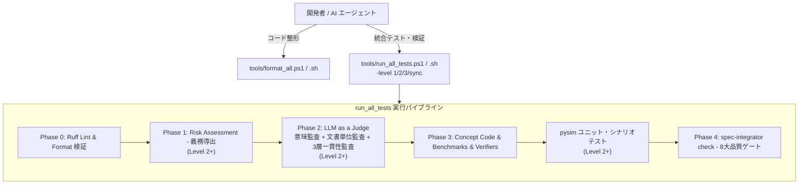

# Fireball ツール体系 & 検証パイプライン仕様書

Fireball Hypervisor の品質保証、コードフォーマット、静的トレーサビリティ、形式検証（pyModelChecking）、WIT インターフェース検証、Python シミュレータ実機相当テスト、および LLM as a Judge を実行する統合ツール体系です。

Windows（PowerShell）および Linux / WSL（Bash）の双方で完全透過に同一のコマンドライン操作が可能です。

---

## 1. ツール・スクリプト一覧 (Tool Architecture)



| ツール / スクリプト | 種別 | 対象 | 主な役割 |
| :--- | :--- | :--- | :--- |
| `tools/format_all.ps1`<br>`tools/format_all.sh` | フォーマッタ | `experiments/`<br>`tools/`<br>`docs/` | **ワンタッチ自動整形**。Ruff による PEP8 準拠フォーマット & Lint エラー自動修復（`--fix`）を一発適用。 |
| `tools/check_terminology.ps1`<br>`tools/check_terminology.sh` | 表記揺れ検査 | `docs/` | **ワンタッチ表記揺れ検査**。静的レーベンシュタイン距離、TF-IDF、エンベディング、さくらのAIによる文脈判定を一括実行。 |
| `tools/run_all_tests.ps1`<br>`tools/run_all_tests.sh` | 統合ランナー | 全体 | **統合検証パイプライン**。Phase 0〜4 の全品質ゲート、形式検証、概念コード、シミュレータテストを包括実行。 |
| `experiments/pysim/tests/run_all.py` | 単体テスト | `experiments/pysim` | シミュレータ単体テスト（全9スイート: 命令網羅、ローダ、Syscall、GDB、JIT、All-Pairs等）。 |
| `experiments/pysim/scenarios/run_all.py` | 結合テスト | `experiments/pysim` | 実機同等ユースケース結合シナリオテスト（全11シナリオ）。 |
| `tools/spec-integrator/` | 検証エンジン | `docs/`, `inc/` | 文書トポロジー解析、形式検証、WIT検証、一貫性追跡、表記揺れ判定、LLM as a Judge。 |

---

## 2. 目的別クイックスタート (Workflow by Purpose)

開発フローに応じて最適なコマンドを実行します。

`run_all_tests` が公開するオプションは検証レベル（`-level` / `--level`）ひとつだけです。バックエンドやコンポーネント指定などの微調整は `spec-integrator` 本体の CLI を直接叩きます（§5, §6）。

| 開発ステージ | タイミング | 実行コマンド（Windows / Linux） | コスト・所要時間 |
| :--- | :--- | :--- | :--- |
| **0. 自動フォーマット** | コード編集後・コミット前 | `powershell tools/format_all.ps1`<br>`./tools/format_all.sh` | 0円 / 1〜2秒 |
| **表記揺れチェック** | 用語統一度の確認・執筆時 | `powershell tools/check_terminology.ps1`<br>`./tools/check_terminology.sh`（高速版: `-quick`） | 0円〜課金 / 2秒〜30秒 |
| **仕様変更同期** | 仕様書編集後・他レベルの前 | `powershell tools/run_all_tests.ps1 -level sync`<br>`./tools/run_all_tests.sh --level sync` | 0円 / 2〜3秒 |
| **Level 1 (既定・日常)** | コミット前の標準確認 | `powershell tools/run_all_tests.ps1`<br>`./tools/run_all_tests.sh` | 0円 / 5〜10秒 |
| **Level 2 (明示指示のみ)** | ADR 追加・大規模仕様変更時 | `powershell tools/run_all_tests.ps1 -level 2`<br>`./tools/run_all_tests.sh --level 2` | 課金 / 30秒〜1分 |
| **Level 3 (明示指示のみ)** | PR 作成・リリース判定時 | `powershell tools/run_all_tests.ps1 -level 3`<br>`./tools/run_all_tests.sh --level 3` | 課金 / 完全全量監査 |

---

## 3. パイプライン実行仕様 (`run_all_tests`)

`tools/run_all_tests.ps1`（Windows）および `tools/run_all_tests.sh`（Linux）は完全に同一のフェーズ構成とオプション体系を持ちます。

### 3.1 フェーズ構成 (Execution Phases)

1. **Phase 0: Python Linter & Formatter (`ruff check` & `ruff format --check`)** — 全レベル共通。
   - リポジトリ全域の Python コード（`experiments`, `tools`, `docs`）の PEP8 準拠性、未定義変数、インポート順を検査。
   - 違反時は即座に停止し、`format_all` の実行を促します。
2. **Phase 1: Risk Assessment (`llm-assess`)** — Level 2 以上。
   - キーワードごとの複雑度・設計リスクをトリアージし、検証義務をキャッシュ DB（`.spec-integrator/doc_cache.db`）に記録。
   - Level 1 ではスキップし、DB に保存済みの評価を再利用（0円）。
3. **Phase 2: LLM as a Judge (`llm-judge`)** — Level 2 以上。
   - キーワードサブグラフの意味監査（ADR の妥当性、要件とコンポーネントの整合性）、ドキュメント単位の自己一貫性監査、
     設計仕様→テスト仕様→テストコードの 3 層トレーサビリティ監査の3つを、同一コマンドで常に実行。
   - Level 1 ではスキップ（0円）。
4. **Phase 3: Concept Code & Benchmarks & Semantic Verifiers** — 全レベル共通。
   - `docs/**/concepts/*_concept.py`（概念実証コード 14 本）の実行。
   - `docs/**/benchmarks/*_bench.py`（実測ベンチマーク 4 本）の実行とアサーション検証。
   - ARMv8-M Thumb2 エミュレータ（Unicorn）による JIT ステンシルの実機マシンコード実行検証。
   - Level 2 以上では `experiments/pysim` の単体テストスイート（9本）と結合シナリオテスト（11本）も追加実行。
5. **Phase 4: Quality Gates (`check`)** — 全レベル共通。
   - 8 大品質ゲート（静的リンク、トレーサビリティ、階層分離、形式モデル、WIT契約、エビデンス、義務充足、一貫性ロック）を評価し、最終合否を出力。
   - Level 3 ではキャッシュ DB を使わない `--clean` スキャンで実行。

### 3.2 コマンドライン引数一覧

| 引数 (PowerShell) | 引数 (Bash) | 型 | 説明 |
| :--- | :--- | :---: | :--- |
| `-level <1\|2\|3\|sync>` | `--level <1\|2\|3\|sync>` | String | 検証レベル（既定: `1`）。`sync` は検証ではなく `spec-consistency.lock` の更新のみ行い終了する。詳細は §3.1・§3.3。 |
| `-h`, `-help` | `-h`, `--help` | Switch | ヘルプを表示。 |

### 3.3 レベルの内訳

| レベル | 含まれる処理 | コスト |
| :--- | :--- | :--- |
| `sync` | 一貫性ベースラインの更新のみ（他の処理は行わず終了） | 0円 |
| `1`（既定） | Phase 0, 3, 4（保存済みのリスク評価・判定結果を再利用） | 0円 |
| `2` | Level 1 + `llm-assess` + `llm-judge`（意味監査 + 文書単位監査 + 3層一貫性監査）+ pysim スイート | 課金（LLM呼び出し） |
| `3` | Level 2 + 網羅的評価（`--exhaustive`、上限なし・全コンポーネント）+ `check --clean` | 課金（最大） |

バックエンド・モデル・Tier・コンポーネントの指定は `-level` に含まれません。これらは全コマンドで共通の `spec-integrator.yaml` の `llm_judge.default_backend` が使われるため、個別に上書きしたい場合のみ `spec-integrator` 本体を直接呼び出してください（§5, §6）。

---

## 4. 品質ゲート詳細 (8 Quality Gates)

`spec-integrator check` が強制する 8 つの品質ゲートです（1 件でも違反があれば終了コード 1 で失敗）。

| ゲート名 | ルール | 検査内容 |
| :--- | :--- | :--- |
| **1. Format Gate** | `FMT-*` | Markdown 内部リンク切れ、見出しアンカー切れ、Mermaid構文、**レーベンシュタイン距離による静的タイポ・表記揺れ（`FMT-LEVENSHTEIN-TYPO`）** の検出。 |
| **2. Traceability Gate** | `TRACE-*` | 未定義キーワードの参照、未参照の要求仕様、孤立ノードの検出。 |
| **3. Hierarchy Gate** | `HIERARCHY-*` | Tier（0:要求 $\to$ 1:主要 $\to$ 2:サブ $\to$ 3:リーフ）間の逆流参照・カプセル化違反の検出。 |
| **4. Formal Gate** | `FORMAL-*` | `docs/**/formal/*.py`（pyModelChecking）の実行、LTL/CTL 検証、`BACKS` 契約の検証。 |
| **5. WIT Gate** | `WIT-*` | `wit/*.wit` の構文・型整合性・エラー回復戦略契約の検証。 |
| **6. Evidence Gate** | `EVIDENCE-*` | `<!-- evidence: ... -->` で主張されたベンチマークや実装ファイルの実在性とアサーション検証。 |
| **7. Obligation Gate** | `OBLIG-*` | Phase 1 のリスク評価で導出された検証義務（形式検証・LLM監査等）が **100% 履行** されているかの検証。 |
| **8. Consistency Gate** | `CONSIST-*`<br>`TERM_VARIANCE` | 一貫性ベースライン（キャッシュ DB 記録値）との差分・シンボル値ズレ、および **TF-IDF + さくらのAI エンベディング・LLM文脈監査による用語表記揺れ（`TERM_VARIANCE`）** の警告。 |

---

## 5. トラブルシューティング (Troubleshooting)

### Q1. `OBLIG-ASSESSMENT-STALE` または `OBLIG-JUDGE-STALE` で失敗する
- **原因**: ドキュメント本文を編集したため、以前のリスク評価（キャッシュ DB に記録済み）のハッシュ値と不整合が生じています。
- **対処**:
  ```bash
  # 通常の再計算（クラウド LLM、既定バックエンドを使用）:
  powershell tools/run_all_tests.ps1 -level 2
  # または、ローカルの Ollama があればコスト0で:
  uv run --system-certs --project tools/spec-integrator python -m spec_integrator.cli llm-assess --backend ollama -a --max-keywords 0
  ```

### Q2. `CONSIST-COCHANGE-STALE` または `CONSIST-SYMBOL-DRIFT` で失敗する
- **原因**: キーワード定義や `FB_CONF_*` 定数を変更した際、それを参照している別コンポーネントの記述が更新されていません。
- **対処**: レポート（`reports/doc_report.md`）に示された該当箇所を修正した後、`powershell tools/run_all_tests.ps1 -level sync` または `./tools/run_all_tests.sh --level sync` を実行して一貫性ベースラインを更新します。

### Q3. Python コードの Lint / フォーマットエラーで Phase 0 が失敗する
- **原因**: PEP8 フォーマット違反、未使用インポート、未定義シンボル等が存在します。
- **対処**:
  ```bash
  # Windows:
  powershell -ExecutionPolicy Bypass -File tools/format_all.ps1
  # Linux:
  ./tools/format_all.sh
  ```
