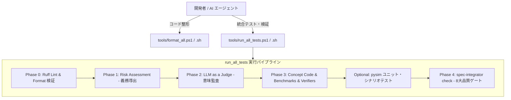

# Fireball ツール体系 & 検証パイプライン仕様書

Fireball Hypervisor の品質保証、コードフォーマット、静的トレーサビリティ、形式検証（pyModelChecking）、WIT インターフェース検証、Python シミュレータ実機相当テスト、および LLM as a Judge を実行する統合ツール体系です。

Windows（PowerShell）および Linux / WSL（Bash）の双方で完全透過に同一のコマンドライン操作が可能です。

---

## 1. ツール・スクリプト一覧 (Tool Architecture)



| ツール / スクリプト | 種別 | 対象 | 主な役割 |
| :--- | :--- | :--- | :--- |
| `tools/format_all.ps1`<br>`tools/format_all.sh` | フォーマッタ | `experiments/`<br>`tools/`<br>`docs/` | **ワンタッチ自動整形**。Ruff による PEP8 準拠フォーマット & Lint エラー自動修復（`--fix`）を一発適用。 |
| `tools/run_all_tests.ps1`<br>`tools/run_all_tests.sh` | 統合ランナー | 全体 | **統合検証パイプライン**。Phase 0〜4 の全品質ゲート、形式検証、概念コード、シミュレータテストを包括実行。 |
| `experiments/pysim/tests/run_all.py` | 単体テスト | `experiments/pysim` | シミュレータ単体テスト（全9スイート: 命令網羅、ローダ、Syscall、GDB、JIT、All-Pairs等）。 |
| `experiments/pysim/scenarios/run_all.py` | 結合テスト | `experiments/pysim` | 実機同等ユースケース結合シナリオテスト（全11シナリオ）。 |
| `tools/spec-integrator/` | 検証エンジン | `docs/`, `inc/` | 文書トポロジー解析、形式検証、WIT検証、一貫性追跡、LLM as a Judge。 |

---

## 2. 目的別クイックスタート (Workflow by Purpose)

開発フローに応じて最適なコマンドを実行します。

| 開発ステージ | タイミング | 実行コマンド（Windows / Linux） | コスト・所要時間 |
| :--- | :--- | :--- | :--- |
| **0. 自動フォーマット** | コード編集後・コミット前 | `powershell tools/format_all.ps1`<br>`./tools/format_all.sh` | 0円 / 1〜2秒 |
| **1. 簡易テスト (日常)** | コミット前の標準確認 | `powershell tools/run_all_tests.ps1`<br>`./tools/run_all_tests.sh` | 0円 / 5〜10秒 |
| **2. シミュレータ込み確認** | 実装変更・ロジック検証時 | `powershell tools/run_all_tests.ps1 -pysim`<br>`./tools/run_all_tests.sh --pysim` | 0円 / 15〜20秒 |
| **3. 仕様変更同期** | 仕様書編集後のベースライン更新 | `powershell tools/run_all_tests.ps1 -sync`<br>`./tools/run_all_tests.sh --sync` | 0円 / 2〜3秒 |
| **4. クラウド LLM 監査** | ADR 追加・大規模仕様変更時（明示指示のみ） | `powershell tools/run_all_tests.ps1 -assess -backend sakura`<br>`powershell tools/run_all_tests.ps1 -llm -backend sakura` | 無料 / 30秒〜1分 |
| **5. リリース前全量監査** | PR 作成・リリース判定時 | `powershell tools/run_all_tests.ps1 -full -backend sakura`<br>`./tools/run_all_tests.sh --full --backend sakura` | 完全全量監査 |

---

## 3. パイプライン実行仕様 (`run_all_tests`)

`tools/run_all_tests.ps1`（Windows）および `tools/run_all_tests.sh`（Linux）は完全に同一のフェーズ構成とオプション体系を持ちます。

### 3.1 フェーズ構成 (Execution Phases)

1. **Phase 0: Python Linter & Formatter (`ruff check` & `ruff format --check`)**
   - リポジトリ全域の Python コード（`experiments`, `tools`, `docs`）の PEP8 準拠性、未定義変数、インポート順を検査。
   - 違反時は即座に停止し、`format_all` の実行を促します。
2. **Phase 1: Risk Assessment (`assess`)**
   - セクションごとの複雑度・設計リスクをトリアージし、検証義務台帳（`reports/doc_risk_report.json`）を生成。
   - オプション未指定時は保存済みの台帳を再利用（0円）。
3. **Phase 2: LLM as a Judge (`judge`)**
   - LLM によるセマンティック意味監査（ADR の妥当性、要件とコンポーネントの整合性）を実施。
   - オプション未指定時はスキップ（0円）。
4. **Phase 3: Concept Code & Benchmarks & Semantic Verifiers**
   - `docs/**/concepts/*_concept.py`（概念実証コード 14 本）の実行。
   - `docs/**/benchmarks/*_bench.py`（実測ベンチマーク 4 本）の実行とアサーション検証。
   - ARMv8-M Thumb2 エミュレータ（Unicorn）による JIT ステンシルの実機マシンコード実行検証。
   - `-pysim` / `--pysim` 指定時は、`experiments/pysim` の単体テストスイート（9本）と結合シナリオテスト（11本）も追加実行。
5. **Phase 4: Quality Gates (`check`)**
   - 8 大品質ゲート（静的リンク、トレーサビリティ、階層分離、形式モデル、WIT契約、エビデンス、義務充足、一貫性ロック）を評価し、最終合否を出力。

### 3.2 コマンドライン引数一覧

| 引数 (PowerShell) | 引数 (Bash) | 型 | 説明 |
| :--- | :--- | :---: | :--- |
| `-pysim` | `--pysim` | Switch | Python シミュレータの単体テスト（9本）および結合シナリオテスト（11本）を実行。 |
| `-sync` | `--sync` | Switch | 現在の仕様状態を基準として `spec-consistency.lock` を更新し、終了。 |
| `-clean` | `--clean` | Switch | キャッシュ DB を使用せず、クリーンな状態で全文書を走査・検証。 |
| `-assess` | `--assess` | Switch | リスク評価（Phase 1）を実行し、検証義務台帳を再生成。 |
| `-llm` | `--llm` | Switch | LLM as a Judge 意味監査（Phase 2）を実行。 |
| `-testchain` | `--testchain` | Switch | 設計仕様 $\to$ テスト仕様 $\to$ テストコードの 3 層トレーサビリティ一貫性監査を実行。 |
| `-component <C>` | `--component <C>` | String | `-testchain` の監査対象を特定コンポーネントに限定（例: `jit_compiler`）。 |
| `-full` | `--full` | Switch | `-assess`, `-llm`, `-pysim` をすべて含む完全全量監査を実行。 |
| `-backend <B>` | `--backend <B>` | String | LLM バックエンド指定（`sakura` / `ollama` / `mock` / `heuristic`、デフォルト: `sakura`）。 |
| `-model <M>` | `--model <M>` | String | 使用する LLM モデル名のオーバーライド。 |
| `-noStrict` | `--no-strict` | Switch | リスク評価が部分カバレッジの場合でも終了コード 0 を許容。 |

---

## 4. 品質ゲート詳細 (8 Quality Gates)

`spec-integrator check` が強制する 8 つの品質ゲートです（1 件でも違反があれば終了コード 1 で失敗）。

| ゲート名 | ルール | 検査内容 |
| :--- | :--- | :--- |
| **1. Format Gate** | `FORMAT-*` | Markdown 内部リンク切れ、見出しアンカー切れ、不正記法の検出。 |
| **2. Traceability Gate** | `TRACE-*` | 未定義キーワードの参照、未参照の要求仕様、孤立ノードの検出。 |
| **3. Hierarchy Gate** | `HIERARCHY-*` | Tier（0:要求 $\to$ 1:主要 $\to$ 2:サブ $\to$ 3:リーフ）間の逆流参照・カプセル化違反の検出。 |
| **4. Formal Gate** | `FORMAL-*` | `docs/**/formal/*.py`（pyModelChecking）の実行、LTL/CTL 検証、`BACKS` 契約の検証。 |
| **5. WIT Gate** | `WIT-*` | `wit/*.wit` の構文・型整合性・エラー回復戦略契約の検証。 |
| **6. Evidence Gate** | `EVIDENCE-*` | `<!-- evidence: ... -->` で主張されたベンチマークや実装ファイルの実在性とアサーション検証。 |
| **7. Obligation Gate** | `OBLIG-*` | Phase 1 のリスク評価で導出された検証義務（形式検証・LLM監査等）が **100% 履行** されているかの検証。 |
| **8. Consistency Gate** | `CONSIST-*` | `spec-consistency.lock` と比較し、仕様変更時の修正漏れ・シンボル値ズレ（`FB_CONF_*`）を機械検出。 |
| *(Topology Verifier)* | `TOPOLOGY-*` | IPC Router 等のロール間通信マトリクスにおける循環依存（デッドロック）の静的検出。 |

---

## 5. でっち上げ決定の検知 (`detect-fake-decision`, Advisory)

「本来コンポーネント単独で決めていい話ではないのに、辻褄合わせで勝手に決められていないか」「ADR タグのない勝手な仕様固定がないか」をスキャンするアドバイザリ機能です。

```bash
# 静的スキャン（高速・0円）
uv run --project tools/spec-integrator python -m spec_integrator.cli detect-fake-decision

# LLM セマンティック監査（ユーザー指示時のみ）
uv run --project tools/spec-integrator python -m spec_integrator.cli detect-fake-decision --llm --backend sakura
```

---

## 6. トラブルシューティング (Troubleshooting)

### Q1. `OBLIG-ASSESSMENT-STALE` または `OBLIG-JUDGE-STALE` で失敗する
- **原因**: ドキュメント本文を編集したため、以前のリスク評価台帳（`reports/doc_risk_report.json`）のハッシュ値と不整合が生じています。
- **対処**:
  ```bash
  # ローカル・コスト0でアセスメントを再計算する場合:
  uv run --system-certs --project tools/spec-integrator python -m spec_integrator.cli assess --backend heuristic -a --include-reqs --include-meta --min-length 0 --max-sections 0 -o reports/doc_risk_report.json -r reports/doc_risk_report.md
  ```

### Q2. `CONSIST-COCHANGE-STALE` または `CONSIST-SYMBOL-DRIFT` で失敗する
- **原因**: キーワード定義や `FB_CONF_*` 定数を変更した際、それを参照している別コンポーネントの記述が更新されていません。
- **対処**: レポート（`reports/doc_report.md`）に示された該当箇所を修正した後、`powershell tools/run_all_tests.ps1 -sync` または `./tools/run_all_tests.sh --sync` を実行してロックファイルを更新します。

### Q3. Python コードの Lint / フォーマットエラーで Phase 0 が失敗する
- **原因**: PEP8 フォーマット違反、未使用インポート、未定義シンボル等が存在します。
- **対処**:
  ```bash
  # Windows:
  powershell -ExecutionPolicy Bypass -File tools/format_all.ps1
  # Linux:
  ./tools/format_all.sh
  ```
