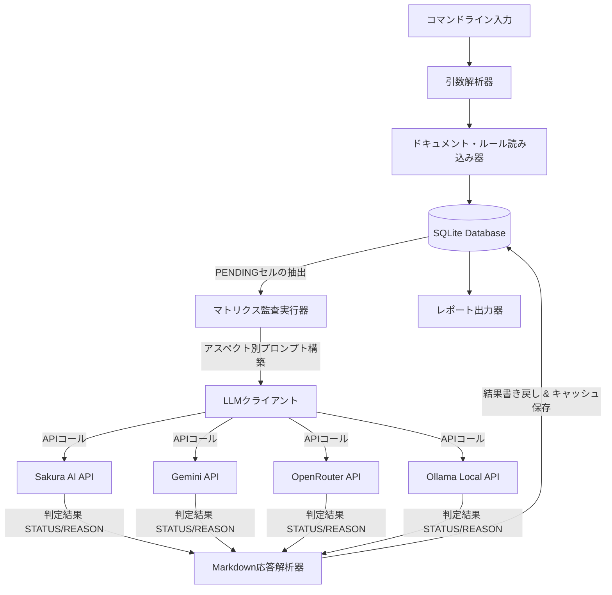

# LLMドキュメント自動テストツール仕様書 (doc_test_llm)

本仕様書は、Fireballプロジェクトにおいて仕様ドキュメントの「一貫性」と「品質」をLLMを介して検証する自動テストツール（`doc_test_llm`）の設計・機能を定義する。 `{META_AI_Native_Dev}` `{META_Risk_Tiering}`

判定基準の正本は `.claude/rules/development-policy.md`、`.claude/rules/documentation.md`、`.claude/rules/documentation_format.md` に置く。

---

## 1. コンセプト

LLMを用いた仕様記述においては、同一ドキュメント内の自己矛盾や、関連ドキュメントとの境界条件の齟齬、さらには開発ポリシー（ヒープ禁止など）の違反といった「意味的な不整合」が発生しやすい。
本ツールは、これら静的解析（機械的な正規表現チェック等）では検知不可能な論理矛盾を、LLMの意味理解力を活用して監査し、一貫した仕様品質を維持するためのものである。

本ツールは、ドキュメントの全セクションを行とし、検証するアスペクト（メモリ制約、例外制限、要求整合性、記述品質、API命名規則）を列とした「レビューマトリクス」をベースにします。検証が必要な対象セルのみを **LLM as a Judge** によって動的・意味的にスクリーニング（`PENDING`化）し、無駄な検証（APIコール数）を徹底的に排除した高精度かつ低コストなテストを実現します。

---

## 2. 静的モデル

### 2.1 データ構造
本ツールは、検証対象のドキュメント、環境ルールおよび要求仕様書を読み込み、SQLite データベースに同期して検証状態を管理します。

- **`document_tiers`**: 要求仕様書（`requirement_list.md`, Tier 0）を最上位とし、他のコンポーネント仕様書（Tier 1〜3）をその直下にマッピングした親子構造情報。
- **`keyword_sections`**: 定義済みの要求キーワード（`{Keyword}`）が、どのコンポーネントのどのセクションに出現するかを示すインデックスマップ。
- **`review_matrix`**: 各仕様書のセクションごとに、各検証アスペクト（ポリシー、品質、整合性）の検証ステータス（`PENDING`, `N/A`, `PASS`, `FAIL`, `WARN`）を記録するマトリクス。

### 2.2 内部ブロック図

### 2.3 データベース・テーブル仕様

#### ① document_tiers
| 項目名 | 型 | 説明 |
| :--- | :--- | :--- |
| file_path | TEXT (PK) | 対象ファイルの相対パス |
| tier | INTEGER | 階層レベル (0: 最上位要求, 1: コア, 2: ランタイム, 3: プラットフォーム) |
| parent_file | TEXT | 親要求仕様書のパス（最上位ファイルへの参照） |

#### ② keyword_sections
| 項目名 | 型 | 説明 |
| :--- | :--- | :--- |
| keyword | TEXT (PK) | 抽出された要求キーワード |
| file_path | TEXT (PK) | 記載されているファイルのパス |
| heading | TEXT (PK) | 記載されているセクションの見出し |
| line_start | INTEGER | キーワード出現箇所の開始行番号 |

#### ③ review_matrix
| 項目名 | 型 | 説明 |
| :--- | :--- | :--- |
| file_path | TEXT (PK) | 仕様ファイルの相対パス |
| heading | TEXT (PK) | セクションの見出し |
| keywords | TEXT | セクション内に含まれるキーワード（カンマ区切り） |
| policy_P01 | TEXT | メモリ制約ポリシー判定ステータス（PASS/FAIL/WARN/PENDING/N/A） |
| policy_P02 | TEXT | 例外・RTTI制限ポリシー判定ステータス |
| review_traceability | TEXT | 要求整合性（横串テスト）判定ステータス |
| review_quality | TEXT | 記述品質判定ステータス |
| review_api | TEXT | API命名規則・設計ルール判定ステータス |
| llm_checked | INTEGER | すべての検証列が埋まった場合 1 に更新される完了フラグ |

---

## 3. 動的モデル

### 3.1 アルゴリズム

本ツールは、マトリクスの構築段階と、LLMによる実際の監査段階の2つのフェーズに分かれます。

#### Phase A: マトリクスの再生成とLLM Judgeによるスクリーニング (`--gentable`)
各仕様書の全セクションについて、**LLM as a Judge** がアスペクトごとに「このセクションを検証すべきか」を判定します。

- 概要、参考、履歴などの機械的に除外可能なセクション、および50文字未満の極めて短いセクションは機械的プレフィルタによって一律 `N/A` と判定します。
- それ以外の主要設計セクションについてはLLMがジャッジを行い、検証が必要なセルのみを `PENDING` に設定します。
- 判定結果はセクションハッシュ値と共にDBにキャッシュされるため、ドキュメントの修正がない限り二回目以降のAPIコールは発生しません。

#### Phase B: マトリクス監査の実行 (`--llm`)
- `review_matrix` からステータスが `PENDING` のセルのみを抽出します。
- キャッシュ（DBの `audit_results`）を確認し、過去に判定済みの内容（ドキュメントに変更がないセクション）であればLLMの呼び出しをスキップします。
- 新規または変更されたセクションについてはアスペクト別の検証プロンプトを構築し、LLMに監査を行わせます。
- 応答から `STATUS` (PASS/FAIL/WARN) と `REASON`, `SUGGESTIONS` をパースし、DBおよび `review_matrix.csv` に書き戻します。

---

## 4. インターフェイス定義

### 4.1 CLI引数定義 `{META_AI_Native_Dev}`

| 項目 | 内容 |
| :--- | :--- |
| 機能概要 | 開発者向けのドキュメント自動検証のトリガー機能を提供する。 |
| コマンドライン引数 | <ul><li>`--sync`: キーワード定義やグローバルポリシーをDBに初期同期して終了。</li><li>`--gentable`: ドキュメントを全スキャンし、LLM as a Judgeを交えてレビューマトリクスCSVを再生成・DB同期。</li><li>`--llm`: マトリクス内の `PENDING` 項目に限定してLLM監査を実行し、結果を反映。</li><li>`--backend <名>`: API（sakura / openrouter / gemini / ollama）の指定。</li><li>`--model <名>`: 使用モデルのオーバーライド。</li></ul> |
| 事前条件 | 環境変数に選択したAPIのアクセスキーが設定されていること（ローカルOllamaの場合は不要）。 |
| 事後条件 | なし |
| エラー時の挙動 | APIキー不足、JSON解析不能、通信断などの障害時は `ERROR` 判定として画面にログを出力し、終了コード `1` で異常終了する。 |

---

## 5. 制約達成の方策

### 5.1 性能・コスト制約と方策 (キャッシュの活用)
- スクリーニング判定結果（Judge Screening）、および実際の検証判定結果（Matrix Audit）はすべてDBキャッシュに保存されます。
- ドキュメントに修正のないセクションはキャッシュから自動ロードされるため、大規模な仕様変更時であっても、実際に変更のあったセクションおよびその直接の依存先のみにLLMのコールが限定されます（テスト時間・APIコストの抑制）。

### 5.2 安全性制約と方策
- APIキー環境変数の読み込み処理（`_read_api_key`）において非ASCII文字の混入をチェックし、誤った認可トークンによる接続障害を防止します。
